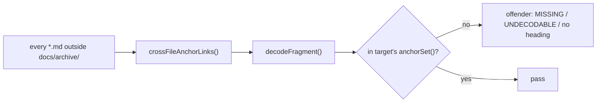

# PR Summary — Issue #3337: fix broken cross-file heading anchors; `githubSlug` keeps underscores

Closes #3337

## Summary

- `githubSlug` now keeps connector punctuation (`\p{Pc}`, e.g. `_`), as
  GitHub's `github-slugger` does (`worker/deno/lib/markdown_anchors.ts:46`).
- Review on PR #3363: keeping `\p{Pc}` wrongly kept `_word_` underscore
  *emphasis* delimiters too — GitHub renders those as `<em>word</em>` and
  drops them from the id. `githubSlug` now strips a matched `_..._` /
  `__..__` pair at a word boundary, outside backtick code spans, before
  applying `STRIP` (`stripEmphasisUnderscores`,
  `worker/deno/lib/markdown_anchors.ts:67-81`); an intraword underscore
  (`callbacks.host_failure`) is untouched.
- New `crossFileAnchorLinks()` and `decodeFragment()` helpers in the same
  module. They find every relative `*.md#fragment` link (inline links,
  the angle-bracket form, optional title, reference definitions) and skip
  fenced code blocks, inline code spans and URLs with a scheme.
- New repo-wide test `worker/deno/tests/cross_file_anchors_test.ts`. It
  checks every such link outside `docs/archive/` against its target's
  `anchorSet()`, using the decoded fragment.
- Every broken link is fixed: 56 at base → 46 after `\p{Pc}` → **0**.



## Evidence

GitHub's real rendered id, observed with:

```bash
gh api repos/stSoftwareAU/VibeCoder/contents/docs/CALLBACKS.md -H "Accept: application/vnd.github.html"
```

The output includes `id="user-content-host-level-failures--callbackshost_failure"`
and `id="user-content-migrating-from-fleet_health_dir--fleet_health_repo"`.
The underscore survives. The test
`githubSlug - connector punctuation (underscore) survives (Issue #3337)`
(`worker/deno/tests/markdown_anchors_test.ts:71`) pins that id.

Review fix (PR #3363): re-ran the same lookup against
`docs/audits/security-sweep-1218-commands-cli.md`, whose `### SEC-1218-F5 —
an unescaped shell variable _name_ in text that is \`eval\`'d` heading uses
underscore emphasis. GitHub's rendered id is
`user-content-sec-1218-f5--an-unescaped-shell-variable-name-in-text-that-is-evald`
— no underscores around `name`. Pinned by
`githubSlug - underscore emphasis delimiters drop, unlike connector-punctuation underscores (PR #3363)`
(`worker/deno/tests/markdown_anchors_test.ts:88`).

Link fixes (old fragment → new fragment):

| File | Old | New |
|---|---|---|
| DESIGN-PRINCIPLES.md | `INTERNALS.md#1-worker-run-loop-and-process-lifecycle` | `#-1-worker-run-loop-and-process-lifecycle` |
| SECURITY.md | `CONFIGURATION.md#operational-defaults` | `#-internal-operational-constants` |
| SECURITY.md | `README.md#security` | `#-security` |
| docs/CONFIGURATION.md | `IDLE-TASK-FRAMEWORK.md#configuring-the-cadence--idle_task_cadence-issue-4011` | suffix `-issue-4011` dropped |
| docs/DEPLOYMENT.md | `#service-account-authentication-ssh--gh-auth` | leading `-` added |
| docs/HUMAN-PR-POLICY.md | LESSONS-LEARNT anchor | suffix `-issue-4074` dropped |
| docs/IDLE-TASK-FRAMEWORK.md | issue-processing tier-suppression anchor | `--a-suppressing…` |
| docs/IDLE-TASK-FRAMEWORK.md | `CONFIGURATION.md#%EF%B8%8F-idle-task-template-weights-issue-2401` | suffix `-issue-2401` dropped |
| docs/INTERNALS.md | workflows/README "one shared store" anchor | `#per-lane-worktrees-issue-394` |
| docs/OVERVIEW.md | `#clarification`, `../README.md#documentation` | leading `-` added |
| docs/PROMPTS.md, PROMPT-BEST-PRACTICES-CHECKLIST.md, PROMPT-HOUSE-VOCABULARY.md | `EXTENDING.md#prompt-templates` | `#-prompt-templates` |
| docs/SETUP.md | 9 `CONFIGURATION.md` anchors | leading `-` added |
| docs/SUPPLY-CHAIN-TRIAGE.md | tier-suppression anchor | `--` |
| docs/TROUBLESHOOTING.md | `milestones.md#decision-points-and-exceptions` | leading `-` added |
| docs/USAGE.md | `DEPLOYMENT.md#screenshot-support-setup` | leading `-` added |
| docs/workflows/README.md | `#documentation`, `pr-feedback.md#which-prs-are-monitored` | leading `-` added |
| docs/workflows/README.md | `projects-and-dependencies.md#workflow-labels` | `#%EF%B8%8F-workflow-labels` |
| docs/workflows/WORKED-EXAMPLE.md | pr-feedback priority anchors, `milestones.md#milestone-completion` | leading `-` added |
| docs/workflows/ci-fix.md | `CONFIGURATION.md#how-timeouts-interact` | `#%EF%B8%8F-how-timeouts-interact` |
| docs/workflows/issue-processing.md | `#clarification`, `#automatic-complexity…` | leading `-` added |
| docs/workflows/milestones.md | `#one-pr-per-target-branch-open-pr-blocking` | leading `-` added |
| docs/workflows/milestones.md | `#open-pr-blocking-does-not-apply-issue-500` | `#-open-pr-blocking-does-not-apply` |
| docs/workflows/resilience-and-concurrency.md | repository-scan-order, milestone-aware-repo-availability | leading `-` added |
| docs/workflows/projects-and-dependencies.md | same kind of fixes | leading `-` / `%EF%B8%8F` |

**Docs sweep** — grep: `githubSlug`, `anchorSet`, `headingSlugs`, `markdown_anchors`, `crossFileAnchorLinks`, `decodeFragment`, `cross_file_anchors`, `github-slugger`; section: none — `worker/deno/lib/markdown_anchors.ts` is a test-only helper and no manual in `README.md`, `*/README.md` or `docs/` (outside `docs/archive/`) documents GitHub heading-slug rules or the cross-file anchor check (the only hit is the file list in `docs/audits/lib-sweep-coverage.json:701`, which is a coverage audit, not a manual); updated: the module doc in `worker/deno/lib/markdown_anchors.ts:10-31` for `\p{Pc}`, and (review on PR #3363) a new consequences-list bullet (`:32-36`) and a new doc comment for `EMPHASIS_UNDERSCORES`/`stripEmphasisUnderscores` (`:50-66`) for the emphasis-underscore fix. Re-ran the same grep after the review fix: no additional hits. `docs/archive/` links were left as they are.

The callers of the widened helper are
`worker/deno/tests/agents_md_pointer_anchors_test.ts`,
`worker/deno/tests/docs_provider_matrix_test.ts`,
`worker/deno/tests/release_integrity_docs_test.ts`,
`worker/deno/tests/threat_model_docs_test.ts`,
`worker/deno/tests/update_mode_docs_test.ts` and
`worker/deno/tests/markdown_anchors_test.ts`. None of them describes the old
underscore-stripping behaviour, and all pass.

## Test Plan

- [x] `timeout 1080 ./quality.sh < /dev/null` from the repo root (review
  fix, PR #3363): **PASSED**. Only `config integration` was skipped,
  because `.config.json` is absent.
- [x] Corpus: 455 cross-file fragment links in 274 files. Broken links went
  56 at base → 46 with `\p{Pc}` → 0 after the doc fixes.
- [x] Red checks. Each goal was removed on purpose and the named test went red:
  - Removing `\p{Pc}` fails the underscore test (`markdown_anchors_test.ts:71`).
  - Disabling the fence and code-span skips fails the skip table
    (`cross_file_anchors_test.ts:84`).
  - Restoring base `docs/SETUP.md` fails the sweep
    (`cross_file_anchors_test.ts:248`) with 9 offenders, e.g.
    `docs/SETUP.md:1597 CONFIGURATION.md#configuration-file (no heading produces this anchor)`.
  - Restoring the first INLINE link regex, which was quadratic on hostile
    input, fails the INLINE growth tests (`:128`, `:137`, `:146`). Measured
    157 ms → 2439 ms against an allowance of 1255 ms. The code-span and
    REF_DEF growth tests (`:155`, `:164`, `:173`) pass under both versions,
    because those patterns were already linear. They stay as guards.
  - Review fix (PR #3363): removing `stripEmphasisUnderscores` from
    `githubSlug` fails
    `githubSlug - underscore emphasis delimiters drop, unlike connector-punctuation underscores (PR #3363)`
    (`markdown_anchors_test.ts:88`) — actual slug keeps the stray
    `_name_`: `sec-1218-f5--an-unescaped-shell-variable-_name_-in-text-that-is-evald`
    vs the expected `...-name-in-text-that-is-evald`.
- [x] `worker/deno/tests/cross_file_anchors_test.ts` uses `assertLinearGrowth`, so it is
  registered in `WALL_CLOCK_TEST_FILES`
  (`worker/deno/lib/parallel_unsafe_test_manifest.ts:196`). `check:manifests`
  passes.
- [x] No documentation-drift pins were added.

**Branch outcomes:**

- `worker/deno/lib/markdown_anchors.ts:162` — absent (link with a scheme → null) — `worker/deno/tests/cross_file_anchors_test.ts::crossFileAnchorLinks - skips everything it must not report (Issue #3337)` — flipped, test went red
- `worker/deno/lib/markdown_anchors.ts:165` — absent (no `#` → null) — `worker/deno/tests/cross_file_anchors_test.ts::crossFileAnchorLinks - skips everything it must not report (Issue #3337)` — flipped, test went red
- `worker/deno/lib/markdown_anchors.ts:169` — absent (non-`.md` target → null) — `worker/deno/tests/cross_file_anchors_test.ts::crossFileAnchorLinks - skips everything it must not report (Issue #3337)` — flipped, test went red
- `worker/deno/lib/markdown_anchors.ts:170` — absent (empty fragment → null) — `worker/deno/tests/cross_file_anchors_test.ts::crossFileAnchorLinks - skips everything it must not report (Issue #3337)` — flipped, test went red
- `worker/deno/lib/markdown_anchors.ts:159` — success (angle-bracket destination unwrapped) — `worker/deno/tests/cross_file_anchors_test.ts::crossFileAnchorLinks - catches every link shape it must (Issue #3337)` — flipped, test went red
- `worker/deno/lib/markdown_anchors.ts:193-202` — success (reference definition recorded, then `continue`) — `worker/deno/tests/cross_file_anchors_test.ts::crossFileAnchorLinks - catches every link shape it must (Issue #3337)` — flipped, test went red
- `worker/deno/lib/markdown_anchors.ts:205` — success (inline links recorded) — `worker/deno/tests/cross_file_anchors_test.ts::crossFileAnchorLinks - catches every link shape it must (Issue #3337)` — flipped, test went red
- `worker/deno/lib/markdown_anchors.ts:72-78` — absent (fence toggle; lines inside a fence skipped) — `worker/deno/tests/cross_file_anchors_test.ts::crossFileAnchorLinks - skips everything it must not report (Issue #3337)` — flipped, test went red
- `worker/deno/lib/markdown_anchors.ts:147` — absent (code spans blanked) — `worker/deno/tests/cross_file_anchors_test.ts::crossFileAnchorLinks - skips everything it must not report (Issue #3337)` — flipped, test went red
- `worker/deno/lib/markdown_anchors.ts:227` — success (well-formed escapes decoded) — `worker/deno/tests/cross_file_anchors_test.ts::decodeFragment - decodes well-formed percent-escapes` — flipped, test went red
- `worker/deno/lib/markdown_anchors.ts:229` — error (malformed escape → null) — `worker/deno/tests/cross_file_anchors_test.ts::decodeFragment - returns null for a malformed percent-escape` — flipped, test went red
- `worker/deno/lib/markdown_anchors.ts:46` — success (`_` kept by `githubSlug`) — `worker/deno/tests/markdown_anchors_test.ts::githubSlug - connector punctuation (underscore) survives (Issue #3337)` — removed `\p{Pc}`, test went red
- `worker/deno/lib/markdown_anchors.ts:67-81` (review on PR #3363) — success (`_word_`/`__word__` emphasis pair at a word boundary stripped, outside code spans) — `worker/deno/tests/markdown_anchors_test.ts::githubSlug - underscore emphasis delimiters drop, unlike connector-punctuation underscores (PR #3363)` — removed the `stripEmphasisUnderscores` call, test went red
- `worker/deno/lib/markdown_anchors.ts:67-81` (review on PR #3363) — absent (intraword underscore, e.g. `host_failure`, left alone — lookbehind/lookahead fail) — `worker/deno/tests/markdown_anchors_test.ts::githubSlug - connector punctuation (underscore) survives (Issue #3337)` — already covered above; re-ran after the review fix and it still passes, proving the new strip does not touch intraword underscores
- `worker/deno/tests/cross_file_anchors_test.ts:282` — error ("no heading produces this anchor" offender) — `worker/deno/tests/cross_file_anchors_test.ts::every cross-file #fragment link resolves to a heading in its target (Issue #3337)` — restored base `docs/SETUP.md`, test went red with 9 offenders
- `worker/deno/tests/cross_file_anchors_test.ts:266` and `:274` — error (MISSING target file / UNDECODABLE fragment offenders) — no current corpus input reaches them; they are fail-loud reporting paths inside the sweep test itself, not production branches, and the decode-failure input is pinned by `worker/deno/tests/cross_file_anchors_test.ts::decodeFragment - returns null for a malformed percent-escape`

Callers checked (shared helper widened, not narrowed): `githubSlug`,
`headingSlugs` and `anchorSet` are used by the six suites listed under the
Docs sweep above. The change only *keeps* `_`, which no previously passing
heading slug relied on stripping. All of these pass in the gate.

Rule self-application: this PR adds no prompt or coding-standard rule. I read
the PR's own diff against the existing anchor and fence handling and found
nothing to change.

## Pre-PR Security Self-Check

- [x] Input validation: the new helpers take repository Markdown only.
  `decodeFragment` returns null for a malformed escape instead of throwing.
- [x] Every regex runs on Markdown text and was vetted for ReDoS. Each one has
  a hostile linear-growth case (`cross_file_anchors_test.ts:119-173`).
  Review on PR #3363 added `CODE_SPAN` and `EMPHASIS_UNDERSCORES` to
  `githubSlug`, but — like the pre-existing `STRIP` regex in the same
  file — they run per heading (one Markdown line, already length-bounded
  by `headingSlugs`'s line match), not over a whole document, so a
  dedicated growth test is not warranted; worst case is one lazy scan to
  end-of-line per unmatched underscore on a single short line.
- [x] Secrets: no hidden or credential files are staged.
- [x] Injection surface: none. The code only reads files.
- [x] Path confinement: none added. Link targets resolve only to read docs in
  a test.
- [x] Dependencies: none added. `deno.lock` is unchanged.

🤖 Generated with [Claude Code](https://claude.com/claude-code)
