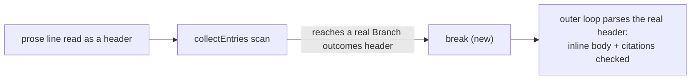

# PR Summary — Issue #3340

## Summary

Closes #3340

`parseBranchOutcomes` could read a prose line that opens with a
`Branch outcomes:` mention as a header. That call's `collectEntries` scan
then ran on and swallowed the real `**Branch outcomes:**` header below it.
The real header's inline body and test citations were never checked, so an
invented test path passed the gate. `collectEntries` now stops at the next
`Branch outcomes` header, as `scanRegionText` already did, and the outer
loop parses that header on its own.

**PR #3372 review round:** the first fix only reordered the inline-header
case; `collectEntries`'s `if (lvl > 0) continue` (the deeper-grouping-heading
skip) still ran *before* the header check, so a real heading-form header
(`### Branch outcomes`) reached mid-scan was treated as a skippable grouping
sub-heading rather than a header in its own right, and its own region was
never scanned. The header check now runs before that skip, matching the
order `scanRegionText` already used.

- [x] `collectEntries` breaks at a `Branch outcomes` prefix or heading line —
  including a heading-form header deeper than the enclosing boundary.
- [x] Five new tests, plus one existing test rewritten to assert the
  corrected behaviour (first round); one more new test, plus one existing
  test updated and one strengthened, for the heading-form case (PR #3372
  review round).
- [x] Corpus run over `docs/archive/pr-summaries/`: no new false positive or
  false negative (re-run after the heading-form fix: 0 files changed).
- [x] Targeted tests passed; full quality gate run noted in Evidence.

## Spec

### Intent and Rationale

Each real `Branch outcomes` header must have its body and test citations
checked. A stray prose line that looks like a header must not hide the
real one, because that turns the gate into a silent pass.

### Essential Design Decisions

- **Stop at the header, do not skip it.** The scan breaks before the next
  header line instead of continuing past it. This reuses the stop
  `scanRegionText` already has. Both use the existing
  `BRANCH_OUTCOMES_PREFIX_RE` / `BRANCH_OUTCOMES_HEADING_RE`, so no new
  regex was added.
- **Code spans are out of scope.** The prose line is still read as a
  header. Teaching the parser to ignore a backticked mention is a separate
  change. This fix makes sure the misread can no longer hide a real header.

### Undiscoverable Facts

- The issue's example, `docs/archive/pr-summaries/pr-summary-3249.md`,
  parses the same before and after. Its L46 prose mention is still read as
  a header, but the list item at L53 already ended that scan. The real L88
  header is `Branch outcomes: none added`, which has no citations to check.
- Before this fix, the swallow needed a blank line between the prose line
  and the real header. With the header on the very next line, the existing
  wrap handling already caught the citation. That is why only the
  blank-line test is red on base.

## Evidence

- `deno task test:unit tests/branch_outcomes_gate_test.ts` (from
  `worker/deno`): first round 79 passed; this round (PR #3372 review) 80
  passed, 0 failed.
- **Corpus run:** all 915 files in `docs/archive/pr-summaries/` were parsed
  before and after this round's heading-form fix.
  - 0 files changed (entries, body, scanText and named paths identical).
  - So there are 0 new false positives and 0 new false negatives from this
    round's fix.
- `./quality.sh`: PASSED (this round, re-run on the final head).
  `config integration` was SKIPPED because `.config.json` is not present in
  the container.
- Related rules checked: **Every outcome of a branch you add needs a test
  that reaches it**, **A new test must go red without its change** and
  **Vet every regex on untrusted text**. No regex was added or changed (the
  fix only reorders an existing check). No prompt or standards rule changed.
  Applied to this PR's own diff: nothing found.

**Docs sweep** — grep: `collectEntries`, `scanRegionText`, `parseBranchOutcomes`, "Branch outcomes header", "Branch outcomes", "stops at"; section: `docs/workflows/issue-processing.md#-a-branch-outcome-with-no-recorded-test-blocks-the-summary-issue-3147`; updated: the `collectEntries` doc comment in `worker/deno/lib/branch_outcomes_gate.ts`; `docs/workflows/issue-processing.md:1857` — still true because the section describes what a `Branch outcomes:` list must carry and never says where the parser's scan stops or how a second header is read; the `scanText` field doc and the `scanRegionText` doc in `worker/deno/lib/branch_outcomes_gate.ts` — still true, the latter already describes the same stop; `reproduction_status_gate.ts`'s `collectEntries` — unrelated function of the same name. This round's reorder does change a gate verdict (a heading-form header previously swallowed into `wrap` now ends `collectEntries` and blocks `validateBranchOutcomes`, per `worker/deno/tests/branch_outcomes_gate_test.ts:144`'s "a deeper heading-form header after a prose mention still names the invented test"), but no doc describes where the parser's scan stops or how a header is recognised (same regexes, same fields), so no further doc hit was found.

## Test Plan

All tests are in `worker/deno/tests/branch_outcomes_gate_test.ts`.

**Red on base.** I swapped in the base copy of
`worker/deno/lib/branch_outcomes_gate.ts` (commit `8958b3c3`) and ran the
suite. Result: 77 passed, 2 failed. The two failures:

- `validateBranchOutcomes - a prose mention separated by a blank line still does not hide the real header's inline citation`
- `parseBranchOutcomes - a later Branch outcomes header is parsed on its own, so its region is scanned`

**New tests that also pass on base.** These pin the behaviour around the fix:

- `validateBranchOutcomes - a prose mention read as a header does not hide the real header's inline citation`
- `validateBranchOutcomes - a list-item header nested under a prose mention still names the invented test`
- `validateBranchOutcomes - a prose mention read as a header does not hide the real header's valid citation`
- `parseBranchOutcomes - a prose mention read as a header does not hide the real header's inline body`

**Changed assertion.**

- Removed from `worker/deno/tests/branch_outcomes_gate_test.ts`: `assertEquals(namedTestPaths(record), []);` — #3340 requires each real `Branch outcomes` header to be parsed on its own, so the second header's region is now scanned and `[]` is untrue; it is replaced by `assertEquals(namedTestPaths(record), ["worker/deno/tests/unrelated_test.ts"]);`.
- The test `parseBranchOutcomes - the test-path scan stops at a later Branch outcomes header` was renamed to `parseBranchOutcomes - a later Branch outcomes header is parsed on its own, so its region is scanned`.
- Its expectation changed from `[]` to `["worker/deno/tests/unrelated_test.ts"]`.
- The old `[]` held only because of this bug: the first header's scan swallowed the second header, so the second header's region was never scanned.
- Once that header is parsed, its region is scanned like any other. A `none added` header's region is scanned too (PR #3160, seventh round).

### PR #3372 review round — heading-form headers

The first round's fix only reordered `collectEntries`'s check for the
*inline* header form; a heading-form header (`### Branch outcomes`) reached
mid-scan still fell into the earlier `if (lvl > 0) continue` (deeper-heading
skip) before ever being tested against `BRANCH_OUTCOMES_HEADING_RE`, so it
was swallowed as a grouping sub-heading the same way the inline case used to
be. Fixed by moving the header check above that skip, in both
`collectEntries` and matching the order `scanRegionText` already used.

**Red on base (this round).** I swapped in this round's pre-fix copy of
`worker/deno/lib/branch_outcomes_gate.ts` (HEAD before this round, commit
`9a3e30f8`) and ran the suite: 78 passed, 2 failed —

- `validateBranchOutcomes - a deeper heading-form header after a prose mention still names the invented test`
- `parseBranchOutcomes - the test-path scan stops at a later heading-form header, even when deeper than the boundary`

**Changed/strengthened assertions.**

- `parseBranchOutcomes - the test-path scan stops at a later heading-form header, even when deeper than the boundary`: expected `record.scanText` changed from `"outcome one"` to `"outcome one unrelated-marker-xyz"` — the heading-form header is now a real header the outer loop parses on its own, so its own region (`unrelated-marker-xyz`) is scanned too, same as the inline case above.
- `parseBranchOutcomes - a later Branch outcomes header is parsed on its own, so its region is scanned`: added `assert(!record.scanText.includes("none added"))` — pins that `scanRegionText`'s own header-stop (the first header's scan must not swallow the second header's body) still holds; confirmed by temporarily removing that stop from `scanRegionText` and seeing this assertion fail.

Branch outcomes:

- `worker/deno/lib/branch_outcomes_gate.ts:328` (`collectEntries`'s header
  check, now run before the deeper-heading skip): a heading-form `Branch
  outcomes` header reached mid-scan is recognised and ends the call, so the
  outer loop parses it on its own:
  - Test: `validateBranchOutcomes - a deeper heading-form header after a prose mention still names the invented test`.
  - Flip: restoring the pre-fix order (skip before check) turned it red.
- `worker/deno/lib/branch_outcomes_gate.ts:328`, the same check's
  pre-existing inline-form half (`BRANCH_OUTCOMES_PREFIX_RE`), still breaking
  `collectEntries` at the real header rather than the heading-form half
  tested above:
  - Tests: `validateBranchOutcomes - a prose mention separated by a blank
    line still does not hide the real header's inline citation` and
    `parseBranchOutcomes - a later Branch outcomes header is parsed on its
    own, so its region is scanned`.
  - Flip: deleting `BRANCH_OUTCOMES_PREFIX_RE.test(stripped) ||` from the
    check (confirmed locally) turned both red; the heading-form test above
    stayed green under that same flip, since its input never reaches the
    inline half.
- `worker/deno/lib/branch_outcomes_gate.ts:328`, a line that is not a header falls through to the existing entry and wrap handling:
  - Test: `validateBranchOutcomes - a bare header followed by a wrapped prose line naming an existing test passes`, among other existing tests.
  - Flip: breaking on every line turned it red.
