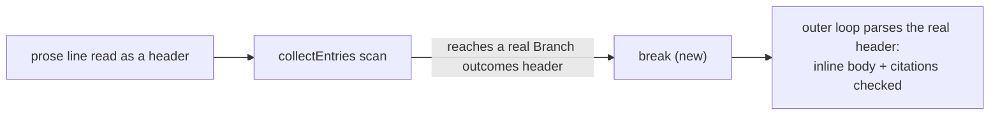

# PR Summary — Issue #3340

## Summary

Closes #3340

`parseBranchOutcomes` could read a prose line that opens with a
`Branch outcomes:` mention as a header. That call's `collectEntries` scan
then ran on and swallowed the real `**Branch outcomes:**` header below it.
The real header's inline body and test citations were never checked, so an
invented test path passed the gate. `collectEntries` now stops at the next
`Branch outcomes` header, as `scanRegionText` already did, and the outer
loop parses that header on its own.

- [x] `collectEntries` breaks at a `Branch outcomes` prefix or heading line.
- [x] Five new tests, plus one existing test rewritten to assert the corrected behaviour.
- [x] Corpus run over `docs/archive/pr-summaries/`: no new false positive or false negative.
- [x] Full quality gate passed.

## Spec

### Intent and Rationale

Each real `Branch outcomes` header must have its body and test citations
checked. A stray prose line that looks like a header must not hide the
real one, because that turns the gate into a silent pass.

### Essential Design Decisions

- **Stop at the header, do not skip it.** The scan breaks before the next
  header line instead of continuing past it. This reuses the stop
  `scanRegionText` already has. Both use the existing
  `BRANCH_OUTCOMES_PREFIX_RE` / `BRANCH_OUTCOMES_HEADING_RE`, so no new
  regex was added.
- **Code spans are out of scope.** The prose line is still read as a
  header. Teaching the parser to ignore a backticked mention is a separate
  change. This fix makes sure the misread can no longer hide a real header.

### Undiscoverable Facts

- The issue's example, `docs/archive/pr-summaries/pr-summary-3249.md`,
  parses the same before and after. Its L46 prose mention is still read as
  a header, but the list item at L53 already ended that scan. The real L88
  header is `Branch outcomes: none added`, which has no citations to check.
- Before this fix, the swallow needed a blank line between the prose line
  and the real header. With the header on the very next line, the existing
  wrap handling already caught the citation. That is why only the
  blank-line test is red on base.

## Evidence

- `deno task test:unit tests/branch_outcomes_gate_test.ts` (from
  `worker/deno`): 79 passed, 0 failed.
- **Corpus run:** all 913 files in `docs/archive/pr-summaries/` were parsed
  before and after.
  - Only `pr-summary-3147.md` changed. Its body gained the later header
    region's prose. Its set of test paths was the same before and after.
  - So there are 0 new false positives and 0 new false negatives.
- `./quality.sh`: PASSED. `config integration` was SKIPPED because
  `.config.json` is not present in the container.
- Docs sweep:
  - Grepped for `collectEntries`, `scanRegionText`, `Branch outcomes header`
    and `stops at`.
  - Updated the `collectEntries` doc comment in
    `worker/deno/lib/branch_outcomes_gate.ts`.
  - Still true:
    - the `scanText` field doc (`worker/deno/lib/branch_outcomes_gate.ts:138`);
    - the `scanRegionText` doc (`worker/deno/lib/branch_outcomes_gate.ts:247`), which already describes the same stop.
  - Not related: `reproduction_status_gate.ts` has an unrelated
    `collectEntries`. `CODING-STANDARDS.md` and `docs/*.md` say nothing about
    where the parser stops.
- Related rules checked: **Every outcome of a branch you add needs a test
  that reaches it**, **A new test must go red without its change** and
  **Vet every regex on untrusted text**. No regex was added or changed. No
  prompt or standards rule changed. Applied to this PR's own diff: nothing
  found.

## Test Plan

All tests are in `worker/deno/tests/branch_outcomes_gate_test.ts`.

**Red on base.** I swapped in the base copy of
`worker/deno/lib/branch_outcomes_gate.ts` (commit `8958b3c3`) and ran the
suite. Result: 77 passed, 2 failed. The two failures:

- `validateBranchOutcomes - a prose mention separated by a blank line still does not hide the real header's inline citation`
- `parseBranchOutcomes - a later Branch outcomes header is parsed on its own, so its region is scanned`

**New tests that also pass on base.** These pin the behaviour around the fix:

- `validateBranchOutcomes - a prose mention read as a header does not hide the real header's inline citation`
- `validateBranchOutcomes - a list-item header nested under a prose mention still names the invented test`
- `validateBranchOutcomes - a prose mention read as a header does not hide the real header's valid citation`
- `parseBranchOutcomes - a prose mention read as a header does not hide the real header's inline body`

**Changed assertion.**

- The test `parseBranchOutcomes - the test-path scan stops at a later Branch outcomes header` was renamed to `parseBranchOutcomes - a later Branch outcomes header is parsed on its own, so its region is scanned`.
- Its expectation changed from `[]` to `["worker/deno/tests/unrelated_test.ts"]`.
- The old `[]` held only because of this bug: the first header's scan swallowed the second header, so the second header's region was never scanned.
- Once that header is parsed, its region is scanned like any other. A `none added` header's region is scanned too (PR #3160, seventh round).

Branch outcomes:

- `worker/deno/lib/branch_outcomes_gate.ts:321`, a `Branch outcomes` header is reached mid-scan, so the scan breaks:
  - Tests: `validateBranchOutcomes - a prose mention separated by a blank line still does not hide the real header's inline citation` and `parseBranchOutcomes - a later Branch outcomes header is parsed on its own, so its region is scanned`.
  - Flip: removing the `break` turned both red.
- `worker/deno/lib/branch_outcomes_gate.ts:321`, a line that is not a header falls through to the existing entry and wrap handling:
  - Test: `validateBranchOutcomes - a bare header followed by a wrapped prose line naming an existing test passes`, among other existing tests.
  - Flip: breaking on every line turned it red.
