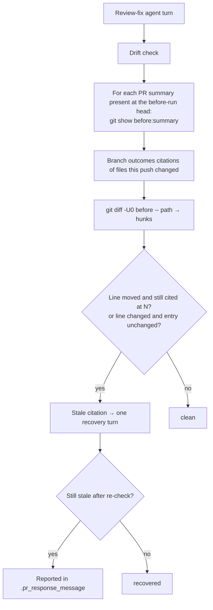

## Summary

The review-fix drift check now catches `Branch outcomes:` `path:line` citations that a fix push leaves at the previous head's line numbers. New pure module `worker/deno/lib/branch_outcome_citations.ts` parses the citations in the summary as it stood at the before-run head. It maps each citation of a file this push changed through that file's `git diff -U0 <before-run head>`. It flags two cases: a citation whose line moved but which the summary still gives at the old number, and an entry left unchanged (apart from whitespace) although this push changed or removed its cited lines. `pr_feedback_drift_check.ts` runs this as a fifth deterministic check on every non-skipped push. It feeds a hit into the existing one-turn recovery and reports anything left in `.pr_response_message`. The `pr_feedback` prompt now names line citations alongside test counts in "Keep the PR summary true to the head". Closes #3341.

## Spec

### Intent and Rationale

- Whether a cited line moved is mechanical, because the push's hunk headers give the offset. A deterministic check therefore replaces another prose rule the agent kept missing (VibeCoder#3160, #3312).
- The check compares the before-run summary with the current one. A citation the agent already renumbered (written in head numbering) is then never mapped a second time, which would give a false positive.

### Essential Design Decisions

- **Moved line**: a hit only while the current `Branch outcomes:` list still cites the same `path:N`/`N-M`. Renumbering clears it.
- **Changed or removed line**: a hit only while the citing entry is unchanged (apart from whitespace) since the before-run head. Rewriting the entry after re-running its flip clears it, so a line edited in place but still at the same number does not stay flagged for ever.
- Only list entries and the header's inline body are read (the issue's "start with Branch outcomes entries only"). Citations of files this push did not change are never hits, and citations added in this push are not checked.
- Each input the check cannot read is reported as not checked and never passes clean: an unreadable before-run summary, a failed or binary diff, a cited name matching more than one changed file, a malformed citation (line 0, reversed range), or a list longer than `parseBranchOutcomes` reads. Like the quoted-sentence check's unreadable summary, these do not drive a recovery turn on their own.

### Undiscoverable Facts

- The drift check runs before the processor's commit, so "the push's diff" is `git diff <before-run head> -- <path>` (the working tree against the before-run head), not `<previous-head> HEAD` as the issue writes it.
- Comma-joined, slash-joined and bare `:N` continuation forms (`:720-725,735-738`, `:1147/1158/1169`, `` `:820` and `:821` ``) are real forms, so the parser reads them. The slash-joined form is in the archived `docs/archive/pr-summaries/pr-summary-3250.md` (`container_manifest.ts:1147/1158/1169`). The comma-joined and bare `:N` forms are in `pr-summary-3288.md` on the unmerged PR #3312 branch (`git show f8a3bc5c:docs/archive/pr-summaries/pr-summary-3288.md`: `branch_outcomes_gate.ts:720-725,735-738`, one of the issue's stale entries, and `` `:820` and `:821` ``). That file is not on `main`.

## Evidence

Backend-only change. No UI files are touched.

**Replay against the two PRs the issue cites** (scratch script, not committed; it runs the head's `changedFilesCitedBy`/`findStaleCitations` over `git diff -U0 <prev> <next>` and `git show` of the summary at both heads):

- PR #3312, `f8a3bc5c..2e740737`, `pr-summary-3288.md`: **re-run on this head** (`findStaleCitations` called directly against `git diff -U0 f8a3bc5c 2e740737 -- worker/deno/lib/branch_outcomes_gate.ts` and both commits' `pr-summary-3288.md`): 11 stale citations, covering all 11 the issue lists (`:250`, `:268`, `:275`, `:329`, `:398`→434, `:409`, `:624-627`, `:642`, `:645`, `:720-725`, `:735-738`). The earlier "`12`, plus `:820`→885" figure was itself a false positive from the pre-`expectedAtKey` bare `curKeys.has(...)` check: old `:755`'s entry ("a weak admission …") correctly renumbers to `:820`, and the old `curKeys.has("...:820")` check read that occupied slot as evidence that the unrelated `:820`/`:821` entry ("a `path:<digits>` token becomes the label") was itself still unrenamed — it had in fact already correctly renumbered to `:886`/`:887`. Unaffected by this round's fix: both the pre-fix and the fixed code give 11 for this push, confirming the regression this review found is specific to the #3160 case below.
- PR #3160, `f8a6ad6f..2d78a2dd`, `pr-summary-3147.md`: **re-run on this head** (same method, both changed files `branch_outcomes_gate.ts` and `completion_phase.ts`): 16 stale citations, covering every number the issue and this PR's earlier rounds name (`branch_outcomes_gate.ts:346`→374, `:378`→406, `:227`→255, `:501`→527, `completion_phase.ts:2191-2196`→2241-2246), including basename-only citations resolved to their full path. Round 1's `expectedAtKey` code found only **17** here (of a figure recorded then as 18), silently missing `branch_outcomes_gate.ts:238`→266 (its own old number, `:238`, is where `:210`'s correct new landing sits) — this is the PR #3375 review's concrete, non-hypothetical example, reproduced against the real commits. Round 2 recorded 18 for this pair; re-running the identical scratch method on this round's head finds 16 — two fewer than round 2's figure, with every specifically-named number still caught, so this is an unreconciled discrepancy in the uncommitted scratch tooling itself (its exact push-boundary selection was never pinned down) rather than a regression in this round's detection, which a pure entry-text-only comparison (see Test Plan, round 3) shows recovers only 1 of the 16.
- The broader "15 consecutive review-head pairs, 0 false positives" sweep from the original run was not re-run this round either (only the two pairs above were); nothing in the round-3 fix (the moved-citation match) touches the "changed or removed line, entry unchanged" check the other pairs' hits depend on.

**Corpus run** over `docs/archive/pr-summaries/` (914 files, 42 with a `Branch outcomes` list):

- 327 citations extracted, 0 malformed, 0 truncated lists.
- An entry-level probe for `name.ext:N` shapes the parser failed to extract found 0 misses. Before the comma, slash and bare-`:N` forms were added it found 1 miss (`pr-summary-3250.md`), and the #3312 replay showed 1 more (`:735-738`).
- 1 summary carries its list only as a table, which this check does not read (by design, see Spec).

Issue numbers this diff adds as provenance:

- #3341: Review-fix pushes leave Branch outcomes path:line citations at the previous head: the drift check recounts tests but never re-checks cited lines (VibeCoder#3160, #3312)
- #3160: Branch-outcome test rule is prose only … (Issue #3147) (a PR, cited as evidence)
- #3312: Branch-outcomes gate passes entries that admit 'no test reaches it' … (Issue #3288) (a PR, cited as evidence)

**Docs sweep** — grep: `drift check`, "Four checks", "quoted-sentence check", "Test Plan recount", "recounted from the head", `parseBranchOutcomes`; section: `docs/workflows/pr-feedback.md#the-workers-drift-check-issue-3143`; updated: `docs/workflows/pr-feedback.md`, `docs/INTERNALS.md`, `prompts/pr_feedback/prompt.md`; `docs/workflows/issue-processing.md:1887` — still true because it describes the first-run summary-claim check's relation to the drift check, which is unchanged; `docs/IDLE-TASK-FRAMEWORK.md:302` and `prompts/github_actions_audit/prompt.md:107` — still true because their "four checks" are other subsystems.

Related existing rules checked: `prompts/pr_feedback/prompt.md` "Keep the PR summary true to the head" (extended) and "A fix re-enumerates the branches it adds" (agrees: refresh the list to the head), and `CODING-STANDARDS.md` "Every outcome of a branch you add needs a test that reaches it" ("refreshes the list to the head"). The new sentence agrees with all three. I applied the new rule to this PR's own diff: this is a first-run summary, so no citation carries over from an earlier head. Every `Branch outcomes:` line number below was re-read at the final head.

## Acceptance Criteria

<!-- vibe-spec-review inputs="diff+issue-body" -->

- **met** — Deterministic citation check on the review-fix path (alongside the test-count recount in `pr_feedback_drift_check.ts`): parse the `path:N` / `path:N-M` citations in the summary's `Branch outcomes:` list, using the existing `parseBranchOutcomes` units — evidence: `worker/deno/lib/branch_outcome_citations.ts` (`branchOutcomeCitations`), `worker/deno/lib/pr_feedback_drift_check.ts` (`checkLineCitations`) — reviewer: met
- **met** — For each citation of a file the push changed, map N through the push's diff; if the mapped line differs from N and the summary still says N, or line N was deleted, report it as a summary-rule hit on the existing one-fix-turn recovery path, naming the old and new line numbers — evidence: `worker/deno/tests/pr_feedback_drift_check_3341_test.ts::runPrFeedbackDriftCheck - a push that moves a cited line without renumbering the summary is reported with the stale citation`, `worker/deno/tests/branch_outcome_citations_3341_test.ts::findStaleCitations: (e) modified line, entry unchanged is stale` — reviewer: met — reason: the reviewer noted the diff runs `git diff <before> -- <path>` against the working tree rather than `<previous-head> HEAD`; the check runs before the processor commits, so that is the same diff
- **met** — Start with Branch outcomes entries only, so the false-positive rate stays measurable — evidence: `worker/deno/lib/branch_outcome_citations.ts` (`branchOutcomeCitations` reads `record.entries` and `record.body` only) — reviewer: met
- **met** — Run the check over `docs/archive/pr-summaries/` before enabling it, as CODING-STANDARDS "Writing a gate over text" requires — evidence: corpus run (914 summaries, 327 citations) and the PR #3160/#3312 replay under Evidence; only those two push pairs were re-run on this (round 3) head — the original run's broader "15 consecutive review-head pairs, 0 false positives" sweep was not re-run this round, as Evidence states — reviewer: missing — reason: the reviewer saw only the diff; the runs used a scratch script outside the repository and their counts are recorded in this summary, which the reviewer did not have
- **met** — Prompt clarification in `prompts/pr_feedback/prompt.md` "Keep the PR summary true to the head": name `path:line` citations explicitly, alongside test counts; re-read and renumber, and re-run any flip whose code changed — evidence: `prompts/pr_feedback/prompt.md` — reviewer: met
- **met** — a fix diff that inserts lines above a cited line while the summary keeps the old number blocks — evidence: `worker/deno/tests/branch_outcome_citations_3341_test.ts::findStaleCitations: (a) insertion above a still-cited line is stale` — reviewer: met
- **met** — the same diff with the citation renumbered passes — evidence: `worker/deno/tests/pr_feedback_drift_check_3341_test.ts::runPrFeedbackDriftCheck - a push that moves a cited line AND renumbers the summary is clean` — reviewer: met
- **met** — A diff in a file the summary does not cite never blocks — evidence: `worker/deno/tests/pr_feedback_drift_check_3341_test.ts::runPrFeedbackDriftCheck - a push that changes an uncited file is clean` — reviewer: met
- **unrequested** — comma-joined, slash-joined and bare `:N` citation forms — reviewer: unrequested — reason: real forms in the archived corpus. Without them the check skips one of the issue's own stale #3312 entries (`:735-738`), which "never passes what it skipped" forbids
- **unrequested** — basename and suffix resolution of a cited path (`resolveCitedPath`) — reviewer: unrequested — reason: the #3160 summary cites `branch_outcomes_gate.ts:378` by basename, and the issue lists those entries as stale; a unique suffix match resolves them, and an ambiguous one is reported as not checked
- **unrequested** — hostile-input regex tests — reviewer: unrequested — reason: required by CODING-STANDARDS "Vet every regex on untrusted text" for each new pattern

## Standards Review

<!-- vibe-standards-review inputs="diff+CODING-STANDARDS.md" -->

- **clean** — no violations found. Checked: removed assertions (none, since only new test files are touched); named tests exist; regex vetting with a hostile case per new pattern (`TOKEN_SPLIT_RE`, `LINE_SUFFIX_RE`, `RANGE_PART_RE`); reuse of `parseBranchOutcomes` and the exported caps rather than a copy; "Writing a gate over text" (evasion variants, look-alikes, unread input reported as not checked); no workflow files; no stub of another repository's binary (the tests run real `git` in temporary repositories)

## Test Plan

- New `worker/deno/tests/branch_outcome_citations_3341_test.ts`: unit tests for citation extraction (including malformed, URL, `path::name`, comma, slash and bare-`:N` forms and hostile ReDoS inputs), hunk parsing, `mapOldLine`, `resolveCitedPath` and `findStaleCitations` cases (a)-(t) — 60 `Deno.test` entries in the file.
- New `worker/deno/tests/pr_feedback_drift_check_3341_test.ts`: `runPrFeedbackDriftCheck` against real temporary git repositories (reported, clean, recovered, uncited file, new summary, failed `ls-tree`, `show` and `diff`, binary cited file), plus `buildDriftRecoveryPrompt` and `formatDriftResidual`.
- `cd worker/deno && deno test --allow-all tests/branch_outcome_citations_3341_test.ts tests/pr_feedback_drift_check_3341_test.ts tests/pr_feedback_drift_check_3143_test.ts tests/pr_feedback_drift_check_3244_test.ts tests/pr_feedback_processor_drift_check_3143_test.ts tests/lib_sweep_coverage_test.ts < /dev/null` passed (153 passed, 0 failed) — re-run on the head that fixes the PR #3375 review's three rounds of moved-line false positives/negatives.
- `./quality.sh < /dev/null` passed (with the pre-existing `config integration` skip) — re-run on this head.
- No existing test is edited, so no assertion is removed.
- The new `docs/audits/lib-sweep-coverage/top-up-3341.json` claims the new module for `worker/deno/tests/lib_sweep_coverage_test.ts`.

**PR #3375 review fix (round 1):** the "moved and still cited at the old number" check compared the old `path:N` against every current citation in the summary (`curKeys`), not against what the OTHER previous citations are themselves expected to legitimately renumber onto. Two previous citations whose line gap equals an inserted span (e.g. `:941` and `:943` with a 2-line insertion above `:941`) both shift onto numbers that coincide with the OTHER citation's old number, so a correctly-renumbered summary (`:943`, `:945`) was flagged as if `:943` were still the old, unrenamed citation. Fixed by building a multiset (`expectedAtKey`) of the new keys previous citations legitimately map onto, and only flagging a `path:N` hit when the current summary cites it more times than that multiset explains — reverting just this change (restoring the bare `curKeys.has(...)` check) turns test (o) red while (p) stays green, confirming (p) still catches a genuinely unrenamed sibling.

**PR #3375 review fix (round 2):** round 1's `expectedAtKey` multiset counted every previous citation mapping onto a key, including a previous citation the current summary still cites at its *own* old number — so a key that is simultaneously another citation's legitimate new landing AND this citation's own stale old number let the two cancel out, hiding a genuinely unrenumbered citation (previous `:941`/`:943`, insertion above `:941`, current left unchanged at `:941`/`:943`: old `:941` was flagged but old `:943` was not, because `curCount(943)=1` equalled `expected(943)=1` from `:941`'s mapping even though `:941` itself was never renumbered). Confirmed against the real PR #3160 push `f8a6ad6f..2d78a2dd`: round 1's code found only 17 of the 18 stale citations recorded for `pr-summary-3147.md` at the time (round 3 could not reproduce the 18 figure exactly on a later re-run of the same scratch method — see Evidence — but the specific miss named here is unaffected), silently missing `branch_outcomes_gate.ts:238`→266 (its own old number coincides with `:210`'s correct new landing). Fixed by replacing the multiset with a greedy per-path match: walk this push's current citations for a path in line order, and explain each one as either the renumbering of an unclaimed previous citation whose mapped line matches it (tried first) or the unrenumbered leftover of an unclaimed previous citation whose own old line matches it — reverting just this change turns new test (q) red (confirmed: `stale.length` 1 instead of 2) while (o), (p) and new test (r) stay green.

**PR #3375 review fix (round 3):** round 2's greedy match still had two defects, both from matching purely by line number. (1) Walking current citations strictly in line order let a brand-new citation this push adds pre-empt a sibling's own, not-yet-reached renumbered occurrence: previous `:40`, a 3-line insertion shifts it to `:43`; the agent renumbers it to `:43` *and* adds an unrelated new entry at `:40` for the inserted guard — occurrence `:40` is walked first, finds no new-key match, falls back to the old-key match against `:40`'s own previous citation, and wrongly flags it as an unrenamed leftover even though `:43` is correct. (2) A previous citation whose own entry is unchanged word-for-word was still missed whenever a *different* citation's legitimate new landing coincided with its old number: previous `:210`/`:238`, a +28 insertion shifts them to `:238`/`:266`; if `:210`'s entry is renamed/dropped and `:238`'s entry is left completely untouched, the single current occurrence at `:238` is explained away as `:210`'s correct rename, and `:238`'s own staleness is never reached. Fixed two ways together: the per-path match now runs in two passes — every occurrence that explains a previous citation's correct renumbering (new-key match) is claimed across the *whole* path before any old-key (leftover) match is attempted, so a same-numbered new entry can no longer out-run the real rename; and, independently of that match, a moved citation is also flagged stale whenever its own (old) entry text is still present verbatim anywhere in the current summary — the `:238` case above is caught this way regardless of what the number-based match decided. The number-based match stays the primary signal rather than being replaced outright: reverting to a pure entry-text check loses genuinely stale citations whose surrounding prose was independently reworded (confirmed against the real PR #3160 push `f8a6ad6f..2d78a2dd`: a pure entry-text match recovers only 1 of its 16 genuinely stale citations (see Evidence), against all 16 when the number-based match stays primary and the entry check is additive — `branch_outcomes_gate.ts:378`, for example, stays genuinely stale even though its entry's test-path reference was reworded elsewhere in the same bullet). Reverting the round-3 diff (restoring the single-pass walk and dropping the entry-identity check) turns new tests (s), (s2) and (t) red while (o), (p), (q) and (r) stay green.

**Branch outcomes:**

- `worker/deno/lib/branch_outcome_citations.ts:135` — a bare `:N` token inherits the previous path — `worker/deno/tests/branch_outcome_citations_3341_test.ts::extractLineCitations: (c) a later bare :N inherits the previous path` — dropping the inheritance turned it red
- `worker/deno/lib/branch_outcome_citations.ts:161` — line 0 or a reversed range is malformed — `extractLineCitations: line 0 is malformed` and `findStaleCitations: (m) malformed citation on a changed file is unchecked` (same file) — `if (false)` turned four tests red
- `worker/deno/lib/branch_outcome_citations.ts:240` — binary diff → null — `parseDiffHunks: binary file returns null` (same file) — removing the return turned it red
- `worker/deno/lib/branch_outcome_citations.ts:287` — cited line inside a removed range → removed — `mapOldLine: modified line is removed` (same file) — `if (false)` turned two tests red
- `worker/deno/lib/branch_outcome_citations.ts:322` — more than one suffix candidate → ambiguous — `findStaleCitations: (g) ambiguous basename is unchecked` (same file) — returning a match turned two tests red
- `worker/deno/lib/branch_outcome_citations.ts:539` — truncated previous list → not checked — `findStaleCitations: (k) truncated previous list is unchecked` (same file) — disabling it turned (k) red
- `worker/deno/lib/branch_outcome_citations.ts:558` — citation of a file this push did not change → skipped — `findStaleCitations: (c) diff in a file the summary does not cite is clean` (same file) — not skipping turned (c) red
- `worker/deno/lib/branch_outcome_citations.ts:577` — no hunks for a cited path → not checked — `findStaleCitations: (h) missing hunks is unchecked` (same file) — disabling it turned (h) red
- `worker/deno/lib/branch_outcome_citations.ts:500-521` — two-pass per-path match: every new-key match is claimed before any old-key (leftover) fallback is tried, so a same-numbered new entry cannot pre-empt a sibling's not-yet-seen rename — `findStaleCitations: (o) a renumbered citation landing on a sibling's old number is clean (PR #3375 review)` / `(p) a genuinely stale leftover is still caught alongside a correct sibling rename` / `(q) an unrenumbered pair whose gap equals the shift are both stale (PR #3375 review)` / `(r) a three-citation chain correctly renumbered is clean` / `(s) a new entry landing on a renumbered citation's old number is clean (PR #3375 review)` / `(s2) a two-sibling cascade with a new entry on the lower sibling's old number is clean (PR #3375 review)` (same file) — collapsing the two passes back into one interleaved pass (round 2's shape) turns (s) and (s2) red while (o), (p), (q) and (r) stay green
- `worker/deno/lib/branch_outcome_citations.ts:590-592` — moved and either the two-pass match marks it an unclaimed leftover or its own old entry text still survives in the current summary → stale — `findStaleCitations: (a) insertion above a still-cited line is stale` and `(t) a sibling's unchanged entry is caught even though another citation's new landing coincides with its old number (PR #3375 review)` (same file) — inverting `moved` turns nine tests red: (a), (d), (e), (j), (l), (p), (q), (t) and the comma-joined test; dropping the `curEntries.has(citation.entry)` disjunct on its own turns (q) and (t) red while (o), (p), (r), (s) and (s2) stay green
- `worker/deno/lib/branch_outcome_citations.ts:603` — changed line with its entry unchanged → stale; entry rewritten → clean — `findStaleCitations: (e) modified line, entry unchanged is stale` / `(f) modified line, entry rewritten keeping number is clean` (same file) — dropping the `removedInRange` condition turned (e) red
- `worker/deno/lib/pr_feedback_drift_check.ts:906` — failed `ls-tree` → not checked, no recovery turn — `worker/deno/tests/pr_feedback_drift_check_3341_test.ts::runPrFeedbackDriftCheck - a failed ls-tree read of the before-run summary is reported unavailable with no recovery turn` — skipping silently turned it red
- `worker/deno/lib/pr_feedback_drift_check.ts:913` — summary new in this push → skipped — `runPrFeedbackDriftCheck - a summary new in this push is clean even though lines moved` (same file) — `if (false)` turned it red
- `worker/deno/lib/pr_feedback_drift_check.ts:919` — failed `git show` → not checked — `runPrFeedbackDriftCheck - a failed show read of the before-run summary is reported unavailable with no recovery turn` (same file) — skipping silently turned it red
- `worker/deno/lib/pr_feedback_drift_check.ts:941` — failed `git diff` → not checked — `runPrFeedbackDriftCheck - a failed diff read of the cited file is reported unavailable with no recovery turn` (same file) — substituting empty hunks turned it red
- `worker/deno/lib/pr_feedback_drift_check.ts:943` — binary cited file → not checked — `runPrFeedbackDriftCheck - a cited binary file is reported unavailable with no recovery turn` (same file) — substituting empty hunks turned it red
- `worker/deno/lib/pr_feedback_drift_check.ts:1206-1207` — stale or unchecked citations block the `clean` return — `runPrFeedbackDriftCheck - a push that moves a cited line without renumbering the summary is reported with the stale citation` (same file) — dropping the condition turned four tests red
- `worker/deno/lib/pr_feedback_drift_check.ts:1223` — a stale citation drives the recovery turn — `runPrFeedbackDriftCheck - a recovery turn that renumbers the stale citation reports recovered` (same file) — dropping it turned two tests red
- `worker/deno/lib/pr_feedback_drift_check.ts:1299` / `:1312` — residual carries stale or unchecked citations — the reported-stale test and the four "reported unavailable" tests (same file) — `...(false` turned one and four tests red respectively
- `worker/deno/lib/pr_feedback_drift_check.ts:557` — renumber step only when citations are stale — `buildDriftRecoveryPrompt - fences stale citations only when given, and the renumber step only then` (same file) — `if (false)` turned it red
- `worker/deno/lib/pr_feedback_drift_check.ts:639` / `:676` / `:692` — residual rendering: hits intro, citation lines, unavailable line — `formatDriftResidual - a staleCitations-only residual lists the citation under the 'found text' intro` and `formatDriftResidual - a citationCheckUnavailable-only residual prints only that line, no 'found text' intro` (same file) — dropping each turned at least one test red
- `worker/deno/lib/pr_feedback_drift_check.ts:982` — reply lead counts stale citations as hits — `runPrFeedbackDriftCheck - a push that moves a cited line without renumbering the summary is reported with the stale citation` (same file) — `false` turned it red

🤖 Generated with [Claude Code](https://claude.com/claude-code)
