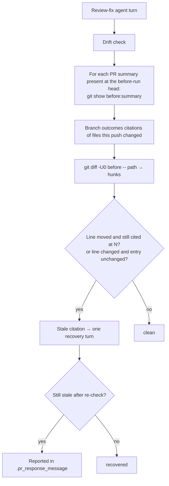

## Summary

The review-fix drift check now catches `Branch outcomes:` `path:line` citations that a fix push leaves at the previous head's line numbers. New pure module `worker/deno/lib/branch_outcome_citations.ts` parses the citations in the summary as it stood at the before-run head. It maps each citation of a file this push changed through that file's `git diff -U0 <before-run head>`. It flags two cases: a citation whose line moved but which the summary still gives at the old number, and an entry left unchanged (apart from whitespace) although this push changed or removed its cited lines. `pr_feedback_drift_check.ts` runs this as a fifth deterministic check on every non-skipped push. It feeds a hit into the existing one-turn recovery and reports anything left in `.pr_response_message`. The `pr_feedback` prompt now names line citations alongside test counts in "Keep the PR summary true to the head". Closes #3341.

## Spec

### Intent and Rationale

- Whether a cited line moved is mechanical, because the push's hunk headers give the offset. A deterministic check therefore replaces another prose rule the agent kept missing (VibeCoder#3160, #3312).
- The check compares the before-run summary with the current one. A citation the agent already renumbered (written in head numbering) is then never mapped a second time, which would give a false positive.

### Essential Design Decisions

- **Moved line**: a hit only while the current `Branch outcomes:` list still cites the same `path:N`/`N-M`. Renumbering clears it.
- **Changed or removed line**: a hit only while the citing entry is unchanged (apart from whitespace) since the before-run head. Rewriting the entry after re-running its flip clears it, so a line edited in place but still at the same number does not stay flagged for ever.
- Only list entries and the header's inline body are read (the issue's "start with Branch outcomes entries only"). Citations of files this push did not change are never hits, and citations added in this push are not checked.
- Each input the check cannot read is reported as not checked and never passes clean: an unreadable before-run summary, a failed or binary diff, a cited name matching more than one changed file, a malformed citation (line 0, reversed range), or a list longer than `parseBranchOutcomes` reads. Like the quoted-sentence check's unreadable summary, these do not drive a recovery turn on their own.

### Undiscoverable Facts

- The drift check runs before the processor's commit, so "the push's diff" is `git diff <before-run head> -- <path>` (the working tree against the before-run head), not `<previous-head> HEAD` as the issue writes it.
- Comma-joined, slash-joined and bare `:N` continuation forms (`:720-725,735-738`, `:1147/1158/1169`, `` `:820` and `:821` ``) are real forms, so the parser reads them. The slash-joined form is in the archived `docs/archive/pr-summaries/pr-summary-3250.md` (`container_manifest.ts:1147/1158/1169`). The comma-joined and bare `:N` forms are in `pr-summary-3288.md` on the unmerged PR #3312 branch (`git show f8a3bc5c:docs/archive/pr-summaries/pr-summary-3288.md`: `branch_outcomes_gate.ts:720-725,735-738`, one of the issue's stale entries, and `` `:820` and `:821` ``). That file is not on `main`.

## Evidence

Backend-only change. No UI files are touched.

**Replay against the two PRs the issue cites** (scratch script, not committed; it runs the head's `changedFilesCitedBy`/`findStaleCitations` over `git diff -U0 <prev> <next>` and `git show` of the summary at both heads):

- PR #3312, `f8a3bc5c..2e740737`, `pr-summary-3288.md`: 12 stale citations. They cover all 11 the issue lists (`:250`, `:268`, `:275`, `:329`, `:398`→434, `:409`, `:624-627`, `:642`, `:645`, `:720-725`, `:735-738`) plus `:820`→885.
- PR #3160, `f8a6ad6f..2d78a2dd`, `pr-summary-3147.md`: 18 stale citations. They cover every number the issue lists (`branch_outcomes_gate.ts:346`→374, `:378`→406, `:227`→255, `:501`→527, `completion_phase.ts:2191-2196`→2241-2246), including basename-only citations resolved to their full path.
- Across all 15 consecutive review-head pairs of both PRs, 4 pairs produce hits and 11 are clean. I hand-checked three of the hits from the later #3160 rounds (`32138903..3114a65c` `:183`, `:268`; `3114a65c..a855e54a` `:183`): each old number names different code at the new head while the summary still cites it, so all three are true positives. **False positives found: 0.**

**Corpus run** over `docs/archive/pr-summaries/` (914 files, 42 with a `Branch outcomes` list):

- 327 citations extracted, 0 malformed, 0 truncated lists.
- An entry-level probe for `name.ext:N` shapes the parser failed to extract found 0 misses. Before the comma, slash and bare-`:N` forms were added it found 1 miss (`pr-summary-3250.md`), and the #3312 replay showed 1 more (`:735-738`).
- 1 summary carries its list only as a table, which this check does not read (by design, see Spec).

Issue numbers this diff adds as provenance:

- #3341: Review-fix pushes leave Branch outcomes path:line citations at the previous head: the drift check recounts tests but never re-checks cited lines (VibeCoder#3160, #3312)
- #3160: Branch-outcome test rule is prose only … (Issue #3147) (a PR, cited as evidence)
- #3312: Branch-outcomes gate passes entries that admit 'no test reaches it' … (Issue #3288) (a PR, cited as evidence)

**Docs sweep** — grep: `drift check`, "Four checks", "quoted-sentence check", "Test Plan recount", "recounted from the head", `parseBranchOutcomes`; section: `docs/workflows/pr-feedback.md#the-workers-drift-check-issue-3143`; updated: `docs/workflows/pr-feedback.md`, `docs/INTERNALS.md`, `prompts/pr_feedback/prompt.md`; `docs/workflows/issue-processing.md:1887` — still true because it describes the first-run summary-claim check's relation to the drift check, which is unchanged; `docs/IDLE-TASK-FRAMEWORK.md:302` and `prompts/github_actions_audit/prompt.md:107` — still true because their "four checks" are other subsystems.

Related existing rules checked: `prompts/pr_feedback/prompt.md` "Keep the PR summary true to the head" (extended) and "A fix re-enumerates the branches it adds" (agrees: refresh the list to the head), and `CODING-STANDARDS.md` "Every outcome of a branch you add needs a test that reaches it" ("refreshes the list to the head"). The new sentence agrees with all three. I applied the new rule to this PR's own diff: this is a first-run summary, so no citation carries over from an earlier head. Every `Branch outcomes:` line number below was re-read at the final head.

## Acceptance Criteria

<!-- vibe-spec-review inputs="diff+issue-body" -->

- **met** — Deterministic citation check on the review-fix path (alongside the test-count recount in `pr_feedback_drift_check.ts`): parse the `path:N` / `path:N-M` citations in the summary's `Branch outcomes:` list, using the existing `parseBranchOutcomes` units — evidence: `worker/deno/lib/branch_outcome_citations.ts` (`branchOutcomeCitations`), `worker/deno/lib/pr_feedback_drift_check.ts` (`checkLineCitations`) — reviewer: met
- **met** — For each citation of a file the push changed, map N through the push's diff; if the mapped line differs from N and the summary still says N, or line N was deleted, report it as a summary-rule hit on the existing one-fix-turn recovery path, naming the old and new line numbers — evidence: `worker/deno/tests/pr_feedback_drift_check_3341_test.ts::runPrFeedbackDriftCheck - a push that moves a cited line without renumbering the summary is reported with the stale citation`, `worker/deno/tests/branch_outcome_citations_3341_test.ts::findStaleCitations: (e) modified line, entry unchanged is stale` — reviewer: met — reason: the reviewer noted the diff runs `git diff <before> -- <path>` against the working tree rather than `<previous-head> HEAD`; the check runs before the processor commits, so that is the same diff
- **met** — Start with Branch outcomes entries only, so the false-positive rate stays measurable — evidence: `worker/deno/lib/branch_outcome_citations.ts` (`branchOutcomeCitations` reads `record.entries` and `record.body` only) — reviewer: met
- **met** — Run the check over `docs/archive/pr-summaries/` before enabling it, as CODING-STANDARDS "Writing a gate over text" requires — evidence: corpus run and the PR #3160/#3312 replay under Evidence (914 summaries, 327 citations; 15 real push pairs, 0 false positives found) — reviewer: missing — reason: the reviewer saw only the diff; the run used a scratch script outside the repository and its counts are recorded in this summary, which the reviewer did not have
- **met** — Prompt clarification in `prompts/pr_feedback/prompt.md` "Keep the PR summary true to the head": name `path:line` citations explicitly, alongside test counts; re-read and renumber, and re-run any flip whose code changed — evidence: `prompts/pr_feedback/prompt.md` — reviewer: met
- **met** — a fix diff that inserts lines above a cited line while the summary keeps the old number blocks — evidence: `worker/deno/tests/branch_outcome_citations_3341_test.ts::findStaleCitations: (a) insertion above a still-cited line is stale` — reviewer: met
- **met** — the same diff with the citation renumbered passes — evidence: `worker/deno/tests/pr_feedback_drift_check_3341_test.ts::runPrFeedbackDriftCheck - a push that moves a cited line AND renumbers the summary is clean` — reviewer: met
- **met** — A diff in a file the summary does not cite never blocks — evidence: `worker/deno/tests/pr_feedback_drift_check_3341_test.ts::runPrFeedbackDriftCheck - a push that changes an uncited file is clean` — reviewer: met
- **unrequested** — comma-joined, slash-joined and bare `:N` citation forms — reviewer: unrequested — reason: real forms in the archived corpus. Without them the check skips one of the issue's own stale #3312 entries (`:735-738`), which "never passes what it skipped" forbids
- **unrequested** — basename and suffix resolution of a cited path (`resolveCitedPath`) — reviewer: unrequested — reason: the #3160 summary cites `branch_outcomes_gate.ts:378` by basename, and the issue lists those entries as stale; a unique suffix match resolves them, and an ambiguous one is reported as not checked
- **unrequested** — hostile-input regex tests — reviewer: unrequested — reason: required by CODING-STANDARDS "Vet every regex on untrusted text" for each new pattern

## Standards Review

<!-- vibe-standards-review inputs="diff+CODING-STANDARDS.md" -->

- **clean** — no violations found. Checked: removed assertions (none, since only new test files are touched); named tests exist; regex vetting with a hostile case per new pattern (`TOKEN_SPLIT_RE`, `LINE_SUFFIX_RE`, `RANGE_PART_RE`); reuse of `parseBranchOutcomes` and the exported caps rather than a copy; "Writing a gate over text" (evasion variants, look-alikes, unread input reported as not checked); no workflow files; no stub of another repository's binary (the tests run real `git` in temporary repositories)

## Test Plan

- New `worker/deno/tests/branch_outcome_citations_3341_test.ts`: unit tests for citation extraction (including malformed, URL, `path::name`, comma, slash and bare-`:N` forms and hostile ReDoS inputs), hunk parsing, `mapOldLine`, `resolveCitedPath` and `findStaleCitations` cases (a)-(p) — 55 `Deno.test` entries in the file.
- New `worker/deno/tests/pr_feedback_drift_check_3341_test.ts`: `runPrFeedbackDriftCheck` against real temporary git repositories (reported, clean, recovered, uncited file, new summary, failed `ls-tree`, `show` and `diff`, binary cited file), plus `buildDriftRecoveryPrompt` and `formatDriftResidual`.
- `cd worker/deno && deno test --allow-all tests/branch_outcome_citations_3341_test.ts tests/pr_feedback_drift_check_3341_test.ts tests/pr_feedback_drift_check_3143_test.ts tests/pr_feedback_drift_check_3244_test.ts tests/pr_feedback_processor_drift_check_3143_test.ts tests/lib_sweep_coverage_test.ts < /dev/null` passed (148 passed, 0 failed) — re-run on the head that fixes the PR #3375 review's moved-line false positive.
- `./quality.sh < /dev/null` passed (with the pre-existing `config integration` skip) — re-run on this head.
- No existing test is edited, so no assertion is removed.
- The new `docs/audits/lib-sweep-coverage/top-up-3341.json` claims the new module for `worker/deno/tests/lib_sweep_coverage_test.ts`.

**PR #3375 review fix:** the "moved and still cited at the old number" check compared the old `path:N` against every current citation in the summary (`curKeys`), not against what the OTHER previous citations are themselves expected to legitimately renumber onto. Two previous citations whose line gap equals an inserted span (e.g. `:941` and `:943` with a 2-line insertion above `:941`) both shift onto numbers that coincide with the OTHER citation's old number, so a correctly-renumbered summary (`:943`, `:945`) was flagged as if `:943` were still the old, unrenamed citation. Fixed by building a multiset (`expectedAtKey`) of the new keys previous citations legitimately map onto, and only flagging a `path:N` hit when the current summary cites it more times than that multiset explains — reverting just this change (restoring the bare `curKeys.has(...)` check) turns new test (o) red while (p) stays green, confirming (p) still catches a genuinely unrenamed sibling.

**Branch outcomes:**

- `worker/deno/lib/branch_outcome_citations.ts:135` — a bare `:N` token inherits the previous path — `worker/deno/tests/branch_outcome_citations_3341_test.ts::extractLineCitations: (c) a later bare :N inherits the previous path` — dropping the inheritance turned it red
- `worker/deno/lib/branch_outcome_citations.ts:161` — line 0 or a reversed range is malformed — `extractLineCitations: line 0 is malformed` and `findStaleCitations: (m) malformed citation on a changed file is unchecked` (same file) — `if (false)` turned four tests red
- `worker/deno/lib/branch_outcome_citations.ts:240` — binary diff → null — `parseDiffHunks: binary file returns null` (same file) — removing the return turned it red
- `worker/deno/lib/branch_outcome_citations.ts:287` — cited line inside a removed range → removed — `mapOldLine: modified line is removed` (same file) — `if (false)` turned two tests red
- `worker/deno/lib/branch_outcome_citations.ts:322` — more than one suffix candidate → ambiguous — `findStaleCitations: (g) ambiguous basename is unchecked` (same file) — returning a match turned two tests red
- `worker/deno/lib/branch_outcome_citations.ts:468` — truncated previous list → not checked — `findStaleCitations: (k) truncated previous list is unchecked` (same file) — disabling it turned (k) red
- `worker/deno/lib/branch_outcome_citations.ts:487` — citation of a file this push did not change → skipped — `findStaleCitations: (c) diff in a file the summary does not cite is clean` (same file) — not skipping turned (c) red
- `worker/deno/lib/branch_outcome_citations.ts:505` — no hunks for a cited path → not checked — `findStaleCitations: (h) missing hunks is unchecked` (same file) — disabling it turned (h) red
- `worker/deno/lib/branch_outcome_citations.ts:522` — moved and cited more times than previous citations legitimately map onto that key → stale — `findStaleCitations: (a) insertion above a still-cited line is stale` (same file) — inverting `moved` turns seven tests red: (a), (d), (e), (f), (l), (p) and the comma-joined test
- `worker/deno/lib/branch_outcome_citations.ts:522` — a renumbered citation landing on a sibling's old number stays clean, but a genuinely unrenamed sibling at that same number is still caught — `findStaleCitations: (o) a renumbered citation landing on a sibling's old number is clean (PR #3375 review)` / `(p) a genuinely stale leftover is still caught alongside a correct sibling rename` (same file) — reverting the `expectedAtKey` multiset (restoring the bare `curKeys.has(...)` check) turned (o) red while (p) stayed green
- `worker/deno/lib/branch_outcome_citations.ts:533` — changed line with its entry unchanged → stale; entry rewritten → clean — `findStaleCitations: (e) modified line, entry unchanged is stale` / `(f) modified line, entry rewritten keeping number is clean` (same file) — dropping the `removedInRange` condition turned (j) red
- `worker/deno/lib/pr_feedback_drift_check.ts:906` — failed `ls-tree` → not checked, no recovery turn — `worker/deno/tests/pr_feedback_drift_check_3341_test.ts::runPrFeedbackDriftCheck - a failed ls-tree read of the before-run summary is reported unavailable with no recovery turn` — skipping silently turned it red
- `worker/deno/lib/pr_feedback_drift_check.ts:913` — summary new in this push → skipped — `runPrFeedbackDriftCheck - a summary new in this push is clean even though lines moved` (same file) — `if (false)` turned it red
- `worker/deno/lib/pr_feedback_drift_check.ts:919` — failed `git show` → not checked — `runPrFeedbackDriftCheck - a failed show read of the before-run summary is reported unavailable with no recovery turn` (same file) — skipping silently turned it red
- `worker/deno/lib/pr_feedback_drift_check.ts:941` — failed `git diff` → not checked — `runPrFeedbackDriftCheck - a failed diff read of the cited file is reported unavailable with no recovery turn` (same file) — substituting empty hunks turned it red
- `worker/deno/lib/pr_feedback_drift_check.ts:943` — binary cited file → not checked — `runPrFeedbackDriftCheck - a cited binary file is reported unavailable with no recovery turn` (same file) — substituting empty hunks turned it red
- `worker/deno/lib/pr_feedback_drift_check.ts:1206-1207` — stale or unchecked citations block the `clean` return — `runPrFeedbackDriftCheck - a push that moves a cited line without renumbering the summary is reported with the stale citation` (same file) — dropping the condition turned four tests red
- `worker/deno/lib/pr_feedback_drift_check.ts:1223` — a stale citation drives the recovery turn — `runPrFeedbackDriftCheck - a recovery turn that renumbers the stale citation reports recovered` (same file) — dropping it turned two tests red
- `worker/deno/lib/pr_feedback_drift_check.ts:1299` / `:1312` — residual carries stale or unchecked citations — the reported-stale test and the four "reported unavailable" tests (same file) — `...(false` turned one and four tests red respectively
- `worker/deno/lib/pr_feedback_drift_check.ts:557` — renumber step only when citations are stale — `buildDriftRecoveryPrompt - fences stale citations only when given, and the renumber step only then` (same file) — `if (false)` turned it red
- `worker/deno/lib/pr_feedback_drift_check.ts:639` / `:676` / `:692` — residual rendering: hits intro, citation lines, unavailable line — `formatDriftResidual - a staleCitations-only residual lists the citation under the 'found text' intro` and `formatDriftResidual - a citationCheckUnavailable-only residual prints only that line, no 'found text' intro` (same file) — dropping each turned at least one test red
- `worker/deno/lib/pr_feedback_drift_check.ts:982` — reply lead counts stale citations as hits — `runPrFeedbackDriftCheck - a push that moves a cited line without renumbering the summary is reported with the stale citation` (same file) — `false` turned it red

🤖 Generated with [Claude Code](https://claude.com/claude-code)
