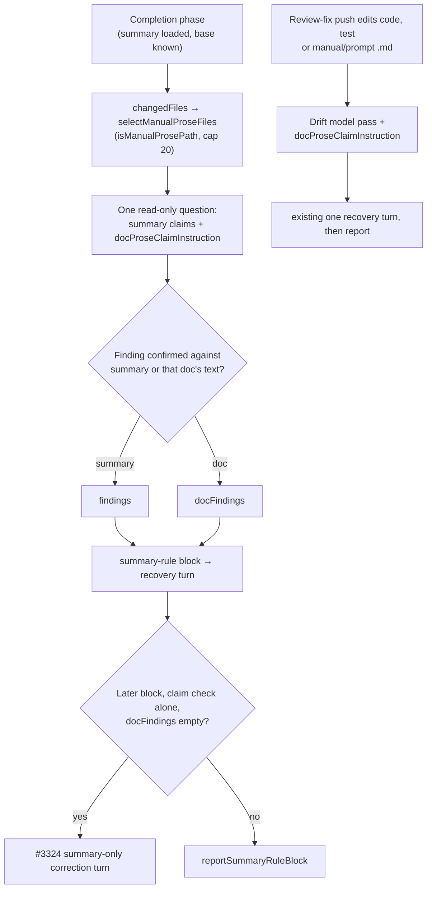

## Summary

The first-run claim check and the review-fix drift check now read the
manual and prompt Markdown a change edits, not only the PR summary. Each asks
the read-only model whether the head code that decides a "when", "refuses /
allows" or absolute-word sentence agrees with it. A confirmed contradiction
feeds the existing summary-rule recovery path; no new gate path was added.
Closes #3347.

## Spec

### Intent and Rationale

- After #3120 and #3232 (prose guidance only), fleet PRs kept shipping manual or prompt sentences that the PR's own head code contradicted (GRQ-AutoTrader#2609, #2685, #2699, VibeCoder#3308). The two model passes that already compare prose with head code never looked at those lines.
- Extending the existing question (`runSummaryClaimCheck`, `buildDriftQuestionPrompt`) reuses the existing verdict parser, confirmation and recovery machinery. A separate checker would have needed a new gate path, which the issue rules out.

### Essential Design Decisions

- One shared scope and question, `worker/deno/lib/doc_prose_claims.ts`. `isManualProsePath` accepts `.md` outside `docs/archive/pr-summaries/` with a safe relative shape, and rejects test fixtures. `docProseClaimInstruction` gives the same wording to both checks, so they cannot drift apart.
- Doc findings go into a separate `docFindings` list. `findings` stays summary-only, so the #3324 carry-forward and the summary-only correction turn never touch a doc sentence. The correction turn is withheld when `docFindings` is non-empty (`completion_phase.ts`), because it can only rewrite the summary. That block takes `reportSummaryRuleBlock` instead.
- Fail loud on what was not read. If the changed-file list is missing, a file is past the 20-file cap (`MAX_DOC_PROSE_FILES`), or a file cannot be read (anything but `NotFound`), it is recorded in `notChecked` and logged at error. It is never passed as clean. A finding is confirmed only when it names a file the question was asked about and quotes that file's current text.
- In the drift check, the manuals the push edited are listed before the PR's other docs, so the existing 40-file cap cannot drop them. Files over the cap are now logged at warn.

### Undiscoverable Facts

- The first-run check uses the completion phase's existing `git diff --name-only <base>...HEAD` list, so it covers committed changes only. That is the same list the docs-sweep and branch-outcomes gates use.
- The new lib module needed its own lib-sweep coverage slice (`docs/audits/lib-sweep-coverage/top-up-3347.json`), or the completeness checks stage of `./quality.sh` fails. Its `sweptAt` is the branch's merge-base with `origin/main`, because a branch-only commit is lost on squash.

## Evidence

Backend-only change (no UI files).

Issue numbers this diff cites as provenance:

- #3347: Claim check never reads manual prose: fleet PRs keep shipping docs that misstate their own new behaviour after #3120/#3232 (GRQ-AutoTrader#2609, #2685, #2699, VibeCoder#3308)
- #3257: First-run PR summaries describe named code wrongly from the start: the #3143 claim check runs only on review-fix pushes (VibeCoder#3252, #3132)
- #3143: Review-fix runs get no drift check: summary and docs rules (#3114, #3117, #3120) are prose only, and fix pushes still leave docs contradicting the head (VibeCoder#3134, #3095, #3132)
- #3324: First-run claim check (#3257) catches a wrong PR-summary sentence but the PR ships with it: the one recovery turn misses or never sees it (VibeCoder#3310, #3322)
- #3120: Fleet docs and prompts misstate the PR's own new behaviour: dropped conditions and absolute claims the code does not guarantee (GRQ#5158, VibeCoder#3095, #3119, GRQ#5153, GRQ-AutoTrader#2259)
- #3232: Absolute-claim rule misses "every"/"all" and closed lists: fleet docs overstate what their own scan or coverage handles (VibeCoder#3231, #3160, GRQ-AutoTrader#2479)

Fakes: the completion-phase tests drive `runSummaryClaimQuestion` and `runGitCommand` fakes. Their `git diff --name-only` reply stands in for `deps.git.runGitCommand`, the same production call that builds `changedFiles`. The drift-check tests run against real temporary git repos.

**Docs sweep** — grep: `docs-only push`, `claim check alone`, `alone still block`, `only gate still`, `correction turn`, `runSummaryClaimCheck`, `summary_claim_check`, `pr_feedback_drift_check`; section: `docs/workflows/issue-processing.md#-a-summary-that-describes-named-code-wrongly-blocks-the-pr-issue-3257`, `docs/workflows/pr-feedback.md#the-workers-drift-check-issue-3143`; updated: `docs/workflows/issue-processing.md`, `docs/workflows/pr-feedback.md`, `docs/INTERNALS.md`, `DESIGN-PRINCIPLES.md`, `CODING-STANDARDS.md`; `worker/deno/lib/pr_feedback_drift_check.ts:1140` — still true because it says a line citation can go stale on a docs-only push, which this change does not affect.

## Acceptance Criteria

<!-- vibe-spec-review inputs="diff+issue-body" -->

- **met** — Extend the first-run claim check (`runSummaryClaimCheck`, #3257) to cover prose lines the diff adds or edits in Markdown outside `docs/archive/pr-summaries/` — evidence: `worker/deno/tests/summary_claim_check_test.ts::runSummaryClaimCheck - a confirmed changed-manual finding lands in docFindings and blocks`, `worker/deno/tests/completion_phase_summary_claim_check_test.ts::completion - the changed file list reaches the claim question so a changed manual is checked` — reviewer: met — reason: the reviewer noted the check runs only when a PR summary was loaded and the base ref is known. That is the existing claim check's precondition, and the issue does not ask to change it.
- **met** — Run the same scope in the review-fix drift check (#3143), so a fix push that rewrites a doc line is checked too — evidence: `worker/deno/tests/pr_feedback_drift_check_3347_test.ts::runPrFeedbackDriftCheck - a push that edits only a manual makes one read-only model call and reports clean on an empty verdict` — reviewer: met
- **met** — Feed findings into the existing summary-rule recovery path, and do not add a new gate path. Keep #3324's fix in mind so the flagged sentence is actually corrected before raising — evidence: `worker/deno/tests/completion_phase_summary_claim_check_test.ts::completion - a first block from a doc finding takes the recovery turn, which fixes the manual and the PR is raised`, `worker/deno/tests/completion_phase_summary_claim_check_test.ts::completion - a later block from a doc finding gets no summary-only correction turn` — reviewer: met
- **met** — Do not relax the #3120/#3232 guidance. This adds a check that enforces it — evidence: `CODING-STANDARDS.md` "Prose about the PR's own change" only gains a paragraph — reviewer: met
- **unrequested** — the #3324 correction turn is withheld when a block carries a doc finding, and four docs say so — reviewer: unrequested — reason: this is how the diff meets item 3's "keep #3324's fix in mind". The summary-only turn cannot fix a doc sentence, and its carry-forward would drop the finding.
- **unrequested** — the 20-file cap with not-checked reporting — reviewer: unrequested — reason: it bounds the one question's size and fails loud on what it skips, so nothing is passed unread.
- **unrequested** — `isManualProsePath` also rejects test-fixture Markdown, legacy `docs/pr-summary-N.md` paths and unsafe path shapes — reviewer: unrequested — reason: each path is interpolated into a model prompt and read from disk, and a fixture is not a manual.
- **unrequested** — the drift check lists pushed manuals first and warns on files over its 40-file cap — reviewer: unrequested — reason: without it, a pushed manual could fall past the existing cap and go unquestioned without a trace.
- **unrequested** — the gate comment is restructured into a variable-length procedure, and the block reason has a doc-specific form — reviewer: unrequested — reason: the recovery turn needs the file name and a fix-the-doc step to correct a doc sentence.

## Standards Review

<!-- vibe-standards-review inputs="diff+CODING-STANDARDS.md" -->

- **clean** — Prose about the PR's own change, A code change owes a docs change, A named test must exist, A new test must go red without its change, negative tests able to fail, every branch outcome tested, a new argument reaches every caller (`changedFiles` from `completion_phase.ts`), no silent pass on unread input, path-shape safety, no hostile regex, Australian English. The reviewer found no rule worded "by review only" and checked the blocking self-review rules instead. Optional notes: the new not-checked cases log at error. That matches this module's existing policy for deterministic degradation (null base ref), so it was kept. The shared question's opener was tightened in this diff so it is true in the drift check too.

## Test Plan

Added tests:

- `worker/deno/tests/doc_prose_claims_test.ts` (new): path scope accept and reject cases, cap splitting, instruction wording.
- `worker/deno/tests/summary_claim_check_test.ts`:
  - prompt with and without `docFiles`, plus invalid `docFiles`.
  - `runSummaryClaimCheck` cases: a confirmed doc finding; an unconfirmed sentence; an unchanged file; null `changedFiles`; files over the cap; an absent file and an unreadable one.
  - Gate comment rendering.
- `worker/deno/tests/pr_feedback_drift_check_3347_test.ts` (new): manual-only push gets a read-only pass, recovery on a reported manual sentence, summary-only push gets none, prompt instruction only when a manual is listed, pushed manual kept under the 40-file cap.
- `worker/deno/tests/completion_phase_summary_claim_check_test.ts`: the four "completion - …" doc-finding tests (call-site wiring, first-block recovery, later block with no correction turn, existing PR finalised as `summary_incomplete`).

Edited existing tests, no assertion removed:

- `worker/deno/tests/pr_feedback_drift_check_3143_test.ts`: three tests pushed `docs/notes.md` and asserted no model call. #3347 item 2 makes a Markdown manual edit trigger a model pass, so those pushes now write `docs/notes.txt` (a non-Markdown doc) and every assertion is kept. The first test is renamed "a docs-only push that edits no Markdown makes no model call and reports clean".
- `worker/deno/tests/pr_feedback_drift_check_3244_test.ts`: the same fixture switch in "a finding naming a pr-summary that does not exist at the head …". Its assertions are unchanged.
- `worker/deno/tests/summary_claim_check_test.ts`, `worker/deno/tests/summary_claim_correction_test.ts`, `worker/deno/tests/summary_rule_gate_retry_test.ts`: they only add the new required `docFiles: []`, `changedFiles: []` and `docFindings: []` fields.

Results on the head:

- Targeted run: `deno test --allow-all` over the claim-check, correction, retry and drift-check test files passed. The last run of the three `doc_prose_claims`, `summary_claim_check` and `pr_feedback_drift_check_3347` files gave 81 passed, 0 failed.
- `./quality.sh < /dev/null` passed on the final head (completeness, markdownlint, semgrep, deno tests, lint, type check and fmt; config integration skipped).

**Branch outcomes:**

- `worker/deno/lib/doc_prose_claims.ts:45` — untrimmed path rejected — `doc_prose_claims_test.ts::isManualProsePath rejects unsafe path shapes` — dropping the trim clause went red
- `worker/deno/lib/doc_prose_claims.ts:47` — over 500 chars rejected — `isManualProsePath enforces the length limit` — removing the cap went red
- `worker/deno/lib/doc_prose_claims.ts:48` — control char, backslash or backtick rejected — `isManualProsePath rejects unsafe path shapes` — removal went red
- `worker/deno/lib/doc_prose_claims.ts:49` — leading `/` or `-` rejected — same test — removal went red
- `worker/deno/lib/doc_prose_claims.ts:51` — `..`, `.` or empty segment rejected — same test — removal went red
- `worker/deno/lib/doc_prose_claims.ts:53` — non-`.md` rejected — `isManualProsePath rejects non-Markdown` — removal went red
- `worker/deno/lib/doc_prose_claims.ts:54` — `docs/archive/pr-summaries/` rejected — `isManualProsePath rejects PR summaries` — removal went red
- `worker/deno/lib/doc_prose_claims.ts:55` — legacy `docs/pr-summary-N.md` rejected — same test — removal went red
- `worker/deno/lib/doc_prose_claims.ts:56` — test-directory Markdown rejected — `isManualProsePath rejects Markdown under a test directory` — removal went red
- `worker/deno/lib/doc_prose_claims.ts` `selectManualProseFiles` invalid cap throws — `selectManualProseFiles rejects an invalid cap` — removing the throw went red
- `worker/deno/lib/summary_claim_check.ts` `buildSummaryClaimQuestionPrompt` over-cap and non-prose `docFiles` throw — `summary_claim_check_test.ts::buildSummaryClaimQuestionPrompt - rejects non-prose and over-cap docFiles` — removing either throw went red
- `worker/deno/lib/summary_claim_check.ts:795` — null `changedFiles` recorded as not checked — `runSummaryClaimCheck - null changedFiles is notChecked and the doc instruction is omitted` — making it act as an empty list went red
- `worker/deno/lib/summary_claim_check.ts:805` — over-cap files recorded as not checked — `runSummaryClaimCheck - manual files over the cap are reported and left out of the prompt` — removal went red
- `worker/deno/lib/summary_claim_check.ts:824` — `NotFound` skipped silently, other read errors recorded as not checked — `runSummaryClaimCheck - an absent changed manual is skipped silently; an unreadable one is notChecked` — sending `NotFound` to not-checked went red
- `worker/deno/lib/summary_claim_check.ts:884` — doc finding confirmed into `docFindings` — `runSummaryClaimCheck - a confirmed changed-manual finding lands in docFindings and blocks` — routing it to unconfirmed went red
- `worker/deno/lib/summary_claim_check.ts` `summaryClaimBlockReason` doc-only reason, and `buildSummaryClaimGateComment` doc header and final step — `buildSummaryClaimGateComment - a doc-only finding names the file, sentence and procedure`, `buildSummaryClaimGateComment - summary and doc findings render both blocks` — each flip went red
- `worker/deno/lib/pr_feedback_drift_check.ts:416` — doc-prose instruction added only when a manual is listed — `pr_feedback_drift_check_3347_test.ts::buildDriftQuestionPrompt - the doc-prose instruction appears only when a manual is listed` — removal went red
- `worker/deno/lib/pr_feedback_drift_check.ts:1158` — model pass on a manual-only push — `runPrFeedbackDriftCheck - a push that edits only a manual makes one read-only model call and reports clean on an empty verdict` — removing the clause went red. The not-taken outcome is covered by `runPrFeedbackDriftCheck - a push that edits only the PR summary still makes no model call`.
- `worker/deno/lib/pr_feedback_drift_check.ts:1167` and `:1177` — pushed manuals ordered first, and a warning for files over the cap — `runPrFeedbackDriftCheck - a pushed manual is still questioned when the PR carries more docs than the file cap` — removing the ordering went red, and removing the warning went red
- `worker/deno/lib/phases/completion_phase.ts:2606` — `changedFiles` reaches the claim check — `completion_phase_summary_claim_check_test.ts::completion - the changed file list reaches the claim question so a changed manual is checked` — passing `[]` went red
- `worker/deno/lib/phases/completion_phase.ts:3026` — correction turn withheld for doc findings — `completion - a later block from a doc finding gets no summary-only correction turn`, `completion - a later doc-finding block on an existing PR is finalised as summary_incomplete with no correction turn` — dropping the clause went red

Entry points checked: the completion phase's `runSummaryClaimCheck` call (wiring test above) and `runPrFeedbackDriftCheck` (real-repo tests). Callers checked for the new required fields: `completion_phase.ts` is the only production caller of `runSummaryClaimCheck`, and the remaining test constructions were updated.

Related rules checked: the "Prose about the PR's own change" rule in `CODING-STANDARDS.md`, `prompts/issue/prompt.md` step 3 and `prompts/pr_feedback/prompt.md` "Hold prose about this PR's own change". The new paragraph agrees with each and loosens none. Applied to this PR's own diff: the first draft of the new paragraph said a contradiction "blocks the PR until the sentence is rewritten", and that the run "gets one recovery turn". Both were scoped to what the head code does (first summary-rule block only, then fail or `summary_incomplete`). The shared question's opener ("every listed file … is a manual or prompt") was false for the drift check and was rewritten.

🤖 Generated with [Claude Code](https://claude.com/claude-code)
