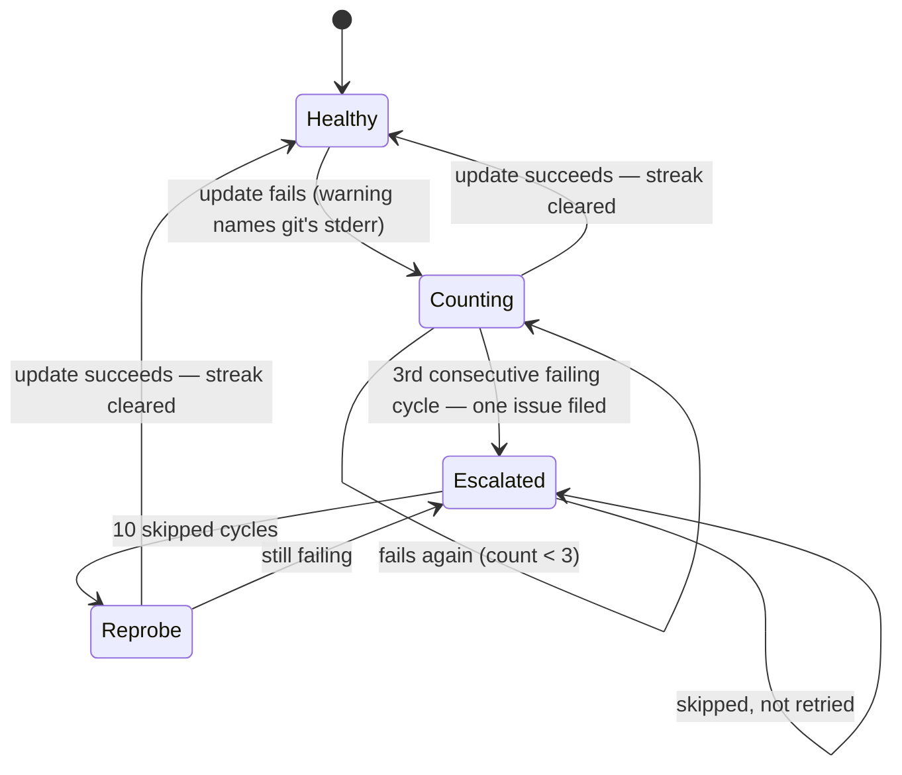

# PR branch update: escalate once instead of retrying for ever

## Summary

The branch-update pass logged each failure and moved on, so the next cycle
retried the same branch from scratch. One branch in
`stSoftwareAU/NEAT-AI-core` produced **65 identical**
`Failed to checkout branch 'issue-3832-detect-cycles-linear'` warnings across
days: nothing counted the repeats, nothing escalated, and the line never named
git's own failure, so even the sixty-fifth was unactionable.

This change gives the failure a memory and a voice:

- **New `worker/deno/lib/pr_branch_update_failure_streak.ts`** — counts
  consecutive failing **cycles** per `(repo, branch)` and, at three, files
  **one** issue against the repo naming the PR, the branch, the consecutive
  count and the underlying git error. Persistent JSON written atomically,
  marker-deduped on the issue body so two hosts converge on one issue, cleared
  on the first success. Same shape as `bump_script_failure_streak.ts` (#207)
  and `idle_inversion_streak.ts` (#321).
- **Escalated branches are skipped, not retried** — with a bounded re-probe
  every 10 cycles, so a branch that is fixed heals itself instead of staying
  suppressed for ever. Suppression is reported (`suppressedCount`, an info line
  and a per-PR detail), never silent.
- **`git_pull.ts` now carries git's stderr on every checkout failure.** Two of
  the three checkout sites discarded it entirely; all three now share one
  `checkoutFailureError()` helper, so the warning names the pathspec, dirty
  tree or lock file that caused the refusal.
- Wired into both callers of `executePrBranchUpdates` — `run_core_production_deps.ts`
  and the `pr_maintenance` command. Omitting the new `failureStreak` dep leaves
  the pass behaving exactly as before, which one test pins.

Counting is per `(repo, branch)`, so one stuck branch never suppresses updates
for its siblings, and per **cycle**, so a pass that runs twice in one cycle
counts once.

Closes #335.

## Evidence

Backend/CLI change — no web interface to screenshot. The evidence is the test
suite: 23 new tests across three files, all exercising real functions with real
streak state (only `gh` and the git-update callback are stubbed).

```
deno test tests/pr_branch_update_failure_streak_test.ts   ok | 15 passed | 0 failed
deno test tests/pr_branch_update_streak_wiring_test.ts    ok |  6 passed | 0 failed
deno test tests/git_pull_checkout_error_test.ts           ok |  2 passed | 0 failed
deno test tests/pr_branch_update_test.ts \
         tests/pr_branch_update_integration_test.ts       ok | 69 passed | 0 failed (with the wiring suite)
```

The two `git_pull_checkout_error_test.ts` tests were written first and failed
against the unfixed code with:

```
AssertionError: Expected actual: "failed to checkout branch 'issue-999-missing'"
to contain: "pathspec"
```

`./quality.sh` passes every gate except `deno tests`, which fails on nine
pre-existing host-environment tests (`fleet_health_test.ts`,
`optional_feature_env_test.ts`, `setup_workdir_reminder_test.ts`). Those nine
fail identically on a clean checkout of `Develop` on this host — confirmed by
stashing this branch's changes and re-running them — and none touch the
branch-update path.

### State machine



### Acceptance criteria

| Criterion | Where it is pinned |
| --- | --- |
| N consecutive failing cycles escalate once, not retried indefinitely | `#335 - a permanently failing branch is escalated once, then skipped` — 10 cycles produce 3 update attempts, 1 `gh issue create`, 1 escalation warning |
| The warning names the underlying git failure | `git_pull_checkout_error_test.ts` — both `updatePrBranch` and `ensurePrMergeable` surface git's `pathspec` stderr |
| A transient failure that clears escalates nothing | `#335 - a transient failure that clears escalates nothing` — 12 cycles of fail/fail/succeed make zero `gh` calls and leave empty state |
| The count is per `(repo, branch)` | `#335 - one escalated branch does not suppress its siblings` — the sibling branch is still attempted while the escalated one is skipped |

## Test Plan

New — `worker/deno/tests/pr_branch_update_failure_streak_test.ts` (15 tests):

- repeated failures inside one cycle count once (cycles, not attempts)
- one issue filed at the threshold, never re-filed
- the filed issue names the PR, the count, the base branch and the git error
- an existing open escalation issue is adopted, not duplicated
- a failed issue search files nothing (a duplicate is worse)
- a transient failure never escalates; a success clears an escalated streak
- suppression: never before escalation, stable within a cycle, re-probed after
  the skip budget
- per-`(repo, branch)` isolation for both siblings and other repos
- corrupt state restarts the streak; clearing an untracked branch is a no-op
- git output cannot forge a marker or close the body's code fence

New — `worker/deno/tests/pr_branch_update_streak_wiring_test.ts` (6 tests):
escalate-then-skip over 10 cycles, suppression reported rather than dropped,
transient failures escalating nothing, recovery after escalation, sibling
isolation, and unchanged behaviour when the streak dep is omitted.

New — `worker/deno/tests/git_pull_checkout_error_test.ts` (2 tests): real git
fixture repos assert both checkout sites carry git's stderr.

No existing tests were modified or removed.
