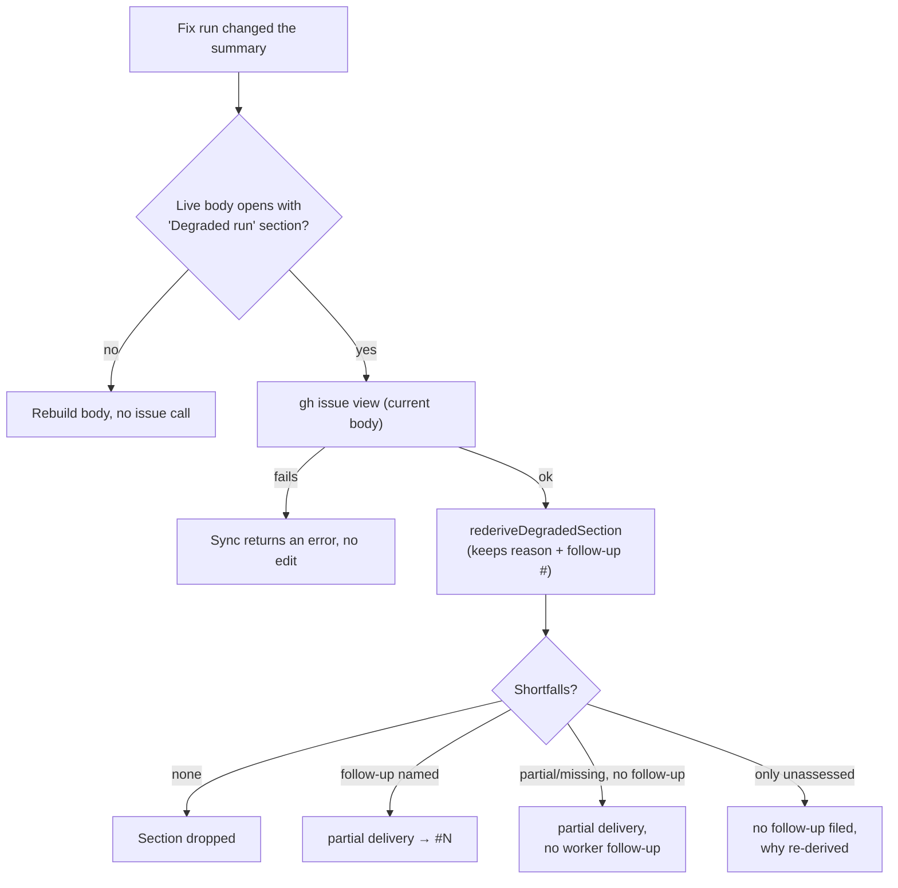

# PR Summary — Issue #3350: re-derive the degraded-run banner on PR body sync

## Summary

Each PR body sync (`syncPrBodyFromSummary`) copied the leading `## ⚠️ Degraded run —` section forward
unchanged. The summary file does not hold that section, so when the banner stopped being true no fix
run could correct it. The sync now re-derives the section from the issue's current body and the
rebuilt summary, using the same scope matching PR creation uses. The only things it keeps from the
live section are the original run's degradation reason and the follow-up number it named. If the
issue cannot be read, the sync fails loudly instead of copying the old banner. Closes #3350.

## Spec

### Intent and Rationale

- The issue offered two fixes: re-derive the banner from current state, or move it into something a fix run can edit. This PR re-derives it. Moving the banner into the summary would let an agent delete a true banner, and making that gap impossible to miss is why the degraded guard exists (#2562).
- After the run, a sync cannot tell which model served it. So the degradation reason and the follow-up number are read back from the live banner, and everything else is recomputed.

### Essential Design Decisions

- `assessScopeShortfalls` is the scope-matching half of `assessDegradedDelivery`, extracted so PR creation and the sync share one owner and cannot drift apart.
- Outcomes of a re-derivation:
  - No shortfall left: the section is dropped, as at PR creation.
  - The live section named a follow-up: it keeps linking it.
  - A `partial`/`missing` gap but no follow-up: a new `partial delivery` section says the worker filed no follow-up. The sync never files issues itself.
  - Only `unassessed` items: the no-follow-up section, with its "why" recomputed.
- `parseDegradedSection` reads only the `This run was degraded (` line. Shortfall bullets are untrusted text and can never supply a follow-up number. The reason ends at the known sentence suffix rather than the first `)`, because reasons contain parentheses.
- If the issue read fails, or `gh` returns a body that is not a string, the sync returns an error and makes no edit. It never falls back to the stale banner.

### Undiscoverable Facts

- On stSoftwareAU/GRQ#5175 the issue (#5167) had its criteria under `## Done when`. `extractAcceptedScope` does not recognise that heading, so re-deriving alone would still say "states no acceptance criteria" for that issue. That separate root cause is filed as #3486.
- The sync still runs only when the summary changed (the digest rule from #3315), so editing the issue alone does not refresh the banner.

## Evidence

Backend-only change, with no UI files. Tests that cover it:

- `worker/deno/tests/pr_body_sync_test.ts::sync - re-derives a stale degraded-run section from the current issue and summary (Issue #3350)` is the regression test. It failed on the unfixed code with `AssertionError: Values are not equal. - true + false` at the assertion that the synced body does not start with `## ⚠️ Degraded run`, and passes after the fix.
- `worker/deno/tests/degraded_delivery_test.ts` covers `assessScopeShortfalls`, `parseDegradedSection` (including a hostile input), `buildDegradedUnfiledGapSection` and every `rederiveDegradedSection` outcome.

Issues cited as provenance: #3350: PR body sync carries a stale 'Degraded run' banner forward that no fix run can remove; #2562: bug: a degraded (fallback-model) run can close an issue with only partial scope delivered; #3486: Degraded-run guard reads a '## Done when' list as 'the issue states no acceptance criteria'.

**Docs sweep** — grep: "Degraded run", "degraded-run section", `carr\w* forward`, `extractDegradedRunSection`, `syncPrBodyFromSummary`; section: `docs/workflows/issue-processing.md#️-a-degraded-run-never-closes-an-issue-as-complete`; updated: `docs/workflows/issue-processing.md` (new bullet "A re-sync re-derives the section"), `docs/USAGE.md` (the `syncPrBodyFromSummary` paragraph), plus the module and function docs in `worker/deno/lib/pr_body_sync.ts` and `worker/deno/lib/degraded_delivery.ts`

Hits read and left in place:

- `docs/workflows/issue-processing.md:2133` and `:2137` are still true: they describe PR creation, which is unchanged.
- `docs/workflows/issue-processing.md:2157` is still true for the same reason.
- `worker/deno/lib/degraded_delivery.ts:25` and `:27` (the creation flowchart) are still true for the same reason.
- The `carr\w* forward` hits in `docs/CALLBACKS.md:391` (hook work), `docs/MODEL-AND-CACHING.md:1924` (session context), `docs/workflows/issue-processing.md:1980` and `:2010` (summary-claim findings), and in `worker/deno/lib/` outside the two changed files (for example `conflict_milestone_rebuild.ts:19`, `milestone_branch_sync.ts:1290`) are about other subjects, not the PR body's degraded-run section.

## Reproduction

- **symptom**: a fix run rewrote the summary, but the PR body still opened with "## ⚠️ Degraded run — no follow-up filed … the issue states no acceptance criteria" after that stopped being true, and review sent the PR back for it (GRQ#5175).
- **status**: `verified`. The regression test failed on the unfixed `syncPrBodyFromSummary`, which copied the banner forward, and passes after the fix.
- **regression test**: `worker/deno/tests/pr_body_sync_test.ts::sync - re-derives a stale degraded-run section from the current issue and summary (Issue #3350)`

## Test Plan

- Changed one existing test: `worker/deno/tests/pr_body_sync_test.ts::sync - keeps a leading degraded-run section (Issue #2562)` now answers the new `gh issue view` call before recording `gh` calls. No assertion was removed or changed, so no removed assertion needs an issue requirement.
- Added to `worker/deno/tests/pr_body_sync_test.ts`: the regression test above; `sync - fails loudly when the issue cannot be read to re-derive the degraded-run section (Issue #3350)`; `sync - fails when the issue view carries no string body (Issue #3350)`; `sync - makes no issue call when the body carries no degraded-run section (Issue #3350)`; `sync - a summary that now marks the criterion partial replaces the no-follow-up banner (Issue #3350)`.
- Added to `worker/deno/tests/degraded_delivery_test.ts`:
  - `assessScopeShortfalls - matches scope against the closure block`
  - `parseDegradedSection - round-trips a reason with parentheses from each builder`
  - `parseDegradedSection - shortfall bullets never supply a follow-up number`
  - `parseDegradedSection - a section without the opening line yields nothing`
  - `parseDegradedSection - hostile follow-up digits are not read as a number (Issue #3350)`
  - `buildDegradedUnfiledGapSection - throws on an all-unassessed verdict`
  - `rederiveDegradedSection - empty when every item is now met`
  - `rederiveDegradedSection - keeps the follow-up number and reason`
  - `rederiveDegradedSection - a gap with no follow-up gets the unfiled-gap section`
  - `rederiveDegradedSection - re-derives the no-follow-up reason from the current issue`
- `deno task test:unit tests/degraded_delivery_test.ts tests/pr_body_sync_test.ts tests/completion_phase_degraded_delivery_test.ts < /dev/null` from `worker/deno` passed on the final head: `ok | 104 passed | 0 failed`.
- `./quality.sh < /dev/null` passed (`Result: PASSED (with skipped checks)`; only `config integration` was skipped) on commit c577776a. The one later commit only adds a test, and that test passed in the targeted run above.
- Callers checked: `assessDegradedDelivery` (PR creation, via `applyDegradedDeliveryGuard` in `worker/deno/lib/phases/completion_phase.ts`) now calls `assessScopeShortfalls` with unchanged behaviour, and `worker/deno/tests/completion_phase_degraded_delivery_test.ts` still passes. `syncPrBodyFromSummary` is the only caller of `rederiveDegradedSection`. The fix-run processors reach it through `runPrBodySync`, and the new tests drive that entry directly.
- Guards on the new sync path: the re-derivation runs after every existing skip (no worker marker, summary unchanged, summary deleted, checkout not the PR head), so it adds no new way to reach `gh pr edit`. The "body already current" check still runs after it.

**Branch outcomes:** each was flipped on purpose and the suite went red, then restored.

- `worker/deno/lib/degraded_delivery.ts:374`: no opening line yields `{}`. Test: `parseDegradedSection - a section without the opening line yields nothing`. Flipped to return a reason: red.
- `worker/deno/lib/degraded_delivery.ts:379`: a known suffix found yields the reason. Test: `parseDegradedSection - round-trips a reason with parentheses from each builder`. Flipped to `if (false)`: 4 tests red.
- `worker/deno/lib/degraded_delivery.ts:383`: `continue in #N:` matched yields the follow-up number; no match (including the hostile digit run) yields none. Tests: `rederiveDegradedSection - keeps the follow-up number and reason`, `parseDegradedSection - hostile follow-up digits are not read as a number (Issue #3350)`. Flipped to always set 1: red.
- `worker/deno/lib/degraded_delivery.ts:399`: a verdict with no partial/missing shortfall throws. Test: `buildDegradedUnfiledGapSection - throws on an all-unassessed verdict`. Guard removed: red.
- `worker/deno/lib/degraded_delivery.ts:435`: no shortfalls drops the section. Tests: `rederiveDegradedSection - empty when every item is now met`, plus the sync regression test. Line deleted: red.
- `worker/deno/lib/degraded_delivery.ts:442`: a follow-up named keeps the follow-up section. Tests: `rederiveDegradedSection - keeps the follow-up number and reason`, `sync - keeps a leading degraded-run section (Issue #2562)`. Flipped to `if (false)`: red.
- `worker/deno/lib/degraded_delivery.ts:445`: a gap gives the unfiled-gap section; only unassessed items give the no-follow-up section. Tests: `rederiveDegradedSection - a gap with no follow-up gets the unfiled-gap section`, `rederiveDegradedSection - re-derives the no-follow-up reason from the current issue`, `sync - a summary that now marks the criterion partial replaces the no-follow-up banner (Issue #3350)`. Arms swapped: 3 tests red.
- `worker/deno/lib/pr_body_sync.ts:579`: no live section means no issue call. Test: `sync - makes no issue call when the body carries no degraded-run section (Issue #3350)`. Flipped to `if (true)`: 11 tests red.
- `worker/deno/lib/pr_body_sync.ts:592`: an issue body that is not a string fails the sync. Test: `sync - fails when the issue view carries no string body (Issue #3350)`. Check removed: red. This test was added after the first flip left the suite green.
- `worker/deno/lib/pr_body_sync.ts:596`: a failed issue read fails the sync with no edit. Test: `sync - fails loudly when the issue cannot be read to re-derive the degraded-run section (Issue #3350)`. Swapped for a skip: red.

🤖 Generated with [Claude Code](https://claude.com/claude-code)
