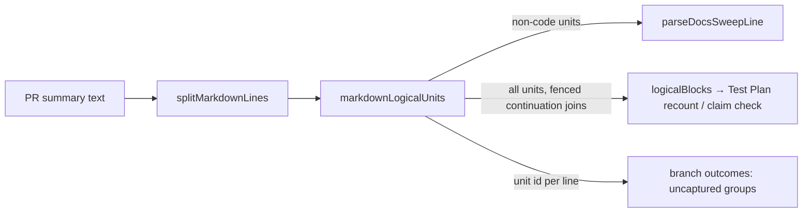

## Summary

Adds one shared Markdown logical-unit splitter, `markdownLogicalUnits` (with
`splitMarkdownLines`), to `worker/deno/lib/markdown_code_spans.ts`, the
module #3313 created. The three prose gates that each re-derived their own
line joiner now use it: `parseDocsSweepLine` (`docs_sweep_gate.ts`),
`logicalBlocks` (`test_plan_recount.ts`, and through it
`summary_claim_check.ts`), and the uncaptured-line grouping of the
unreached-admission check (`branch_outcomes_gate.ts`). CODING-STANDARDS.md
**Writing a gate over text**, rule 1, now says a gate over Markdown prose
matches per logical unit, never per physical line. It also says the
re-wrapped evasion test splits the matched phrase itself and uses a real
corpus shape. Closes #3356.

## Spec

### Intent and Rationale

- PR summaries are hard-wrapped at about 78 columns. Each gate's private joiner had its own end rules and its own gaps. `logicalBlocks` still read a plain wrapped paragraph one physical line at a time: on the pr-summary-2276 shape it compared "114 passed" with only the second line's file.
- One helper answers "which lines form one statement?", next to #3313's "which characters are code?", so a new gate calls it instead of `split("\n")`.

### Essential Design Decisions

- Units never merge across a blank line, heading, new list item, table row, fence, HTML comment, thematic break or quote-depth change. One unit's citation therefore cannot excuse another unit's admission.
- Fenced lines are not dropped. Each one becomes its own `code` unit, so a caller chooses: docs sweep skips them (a fenced example is not the entry), while the Test Plan recount and branch outcomes still check each line. No input the gates checked before is silently skipped.
- `logicalBlocks` keeps one shell rule inside fences: a line after a fenced line ending in `\` or `/` joins it. This is a command continuation, not Markdown, and the pr-summary-1021 shape depends on it.
- Each unit keeps its source line indexes, so a gate can still cite `file:line`.

### Undiscoverable Facts

- On this branch the branch-outcomes gate already checked each uncaptured paragraph as one joined unit (PR #3312 review, round 6). The issue's "no test\nreaches it" symptom no longer reproduced there. Its remaining gap was the private grouping, which merged a deeper heading, fenced line or HTML comment with the prose beside it.
- `prompts/coding_guidelines/prompt.md` does not carry the **Writing a gate over text** section, so it has no twin to update.

## Evidence

Backend/CLI change only; no UI files touched.

- **Red on base** (base production code with the new tests; each lib file restored after):
  - `docs_sweep_gate.ts`: 3 of 5 new tests failed (table row, HTML comment, fenced example).
  - `test_plan_recount.ts`: the 2276-shape pair, the 1639 wrong-count case and the heading/paragraph case failed.
  - `branch_outcomes_gate.ts`: the heading-citation and fenced-citation tests failed (valid=true).
- **Corpus run** over all 946 files in `docs/archive/pr-summaries/`, base against head:
  - `validateDocsSweep` and `validateBranchOutcomes` gave identical verdicts on all 946, so the corpus shows no new false positives and no lost hits.
  - `findTestPlanMismatches` differs on 40 summaries. The counts used are those at today's head, not at each PR's head, so absolute mismatch counts are not false-positive counts.
  - Every difference I read is the head reading the whole wrapped sentence where the base read its last physical line: the 1878, 2112 and 2276 shapes the issue names.
  - The one fenced regression found before the fix (pr-summary-1021's `\` continuation) is preserved by the shell-continuation rule and pinned by a test.
- **Provenance numbers the diff adds:**
  - #3356: Markdown gates keep matching hard-wrapped prose one physical line at a time
  - #3085: Docs sweep still misses the manual for the changed surface (Issue #3073)
  - #3157: Review-fix runs get no drift check (Issue #3143)
  - #3312: Branch-outcomes gate passes entries that admit 'no test reaches it' (Issue #3288)
  - #3288: same subject as #3312
  - #3313: Markdown gates keep pairing inline code spans one line at a time

**Docs sweep** — grep: `logicalBlocks`, `groupUncapturedIndices`,
`isEntryBoundary`, `markdown_code_spans`, "Wrapped list items",
"wrap\w*", "continuation"; section:
`docs/workflows/pr-feedback.md` (Deterministic Test Plan recount) and
`docs/workflows/issue-processing.md#-docs-sweep-on-a-code-change`;
updated: `docs/workflows/pr-feedback.md`,
`docs/workflows/issue-processing.md`, `CODING-STANDARDS.md`;
`worker/deno/lib/summary_claim_check.ts:72` — still true because it still
imports `logicalBlocks`, which keeps its signature;
`docs/workflows/issue-processing.md:1887` — still true because table rows
and prose after the list are still checked for an admission

## Acceptance Criteria

<!-- vibe-spec-review inputs="diff+issue-body" -->

- **met** — Add one exported helper, ideally in the same shared Markdown module #3313 creates, that splits Markdown into logical units — evidence: `worker/deno/tests/markdown_logical_units_3356_test.ts` — reviewer: met
- **met** — Point `docs_sweep_gate.ts`, `test_plan_recount.ts` and `branch_outcomes_gate.ts` at it — evidence: `worker/deno/tests/docs_sweep_wrap_3356_test.ts`, `worker/deno/tests/test_plan_recount_wrap_3356_test.ts`, `worker/deno/tests/branch_outcomes_wrap_3356_test.ts` — reviewer: met
- **met** — Keep their existing tests green — evidence: `./quality.sh` deno tests PASSED on the head — reviewer: partial — reason: the reviewer could not run the suite ("only a test run would settle"); the full gate ran here and the deno tests stage passed
- **met** — Add, for each gate, a wrapped-phrase test built from a real `docs/archive/pr-summaries/` shape — evidence: `worker/deno/tests/docs_sweep_wrap_3356_test.ts::hard-wrapped key split from its value is read (pr-summary-3092 shape)`, `worker/deno/tests/test_plan_recount_wrap_3356_test.ts::a count split from its noun by the line break is still compared (1639 shape)`, `worker/deno/tests/branch_outcomes_wrap_3356_test.ts::a key phrase split at a real wrap after a list is still an admission (Issue #3356)` — reviewer: met
- **met** — In CODING-STANDARDS.md **Writing a gate over text**, rule 1, and its twin in `prompts/coding_guidelines/prompt.md` if that file carries the section, make the wrap case concrete — evidence: `worker/deno/tests/text_gate_matcher_3149_test.ts::CODING-STANDARDS.md Writing a gate over text matches Markdown prose per logical unit (Issue #3356)` — reviewer: met — reason: the reviewer marked the twin `missing` but said "nothing is owed", because `prompts/coding_guidelines/prompt.md` does not carry the section
- **partial** — `git grep -n 'split("\\n")' worker/deno/lib/*_gate.ts worker/deno/lib/test_plan_recount.ts` shows no per-line phrase matching outside the shared helper — evidence: `worker/deno/lib/test_plan_recount.ts:348` — reviewer: partial — reason: the grep is not empty; the remaining hits are heading extraction (`extractTestPlanSection`), git or command output, and gates that do not read Markdown prose, none of them the three gates the issue names
- **met** — Each Markdown gate's tests include a case where the gate's own key phrase is split across two lines, and that case blocks — evidence: `worker/deno/tests/docs_sweep_wrap_3356_test.ts::placeholder wrapped onto the next line is still a bare placeholder`, `worker/deno/tests/test_plan_recount_wrap_3356_test.ts::a count split from its noun by the line break is still compared (1639 shape)`, `worker/deno/tests/branch_outcomes_wrap_3356_test.ts::a key phrase split at a real wrap after `none added.` is still an admission (Issue #3356)` — reviewer: met
- **partial** — Future review-fleet-prs rounds on new or changed Markdown gates no longer report "a hard-wrapped phrase/claim is read one line at a time" findings — evidence: `CODING-STANDARDS.md` (Writing a gate over text, rule 1) — reviewer: missing — reason: the reviewer said "this is not verifiable from a diff, so I don't count it as a defect"; it can only be observed in review rounds after merge, and this diff ships the shared helper and the rule those rounds check against
- **unrequested** — HTML-comment, thematic-break/setext and quote-depth boundaries, and the `kind` field, in `markdownLogicalUnits` — reviewer: unrequested — reason: these are the same paragraph-ending blocks `splitMarkdownCode` already honours; leaving them out would merge one block's citation into another's admission
- **unrequested** — `docs/workflows/issue-processing.md` and `docs/workflows/pr-feedback.md` edits — reviewer: unrequested — reason: both manuals described the old joiners, and a code change owes a docs change
- **unrequested** — the `parallel_unsafe_test_manifest.ts` entry and the linear-growth test — reviewer: unrequested — reason: the helper runs on untrusted summaries (ReDoS guidance), and the completeness gate requires every wall-clock test to be registered
- **unrequested** — a fenced citation or deeper heading no longer clears an adjacent weak admission in `branch_outcomes_gate.ts` — reviewer: unrequested — reason: a direct consequence of grouping by shared units, which the issue asks for ("never merge across … a heading")
- **unrequested** — `logicalBlocks` joins lazy continuation lines and stops at table rows and HTML comments — reviewer: unrequested — reason: these are the shared helper's unit rules, which the issue asks `test_plan_recount.ts` to adopt

## Standards Review

<!-- vibe-standards-review inputs="diff+CODING-STANDARDS.md" -->

- **violation** — the rule this diff adds says the re-wrapped evasion test uses a real wrapped shape from the corpus, but the branch-outcomes split-phrase tests and the Test Plan "ran 9\npassed" test used invented prose — evidence: `worker/deno/tests/branch_outcomes_wrap_3356_test.ts:39`, `worker/deno/tests/test_plan_recount_wrap_3356_test.ts:70` — reason: fixed in this diff; the tests are rebuilt on pr-summary-1823.md:185-187 (verb substituted only), pr-summary-1579.md:154-156 and pr-summary-1639.md:107-108, and the corpus run is reported under Evidence
- **clean** — the Writing a gate over text rule applied to the three gates; helper imports exist; every named test exists at the head; no workflow file or external-binary stub; negative fixtures hold the forbidden value; ReDoS (`assertLinearGrowth`, no overlapping quantifiers in `/[/\\]$/`); insertion points; Australian English; review-enforced rules checked: Boy Scout rule, whole-page `includes` drift pins (the new pins use `flat(section(...))`), "Check where you insert"

## Test Plan

Tests added (all new files except the drift pin):

- `worker/deno/tests/markdown_logical_units_3356_test.ts`: 14 tests, one per unit rule, plus `splitMarkdownLines` terminators and a linear-growth guard. Registered in `WALL_CLOCK_TEST_FILES`.
- `worker/deno/tests/docs_sweep_wrap_3356_test.ts`: 5 tests.
- `worker/deno/tests/test_plan_recount_wrap_3356_test.ts`: 8 tests.
- `worker/deno/tests/branch_outcomes_wrap_3356_test.ts`: 7 tests.
- `worker/deno/tests/text_gate_matcher_3149_test.ts`: one new drift test. `deno task drift-pins-on-base origin/milestone/worker-deno-lib-pr-summary-markdown-gates CODING-STANDARDS.md "Writing a gate over text" …` printed `absent on base` for all four phrases: `markdownLogicalUnits`, `never per physical line`, `splits the matched phrase or claim itself across a line break`, `a real wrapped shape from the corpus`.

Expected green on base, as pins or look-alikes:

- The pr-summary-3092 and wrapped-placeholder docs-sweep tests.
- The two fenced-command tests, the table-row test and the matching 1639 case in the Test Plan recount.
- The branch-outcomes split-admission tests. They go red only when the shared grouping is broken (`startsNewGroup` forced true).
- The 1823 and 1579 look-alikes and the covered-entry look-alike.

Existing tests:

- The diff removes no assertion from any existing test. The only edit to `worker/deno/tests/branch_outcomes_gate_test.ts` rewords and rewraps two comments.
- `deno task test:unit` passed on all the touched suites, and `./quality.sh` passed on the head (config integration SKIPPED, as in every local run).

Callers checked:

- `logicalBlocks` is called by `findTestPlanMismatches` and `summary_claim_check.ts::findTestPlanClaimProblems`, and their suites pass.
- `parseDocsSweepLine` has one non-test caller, `validateDocsSweep` in `docs_sweep_gate.ts`. `docs_sweep_hits.ts` does not call it; it takes the parsed `rawBody` as a parameter. The tests that call it directly, `worker/deno/tests/docs_sweep_gate_test.ts` and `worker/deno/tests/docs_sweep_hits_test.ts`, pass.
- `groupUncapturedIndices` is called only by `evaluateApplicable`.

Branch outcomes:

Each outcome was flipped on purpose and the named test went red; the file was restored after each flip.

- `worker/deno/lib/markdown_code_spans.ts:514` — fence → per-line `code` units — `worker/deno/tests/markdown_logical_units_3356_test.ts::each non-blank fenced line is its own code unit and prose does not join it` — flipping it went red
- `worker/deno/lib/markdown_code_spans.ts:528` — blank line closes the unit — `worker/deno/tests/markdown_logical_units_3356_test.ts::a blank line splits paragraphs and belongs to no unit` — flipping it went red
- `worker/deno/lib/markdown_code_spans.ts:535` — quote-depth change closes the unit — `worker/deno/tests/markdown_logical_units_3356_test.ts::a quote-depth change splits and same-depth quoted lines join` — flipping it went red
- `worker/deno/lib/markdown_code_spans.ts:539` — HTML comment is one `html` unit — `worker/deno/tests/markdown_logical_units_3356_test.ts::an HTML comment spanning two lines is one html unit apart from prose` — flipping it went red
- `worker/deno/lib/markdown_code_spans.ts:552` — heading is its own unit — `worker/deno/tests/markdown_logical_units_3356_test.ts::a heading between paragraphs is its own unit and they do not merge` — flipping it went red
- `worker/deno/lib/markdown_code_spans.ts:554` — thematic break is its own unit — `worker/deno/tests/markdown_logical_units_3356_test.ts::a thematic break is its own unit and is checked before list items` — flipping it went red
- `worker/deno/lib/markdown_code_spans.ts:556` — list item opens a new unit — `worker/deno/tests/markdown_logical_units_3356_test.ts::a list item joins an indented continuation line` — flipping it went red
- `worker/deno/lib/markdown_code_spans.ts:559` — table row is its own unit — `worker/deno/tests/markdown_logical_units_3356_test.ts::each table row is its own unit and a following line does not join it` — flipping it went red
- `worker/deno/lib/markdown_code_spans.ts:562` — ordinary line extends an open paragraph or list item — `worker/deno/tests/markdown_logical_units_3356_test.ts::a hard-wrapped paragraph is one unit joined with single spaces` — flipping it went red
- `worker/deno/lib/test_plan_recount.ts:441` — non-code unit read as one block — `worker/deno/tests/test_plan_recount_wrap_3356_test.ts::wrapped paragraph naming two files is read as one claim (2276 shape)` — flipping it to per-line went red
- `worker/deno/lib/test_plan_recount.ts:447` — fenced `\` continuation joins — `worker/deno/tests/test_plan_recount_wrap_3356_test.ts::fenced shell continuation joins into one command (1021 shape)` — flipping it went red
- `worker/deno/lib/docs_sweep_gate.ts:125` — fenced line is not the entry — `worker/deno/tests/docs_sweep_wrap_3356_test.ts::a fenced example is not the entry` — flipping it went red
- `worker/deno/lib/docs_sweep_gate.ts:138` — entry ends with its unit — `worker/deno/tests/docs_sweep_wrap_3356_test.ts::a following table row carrying section: is not part of the entry` — flipping it went red
- `worker/deno/lib/branch_outcomes_gate.ts:715` — a new unit starts a new group — `worker/deno/tests/branch_outcomes_wrap_3356_test.ts::a deeper heading citation does not clear a weak admission on the next line (Issue #3356)` — flipping it went red

🤖 Generated with [Claude Code](https://claude.com/claude-code)
