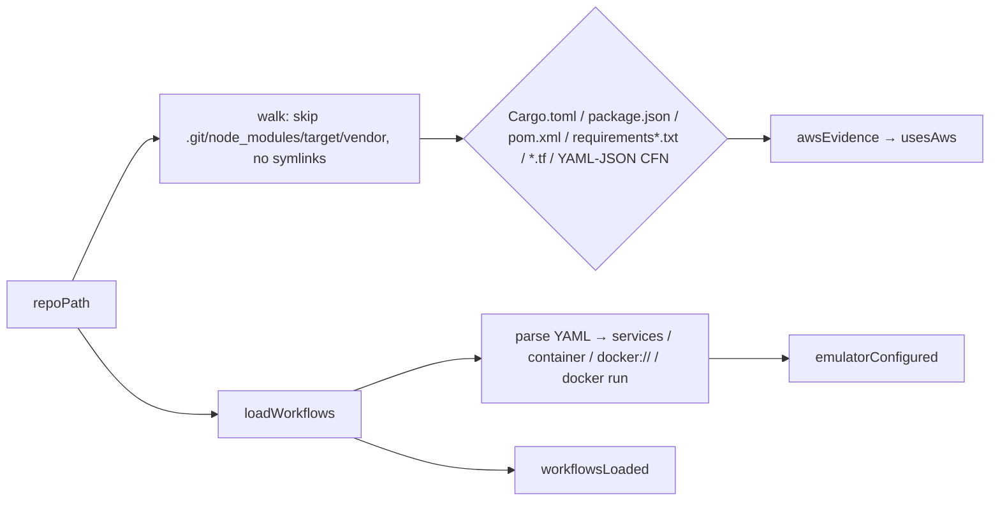

# PR Summary — Issue #3366

## Summary

Adds `worker/deno/lib/aws_emulator_in_ci_check.ts`, a deterministic,
file-based module. `checkAwsEmulatorInCI(repoPath)` answers two
questions about a checkout: does the repo use AWS, and does any GitHub
Actions workflow run the `floci/floci` emulator image? It returns
`{ usesAws, awsEvidence, emulatorConfigured, workflowsLoaded }`. It is the
detection half of `BP-AWS-EMULATOR-MISSING`. No caller wires it in yet; the
rest of milestone #3346 does that. Closes #3366.

## Spec

### Intent and Rationale

- The milestone needs a no-LLM check modelled on `linter_in_ci_check.ts`, so "uses AWS" and "runs Floci" are decided by parsing files, never by judgement.
- `scanCfnCostCandidates` does not fit template discovery. It only reads templates that contain `AWS::Lambda::Function`, returns rendered lines rather than paths, and swallows read errors. So the module has its own small walker, and it reuses the parser by exporting `parseCfnDocument` from `cfn_cost_checks.ts`.
- Emulator detection reuses `loadWorkflows` and walks the parsed YAML (`jobs.*.services.*.image`, `jobs.*.container`, `step.uses`, `step.run`), so a YAML comment never passes and `services:` and `container:` are covered, which `invocations` omits.

### Essential Design Decisions

- Fail loud: any read error other than `NotFound` on a nested path throws with that path. `NotFound` on `repoPath` itself throws too, and so does an invalid `package.json`. A wrong path or an unreadable tree is never reported as "no AWS".
- `isFlociImage` matches `floci/floci` exactly or followed by `:` (a tag) or `@` (a digest). This is how Docker reads "starts with `floci/floci`": `floci/floci-proxy` is a different image repository.
- The walk skips `.git`, `node_modules`, `target` and `vendor`, and never follows symlinks (`Deno.readDir` reports a symlink as neither file nor directory), so it cannot loop or leave the checkout.
- Manifest detection is line- and structure-based, because the repo has no TOML or XML dependency. Only dependency tables count in `Cargo.toml`, only the four dependency groups count in `package.json`, only `<dependency>` blocks (with comments stripped) count in `pom.xml`, and only exact package names count in `requirements*.txt`.

### Undiscoverable Facts

- #3346 names VibeCoder (`infra/cloudformation/linux-verification-host.yaml`) as an AWS-using repo. A run against this checkout returned `{"usesAws":true,"awsEvidence":["infra/cloudformation/linux-verification-host.yaml"],"emulatorConfigured":false,"workflowsLoaded":true}`.
- `docs/audits/lib-sweep-coverage/top-up-3366.json` claims the new module because the completeness gate (`lib_sweep_coverage_test.ts`) requires every new `worker/deno/lib/` module to be in a sweep slice.
- The run was observed with `deno eval` on the real checkout; the symlink classification was observed with `Deno.readDir` on Deno 2.9.6 (`isFile: false, isDirectory: false, isSymlink: true`).

## Evidence

Backend/CLI-only change; no UI files are touched. Evidence is the unit suite
`worker/deno/tests/aws_emulator_in_ci_check_test.ts` (46 tests, temp-directory
fixtures) and the full gate.

**Docs sweep** — grep: `parseTemplate`, `parseCfnDocument`, `aws_emulator`, `floci`, `cfn_cost_checks` over `README.md` and `docs/` (excluding `docs/archive/`); section: none — no manual documents this module yet, because it is not wired into a scan; updated: none; `docs/BEST-PRACTICES-SCAN.md:219` — still true because `scanCfnCostCandidates` behaviour is unchanged (`parseCfnDocument` is an extraction with no behaviour change).

Issue numbers cited as provenance: #3366: Add a deterministic check that detects AWS repos and whether their CI runs Floci; #3346: Adopt Floci (local AWS emulator) for AWS integration testing; #2880: the `loadWorkflows` diagnostic guard the issue tells this module to mirror (cited in the issue body).

The fakes are temp-directory fixtures, not port doubles. `loadWorkflows` and
`parseCfnDocument` are the real production functions.

## Acceptance Criteria

<!-- vibe-spec-review inputs="diff+issue-body" -->

- **met** — Each of the four SDK manifests, alone, yields `usesAws: true`, with that file in `awsEvidence`. — evidence: `worker/deno/tests/aws_emulator_in_ci_check_test.ts::checkAwsEmulatorInCI - Cargo.toml with aws-sdk dependency is the only evidence` (+ package.json, pom.xml, requirements-dev.txt tests) — reviewer: met
- **met** — A CloudFormation template under `infra/`, or a `*.tf` file, alone yields `usesAws: true`. — evidence: `worker/deno/tests/aws_emulator_in_ci_check_test.ts::checkAwsEmulatorInCI - CloudFormation YAML with AWSTemplateFormatVersion and short-form tags`, `::checkAwsEmulatorInCI - a .tf file alone is evidence` — reviewer: met
- **met** — A repo with no AWS evidence yields `usesAws: false`, even when its workflows mention Floci. — evidence: `worker/deno/tests/aws_emulator_in_ci_check_test.ts::checkAwsEmulatorInCI - no AWS evidence, but workflow runs floci service image` — reviewer: met
- **met** — A `services:` image of `floci/floci@sha256:…`, a `container:` image, a `docker://floci/floci…` step and a `docker run … floci/floci…` step each yield `emulatorConfigured: true`. — evidence: `worker/deno/tests/aws_emulator_in_ci_check_test.ts::checkAwsEmulatorInCI - services.floci.image with a sha256 digest`, `::container as a plain string`, `::container as a record with image`, `::step uses docker://floci/floci`, `::step run with docker run floci/floci` — reviewer: met
- **met** — A workflow that mentions `floci/floci` only in a YAML comment yields `emulatorConfigured: false`. — evidence: `worker/deno/tests/aws_emulator_in_ci_check_test.ts::checkAwsEmulatorInCI - comment mentioning floci/floci does not count` — reviewer: met
- **met** — Files under `node_modules/` or `target/` never count as AWS evidence. — evidence: `worker/deno/tests/aws_emulator_in_ci_check_test.ts::checkAwsEmulatorInCI - manifests under node_modules/target/vendor/.git are never evidence` — reviewer: met
- **met** — `deno task` lint, fmt, check and test are green. — evidence: `./quality.sh < /dev/null` on the final code head: deno tests, deno lint, deno type check and deno fmt all PASSED — reviewer: partial — reason: the reviewer saw only the diff and could not run the gate; it was run here and passed
- **unrequested** — symlinks are never followed during the walk, and a test pins it — reviewer: unrequested — reason: path confinement under the Secure Coding standard; without it a symlink could pull evidence from outside the checkout or loop the walk

## Standards Review

<!-- vibe-standards-review inputs="diff+CODING-STANDARDS.md" -->

- **clean** — fail-loud (no swallowed errors: the only catches rethrow with the path, or skip `NotFound` mid-walk as the issue specifies); regex safety on untrusted text (no overlapping quantifiers; XML comment stripping and `<dependency>` scanning use `indexOf`); Australian English; no doc comment in `cfn_cost_checks.ts` made stale; symlink and path handling; owners reused rather than copied (`loadWorkflows`, `parseCfnDocument`). Review-enforced rules checked: a stub mirrors the real callee (n/a, no shell-out), a workflow behaviour change extends the validator (n/a, no workflow edited), a named test must exist (holds). No existing test assertions were removed.

## Test Plan

- Added `worker/deno/tests/aws_emulator_in_ci_check_test.ts` (46 tests), written first; it went red with `TS2307: Cannot find module` before the module existed.
- `deno task test:unit tests/aws_emulator_in_ci_check_test.ts tests/cfn_cost_checks_test.ts tests/linter_in_ci_check_test.ts < /dev/null` (from `worker/deno`): `ok | 97 passed | 0 failed`. `cfn_cost_checks_test.ts` is unchanged and green, so the `parseCfnDocument` extraction changed no behaviour.
- `./quality.sh < /dev/null` on the final code head: `Result: PASSED (with skipped checks)`. Only `config integration` was SKIPPED (no `.config.json` in the worktree).
- No existing test file is edited, so no assertions were removed.
- Negative tests were each seen going red with their guard broken on purpose (see the branch outcomes below). Flip 1 replaced detection with a bare `rawContent.includes("floci/floci")` and turned `comment mentioning floci/floci does not count` red.

**Branch outcomes:** (each was flipped on purpose, the named test went red, and the code was restored)

- `worker/deno/lib/aws_emulator_in_ci_check.ts:86` — dotted Cargo dependency header counts — `cargoTomlUsesAws - dotted dependency header counts` — deleting the dotted-header block turned it and `nested Cargo.toml with dotted dependency header` red
- `worker/deno/lib/aws_emulator_in_ci_check.ts:95` — key outside a dependency table ignored — `cargoTomlUsesAws - an aws-sdk-like key outside any dependency table does not count` — dropping the guard turned it red
- `worker/deno/lib/aws_emulator_in_ci_check.ts:105` — `package = "aws-sdk-…"` rename counts — `cargoTomlUsesAws - package rename to aws-sdk counts` — deleting the block turned it red
- `worker/deno/lib/aws_emulator_in_ci_check.ts:133` — only dependency groups count — `packageJsonUsesAws - devDependencies @aws-sdk scope counts` (narrowing the groups to `dependencies` turned it red) and `packageJsonUsesAws - own name as aws-sdk does not count` (also matching `name` turned it red)
- `worker/deno/lib/aws_emulator_in_ci_check.ts:159` — groupId tested per `<dependency>` segment — `pom.xml with project-level groupId only does not count` — testing the whole text turned it red
- `worker/deno/lib/aws_emulator_in_ci_check.ts:177` — XML comments stripped — `pomXmlUsesAws - commented-out dependency does not count` — skipping the strip turned it red
- `worker/deno/lib/aws_emulator_in_ci_check.ts:196` — exact requirement name only — `boto3-stubs in requirements does not count` — dropping the look-ahead turned it red
- `worker/deno/lib/aws_emulator_in_ci_check.ts:212` / `:218` / `:231` — CFN pre-filter, then a structural parse — `YAML mentioning AWS:: only in a plain string does not count`, `isCfnTemplate - plain string mention of AWS:: is not a template` — returning true on the pre-filter turned both red; `isCfnTemplate - AWSTemplateFormatVersion key counts` and `CloudFormation JSON with only Resources/Type AWS:: is detected` reach the true outcomes
- `worker/deno/lib/aws_emulator_in_ci_check.ts:243` — tag/digest boundary — `floci/floci-proxy image does not count`, `isFlociImage - exact, tag and digest forms match; near-miss does not` — a bare `startsWith` turned both red
- `worker/deno/lib/aws_emulator_in_ci_check.ts:274` — services image — `services.floci.image with a sha256 digest` — deleting the loop turned it red
- `worker/deno/lib/aws_emulator_in_ci_check.ts:282` / `:287` — container string or record — `container as a plain string`, `container as a record with image` — deleting the checks turned both red
- `worker/deno/lib/aws_emulator_in_ci_check.ts:300` — `docker://` step — `step uses docker://floci/floci` — deleting the check turned it red
- `worker/deno/lib/aws_emulator_in_ci_check.ts:304` — `docker run` plus image token — `step run with docker run floci/floci`; `run echoing floci/floci without docker run does not count` — dropping the `docker run` test turned it red
- `worker/deno/lib/aws_emulator_in_ci_check.ts:328` — `NotFound` at the root throws; other read errors throw — `a nonexistent repoPath rejects`, `unreadable nested directory rejects with the path in the message` — returning instead of throwing turned them red
- `worker/deno/lib/aws_emulator_in_ci_check.ts:344` — skip dirs — `manifests under node_modules/target/vendor/.git are never evidence` — narrowing `SKIP_DIRS` turned it red
- `worker/deno/lib/aws_emulator_in_ci_check.ts:352` — non-files (symlinks) not followed — `a symlink to an outside directory with AWS evidence is never followed` — classifying with `Deno.stat` (which follows links) turned it red
- `worker/deno/lib/aws_emulator_in_ci_check.ts:363` — `*.tf` is evidence — `a .tf file alone is evidence` — removing the branch turned it red
- `worker/deno/lib/aws_emulator_in_ci_check.ts:383` — invalid `package.json` throws with the path — `invalid package.json JSON rejects with the path in the message` — catching it as false turned it red
- `worker/deno/lib/aws_emulator_in_ci_check.ts:412` — a file that vanishes mid-walk is skipped — not reached by a test: the race cannot be staged deterministically, and the issue explicitly exempts `NotFound` from the throw rule
- `worker/deno/lib/aws_emulator_in_ci_check.ts:449` — `workflowsLoaded` false/true — `no workflows directory yields workflowsLoaded false`, `a workflow present yields workflowsLoaded true`

🤖 Generated with [Claude Code](https://claude.com/claude-code)
