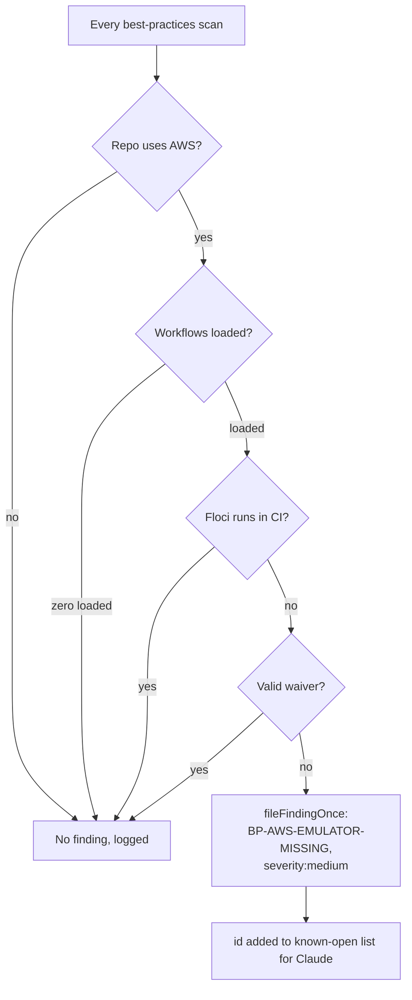

# PR Summary — Issue #3368

## Summary

Wires the #3366 detector (`checkAwsEmulatorInCI`) into the best-practices
scan as a deterministic pre-filer that runs on every bucket, before Claude.
A repo that uses AWS, has at least one loaded workflow, runs no
`floci/floci` image in CI and carries no valid
`best-practice-ignore: BP-AWS-EMULATOR-MISSING` waiver gets one
`BP-AWS-EMULATOR-MISSING` issue at `severity:medium`. The issue is filed
through `fileFindingOnce` and its id joins the known-open list passed to
Claude. The CI-gate filer is generalised to take a severity and renamed
`filePreFiledFinding`; `BP-LINTER-*` still files at `severity:high`.
Part of #3346. Closes #3368.

## Spec

### Intent and Rationale

- The finding is deterministic, so it is pre-filed by code (like `BP-LINTER-<bucket>`) rather than left to the LLM, which could miss it or file it twice.
- Reusing `fileFindingOnce` and `suppression_comments.ts` keeps one dedup path and one waiver governance model (author allowlist, expiry, reason) for every best-practices finding.

### Essential Design Decisions

- The check runs on every bucket, not only language buckets, because AWS usage is independent of the drawn language.
- No workflow loaded → no finding (status unknown), mirroring the linter pre-filer's zero-workflows fail-safe. A detector throw fails the scan run; it is never read as "no finding".
- The waiver may sit anywhere in any workflow file or evidence file. JSON evidence carries no comments, so a JSON-only repo waives in a workflow file — one always exists when the finding files.
- Evidence paths are rejected when absolute or containing `..`, then canonicalised with `Deno.realPath` and refused when they resolve outside the repo root; the resolved path is what gets read.

### Undiscoverable Facts

- #3366 (closed) delivered `worker/deno/lib/aws_emulator_in_ci_check.ts`; its walk never follows symlinks, so production evidence never contains one — the symlink guard is defence in depth for the exported `hasAwsEmulatorWaiver`.
- An earlier attempt's Standards review flagged the old `fileMissingCIGateIssue` name and an inaccurate `spyLogger` comment; both are fixed here.

## Evidence

Backend/CLI change only — no UI files. Verified by the unit tests below and the full gate.

Provenance numbers the diff adds: #3368: File BP-AWS-EMULATOR-MISSING from the best-practices scan. The diff also rewraps an existing `Issue #2882` comment (#2882: review-fleet-prs: file issues as idle-task, trusted via authorized_commenters) without adding it. Other issues named in this summary: #3366: Add a deterministic check that detects AWS repos and whether their CI runs Floci; #3346: Adopt Floci (local AWS emulator) for AWS integration testing.

The waiver test fakes are the repo's own `suppression_comments.ts` test seams (`setSuppressionAuthorAllowlist`, `setSuppressionCommitAuthors`), and the real `findSuppressions` parses each marker. The `gh` stub mirrors the `gh issue create` URL output that `filePreFiledFinding` parses. The default-detector test runs the real `checkAwsEmulatorInCI` on a temporary checkout.

**Docs sweep** — grep: `fileMissingCIGateIssue`, `filePreFiledFinding`, `BP-AWS-EMULATOR-MISSING`, `checkAwsEmulator`, `hasAwsEmulatorWaiver`, `pre-fil\w*`, `missing-linter`, `known-open`, `severity:high`, "one slot may be consumed", "all six slots" over `README.md`, `docs/` (excluding `docs/archive/`), `DESIGN-PRINCIPLES.md`, `*/README.md` and source comments under `worker/deno/lib`; section: `docs/BEST-PRACTICES-SCAN.md#aws-emulator-in-ci-bp-aws-emulator-missing`, `docs/BEST-PRACTICES-SCAN.md#6-issue-cap-and-priority-order`; updated: `docs/BEST-PRACTICES-SCAN.md`, `DESIGN-PRINCIPLES.md`, `docs/IDLE-TASK-FRAMEWORK.md`. `fileMissingCIGateIssue` has no hit outside `docs/archive/`. The cap paragraph's "the LLM has all six slots" for `general`/`design` was made false by the pre-filer and now reads "less any pre-filed `BP-AWS-EMULATOR-MISSING` finding"; every other hit was read in its sentence and is still true.

## Acceptance Criteria

<!-- vibe-spec-review inputs="diff+issue-body" -->

- **met** — AWS repo, no Floci workflow → exactly one issue, with the `severity:medium` label and finding-id `BP-AWS-EMULATOR-MISSING`. — evidence: `worker/deno/tests/best_practices_template_test.ts::runTask - AWS repo with no Floci files BP-AWS-EMULATOR-MISSING at severity:medium` — reviewer: met
- **met** — An existing open issue with the same finding-id → no duplicate (`fileFindingOnce` dedup). — evidence: `worker/deno/tests/best_practices_template_test.ts::runTask - AWS finding already open under its finding-id is not re-filed` — reviewer: met
- **met** — AWS repo with Floci in CI, a non-AWS repo, or a repo with no workflows loaded → no issue. — evidence: `worker/deno/tests/best_practices_template_test.ts::runTask - AWS-emulator pre-check skips filing and logs why (floci configured / no AWS / no workflow)` — reviewer: met
- **met** — A valid unexpired waiver suppresses; an expired one does not. — evidence: `worker/deno/tests/best_practices_template_test.ts::runTask - a valid unexpired waiver marker in a workflow suppresses the AWS finding`, `worker/deno/tests/best_practices_template_test.ts::runTask - an expired waiver marker does not suppress: exactly one issue is filed` — reviewer: met
- **met** — `BP-LINTER-*` findings still file at `severity:high`. — evidence: `worker/deno/tests/best_practices_template_test.ts::runTask - BP-LINTER missing-linter finding remains severity:high, not severity:medium` — reviewer: met
- **met** — The issue body contains `CREATE_COMPLETE`, `::warning::`, `SKIPPED (needs Docker):` and a digest-pinned image reference. — evidence: `worker/deno/tests/best_practices_template_test.ts::runTask - AWS repo with no Floci files BP-AWS-EMULATOR-MISSING at severity:medium` — reviewer: met
- **met** — `docs/BEST-PRACTICES-SCAN.md` documents the check, and markdown-lint is green. — evidence: `docs/BEST-PRACTICES-SCAN.md#aws-emulator-in-ci-bp-aws-emulator-missing`; `./quality.sh` markdownlint stage PASSED on the final head — reviewer: partial — reason: the reviewer confirmed the docs section but could not run markdown-lint itself ("unverified, not confirmed"); the full gate was run here on the head and its markdownlint stage passed
- **unrequested** — `AWS_EVIDENCE_CAP` (50) truncation with a `- … and N more` line in the finding body — reviewer: unrequested — reason: keeps the issue body bounded for repos with many `.tf` files; GitHub caps issue bodies at 65,536 characters
- **unrequested** — `assertRepoRelative` plus the `Deno.realPath` containment check in `hasAwsEmulatorWaiver` — reviewer: unrequested — reason: the waiver scan reads files named by repo-derived paths, so the coding standard's path confinement rule applies
- **unrequested** — backticks in evidence paths replaced with `'` in the issue body — reviewer: unrequested — reason: a repo-controlled filename must not break out of its Markdown code span (output encoding)
- **unrequested** — Mermaid diagram updates in `DESIGN-PRINCIPLES.md` and `docs/BEST-PRACTICES-SCAN.md` — reviewer: unrequested — reason: the existing sequence and flow diagrams would otherwise omit the new pre-filer and become wrong

## Standards Review

<!-- vibe-standards-review inputs="diff+CODING-STANDARDS.md" -->

- **violation** — Path Confinement: `assertRepoRelative` checked only the unresolved string, so a repo-planted symlink at an evidence path could make the waiver scan read a file outside the checkout, and no symlink tests existed — evidence: `worker/deno/lib/idle_task_templates/best_practices_template.ts:689` — reason: fixed in this diff — `hasAwsEmulatorWaiver` now canonicalises each path with `Deno.realPath`, refuses one resolving outside the repo root (`:762`), reads the resolved path, and four symlink tests cover the outward file, the outward directory, `missing/../link/file` and an in-repo symlink positive control
- **clean** — named tests and symbols exist at the head; no `.github/workflows/*` change; changes to existing tests are additive (`checkAwsEmulatorFn: stubNoAws`) with no assertion removed; each of the five pre-filer branches has a dedicated test; the single production caller takes the real `checkAwsEmulatorInCI` default rather than a disabling one; fail-loud on detector throw and unreadable evidence; Australian English. Optional notes (not violations): `worker/deno/tests/idle_task_wrapper_dedup_author_test.ts` now runs the real detector (it passes); `PreFiledSeverity` is a two-value union

## Test Plan

- Added to `worker/deno/tests/best_practices_template_test.ts`: the nine AWS `runTask` tests listed above plus `runTask - the default checkAwsEmulatorFn runs the real detector against the repo checkout`; eight `hasAwsEmulatorWaiver` tests (escape via `..`, missing file skipped, absolute path, non-NotFound read error, outward file symlink, outward directory symlink, `..` after a missing component landing on an outward symlink, in-repo symlink read); two `buildAwsEmulatorFinding` truncation tests. Existing `createBestPracticesTemplate` calls gained `checkAwsEmulatorFn: stubNoAws`.
- `worker/deno/tests/idle_task_scan_dedup_conformance_test.ts`: a no-AWS `checkAwsEmulatorFn` stub added; additions only.
- No assertion was removed from an existing test. The only removed lines in `worker/deno/tests/best_practices_template_test.ts` are imports reshaped to add names (`assertRejects`, `Logger`, `buildAwsEmulatorFinding`), the module doc-comment bullet that was extended, and the `spyLogger` doc comment corrected to drop "(and their context)".
- `deno test -A tests/best_practices_template_test.ts tests/idle_task_scan_dedup_conformance_test.ts tests/idle_task_wrapper_dedup_author_test.ts` (from `worker/deno`): `ok | 228 passed | 0 failed`.
- `./quality.sh < /dev/null` on the final code head: `Result: PASSED (with skipped checks)` — only `config integration` skipped (needs a live config); markdownlint, semgrep, deno tests/lint/check/fmt passed.

**Branch outcomes:** (each flipped on purpose; the named test went red; code restored)

- `worker/deno/lib/idle_task_templates/best_practices_template.ts:1084` — absent (no AWS usage → skip and log) — `worker/deno/tests/best_practices_template_test.ts::runTask - AWS-emulator pre-check skips filing and logs why (floci configured / no AWS / no workflow)` — flipped the guard to `false`, test went red
- `worker/deno/lib/idle_task_templates/best_practices_template.ts:1088` — fail-safe (no workflow loaded → skip and log) — same test — flipped to `false`, test went red
- `worker/deno/lib/idle_task_templates/best_practices_template.ts:1092` — success (Floci configured → skip and log) — same test — flipped to `false`, test went red
- `worker/deno/lib/idle_task_templates/best_practices_template.ts:1096` — waived (valid marker → skip and log) — `worker/deno/tests/best_practices_template_test.ts::runTask - a valid unexpired waiver marker in a workflow suppresses the AWS finding`, `worker/deno/tests/best_practices_template_test.ts::runTask - a valid waiver marker in an evidence file suppresses the AWS finding` — flipped to `false`, both went red
- `worker/deno/lib/idle_task_templates/best_practices_template.ts:1117` — filed (id pushed to `preFiled`) — `worker/deno/tests/best_practices_template_test.ts::runTask - AWS repo with no Floci files BP-AWS-EMULATOR-MISSING at severity:medium` — flipped to never push, test went red
- `worker/deno/lib/idle_task_templates/best_practices_template.ts:791` — valid marker counts / invalid (expired, no `author=`) does not — `worker/deno/tests/best_practices_template_test.ts::runTask - an expired waiver marker does not suppress: exactly one issue is filed`, `worker/deno/tests/best_practices_template_test.ts::runTask - a waiver marker missing author= does not suppress: one issue is filed` — inverted `s.valid`, those and the valid-waiver tests went red
- `worker/deno/lib/idle_task_templates/best_practices_template.ts:692` — error (absolute evidence path) — `worker/deno/tests/best_practices_template_test.ts::hasAwsEmulatorWaiver - an absolute evidence path rejects` — flipped to `false`, test went red
- `worker/deno/lib/idle_task_templates/best_practices_template.ts:698` — error (`..` segment) — `worker/deno/tests/best_practices_template_test.ts::hasAwsEmulatorWaiver - an evidence path escaping the repo root rejects` — flipped to `false`, test went red
- `worker/deno/lib/idle_task_templates/best_practices_template.ts:754` — absent (evidence path not on disk → skipped) — `worker/deno/tests/best_practices_template_test.ts::hasAwsEmulatorWaiver - a non-existent evidence path is skipped, not thrown` — the previous-run flip (skip → throw) turned it and the stubbed-evidence `runTask` tests red; this outcome now sits at the `realPath` step, the first read of the path
- `worker/deno/lib/idle_task_templates/best_practices_template.ts:762` — error (resolves outside the repo root) — `worker/deno/tests/best_practices_template_test.ts::hasAwsEmulatorWaiver - an evidence symlink pointing outside the repo rejects`, `worker/deno/tests/best_practices_template_test.ts::hasAwsEmulatorWaiver - an evidence path through a symlinked directory pointing outside rejects` — flipped to `if (false)`, both went red
- `worker/deno/lib/idle_task_templates/best_practices_template.ts:772` — error (read fails other than NotFound → throw naming the path) — `worker/deno/tests/best_practices_template_test.ts::hasAwsEmulatorWaiver - an unreadable evidence path other than NotFound throws naming the path` — flipped the NotFound test to a bare `continue`, test went red. The NotFound skip on this line is now reachable only if the file vanishes between `realPath` and the read; no test reaches that race
- `worker/deno/lib/idle_task_templates/best_practices_template.ts:745` — absent (repo root itself missing → fall back to the unresolved path; every per-path `realPath` then skips) — reached by the stubbed-evidence `runTask` tests whose `workDir` has no checkout; failing loud there instead turned them red
- `worker/deno/lib/idle_task_templates/best_practices_template.ts:633` — truncated (more than 50 evidence paths → `- … and N more`) — `worker/deno/tests/best_practices_template_test.ts::buildAwsEmulatorFinding - lists 50 evidence paths then '… and N more'` — flipped to `if (false)`, test went red; the untruncated outcome is `worker/deno/tests/best_practices_template_test.ts::buildAwsEmulatorFinding - exactly 50 evidence paths has no '… and more' line`
- `worker/deno/lib/idle_task_templates/best_practices_template.ts:927` — default `checkAwsEmulatorInCI` when no dep is injected — `worker/deno/tests/best_practices_template_test.ts::runTask - the default checkAwsEmulatorFn runs the real detector against the repo checkout` — replaced the default with a no-AWS stub, test went red
- `worker/deno/lib/idle_task_templates/best_practices_template.ts:929` — default `defaultLogger` when no logger is injected — not reached by a test: it only selects where skip reasons are logged, and every test that asserts the log messages injects `spyLogger`

🤖 Generated with [Claude Code](https://claude.com/claude-code)
