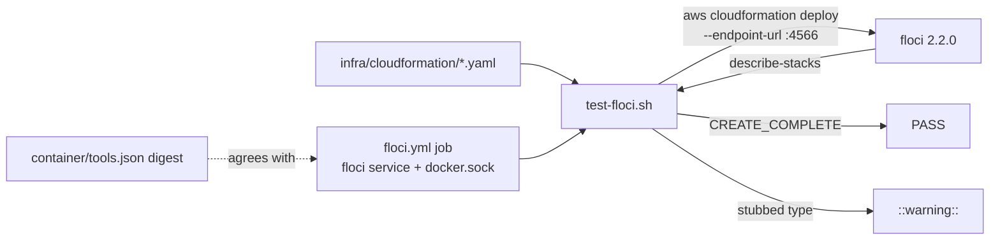

# PR Summary — Issue #3369

## Summary

Adds a Floci CI job that deploys VibeCoder's own CloudFormation template
(`infra/cloudformation/linux-verification-host.yaml`) against an emulator and
asserts `CREATE_COMPLETE`, so the template is exercised on every change instead
of only on a live AWS account.

- `infra/cloudformation/test-floci.sh` starts floci on demand, deploys every
  template with `--endpoint-url http://127.0.0.1:4566`, asserts the stack
  status via `describe-stacks`, and emits one `::warning::` per stubbed
  resource type.
- `.github/workflows/floci.yml` runs it with a `floci/floci` service pinned to
  the `container/tools.json` digest and the Docker socket mounted.
- `worker/deno/lib/floci_workflow_check.ts` plus
  `worker/deno/tests/issue_3369_floci_workflow_test.ts` keep the workflow's
  digest in step with `container/tools.json` and pin the job's load-bearing
  structure.

Closes #3369.

## Spec

### Intent and Rationale

#3346 asks every repo that ships CloudFormation to test it against an AWS
emulator in CI. VibeCoder has no AWS SDK calls, so only the template-deploy
path applies; per-service tests are not applicable.

### Essential Design Decisions

- **Skip locally, fail in CI.** With no Docker socket outside CI the script
  prints `SKIPPED (needs Docker): <template>` and exits 0 (the worker has no
  Docker). In CI (`CI=true`) a missing socket is `::error::` and exit 1, so CI
  can never go green by skipping.
- **Workflow check as a library.** The drift and structure checks live in
  `checkFlociWorkflow` so each invariant has a positive and a negative test
  (workflow-validator rule).
- **Tag plus digest.** The service image is `floci/floci:2.2.0@sha256:…`. The
  existing hardening test (`workflow_hardening_test.ts`) requires a tag beside
  every digest; the digest is still the one in `container/tools.json`.
- **Not added to `WORKFLOW_FILE_CHECKS`**, and path-filtered workflows stay out
  of `pr_check_contexts.ts` (a path-filtered check would block unrelated PRs).

### Undiscoverable Facts

- Floci stubs unsupported resource types only when
  `FLOCI_SERVICES_CLOUDFORMATION_ALLOW_STUB_UNSUPPORTED_RESOURCE_TYPES=true`;
  a stubbed resource's status reason contains "stubbed", which is what the
  script turns into a `::warning::`.
- The worker has neither the `aws` CLI nor a Docker socket, so the live deploy
  could not be run here. Verified instead: shellcheck, `bash -n`, actionlint,
  and a local run printing `SKIPPED (needs Docker): linux-verification-host.yaml`
  with exit 0.

## Evidence

Docs sweep — grep: `floci`, `emulatorConfigured`, `cloudformation`; section:
CONTAINER.md Floci row, EC2-LINUX-VERIFICATION.md intro; updated:
`docs/CONTAINER.md:100` (row now names the `floci.yml` job),
`docs/EC2-LINUX-VERIFICATION.md:17-23` (new paragraph: CI deploys the template
into Floci and fails unless it reaches `CREATE_COMPLETE`, stubbed types are
reported as `::warning::`, and this does not show the launcher works on the
host);
`CONTRIBUTING.md:126-129` — still true because it describes the local quality
gate, which is unchanged; `docs/BEST-PRACTICES-SCAN.md:255-268` — still true
because the detector semantics are unchanged; `DESIGN-PRINCIPLES.md:1666` —
still true because it describes the emulator-in-CI principle this implements;
`docs/SUPPLY-CHAIN-GATE.md` — still true because the digest source
(`container/tools.json`) is unchanged. `docs/audits/dependency-inventory.md` is
regenerated (2 lines) because the workflow adds a pinned image reference.

Issues cited as provenance: #3367: (dependency, closed) the Floci image pin in
`container/tools.json`; #3369: Add a Floci CI job for VibeCoder's own
CloudFormation template.

## Test Plan

- `deno task test:unit` over the five targeted test files (with
  `--allow-write` for the supply-chain gate test): 124 passed, 0 failed.
- `deno task check:manifests`, `deno fmt --check`, `deno lint`, `actionlint`,
  `shellcheck`, `bash -n`: pass.
- Full `./quality.sh` on the final tree: `Result: PASSED (with skipped checks)`;
  the only skip is config integration ("deno or .config.json not available").
- An earlier gate run failed on three items (bare-digest image rejected by the
  hardening test; `floci_workflow_check.ts` claimed by no sweep slice; manifest
  entry) — all fixed above.
- Related rules checked: workflow hygiene (`set -euo pipefail`, SHA-pin
  comments, `persist-credentials: false`, `milestone/*` branch), workflow
  hardening (tag beside digest), lib sweep ledger, integration test manifest.
  The "workflow behaviour change extends the validator" rule was applied to
  this PR's own diff: every new workflow invariant has a positive and a
  negative test; nothing else flagged.
- Callers/entry points: the script is called only from `floci.yml`; the check
  module only from the new test.

**Branch outcomes:**

- `worker/deno/lib/floci_workflow_check.ts:52` — missing `images[]` throws.
  Test: `worker/deno/tests/issue_3369_floci_workflow_test.ts::flociImageDigest throws when images[] is missing`.
  Flipped (return empty): went red.
- `worker/deno/lib/floci_workflow_check.ts:58` — no Floci entry throws. Test:
  `…::flociImageDigest throws when the Floci entry is missing`. Flipped: went red.
- `worker/deno/lib/floci_workflow_check.ts:62` — malformed digest throws.
  Test: `…::flociImageDigest throws on a malformed digest`. Flipped: went red.
- `worker/deno/lib/floci_workflow_check.ts:99` — non-object input. Test:
  `…::reports non-object input without throwing`. Flipped: went red.
- `worker/deno/lib/floci_workflow_check.ts:123-132` — image digest drift, bare
  digest, bare tag, wrong repo. Tests: the four `(a) refuses …` cases.
  Flipped: went red.
- `worker/deno/lib/floci_workflow_check.ts:157` — stub env not `"true"`. Test:
  `…::refuses a floci service without the stub env`. Flipped: went red.
- `worker/deno/lib/floci_workflow_check.ts:135-141` — missing docker.sock
  volume. Test: `…::checkFlociWorkflow (b) refuses a missing docker.sock
  volume`. Flipped: went red.
- `worker/deno/lib/floci_workflow_check.ts:146-152` — first step not the socket
  assertion. Tests: `…::checkFlociWorkflow (c) refuses a first step without the
  socket assertion`, `…::checkFlociWorkflow (c) refuses an echo that merely
  names the socket`. Flipped: went red.
- `worker/deno/lib/floci_workflow_check.ts:180` — no step runs the script.
  Tests: `(d) refuses a workflow that never runs test-floci.sh`, commented-out
  and echoed variants; accepting variants in `(d) accepts bash/sh and bare-path
  invocations`. Flipped: went red.
- `worker/deno/lib/floci_workflow_check.ts:196` — trigger paths missing. Test:
  `…::(e) refuses missing trigger paths`; `accepts the YAML 1.1 \`true\` key
  for \`on\``. Flipped: went red.
- `worker/deno/lib/floci_workflow_check.ts:205` — `milestone/*` missing. Test:
  `…::refuses a pull_request trigger without milestone/*`. Flipped: went red.
- `worker/deno/lib/floci_workflow_check.ts:211` — permissions. Test:
  `…::refuses permissions other than contents: read`. Flipped: went red.
- `worker/deno/lib/floci_workflow_check.ts:164-170` — checkout without
  `persist-credentials: false`. Test:
  `…::refuses checkout without persist-credentials: false`. Flipped: went red.
- `infra/cloudformation/test-floci.sh` branches (Docker gate skip/error, `aws`
  missing, non-`CREATE_COMPLETE`, stub warning): `exempt (untestable): needs
  Docker and the aws CLI, neither of which the worker has; the skip path was
  run locally and the rest are exercised by the CI job itself`.

## Acceptance Criteria

<!-- vibe-spec-review inputs="diff+issue-body" -->

- **missing** — The Floci CI job is green on this PR, and its log shows CREATE COMPLETE for linux-verification-host . — reviewer: missing — reason: the last CI run (38033819415) failed in 'Deploy templates into Floci' because Floci rejects aws ssm put-parameter on the /aws/service/... path, so no deploy or CREATE COMPLETE has been logged
- **missing** — A deliberately broken template (verified locally or in a throwaway commit) makes the job fail. — reviewer: missing — reason: no broken-template run exists, and none can show anything until the job gets past the SSM seeding step
- **partial** — Any stubbed resource type appears as a ::warning:: annotation. — evidence: `infra/cloudformation/test-floci.sh:187-200` — reviewer: partial — reason: the warning code has never run against real Floci output, and no test covers it
- **partial** — Running the script in the worker without Docker prints SKIPPED (needs Docker): and does not fail. — evidence: `infra/cloudformation/test-floci.sh:48-65` — reviewer: partial — reason: the only evidence is a manual local run; no committed test runs this path
- **met** — The digest-agreement test passes; actionlint and shellcheck are green. — evidence: `worker/deno/tests/issue 3369 floci workflow test.ts::floci digest in workflow matches container/tools.json (drift test)` — reviewer: met
- **missing** — After merge, the #3366/#3346 detector reports emulatorConfigured: true for VibeCoder. — reviewer: missing — reason: can only be checked after merge, and merge is blocked by the failing Floci job
- **unrequested** — Extra structural checks in checkFlociWorkflow (milestone/ trigger, stub env, permissions, persist-credentials, socket step, script call, trigger paths) — reviewer: unrequested — reason: the issue asked only for the digest-agreement test
- **unrequested** — Extra 'Check AWS CLI' workflow step and milestone/ branch filter — reviewer: unrequested — reason: not asked for by the issue; the CLI step repeats the script's own check
- **unrequested** — lib-sweep top-up ledger, integration test manifest entry, and doc/dependency-inventory updates — reviewer: unrequested — reason: repo housekeeping needed by the new module, test and workflow

## Standards Review

<!-- vibe-standards-review inputs="diff+CODING-STANDARDS.md" -->

- **violation** — Shell is for orchestration only; new logic belongs in Deno TypeScript (awk YAML parse of SSM parameters, deploy/skip decision, stubbed-resource parsing). — evidence: `infra/cloudformation/test-floci.sh:120` — reason: open — on lines this diff adds and not fixed; this turn may not change code, so neither 'fixed in this diff' nor 'pre-existing, filed' would be true
- **violation** — Every outcome of an added branch needs a test that reaches it; the no-templates, unreadable-template, Docker gate and aws-missing branches, and the SSM parse, are untested although a stub PATH, CI/socket overrides and fixture templates can reach them. — evidence: `infra/cloudformation/test-floci.sh:27` — reason: open — on lines this diff adds and not fixed; this turn may not change code
- **violation** — Writing a gate over text: a loosened invocation ( test-floci.sh true ) is accepted, and step-level continue-on-error: true and if: false are ignored. — evidence: `worker/deno/lib/floci workflow check.ts:82` — reason: open — on lines this diff adds and not fixed; this turn may not change code
- **violation** — A workflow validator must pin the load-bearing invariant: the check accepts the script being run from any job, not specifically the job that has the Floci service. — evidence: `worker/deno/lib/floci workflow check.ts:175` — reason: open — on lines this diff adds and not fixed; this turn may not change code
- **violation** — DRY: re-implements in-repo workflow policy (checkout-persist-credentials in checkout persist credentials scanner.ts, milestone-branch-filters with a literal match stricter than GitHub's, workflow-permissions in workflow file checks.ts). — evidence: `worker/deno/lib/floci workflow check.ts:159` — reason: open — on lines this diff adds and not fixed; this turn may not change code
- **violation** — Single source of truth: the test hard-codes the Floci tag 2.2.0 instead of reading it from container/tools.json. — evidence: `worker/deno/tests/issue 3369 floci workflow test.ts:95` — reason: open — on lines this diff adds and not fixed; this turn may not change code
- **violation** — Avoid over-engineering: handles a YAML 1.1 true key for on that the only caller never produces, and the workflow repeats the script's aws CLI check. — evidence: `worker/deno/lib/floci workflow check.ts:183` — reason: open — on lines this diff adds and not fixed; this turn may not change code
- **clean** — Australian English spelling; fail-loud shell (set -euo pipefail, counted failures, commented true ); SIMPLE-ON-PURPOSE marker format; workflow hygiene (SHA-pinned actions, persist-credentials: false, contents: read, tag plus digest); unit-test classification and manifest entry; positive and negative
