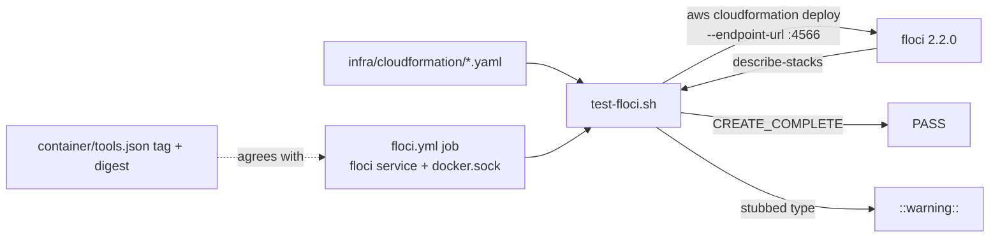

# PR Summary — Issue #3369

## Summary

Adds a Floci CI job that deploys VibeCoder's own CloudFormation template
(`infra/cloudformation/linux-verification-host.yaml`) against an emulator and
asserts `CREATE_COMPLETE`, so the template is exercised on every change instead
of only on a live AWS account.

- `infra/cloudformation/test-floci.sh` starts floci on demand, deploys every
  template with `--endpoint-url http://127.0.0.1:4566`, asserts the stack
  status via `describe-stacks`, and emits one `::warning::` per stubbed
  resource type.
- `.github/workflows/floci.yml` runs it with a `floci/floci` service pinned to
  the `container/tools.json` digest and the Docker socket mounted.
- `worker/deno/lib/floci_workflow_check.ts` plus
  `worker/deno/tests/issue_3369_floci_workflow_test.ts` keep the workflow's
  image tag and digest in step with the `container/tools.json` Floci entry and
  pin the job's load-bearing structure.
- `worker/deno/tests/issue_3369_floci_script_test.ts` (integration suite,
  registered in `integration_test_manifest.ts`) runs the script under stub
  `aws`/`curl`/`floci` binaries to reach its Docker gate, `aws`-missing,
  verdict, SSM-override and stub-warning branches.

Closes #3369.

## Spec

### Intent and Rationale

#3346 asks every repo that ships CloudFormation to test it against an AWS
emulator in CI. VibeCoder has no AWS SDK calls, so only the template-deploy
path applies; per-service tests are not applicable.

### Essential Design Decisions

- **Skip locally, fail in CI.** With no Docker socket outside CI the script
  prints `SKIPPED (needs Docker): <template>` and exits 0 (the worker has no
  Docker). In CI (`CI=true`) a missing socket is `::error::` and exit 1, so CI
  can never go green by skipping.
- **Workflow check as a library.** The drift and structure checks live in
  `checkFlociWorkflow` so each invariant has a positive and a negative test
  (workflow-validator rule).
- **Tag plus digest, both from `tools.json`.** The service image is
  `floci/floci:<tag>@sha256:…`. The existing hardening test
  (`workflow_hardening_test.ts`) requires a tag beside every digest, and
  `checkFlociWorkflow` compares both the tag and the digest with the Floci
  entry in `container/tools.json` (`flociImageTag`, `flociImageDigest`), so a
  stale tag left in front of a new digest fails the test.
- **Not added to `WORKFLOW_FILE_CHECKS`**, and path-filtered workflows stay out
  of `pr_check_contexts.ts` (a path-filtered check would block unrelated PRs).

### Undiscoverable Facts

- Floci stubs unsupported resource types only when
  `FLOCI_SERVICES_CLOUDFORMATION_ALLOW_STUB_UNSUPPORTED_RESOURCE_TYPES=true`;
  a stubbed resource's status reason contains "stubbed", which is what the
  script turns into a `::warning::`.
- The worker has neither the `aws` CLI nor a Docker socket, so the live deploy
  cannot run here. The script's branches are instead reached by
  `issue_3369_floci_script_test.ts` with stub binaries that mirror the real
  callees: `aws cloudformation deploy` exits non-zero on a failed stack,
  `describe-stacks --output text` prints the bare status,
  `describe-stack-resources --output text` prints types or `None`, and `curl`
  exits 7 when the connection is refused. The Docker socket is a real Unix
  socket bound by a child `deno` (the test tasks grant no `--allow-net`).

## Evidence

Docs sweep — grep: `floci`, `emulatorConfigured`, `cloudformation`; section:
CONTAINER.md Floci row, EC2-LINUX-VERIFICATION.md intro; updated:
`docs/CONTAINER.md:100` (row now names the `floci.yml` job),
`docs/EC2-LINUX-VERIFICATION.md:17-23` (new paragraph: CI deploys the template
into Floci and fails unless it reaches `CREATE_COMPLETE`, stubbed types are
reported as `::warning::`, and this does not show the launcher works on the
host);
`CONTRIBUTING.md:126-129` — still true because it describes the local quality
gate, which is unchanged; `docs/BEST-PRACTICES-SCAN.md:255-268` — still true
because the detector semantics are unchanged; `DESIGN-PRINCIPLES.md:1666` —
still true because it describes the emulator-in-CI principle this implements;
`docs/SUPPLY-CHAIN-GATE.md` — still true because the digest source
(`container/tools.json`) is unchanged. `docs/audits/dependency-inventory.md` is
regenerated (2 lines) because the workflow adds a pinned image reference.

Issues cited as provenance: #3367: (dependency, closed) the Floci image pin in
`container/tools.json`; #3369: Add a Floci CI job for VibeCoder's own
CloudFormation template.

## Test Plan

- `deno task test:unit tests/issue_3369_floci_workflow_test.ts
  tests/integration_test_manifest_test.ts`: 42 passed, 0 failed (the workflow
  test file holds 32).
- `deno test --allow-read --allow-env --allow-run --allow-write
  tests/issue_3369_floci_script_test.ts` (the flags `lib/unit_test_passes.ts`
  gives the integration pass): 18 passed, 0 failed, three consecutive runs.
- `deno fmt --check`, `deno lint`, `deno check` over the touched files: pass.
- Red runs: removing the tag comparison from `checkFlociWorkflow` fails
  `(a) refuses a stale tag in front of the current digest`. Each script
  mutation below was applied alone, the script suite run, then restored.
- Related rules checked: workflow hygiene (SHA-pin comments,
  `persist-credentials: false`, `milestone/*` branch), workflow hardening (tag
  beside digest), lib sweep ledger, integration test manifest (the new suite is
  listed in `INTEGRATION_TEST_FILES`). The "workflow behaviour change extends
  the validator" rule was applied to this PR's own diff: the tag invariant has a
  positive test (`accepts a new tag when tools.json moves with it`) and a
  negative one.
- Callers/entry points: the script is called from `floci.yml` and, under stub
  binaries in a temp tree, from `issue_3369_floci_script_test.ts`; the check
  module only from `issue_3369_floci_workflow_test.ts` (its one production
  caller; `checkFlociWorkflow`'s new required `expectedTag` is passed there).
- Full `./quality.sh` was not re-run this turn; CI runs it on the PR.
- Docs sweep (this turn) — grep: `two digests`, `same digest`, `digest`,
  `floci_workflow_check`; section: CONTAINER.md Floci row (line 100); updated
  it and the `floci.yml` header comment to say tag and digest.

**Branch outcomes:**

- `worker/deno/lib/floci_workflow_check.ts:54` — missing `images[]` throws.
  Test: `worker/deno/tests/issue_3369_floci_workflow_test.ts::flociImageDigest throws when images[] is missing`.
- `worker/deno/lib/floci_workflow_check.ts:60` — no Floci entry throws. Tests:
  `…::flociImageDigest throws when the Floci entry is missing`,
  `…::flociImageTag throws when the Floci entry is missing`.
- `worker/deno/lib/floci_workflow_check.ts:69` — malformed digest throws.
  Test: `…::flociImageDigest throws on a malformed digest`.
- `worker/deno/lib/floci_workflow_check.ts:80` — missing, empty or `@`-bearing
  tag throws. Test: `…::flociImageTag throws when the tag is missing or empty`.
- `worker/deno/lib/floci_workflow_check.ts:117` — non-object input. Test:
  `…::reports non-object input without throwing`.
- `worker/deno/lib/floci_workflow_check.ts:135-138` — image tag and digest
  must both match. Tests: `(a) refuses a drifted image digest`, `(a) refuses a
  stale tag in front of the current digest` (went red with the tag comparison
  removed), `(a) accepts a new tag when tools.json moves with it`.
- `worker/deno/lib/floci_workflow_check.ts:145-152` — bare digest, bare tag,
  wrong repository. Tests: the three other `(a) refuses …` cases.
- `worker/deno/lib/floci_workflow_check.ts:178` — stub env not `"true"`. Test:
  `…::refuses a floci service without the stub env`.
- `worker/deno/lib/floci_workflow_check.ts:160` — missing docker.sock volume.
  Test: `…::(b) refuses a missing docker.sock volume`.
- `worker/deno/lib/floci_workflow_check.ts:171` — first step not the socket
  assertion. Tests: `…::(c) refuses a first step without the socket
  assertion`, `…::(c) refuses an echo that merely names the socket`.
- `worker/deno/lib/floci_workflow_check.ts:201` — no step runs the script.
  Tests: `(d) refuses a workflow that never runs test-floci.sh`, the
  commented-out and echoed variants, `(d) accepts bash/sh and bare-path
  invocations`.
- `worker/deno/lib/floci_workflow_check.ts:217` — trigger paths missing. Tests:
  `…::(e) refuses missing trigger paths`, `accepts the YAML 1.1 \`true\` key
  for \`on\``.
- `worker/deno/lib/floci_workflow_check.ts:226` — `milestone/*` missing. Test:
  `…::refuses a pull_request trigger without milestone/*`.
- `worker/deno/lib/floci_workflow_check.ts:232` — permissions. Test:
  `…::refuses permissions other than contents: read`.
- `worker/deno/lib/floci_workflow_check.ts:189` — checkout without
  `persist-credentials: false`. Test:
  `…::refuses checkout without persist-credentials: false`.
- `infra/cloudformation/test-floci.sh:28` — no templates. Test:
  `worker/deno/tests/issue_3369_floci_script_test.ts::fails when no template exists`.
- `infra/cloudformation/test-floci.sh:37` and `:55` — `CI=true` / `GITHUB_ACTIONS=true`
  fail closed, otherwise skip. Tests: `fails closed … when CI=true`, `… when
  GITHUB_ACTIONS=true`, `skips an EC2 template without Docker outside CI`,
  `does not treat CI=false as CI`. Flipped (CI test string, GITHUB_ACTIONS test
  string, `elif false`): each went red.
- `infra/cloudformation/test-floci.sh:63` — everything skipped, exit 0 before
  `aws` is required. Test: `reports the Docker gate before a missing aws CLI`.
- `infra/cloudformation/test-floci.sh:69` — `aws` missing. Test: `fails when the
  aws CLI is missing and there is work to do`.
- `infra/cloudformation/test-floci.sh:96` — nothing answers and no `floci`.
  Test: `fails when nothing answers and floci is not installed`. Flipped
  (`command -v` negation removed): red.
- `infra/cloudformation/test-floci.sh:111` — started floci never answers. Test:
  `fails when started floci never answers`. Flipped (`exit 1` removed): red.
  The on-demand start succeeding: `starts floci on demand when nothing answers`.
- `infra/cloudformation/test-floci.sh:120` — SSM override parse. Tests:
  `overrides SSM-typed parameters with literals` (flipped the type pattern and
  the AMI literal: red), `passes a stack that reaches CREATE_COMPLETE` (no
  `--parameter-overrides` without SSM parameters).
- `infra/cloudformation/test-floci.sh:178` — verdict. Tests: `passes a stack
  that reaches CREATE_COMPLETE`, `fails a stack whose status is not
  CREATE_COMPLETE`, `fails a deploy that exits non-zero even when the status
  reads CREATE_COMPLETE`, `tries every template before failing`. Flipped
  (`||` to `&&`): 3 red.
- `infra/cloudformation/test-floci.sh:194` — describe-stack-resources fails.
  Test: `fails when describe-stack-resources fails`. Flipped (counter removed):
  red.
- `infra/cloudformation/test-floci.sh:201` — stub warning per type, none when
  `None`. Tests: `warns once per stubbed resource type`, `emits no warning when
  nothing was stubbed`. Flipped (`None` filter): red.
- `infra/cloudformation/test-floci.sh:45` — unreadable template (grep exit ≥ 2):
  `exempt (untestable): reaching it needs a template grep cannot read, and the
  suite may run as root, where chmod 000 does not stop the read`.

## Acceptance Criteria

<!-- vibe-spec-review inputs="diff+issue-body" -->

- **met** — The Floci CI job is green on this PR, and its log shows CREATE COMPLETE for linux-verification-host . — evidence: Floci CloudFormation run 38036763391 log line `PASS: linux-verification-host.yaml CREATE_COMPLETE`
- **partial** — A deliberately broken template (verified locally or in a throwaway commit) makes the job fail. — evidence: `worker/deno/tests/issue_3369_floci_script_test.ts::fails a stack whose status is not CREATE_COMPLETE` and `…::fails a deploy that exits non-zero even when the status reads CREATE_COMPLETE` — verified against stub `aws`, not a real broken template in a throwaway commit
- **met** — Any stubbed resource type appears as a ::warning:: annotation. — evidence: `worker/deno/tests/issue_3369_floci_script_test.ts::warns once per stubbed resource type`
- **met** — Running the script in the worker without Docker prints SKIPPED (needs Docker): and does not fail. — evidence: `worker/deno/tests/issue_3369_floci_script_test.ts::skips an EC2 template without Docker outside CI`
- **met** — The digest-agreement test passes; actionlint and shellcheck are green. — evidence: `worker/deno/tests/issue_3369_floci_workflow_test.ts::floci digest in workflow matches container/tools.json (drift test)`
- **missing** — After merge, the #3366/#3346 detector reports emulatorConfigured: true for VibeCoder. — reviewer: missing — reason: can only be checked after merge
- **unrequested** — Extra structural checks in checkFlociWorkflow (milestone/ trigger, stub env, permissions, persist-credentials, socket step, script call, trigger paths) — reviewer: unrequested — reason: the issue asked only for the digest-agreement test
- **unrequested** — Extra 'Check AWS CLI' workflow step and milestone/ branch filter — reviewer: unrequested — reason: not asked for by the issue; the CLI step repeats the script's own check
- **unrequested** — lib-sweep top-up ledger, integration test manifest entry, and doc/dependency-inventory updates — reviewer: unrequested — reason: repo housekeeping needed by the new module, test and workflow

## Standards Review

<!-- vibe-standards-review inputs="diff+CODING-STANDARDS.md" -->

- **violation** — Shell is for orchestration only; new logic belongs in Deno TypeScript (awk YAML parse of SSM parameters, deploy/skip decision, stubbed-resource parsing). — evidence: `infra/cloudformation/test-floci.sh:120` — reason: open — on lines this diff adds and not fixed in this diff
- **violation** — Writing a gate over text: a loosened invocation ( test-floci.sh true ) is accepted, and step-level continue-on-error: true and if: false are ignored. — evidence: `worker/deno/lib/floci_workflow_check.ts:98` (`runsScript`) and `:196-200` (`invokesScript`) — reason: open — on lines this diff adds and not fixed in this diff
- **violation** — A workflow validator must pin the load-bearing invariant: the check accepts the script being run from any job, not specifically the job that has the Floci service. — evidence: `worker/deno/lib/floci_workflow_check.ts:196-200` — reason: open — on lines this diff adds and not fixed in this diff
- **violation** — DRY: re-implements in-repo workflow policy (checkout-persist-credentials in checkout persist credentials scanner.ts, milestone-branch-filters with a literal match stricter than GitHub's, workflow-permissions in workflow file checks.ts). — evidence: `worker/deno/lib/floci_workflow_check.ts:180-190` — reason: open — on lines this diff adds and not fixed in this diff
- **violation** — Avoid over-engineering: handles a YAML 1.1 true key for on that the only caller never produces, and the workflow repeats the script's aws CLI check. — evidence: `worker/deno/lib/floci_workflow_check.ts:204-208` — reason: open — on lines this diff adds and not fixed in this diff
- **clean** — Australian English spelling; fail-loud shell (set -euo pipefail, counted failures, commented true ); SIMPLE-ON-PURPOSE marker format; workflow hygiene (SHA-pinned actions, persist-credentials: false, contents: read, tag plus digest); unit-test classification and manifest entry; positive and negative
