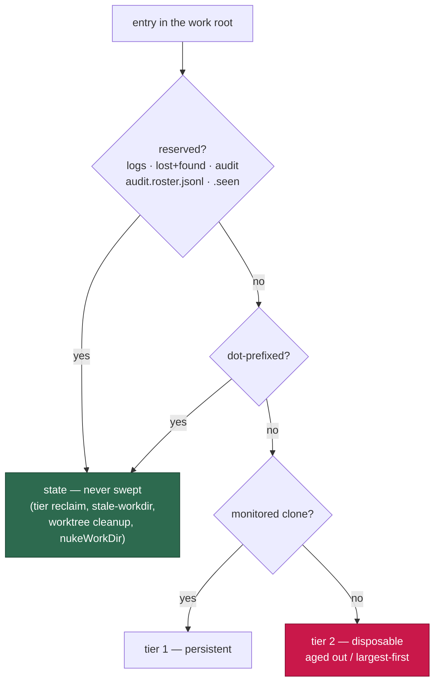

# Reserve the audit trail so housekeeping stops pruning it

## Summary

`${WORK_DIR}/audit` is not dot-prefixed, not a reserved name, and not a
monitored repo, so `classifyWorkRootEntry` tiered it **disposable**. It also
carries no `.git`, so `selectAgedOutDirs` selected it on the first sweep that
reached it and the worker deleted its own hash-chained mutation journals —
`audit-chain-verify` then reported `[SECURITY] [AUDIT_CHAIN_BROKEN]` on every
swept host. The detection was right; the deletion was ours.

- `audit` is now in `RESERVED_WORKDIR_NAMES`, so it tiers as `state` and no
  sweep considers it.
- New `isReservedWorkRootEntry()` covers those names **plus** the audit
  trail's sibling files `audit.roster.jsonl` and `audit.roster.seen` (Issues
  #3949, #270) — the persisted expectation that makes a genuine erasure
  detectable. Every reserved-name check now routes through it, so the one
  sweep that walks files as well as directories (`nukeWorkDir`, the 90%-disk
  emergency) cannot keep the directory while erasing its expectation.

Detection is not weakened: the roster and the seen marker are untouched by
this change, so a genuine `rm -rf audit/` still fails the sweep exactly as
Issue #270 specified. The roster entries for journals **already** deleted on
swept hosts keep reporting broken — deliberately. Silencing them would mean
teaching the verifier to forgive a missing journal, which is the behaviour
that must survive; reconciling those days is an operator action, not
something this fix hides.

Closes #337.

## Evidence

Backend/CLI change only — no web surface to screenshot. Evidence is the test
suite: each new test fails against the unfixed code and passes after the fix
(verified by temporarily removing `audit` and the sidecars from the reserved
sets):

```text
classifyWorkRootEntry - the audit trail is state, never disposable (Issue #337) ... FAILED
reclaimWorkVolumeTiers - never prunes the audit trail (Issue #337) ... FAILED
isReservedWorkRootEntry - reserved dirs plus the audit sidecars (Issue #337) ... FAILED
scanAndCleanupStaleWorkDirs - ignores the audit trail (Issue #337) ... FAILED
nukeWorkDir - keeps the audit trail and its roster sidecars (Issue #337) ... FAILED
FAILED | 62 passed | 5 failed
```

With the fix in place: `ok | 67 passed | 0 failed`.

Tiering after the change:



`./quality.sh` passes every gate except `deno tests`, which reports the same
10 pre-existing failures on the unmodified branch point
(`tests/fleet_health_test.ts`, `tests/host_workdir_guard_test.ts`,
`tests/optional_feature_env_test.ts`, `tests/setup_workdir_reminder_test.ts`
— host work-dir layout dependent, unrelated to this change). Confirmed by
running those four files with the change stashed: `63 passed | 10 failed`,
identical set.

## Test Plan

Added:

- `worker/deno/tests/work_volume_tiers_test.ts`
  - `classifyWorkRootEntry - the audit trail is state, never disposable` —
    pins `classifyWorkRootEntry("audit", …) === "state"`, and derives the
    name from `resolveBaseDir()` so a rename on either side fails here rather
    than on a swept host.
  - `reclaimWorkVolumeTiers - never prunes the audit trail` — a 30-day-old
    audit directory survives both `age` and `disk-low` mode (with
    `bytesNeeded` far above the volume), while the genuinely disposable clone
    beside it is still removed.
- `worker/deno/tests/stale_workdir_test.ts`
  - `isReservedWorkRootEntry - reserved dirs plus the audit sidecars` —
    including the negatives (`audit-scratch`, `audit.roster.jsonl.bak`).
  - `scanAndCleanupStaleWorkDirs - ignores the audit trail` — the `.git`-less
    audit directory is no longer classified "partial" and deleted.
- `worker/deno/tests/disk_space_test.ts`
  - `nukeWorkDir - keeps the audit trail and its roster sidecars` — the
    emergency nuke keeps journals, roster and seen marker while still
    reclaiming clone content.

Docs updated: `docs/CONTAINER.md` (two-tier section and its flowchart) and
`docs/AGENT-ACCOUNTABILITY.md` (storage paragraph) now state that the audit
trail and its sidecars are reserved work-root entries no sweep may delete.
