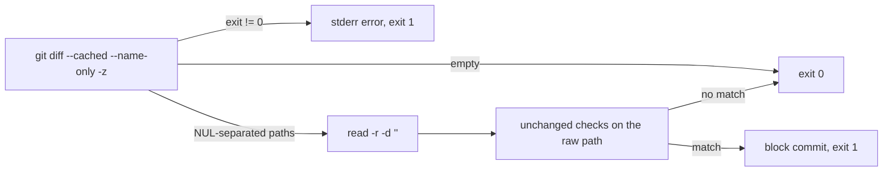

# PR Summary — Issue #3370

## Summary

Closes #3370

`hooks/pre-commit` read staged paths with `git diff --cached --name-only`,
without `-z`. Git C-quotes a path that holds a non-ASCII byte, a `"`, a `\`
or a control character. So `clés/id_ed25519` reached the checks as
`"cl\303\251s/id_ed25519"`, and every anchored basename regex and every
root-level `.secrets/`, `.aws`, `.ssh`, `.gnupg` and `.netrc` check missed
it. The hook now reads the list NUL-separated, so each path is checked as
written.

- [x] Read staged paths with `-z` and `while IFS= read -r -d '' file`
- [x] Fail loud when git cannot list the staged files
- [x] Tests: quoted secret paths blocked, quoted ordinary paths allowed,
      listing failure refused
- [x] `SECURITY.md` pre-commit hook entry updated

## Spec

### Intent and Rationale

The hook is the last local gate against committing a secret, including a
force-added one (`git add -f`). A secret file must not get past it just
because its path, or the directory holding it, has an accented letter or a
quote in it.

### Essential Design Decisions

- **The list goes to a `mktemp` file, not a variable.** Bash variables cannot
  hold NUL bytes, and `$(…)` would drop the separators. A temp file (removed
  by an `EXIT` trap) keeps the NULs. It also lets the hook test git's exit
  status, which a process substitution would hide.
- **Fail loud on a listing failure.** The old line was
  `git diff … 2>/dev/null || echo ""`. When git failed, it turned the failure
  into an empty list, and the hook passed the commit with exit 0. That line
  had to change anyway, so it now prints an error to stderr and exits 1.
  This follows the Never Fail Silently rule.
- **The checks themselves are unchanged.** Only the way the paths are read
  changed, so the existing tests still cover every pattern.
- `read -d ''` and `[[ -s … ]]` work in bash 3.2 (macOS).

### Undiscoverable Facts

- `core.quotePath=false` stops git quoting non-ASCII bytes. It still quotes
  `"`, `\` and control characters, so `say"hi"/id_rsa` was missed even on a
  machine with that setting. The tests set `GIT_CONFIG_GLOBAL=/dev/null` and
  `GIT_CONFIG_NOSYSTEM=1`, so a developer's global `quotePath=false` cannot
  hide the bug.
- `worker/deno/lib/pre_commit_safety.ts` already lists staged paths with
  `-z`. Only the shell hook had the bug.

## Evidence

- `deno task test:unit tests/hooks_pre_commit_test.ts` (from `worker/deno`):
  14 passed, 0 failed.
- `./quality.sh < /dev/null`: PASSED. `config integration` was SKIPPED
  because `.config.json` is not present in the container.
- `bash -n hooks/pre-commit` and `shellcheck hooks/pre-commit`: clean.
- Related rules checked: **Commit Safety**, **Never Fail Silently** and
  **Path Confinement**. Path Confinement does not apply: the hook matches
  path names and does not resolve paths. No prompt or standards rule changed.

**Docs sweep** — grep: `hooks/pre-commit`, `name-only`; updated: `SECURITY.md:744` (pre-commit hook entry now says paths are read with `-z` and that a listing failure rejects the commit); `docs/THREAT-MODEL.md:163` and `docs/THREAT-MODEL.md:203` — still true, they name the hook as the AP-15/C26 control and say nothing about how it reads paths; `docs/SETUP.md:1863` — still true, it only checks that the hook is installed; `CODING-STANDARDS.md:1193` — still true, it is a manual check for a human reading the terminal, not the hook's parser; `SECURITY.md:749` and `SECURITY.md:753` — still true, they cover install and the fail-closed shim; `docs/SECURITY-TREE-SWEEP.md:298` and `docs/audits/security-sweep-1661-worker-state-paths.md:45` — still true, they already describe the Deno gate's `-z` read.

## Test Plan

All tests are in `worker/deno/tests/hooks_pre_commit_test.ts`.

**Red on base.** I ran the new suite against the `main` copy of
`hooks/pre-commit`. Result: 12 passed, 2 failed.

- `pre-commit hook - blocks secret files whose path git would quote (Issue #3370)`
  failed with: `expected hook to block 'clés/id_ed25519' (0 != 1)`.
- `pre-commit hook - fails loud when the staged list cannot be read (Issue #3370)`
  failed with: `expected hook to fail loud: (0 != 1)`.

I also ran the base hook against each of the eight paths on its own:

- Seven exited 0, so the base hook let them through: `clés/id_ed25519`,
  `naïve.pem`, `café/.config.json`, `café/api.secret.json`, `.secrets/tökén`,
  `.aws/crédentials` and `say"hi"/id_rsa`.
- `café/.secrets/token` exited 1 on base, because the unanchored nested
  `/.secrets/` check matches inside the quoted string. That path only pins
  existing behaviour.

**New test that also passes on base:**
`pre-commit hook - allows ordinary files whose path git would quote (Issue #3370)`
(`café/readme.md`, `docs/naïve.ts`). It guards against a fix that blocks
every non-ASCII path.

**Branch outcomes:**

- `hooks/pre-commit:49` — NUL-separated read loop checks the raw path —
  `blocks secret files whose path git would quote (Issue #3370)`. Reverting
  only `-z` / `read -d ''` turned it red (13 passed, 1 failed).
- `hooks/pre-commit:34` — git cannot list the staged files, so the hook
  writes to stderr and exits 1 — `fails loud when the staged list cannot be
  read (Issue #3370)`. Restoring the old swallow (`2>/dev/null || true`)
  turned it red (13 passed, 1 failed).
- `hooks/pre-commit:40` — empty stage exits 0 — `empty stage exits cleanly`.
  This branch existed before; only its test changed from `-z "$var"` to
  `! -s "$file"`.
- `hooks/pre-commit:49` — a quoted ordinary path is allowed — `allows
  ordinary files whose path git would quote (Issue #3370)`.

No assertions were removed or weakened.

## Security self-check

- [x] Input validation: the path names are untrusted. They are only matched
      against regexes and never run or used to open a file.
- [x] Secrets: no secret files are staged. Test fixtures are created in temp
      repos only.
- [x] Injection surface: no new shell or git calls take user input.
      `mktemp` and the `EXIT` trap quote the variable.
- [x] Error handling: a listing failure now refuses the commit instead of
      passing it.
- [x] Dependencies: none added.

🤖 Generated with [Claude Code](https://claude.com/claude-code)
