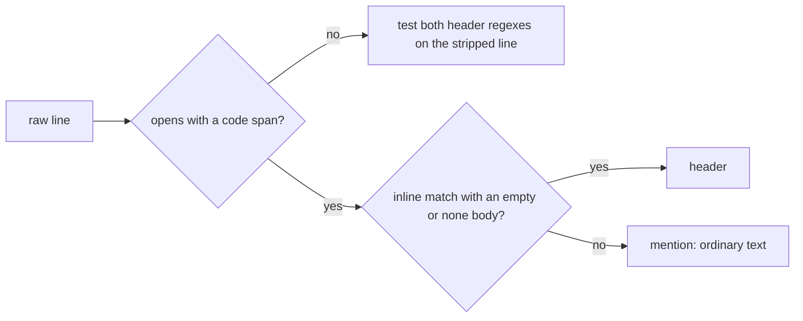

## Summary

The Branch-outcomes gate removed every backtick before testing a line for
the header. A hard-wrapped prose line that opened with a code-span mention,
such as `` `Branch outcomes:`, "example" and … ``, was therefore read as a
real inline header with a non-empty body. A summary with no real list then
passed the gate. Header detection now goes through one `matchHeader` helper
in `worker/deno/lib/branch_outcomes_gate.ts`. It treats a line that opens
with a code span as a quoted mention, unless nothing but `none` or
`none added` follows the separator. Closes #3377.

## Spec

### Intent and Rationale

- The gate failed open: a prose mention set `present: true` and skipped
  the "no list", "empty list" and "bare placeholder" rules.
- The issue suggested two fixes: a check for a code span at the start of
  the line, or a check on what follows the separator. This change combines
  them. A line that opens with a code span is a header only when its body
  after the separator is empty or an honest `none`. Any other text after
  the separator makes it a mention.

### Essential Design Decisions

- One predicate (`matchHeader`) serves all three header checks:
  `parseBranchOutcomes`, `scanRegion` and `collectEntries`. A mention
  therefore neither opens a header nor ends a real list's scan.
- A bare `` `Branch outcomes:` `` line above a list is still a header,
  because PR #3312's review supported that form.
  `branch_outcomes_gate_test.ts::a backticked header still runs the admission check`
  pins it.
- A heading form inside a code span (`` `### Branch outcomes` ``) is never a
  header, because a real ATX heading cannot open with a backtick.

### Undiscoverable Facts

- One gap is accepted: a prose line that is exactly `` `Branch outcomes:` ``
  and wraps onto further prose still reads as a header. The bare
  backticked header is a supported form, so this layout cannot be told
  apart from a real header.

## Evidence

This is a backend-only change to a pure parser, so the evidence is test
and corpus output.

- **Corpus run.** I ran `parseBranchOutcomes` over all 948
  `docs/archive/pr-summaries/*.md` files, before and after the fix. A
  header was present in 76 files before. Three files changed, and every
  change corrects a misread: `pr-summary-3147.md`, `pr-summary-3249.md`
  (now an honest `none added`) and `pr-summary-3340.md` (now 9 entries).
  In each, the old parser had taken a code-span prose mention as the
  header. After the fix it reads the real header. False positives (a real
  header lost): 0. False negatives: none observed. The only line left
  that the rule does not catch is the bare-span wrap case under
  Undiscoverable Facts.
- **Regex safety.** The change adds no regex with overlapping
  quantifiers. `opensWithCodeSpan` uses the existing `LIST_MARKER_RE`, a
  `/\*/g` strip and `startsWith`.
- **Provenance cited.** #3377: Branch-outcomes gate passes a summary with
  no real list when a prose line starting with a backticked
  `Branch outcomes:` mention is read as the header. #3340: Branch-outcomes
  parser skips a real header that follows a prose line read as a header,
  so that header's inline body and test citations are never checked.

**Docs sweep** — grep: `stripDecoration`, `BRANCH_OUTCOMES_PREFIX_RE`,
"bold or plain", "code span"; section:
`docs/workflows/issue-processing.md` (the branch-outcomes gate paragraph);
updated: `docs/workflows/issue-processing.md`;
`docs/workflows/issue-processing.md:1862` — still true because the bold,
plain and heading header forms are unchanged, and the new sentence at the
end of that paragraph covers the code-span case.

## Test Plan

- Added `worker/deno/tests/branch_outcomes_code_span_3377_test.ts` (18
  tests). It covers:
  - a summary whose only mention is a code span, which now blocks as
    "no list";
  - five mention variants: a list item, an indented continuation, a
    whole-line span with bold inside, a double-backtick span and a quoted
    heading;
  - look-alikes that still parse: bold with a list, plain `none added`,
    a bold list-item `none`, a heading with a list, a dash separator, and
    a code span after the separator;
  - the three exempt backticked forms;
  - one test per call site: the outer loop, `collectEntries` and
    `scanRegion`.
- `worker/deno/tests/branch_outcomes_gate_test.ts`: in the fixture of the
  `a deeper heading-form header after a prose mention still names the invented test`
  test, the mention line changed from backticked to plain
  `Branch outcomes: are mentioned here, with no list yet.` A backticked
  mention is no longer a header (this issue). The plain line keeps the
  test's #3340/PR #3372 purpose: a prose line read as a header, followed
  by a deeper heading-form header. No assertion was removed.
- I ran `deno task test` on the 15 test files that import the gate, its
  citations module or the edited manual: `ok | 359 passed | 0 failed`.
- Red checks:
  - Forcing `opensWithCodeSpan` to return false turned 9 of the 15
    mention-and-call-site tests red. The look-alikes stayed green, as
    expected.
  - Dropping the exemption turned the 3 exempt-form tests and
    `branch_outcomes_gate_test.ts::a backticked header still runs the admission check`
    red.
- `./quality.sh < /dev/null`: the first run reported `deno tests FAILED`
  with no failing test named in the condensed output. It ran while the
  worker's periodic WIP checkpoint was committing. The re-run on the same
  tree gave `Result: PASSED (with skipped checks)`. `config integration`
  was skipped and every other check passed.

**Branch outcomes:**

- `worker/deno/lib/branch_outcomes_gate.ts:189` — the line opens with a
  code span, so it is treated as a mention —
  `worker/deno/tests/branch_outcomes_code_span_3377_test.ts::validateBranchOutcomes - a code-span mention is not a list, so the gate blocks (#3377)`
  — forcing the helper false turned it red.
- `worker/deno/lib/branch_outcomes_gate.ts:189` — the line does not open
  with a code span, so the existing regex path runs —
  `worker/deno/tests/branch_outcomes_code_span_3377_test.ts::parseBranchOutcomes - heading form with a list still parses (#3377)`
  and `…::parseBranchOutcomes - a code span after the separator is still a real header (#3377)`
  — forcing the helper true (in a scratch copy) turned both red.
- `worker/deno/lib/branch_outcomes_gate.ts:192` — a code-span line with an
  empty or `none` body is still a header —
  `worker/deno/tests/branch_outcomes_code_span_3377_test.ts::parseBranchOutcomes - a bare backticked header with a list is still a header (#3377)`
  — dropping the exemption turned it red.
- `worker/deno/lib/branch_outcomes_gate.ts:441` — `scanRegion` no longer
  stops at a mention —
  `worker/deno/tests/branch_outcomes_code_span_3377_test.ts::parseBranchOutcomes - a mention inside a none header's region stays in scanText (#3377)`
  — reverting only that call site turned it red.
- `worker/deno/lib/branch_outcomes_gate.ts:512` — `collectEntries` no
  longer stops at a mention —
  `worker/deno/tests/branch_outcomes_code_span_3377_test.ts::parseBranchOutcomes - a mention in an entry's continuation does not end the list (#3377)`
  — reverting only that call site turned it red.

🤖 Generated with [Claude Code](https://claude.com/claude-code)
