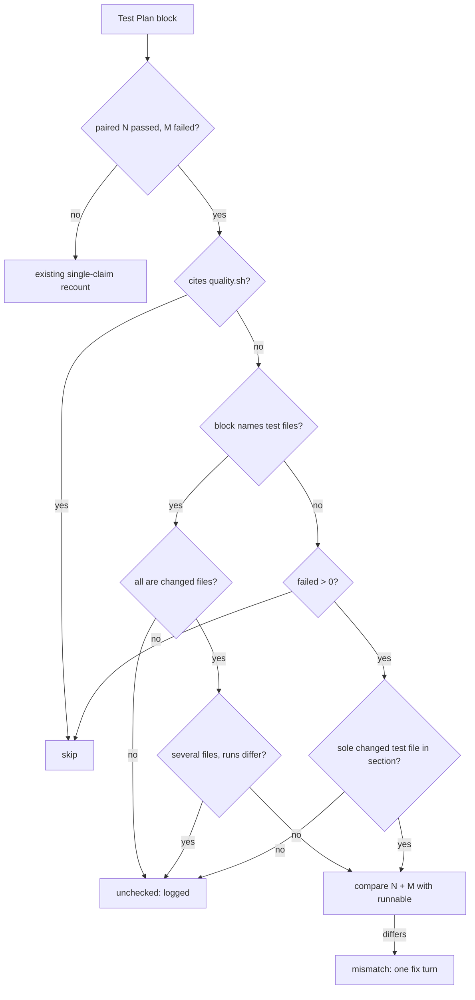

# PR Summary — Issue #3381

## Summary

The review-fix drift check now catches a stale red-on-base result. Previously, when a review fix added tests, the summary's red-on-base pass/fail figures were left describing the older, smaller test file. `findTestPlanMismatches` in `worker/deno/lib/test_plan_recount.ts` now reads a paired `N passed, M failed` result and compares N + M with the runnable count of the head test file that the run executed.

- **Which file:** the file is resolved from the block. When the block names no test file and the result has failures, the section's sole changed test file is used instead.
- **Old false positive removed:** a correct red-on-base result, such as "76 passed, 4 failed" for an 80-test file, is no longer flagged.
- **Recovery:** a mismatch goes to the existing one-fix-turn recovery and names the claimed and actual totals.
- **Results it cannot check:** these are logged as not checked rather than passed silently.

`prompts/pr_feedback/prompt.md` now names the red-on-base result explicitly. When a push changes tests, the head test file is re-run against the base branch's production code, and the old figures and failing-test list are replaced rather than left beside a second block. A run against the PR's own earlier commit must be labelled with that commit.

Closes #3381.

## Spec

### Intent and Rationale

- A red-on-base run executes every runnable test in the head file, so `passed + failed` must equal the head's runnable count. Comparing `passed` alone flags correct red results and misses stale ones.
- The deterministic recount already feeds the drift check's recovery turn, so extending it reuses that path. A new gate would duplicate it.

### Essential Design Decisions

- The fallback uses the section's sole **changed** test file: a token that resolves to a file in the PR's head counts. A test path quoted inside an assertion would otherwise make the section ambiguous, as the real PR #3372 summary shows (`unrelated_test.ts`). A red run must have run a changed test file, because an unchanged test file passes on base.
- The fallback applies only to a result with failures. A file-less green figure, such as a full-suite total, is never compared.
- A block citing `quality.sh` is skipped, because its figures cover the whole suite. Two corpus false positives had this shape (`pr-summary-3255.md`, `pr-summary-3292.md`).
- Three kinds of result are reported through `findUncheckedRunResults` and a drift-check `logger.warn`, not passed silently:
  - a result whose block names an unchanged test file;
  - a result whose block names several files whose runs differ;
  - a red result with no file in its block and no sole changed test file in the section.

### Undiscoverable Facts

- Of the issue's two examples, VibeCoder#3372's stale block was in the Test Plan, and the new test reproduces it verbatim. VibeCoder#3066's stale "0 passed, 3 failed" was in the summary's **Evidence** section (`git show 0888a1b8:docs/archive/pr-summaries/pr-summary-3046.md`, lines 63-65). The recount reads only the Test Plan, so that shape is covered only by the prompt rule.

## Evidence

Backend change only, with no UI files. The checks are the tests named below and a corpus run.

**Corpus run** over `docs/archive/pr-summaries/` (951 summaries). This was a scratch script, deleted after the run. It used the test files each summary names, read at the commit that last touched that summary, as head counts. That is wider than production, which uses only the PR's changed files.

- Base matcher: 137 flags. New matcher: 138 flags, of which 38 are paired-result flags.
- **Flagged only by the new matcher (8):**
  - 4 true positives, each a red total from a smaller earlier file: `pr-summary-1288.md`, `pr-summary-188.md`, `pr-summary-3298.md` and `pr-summary-3307.md`.
  - 4 false positives:
    - `pr-summary-839.md` is a single test cited by `::name`.
    - `pr-summary-3206.md` is a multi-suite run that names one file.
    - `pr-summary-2265.md` and `pr-summary-768.md` are multi-file aggregates. These come from the wider corpus head counts.
- **Cleared old flags (7):** all were false positives of the old `N passed` comparison.
  - Correct red results: `pr-summary-3245.md` and `pr-summary-3407.md`.
  - Full-gate `quality.sh` lines: `pr-summary-2085.md` and `pr-summary-94.md`.
  - Paired results now read correctly: `pr-summary-1292.md`, `pr-summary-3172.md` and `pr-summary-3219.md`.
- **False negatives:** VibeCoder#3066's stale result is outside the Test Plan (see Undiscoverable Facts).

**Issue numbers the diff cites:**

- #3381: Review-fix pushes that add tests leave the summary's red-on-base pass/fail figures at the earlier test file: the Test Plan recount never checks a base run (VibeCoder#3066, #3372)
- PR #3372 and PR #3066 are cited as the issue's evidence.

**Related rules checked:**

- `prompts/pr_feedback/prompt.md`: "Keep the PR summary true to the head" (extended in this diff) and "A requested red run is shown, not claimed".
- `CODING-STANDARDS.md`: "A red run counts only against the base branch" and "Writing a gate over text".
- `prompts/issue/prompt.md`: "Red counts only against the base branch".

These agree with the new rule. All of them define red as the base branch's production code run with the head test.

I applied the new rule to this PR's own diff. The red-on-base figures in the Test Plan below come from the head test files, run against the base lib in a throwaway worktree on the final code. I found nothing else the rule would flag.

**Docs sweep** — grep: `findTestPlanMismatches`, `describeTestPlanMismatch`, "red[- ]on[- ]base", "Test Plan recount", "N passed"; section: `docs/workflows/pr-feedback.md#the-workers-drift-check-issue-3143`; updated:

- `docs/workflows/pr-feedback.md`
- `docs/INTERNALS.md`
- `prompts/pr_feedback/prompt.md`

Hits left in place:

- `docs/INTERNALS.md:5288` is still true, because the drift-check row says it runs the Test Plan recount, which it still does.
- `docs/workflows/pr-feedback.md:522` is still true, because the flowchart node names the Test Plan recount step, which is unchanged in position.

## Acceptance Criteria

<!-- vibe-spec-review inputs="diff+issue-body" -->

- **met** — For a Test Plan block holding an `N passed, M failed` result (any order, with optional `ignored`), compare `N + M` with the head's runnable count, not `N` — evidence: `worker/deno/tests/test_plan_recount_red_on_base_3381_test.ts::paired run result - a block naming the test file is compared by passed + failed` and the variant and `ignored figure is outside the total` tests — reviewer: met
- **partial** — Resolve the test file from the block. When the block names none, use the Test Plan section's sole test file if the section names exactly one — evidence: `worker/deno/tests/test_plan_recount_red_on_base_3381_test.ts::paired run result - the stale PR #3372 plan is flagged once` — reviewer: partial — reason: the fallback counts only test files the PR changes, and only red results. Without that narrowing the issue's own PR #3372 example is missed (it quotes `unrelated_test.ts`), and full-suite green totals would be compared. A block naming an unchanged file is now logged as not checked (`unchecked run results - (a) …`).
- **met** — A mismatch goes to the existing one-fix-turn recovery path, naming the claimed and actual totals — evidence: `worker/deno/tests/test_plan_recount_red_on_base_3381_test.ts::describeTestPlanMismatch - a run names total, passed, failed, file and actual` — reviewer: partial — reason: the reviewer could not see the caller. `collect` in `worker/deno/lib/pr_feedback_drift_check.ts` maps every `findTestPlanMismatches` result through `describeTestPlanMismatch` into the existing recovery turn, unchanged by this diff.
- **met** — Before enabling the check, run it over `docs/archive/pr-summaries/` — evidence: the corpus run under Evidence (951 summaries, false-positive and false-negative counts) — reviewer: partial — reason: the reviewer saw only the diff. The run's counts are recorded in this summary, and its two `quality.sh` false positives produced the full-gate skip.
- **met** — Prompt clarification in `prompts/pr_feedback/prompt.md` "Keep the PR summary true to the head" — evidence: `worker/deno/tests/pr_feedback_red_on_base_3381_test.ts::pr_feedback prompt recounts the red-on-base result after a review fix (Issue #3381)` — reviewer: met
- **met** — A summary whose `77 passed, 2 failed` block sits in a section naming one 80-test file is flagged — evidence: `worker/deno/tests/test_plan_recount_red_on_base_3381_test.ts::paired run result - the stale PR #3372 plan is flagged once` — reviewer: met
- **met** — The same block reading `76 passed, 4 failed` passes — evidence: `worker/deno/tests/test_plan_recount_red_on_base_3381_test.ts::paired run result - a correct red-on-base total is not flagged` — reviewer: met
- **met** — A block in a section naming two test files and no file of its own is left alone — evidence: `worker/deno/tests/test_plan_recount_red_on_base_3381_test.ts::paired run result - two changed test files leave a file-less red block alone` — reviewer: met
- **unrequested** — The `quality.sh` skip, the skip for several files whose runs differ, and the red-only fallback — reviewer: unrequested — reason: the corpus run and "Writing a gate over text" need them to keep the check's false positives down.
- **unrequested** — `findUncheckedRunResults` and the drift-check `logger.warn` — reviewer: unrequested — reason: added for the Standards review's "no silent pass on unread input" finding.
- **unrequested** — Doc updates in `docs/workflows/pr-feedback.md` and `docs/INTERNALS.md`, and the drift test `worker/deno/tests/pr_feedback_red_on_base_3381_test.ts` — reviewer: unrequested — reason: a behaviour change owes its docs change, and a prompt rule needs a drift test (CODING-STANDARDS).
- **unrequested** — The ReDoS growth test, its `WALL_CLOCK_TEST_FILES` entry, and the `run` field on `TestPlanMismatch` — reviewer: unrequested — reason: a regex on agent-written text needs a hostile case, a growth test must run serially, and the description needs the passed and failed split.

## Standards Review

<!-- vibe-standards-review inputs="diff+CODING-STANDARDS.md" -->

- **violation** — Writing a gate over text, item 3: a paired result the recount could not check returned as a clean pass — evidence: `worker/deno/lib/test_plan_recount.ts:651` — reason: fixed in this diff. Unresolvable results now return `unchecked` (lines 651, 662 and 674), `findUncheckedRunResults` exposes them, and `worker/deno/lib/pr_feedback_drift_check.ts:1132` logs them, with one test per reason and a drift-check warn test.
- **violation** — Writing a gate over text, item 1: no evasion case for a result inside a code span — evidence: `worker/deno/lib/test_plan_recount.ts:549` — reason: fixed in this diff. The code-span text is the deno output the check reads, so it is deliberately not masked, and `paired run result - a result inside a code span is the deno output and is checked` pins it both ways.
- **violation** — Writing a gate over text, item 2: corpus false-positive and false-negative counts not in the diff — evidence: `worker/deno/lib/test_plan_recount.ts:643` — reason: fixed in this diff. The counts are recorded in this summary's Evidence.
- **clean** — Checked and compliant:
  - the regex on untrusted text (`RESULT_RE` has no overlapping quantifiers and has a hostile growth case);
  - named tests and helpers exist at the head;
  - no stubs of other repositories;
  - no workflow changes;
  - drift tests are present for the prompt and doc rules;
  - Australian English;
  - logical-unit matching via `logicalBlocks`.

  Review-enforced rules checked: "Writing a gate over text" and "Vet every regex on untrusted text". No existing test assertion is removed.

## Test Plan

Tests added or modified (no existing assertion is removed):

- `worker/deno/tests/test_plan_recount_red_on_base_3381_test.ts` (new): 23 tests at the head. These are the issue's three cases, the evasion variants and look-alikes, the unchecked-reason tests, the description test and a hostile growth case. The file is listed in `WALL_CLOCK_TEST_FILES`.
- `worker/deno/tests/pr_feedback_red_on_base_3381_test.ts` (new): drift pins for the prompt and the workflow doc. All 8 pinned phrases are reported "absent on base" by `deno task drift-pins-on-base origin/milestone/worker-deno-lib-pr-summary-markdown-gates …`.
- `worker/deno/tests/pr_feedback_drift_check_3143_test.ts`: added `runPrFeedbackDriftCheck - a red run result the recount cannot check is warned about (Issue #3381)`.

Red on base (the head test files run against the base branch's `worker/deno/lib/test_plan_recount.ts` and `worker/deno/lib/pr_feedback_drift_check.ts`, in a throwaway worktree):

- `tests/test_plan_recount_red_on_base_3381_test.ts`: the whole module fails to load with `SyntaxError: The requested module '../lib/test_plan_recount.ts' does not provide an export named 'findUncheckedRunResults'` (deno: `FAILED | 0 passed | 1 failed`).
- `tests/pr_feedback_drift_check_3143_test.ts`: `FAILED | 26 passed | 1 failed`. The failure is `runPrFeedbackDriftCheck - a red run result the recount cannot check is warned about (Issue #3381)`.

Green at the head:

- `deno test --no-check -A tests/pr_feedback_drift_check_3143_test.ts tests/test_plan_recount_red_on_base_3381_test.ts` from `worker/deno` gave `ok | 50 passed | 0 failed`.
- `./quality.sh < /dev/null` on the final lib, prompt and docs, before the same-word pair test was added (that test was then run, formatted and linted on its own above): every check passed (config integration skipped by the gate); Deno tests passed in both the parallel and serial passes.

Branch outcomes:

- `worker/deno/lib/test_plan_recount.ts:549`: the two words of a pair match, so it is not a paired result. Reached by `paired run result - two passed figures are not read as a pass/fail pair`. Commenting the line out turned it red (`FAILED | 22 passed | 1 failed`).
- `worker/deno/lib/test_plan_recount.ts:539`: the sole changed test file feeds the fallback. Reached by `paired run result - the stale PR #3372 plan is flagged once`. Counting unresolved tokens as well turned it red.
- `worker/deno/lib/test_plan_recount.ts:643`: a `quality.sh` block is skipped. Reached by `paired run result - a quality.sh full-gate line naming a failing test file is skipped`. Removing the guard turned it red.
- `worker/deno/lib/test_plan_recount.ts:651`: an unchanged test file in the block makes the result unchecked. Reached by `unchecked run results - (a) a block naming an unchanged test file is reported`. Returning ok instead turned it red.
- `worker/deno/lib/test_plan_recount.ts:662`: several files whose runs differ make the result unchecked. Reached by `unchecked run results - (b) several files whose runs differ are reported` and `paired run result - two files with different totals are skipped`. Returning ok, or removing the check, turned them red.
- `worker/deno/lib/test_plan_recount.ts:672-673`: a block that names no test file keeps only its runs with failures, and returns ok when none are left. Reached by `unchecked run results - quality.sh and file-less green blocks are not reported`, which now also asserts `findTestPlanMismatches` returns `[]` for the file-less green `deno task test:unit` line beside a sole changed test file (PR #3553 review). With the `failed > 0` filter dropped (`candidates = runs`), that test went red (`FAILED`, tests/test_plan_recount_red_on_base_3381_test.ts:299) and the other 22 stayed green; restored, all 23 pass.
- `worker/deno/lib/test_plan_recount.ts:674`: no sole changed test file makes the result unchecked. Reached by `unchecked run results - (c) a red result with no file and no sole changed test file is reported` and the drift-check warn test. Returning ok turned the drift-check test red.
- `worker/deno/lib/test_plan_recount.ts:687`: passed + failed differs from runnable, which is a mismatch. Reached by `paired run result - a block naming the test file is compared by passed + failed`. Comparing passed alone turned it, and the variant tests, red.
- `worker/deno/lib/test_plan_recount.ts:705`: the run description. Reached by `describeTestPlanMismatch - a run names total, passed, failed, file and actual`, which asserts the full string.
- `worker/deno/lib/pr_feedback_drift_check.ts:1132`: unchecked results are warned about. Reached by `runPrFeedbackDriftCheck - a red run result the recount cannot check is warned about (Issue #3381)`. Removing the `logger.warn` call turned it red.

Entry points checked:

- `runPrFeedbackDriftCheck` → `collect` → `findTestPlanMismatches`: same signature, so its existing callers are unchanged.
- `runPrFeedbackDriftCheck` → `findUncheckedRunResults`: covered by the warn test.
