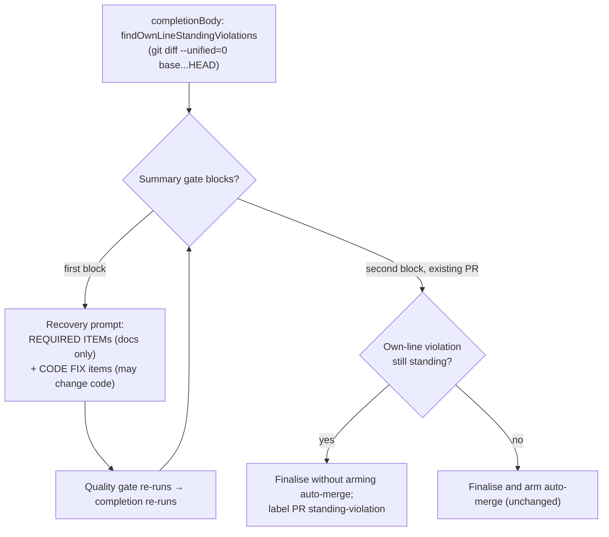

## Summary

Some Standards `violation`s are left standing on lines the branch itself adds or changes. These now go to the in-run recovery turn as **CODE FIX** items, which that turn may change code for. Before, the turn was told not to change code, so it could never settle what the #3196 gate demands. If such a violation is still standing when a later block finalises an existing PR as `summary_incomplete`, the worker no longer arms auto-merge at finalisation. It labels the PR `standing-violation` instead. Closes #3382.

One criterion stays **partial**. The Priority 1.65 auto-merge sweep does not read PR labels, so it can still arm a held PR on a later cycle. Follow-up #3517 tracks that.

## Spec

### Intent and Rationale

- The #3196 gate correctly refuses a standing own-line violation. Its only accepted reason is `fixed in this diff`, but the recovery prompt said "do not change it". The model recorded the breach honestly as unfixed, and VibeCoder#3308 and #3380 shipped that way.
- Rewording alone could not help, so the fix is routing. The worker reads the diff, works out which standing violations sit on the branch's own lines, and only those get code permission. Every other REQUIRED ITEM keeps the documentary "do not change the code" rule.

### Essential Design Decisions

- The #3196 gate itself is unchanged. `isStandingViolation` reuses `violationReasonSettles` as is, and "this turn cannot change code" is still refused.
- Placement fails closed in four cases, and each one is treated as on the branch's own lines:
  - the evidence names no `path:line`;
  - the base ref cannot be resolved;
  - `git diff` fails or exits non-zero;
  - the diff cannot be parsed.
  The not-checked case is logged at error.
- `recoverAndFinaliseExistingPr` now takes a required `finalise: { docsSweepHitsComment, holdAutoMerge }` with no default, so every caller states the hold.
- The cited `path:line` matches a diff path exactly or as a path suffix (`lib/foo.ts` ↔ `worker/deno/lib/foo.ts`). This is because summaries cite paths relative to a subdirectory.

### Undiscoverable Facts

- The auto-merge sweep (`auto_merge_sweep.ts`) arms every non-draft fleet PR and reads no labels. Making it honour the hold means changing the shared PR listing, which this PR does not do (#3517).

## Evidence

Backend/CLI change, so there are no screenshots.

- `worker/deno/lib/standing_violation_routing.ts` (new): `citedLocations`, `ownLineStandingViolations`, `findOwnLineStandingViolations`, `STANDING_VIOLATION_LABEL`. It reuses `parseChangedLines` from `docs_sweep_hits.ts`.
- `worker/deno/lib/independent_review_gate.ts`: `ReviewEntry.evidence` and `isStandingViolation`. The gate's own checks are unchanged.
- `worker/deno/lib/summary_rule_gate_retry.ts`: `SummaryRuleRunVerdict.standingViolations`. Each violation is rendered in its own fence under the run's nonce and named in the boundary-integrity instruction.
- `worker/deno/lib/phases/completion_phase.ts`:
  - finds the own-line violations once, before the summary gates, and threads them through every `reportSummaryRuleBlock` call (the `SummaryRuleBlock` field is required);
  - in `recoverAndFinaliseExistingPr`, applies the hold and the label in place of `armAutoMergeAtCreation`.
- `worker/deno/lib/worker_label_guard.ts`: `standing-violation` is added to the worker allowlist.
- `docs/audits/lib-sweep-coverage/top-up-3382.json`: claims the new module, which the `lib_sweep_coverage_test.ts` manifest check requires.
- Load-bearing fakes:
  - `deps.pr.updatePrLabels` stands in for `pr_issue_linking.ts::updatePrLabels`, which runs `gh pr edit --add-label` and never removes a label.
  - `deps.git.runGitCommand` stands in for the real git runner. Its `--unified=0` fixture uses the `@@ -a,b +c,d @@` hunk shape that `parseChangedLines` already parses in production.
- Callers of `recoverAndFinaliseExistingPr`:
  - `reportSummaryRuleBlock` passes the hold;
  - the idempotent-recovery path and the after-creation-error path pass `holdAutoMerge: false`, because every summary gate has already passed there, so no standing violation can remain;
  - five calls in `worker/deno/tests/completion_phase_merged_pr_closure_test.ts` pass `false`.
- `#N` provenance this diff adds:
  - #3382: "Standing-violation refusal (#3196) is routed to a recovery turn that may not change code…";
  - #3196: "Standards Review lets a breach in the PR's own lines 'stand'…";
  - #3517: "Auto-merge sweep ignores the standing-violation hold label, so a held PR can still be armed (#3382 follow-up)". This run filed it.
- Related existing rules checked: `CODING-STANDARDS.md:1518` (claim-check recovery turn) is still true, and `prompts/issue/prompt.md` was not changed. The new prompt rule applies only to CODE FIX items, and nothing in this PR's own Standards Review uses the refused reasons.

**Docs sweep** — grep: `recoverAndFinaliseExistingPr`, "so do not change it", "this turn may not change code", `summary_incomplete`, "body, labels, link, auto-merge", `standing-violation`; section: `docs/workflows/issue-processing.md#-the-in-run-recovery-from-a-summary-rule-block`; updated: `README.md`, `DESIGN-PRINCIPLES.md`, `docs/INTERNALS.md`, `docs/workflows/issue-processing.md`. Hits left in place:
- `docs/workflows/issue-processing.md:1312` — still true because it is a history of VibeCoder#3251's earlier parameter.
- `docs/workflows/issue-processing.md:1122` — still true because the #3196 gate itself still cannot see the diff (the line now notes that the completion phase reads the diff for routing).

## Acceptance Criteria

<!-- vibe-spec-review inputs="diff+issue-body" -->

- **met** — Route an own-line standing violation to a code-capable fix turn — evidence: `worker/deno/tests/completion_phase_summary_rule_retry_test.ts::completion - an own-line standing violation reaches the recovery prompt as a CODE FIX item (Issue #3382)` — reviewer: met
- **met** — Keep `summary_rule_gate_retry.ts`'s "do not change code" rule for the purely documentary blocks — evidence: `worker/deno/tests/summary_rule_gate_retry_test.ts::summary-rule retry - without standing violations the documentary rule is unchanged (Issue #3382)` — reviewer: met
- **partial** — Don't arm auto-merge on a self-flagged breach … label the PR so the open breach is visible — evidence: `worker/deno/tests/completion_phase_summary_incomplete_test.ts::completion - an own-line standing violation left after recovery holds auto-merge and labels the PR (Issue #3382)` — reviewer: partial — reason: finalisation no longer arms auto-merge and labels the PR, but the Priority 1.65 auto-merge sweep reads no labels and can still arm the PR on a later cycle; follow-up #3517
- **met** — Tests: a summary whose only gate problem is an own-line standing `violation` reaches a recovery prompt that permits code edits to the cited file — evidence: `worker/deno/tests/completion_phase_summary_rule_retry_test.ts::completion - an own-line standing violation reaches the recovery prompt as a CODE FIX item (Issue #3382)` — reviewer: met
- **met** — Tests: a second such block over an existing PR does not arm auto-merge — evidence: `worker/deno/tests/completion_phase_summary_incomplete_test.ts::completion - an own-line standing violation left after recovery holds auto-merge and labels the PR (Issue #3382)` — reviewer: met
- **met** — Never relax the #3196 rule, and never accept "this turn cannot change code" as a settling reason — evidence: `worker/deno/lib/independent_review_gate.ts::isStandingViolation`, `worker/deno/tests/standing_violation_3196_test.ts` — reviewer: met
- **unrequested** — `standing-violation` added to the worker label allowlist — reviewer: unrequested — reason: the worker applies this label, and the allowlist must describe every label the worker applies (Issue #1219 precedent)
- **unrequested** — fail-closed placement and its logging when the base or diff is unreadable — reviewer: unrequested — reason: the fail-loud standard requires that a check that cannot run never reads as clean
- **unrequested** — `recoverAndFinaliseExistingPr` takes a required `finalise` object, and its test callers are updated — reviewer: unrequested — reason: the standards forbid defaulting a behaviour-carrying flag to off
- **unrequested** — docs updates (`README.md`, `DESIGN-PRINCIPLES.md`, `docs/INTERNALS.md`, `docs/workflows/issue-processing.md`) — reviewer: unrequested — reason: a code change owes a docs change
- **unrequested** — extra tests (hostile-input `citedLocations`, forged-delimiter prompt, unchanged-context, label-failure outcomes) — reviewer: unrequested — reason: the regex, fencing and branch-outcome standards require them
- **unrequested** — suffix matching of cited paths against diff paths — reviewer: unrequested — reason: summaries cite paths relative to a subdirectory (`lib/foo.ts`), and without suffix matching those would never place

## Standards Review

<!-- vibe-standards-review inputs="diff+CODING-STANDARDS.md" -->

- **violation** — Every outcome of a branch you add needs a test: the `!ensured.ok` and `!held.ok` outcomes of the hold branch had no test — evidence: `worker/deno/lib/phases/completion_phase.ts:978` — reason: fixed in this diff (`completion - a failed standing-violation label creation still labels the PR and holds auto-merge (Issue #3382)` and `completion - a failed standing-violation PR labelling is logged and auto-merge stays held (Issue #3382)`)
- **clean** — the reviewer found these compliant:
  - Australian English;
  - no silent default on the new parameter;
  - the existing finalise guards (#3092 degraded-run guard, PR-number check) are kept on the hold path;
  - fail-closed on unreadable input;
  - bounded regexes on untrusted text, with hostile cases;
  - untrusted violation text is fenced and named in the boundary-integrity instruction;
  - negative tests have fixtures;
  - the #3196 gate is not relaxed;
  - named tests exist;
  - no test assertion is removed.

  The one rule the reviewer treated as review-enforced, "Check where you insert", was checked and is clean. Optional notes the reviewer raised and this PR does not act on: ERROR-level logging while the run continues, a long spliced sentence in `docs/workflows/issue-processing.md`, and a diff fixture duplicated across two test files.

## Test Plan

Added or modified:
- `worker/deno/tests/standing_violation_routing_test.ts` (new)
- `worker/deno/tests/summary_rule_gate_retry_test.ts` (three tests)
- `worker/deno/tests/completion_phase_summary_rule_retry_test.ts` (two tests and a `--unified=0` diff fixture)
- `worker/deno/tests/completion_phase_summary_incomplete_test.ts` (four tests, plus harness options for the diff, labels, label failures and log capture)
- `worker/deno/tests/completion_phase_merged_pr_closure_test.ts` (call signature only)

Removed assertions: none. Every existing assertion is kept. The existing "same rule broken after the PR exists" test still asserts `finaliseCalls === 1`.

Results on the final head:
- `deno test -A` on the touched test files, plus `standing_violation_3196_test.ts`, `independent_review_gate_test.ts`, `completion_phase_summary_claim_check_test.ts`, `completion_phase_docs_sweep_test.ts`, `worker_label_guard_test.ts` and `lib_sweep_coverage_test.ts`, passed: 176 passed, 0 failed.
- `./quality.sh < /dev/null` passed (config integration skipped: no `.config.json` in the checkout).

**Branch outcomes:**

- `worker/deno/lib/standing_violation_routing.ts:68` — a matched token with no `.` or `/` is skipped — `worker/deno/tests/standing_violation_routing_test.ts::citedLocations - no path:line gives []` — not flipped separately; the remaining `citedLocations` cases pin the accepted shapes.
- `worker/deno/lib/standing_violation_routing.ts:90` — a settled entry is skipped — `worker/deno/tests/standing_violation_routing_test.ts::ownLineStandingViolations - placement rules` — removing the filter went red.
- `worker/deno/lib/standing_violation_routing.ts:92` — no cited `path:line` → kept (fail closed) — `worker/deno/tests/standing_violation_routing_test.ts::ownLineStandingViolations - placement rules` — excluding instead went red.
- `worker/deno/lib/standing_violation_routing.ts:95` — the range overlaps / does not overlap — `worker/deno/tests/standing_violation_routing_test.ts::ownLineStandingViolations - placement rules`, `worker/deno/tests/standing_violation_routing_test.ts::findOwnLineStandingViolations - routing against a diff` — forcing false went red in 2 tests.
- `worker/deno/lib/standing_violation_routing.ts:122` — not applicable, or nothing standing → no git call — `worker/deno/tests/standing_violation_routing_test.ts::findOwnLineStandingViolations - routing against a diff` (runGit never called).
- `worker/deno/lib/standing_violation_routing.ts:132` — base unresolvable → fail closed — the same test — removing the fail-closed went red.
- `worker/deno/lib/standing_violation_routing.ts:145` and `:150` — git throws / exits non-zero → fail closed — the same test (throwing and non-zero runners).
- `worker/deno/lib/standing_violation_routing.ts:161` — diff unparseable → fail closed — exempt (untestable): `parseChangedLines` throws only on a hunk header with no file header, which real `git diff` output never produces; kept as defence in depth.
- `worker/deno/lib/summary_rule_gate_retry.ts:205` / `:236` / `:239` — standing violations present / absent — `worker/deno/tests/summary_rule_gate_retry_test.ts::summary-rule retry - a standing violation arrives as a CODE FIX item the turn may change code for (Issue #3382)` and `worker/deno/tests/summary_rule_gate_retry_test.ts::summary-rule retry - without standing violations the documentary rule is unchanged (Issue #3382)` — removing the CODE FIX section went red in 2 tests.
- `worker/deno/lib/phases/completion_phase.ts:735` — the hold is set or not from the block — `worker/deno/tests/completion_phase_summary_incomplete_test.ts::completion - an own-line standing violation left after recovery holds auto-merge and labels the PR (Issue #3382)` and `worker/deno/tests/completion_phase_summary_incomplete_test.ts::completion - a standing violation on unchanged context still arms auto-merge and adds no label (Issue #3382)` — passing `false` went red.
- `worker/deno/lib/phases/completion_phase.ts:965` — hold → no arm, label applied — the same hold test.
- `worker/deno/lib/phases/completion_phase.ts:978` — `ensureLabelExists` fails → warn, still label — `worker/deno/tests/completion_phase_summary_incomplete_test.ts::completion - a failed standing-violation label creation still labels the PR and holds auto-merge (Issue #3382)` — dropping the warning went red.
- `worker/deno/lib/phases/completion_phase.ts:986` — `updatePrLabels` fails → error logged, still not armed — `worker/deno/tests/completion_phase_summary_incomplete_test.ts::completion - a failed standing-violation PR labelling is logged and auto-merge stays held (Issue #3382)` — dropping the error went red.
- `worker/deno/lib/phases/completion_phase.ts:2776` — `notChecked` → error log — exempt (untestable): log-only, with no effect on the result; the fail-closed result it reports is covered at `standing_violation_routing.ts:132`.
- `worker/deno/lib/phases/completion_phase.ts:2786` — violations found → warn log — `worker/deno/tests/completion_phase_summary_rule_retry_test.ts::completion - an own-line standing violation reaches the recovery prompt as a CODE FIX item (Issue #3382)` (an empty list there went red in the prompt test and the hold test).

Guards kept on the new path: the hold replaces only `armAutoMergeAtCreation`. The degraded-run guard (#3092), the unnumberable-URL check (#3139), the body recovery, the label update, the link and the milestone retarget all still run first, unchanged.

🤖 Generated with [Claude Code](https://claude.com/claude-code)
