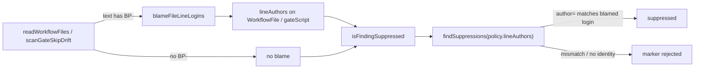

## Summary

Native workflow-scanner suppression markers were always rejected in production.
`isFindingSuppressed` gave `findSuppressions` no commit identity, and nothing in
production calls `setSuppressionCommitAuthors`. Now `readWorkflowFiles` runs
`git blame` on any workflow or composite-action file that contains a `BP-`
marker candidate and attaches the result as `WorkflowFile.lineAuthors`.
`scanGateSkipDrift` does the same for `quality.sh`. `isFindingSuppressed` now
takes the file object and passes `lineAuthors` through, so a marker committed by
the login named in its `author=` field is honoured, and a forged one is still
rejected. Closes #3389.

## Spec

### Intent and Rationale

- This uses the per-line blame binding that `orphan_deps_suppression_scan.ts`
  already applies (Issue #269), not the process-wide
  `setSuppressionCommitAuthors` seam. Blame ties the identity to the marker's
  own line, so a fork that writes `author=<allowlisted-login>` still blames as
  the attacker.
- The blame happens when the files are loaded. The scanners therefore stay pure
  and synchronous, and the production loader for every pre-filer
  (`github_actions_audit_template.ts` → `readWorkflowFiles`) picks it up with no
  per-scanner wiring.

### Essential Design Decisions

- `isFindingSuppressed(source, line, id)` now takes the file object rather than
  `(text, line, id, path)`. A caller that holds a `WorkflowFile` therefore
  passes its `lineAuthors` without having to remember to.
- Blame runs only when the text matches `/BP-/i`. Every best-practices marker
  form needs a `BP-` id, so the check never skips a real marker, and
  marker-free files skip the blame and its possible unshallow fetch for
  non-scanner callers (`pr_ci_processor`, `pr_maintenance`,
  `check_main_ruleset`, `llm_usage_detection`).
- If blame returns no logins (no git history, or only shallow-boundary hunks),
  `lineAuthors` is left unset and the process-wide list applies, as in
  `orphan_deps_suppression_scan.ts`. Production never sets that list, so the
  marker is rejected.
- `isAnnotationClassSuppressed` (`workflow_annotation_filer.ts`) passes
  `{ rawText }` with no identity, so it still rejects every marker. The
  `FileAnnotationClassesOptions.readWorkflowText` doc says the real scan has
  no local checkout, and there is none to blame.
  `changed_workflow_gate.ts` builds its own `WorkflowFile`s without
  `lineAuthors`, so a marker added by the agent's own PR cannot waive a finding
  in that gate.

### Undiscoverable Facts

- The issue was found while reviewing PR #3388 and was out of that PR's scope.

## Evidence

Backend-only change. The tests below call the real loaders and suppression
parser, and one test uses a real `git` repository.

- `worker/deno/tests/workflow_scan_common_test.ts::readWorkflowFiles + isFindingSuppressed - a committed marker is honoured in production wiring (Issue #3389)`
  runs `git init` and commits a workflow carrying the marker as `nigel`
  (`nigel@users.noreply.github.com`). It then calls `readWorkflowFiles(dir)`
  with the default blame and asserts that the finding is suppressed. A second
  commit by `mallory` rewrites the marker line, still claiming `author=nigel`,
  and the test asserts the marker is rejected. The fixture relies on
  `git blame --porcelain` `author`/`author-mail` headers, which
  `parseBlamePorcelain` already handles; the real git run is the observation.
- Without the blame call in `readWorkflowFiles`, this test and the stub-based
  `readWorkflowFiles` test fail (2 failed, 22 passed). Without the blame call in
  `scanGateSkipDrift`, the new gate-skip test fails (1 failed, 32 passed).
- Production implementation behind the blame stubs: `blameFileLineLogins`
  (`worker/deno/lib/suppression_identity.ts`). The property relied on is that it
  returns a 1-based line → login map, or `{}` on any git failure.

**Docs sweep** — grep: `isFindingSuppressed`, `readWorkflowFiles(`,
`commit identity`, `blame`, `best-practice-ignore` in `README.md`, `docs/`
(excluding archive and audits) and the source doc comments of the changed
files. Sections: `docs/GITHUB-ACTIONS-AUDIT-SCAN.md#suppression-comment-syntax`
and `docs/GATE-SKIP-DRIFT-SCAN.md#suppression`, both updated with the blame
binding. The `workflow_scan_common.ts` module doc and the doc comments of
`isFindingSuppressed`, `readWorkflowFiles`, `WorkflowFile` and `selectLiveSteps`
were updated in the code. `docs/BEST-PRACTICES-SCAN.md:754` is unchanged and
still true because it documents the marker grammar, which did not change.

## Test Plan

- `./quality.sh < /dev/null` was run on the committed change and passed: deno
  tests, lint, type check, fmt, semgrep and markdownlint all passed; config
  integration was skipped by the gate itself.
- `deno task test:unit` over the 13 scanner test files
  (workflow_scan_common, gate_skip_drift, action_pin, artifact_upload,
  checkout_persist_credentials, ci_install_pin, gitleaks_drift,
  gitleaks_pr_coverage, milestone_branch_filter, run_injection,
  workflow_permissions, workflow_trigger, workflow_annotation_scan) passed
  280/280.
- Added in `worker/deno/tests/workflow_scan_common_test.ts`. None of them sets
  the process-wide commit-author seam.
  - `isFindingSuppressed - honours a marker whose author matches the blamed line without the commit-author seam (Issue #3389)`
  - `isFindingSuppressed - rejects a marker blamed on someone else or with no blame (Issue #3389)`
  - `readWorkflowFiles - blames a file carrying a BP- marker and attaches lineAuthors (Issue #3389)`
  - `readWorkflowFiles + isFindingSuppressed - a committed marker is honoured in production wiring (Issue #3389)`
  - `selectLiveSteps - a file's blamed lineAuthors lets an in-source marker drop a step without the seam (Issue #3389)`
- Added in `worker/deno/tests/gate_skip_drift_scanner_test.ts`, without the
  seam: `scanGateSkipDrift - a waiver bound by blame suppresses the tool without the commit-author seam (Issue #3389)`.
  It checks both a waiver blamed on `nigel` (honoured) and one blamed on
  `mallory` (rejected).
- Modified: the existing `isFindingSuppressed` calls in
  `workflow_scan_common_test.ts` now pass `{ rawText: text }` and similar
  objects, to match the new signature. No assertion was removed.
- The negative assertions (the `mallory` cases) exercise the existing Issue
  #269 mismatch guard in `suppression_comments.ts`, which this diff does not
  change. That guard was not flipped in this run. Each negative assertion sits
  beside a positive assertion on the same fixture, and the positive one went
  red with the blame call removed, so the fixture does reach the identity check.
- Callers checked for the new `lineAuthors` behaviour: `action_pin_scanner`,
  `ci_install_pin_scanner`, `gitleaks_drift_scanner`,
  `gitleaks_pr_coverage_scanner`, `milestone_branch_filter_scanner`,
  `run_injection_scanner` (2 sites), `workflow_permissions_scanner`,
  `workflow_trigger_scanner` and `selectLiveSteps` (used by
  `artifact_upload_scanner` and `checkout_persist_credentials_scanner`) all pass
  the `WorkflowFile`. `gate_skip_drift_scanner` passes the blamed `gateScript`.
  `workflow_annotation_filer` passes `{ rawText }` only, because no checkout is
  available there (see Spec).

**Branch outcomes:**

- `worker/deno/lib/workflow_scan_common.ts:121` — no `BP-` in the text, so no
  blame and `undefined` is returned — reached by
  `worker/deno/tests/workflow_scan_common_test.ts::readWorkflowFiles - blames a file carrying a BP- marker and attaches lineAuthors (Issue #3389)`
  (`clean.yml` is never blamed) — deleting the pre-check turned it red (56
  passed, 1 failed).
- `worker/deno/lib/workflow_scan_common.ts:123` — blame returned no logins, so
  `undefined` is returned and the process-wide list applies — reached by
  `worker/deno/tests/gate_skip_drift_scanner_test.ts::scanGateSkipDrift - an attributed in-source waiver suppresses the tool`
  (a non-git temp dir) — returning `{}` instead turned it red (56 passed, 1
  failed).
- `worker/deno/lib/workflow_scan_common.ts:123` — blame returned logins, so the
  map is returned — reached by
  `worker/deno/tests/workflow_scan_common_test.ts::readWorkflowFiles + isFindingSuppressed - a committed marker is honoured in production wiring (Issue #3389)`
  — removing the blame call turned it red.
- `worker/deno/lib/workflow_scan_common.ts:216` — `lineAuthors` attached or
  omitted — reached by the `readWorkflowFiles - blames a file carrying a BP- marker…`
  test (attached on `marked.yml`, `undefined` on `clean.yml`) — red when the
  blame call was removed.
- `worker/deno/lib/workflow_scan_common.ts:338` — `lineAuthors` passed to the
  policy, or absent — reached by
  `isFindingSuppressed - honours a marker whose author matches the blamed line…`
  (present) and `isFindingSuppressed - rejects a marker blamed on someone else or with no blame…`
  (absent, which rejects) — the honours test is red without the policy
  `lineAuthors`, because the seam is cleared.
- `worker/deno/lib/gate_skip_drift_scanner.ts:744` and the matching spread in
  `correlateGateSkipDrift` — the gate script carries `lineAuthors` or not —
  reached by
  `worker/deno/tests/gate_skip_drift_scanner_test.ts::scanGateSkipDrift - a waiver bound by blame suppresses the tool without the commit-author seam (Issue #3389)`
  — removing the gate-script blame turned it red (1 failed, 32 passed).

🤖 Generated with [Claude Code](https://claude.com/claude-code)
