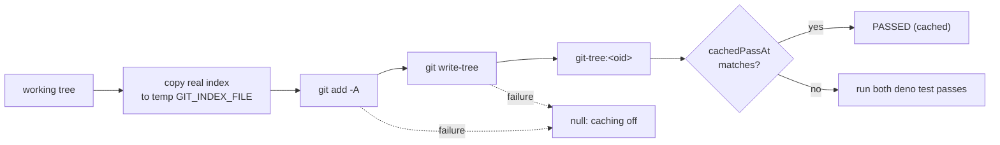

## Summary

The quality gate's `deno tests` cache is now keyed on the whole working tree
as git sees it, not only on the `.ts` files under `worker/deno`. A docs,
prompt, PR-summary, workflow, shell or container edit made after a cached PASS
now re-runs the suite instead of reusing a stale PASS that then fails in CI.
`deno check` is keyed on that working tree plus its existing `.ts` digest,
because it type-checks `tests/**`, which import `.ts` files outside
`worker/deno` (`.claude/skills/review-fleet-prs/scripts/*.ts`), and
`deno test` runs with `--no-check`. Closes #3392.

## Spec

### Intent and Rationale

- The unit suite reads `CODING-STANDARDS.md`, `docs/`, `prompts/`,
  `.github/workflows/` and container files, so a `.ts`-only key let a
  docs-only edit reuse a PASS that no longer held.
- A git tree id is a content digest of every file git would track. It
  costs one `add -A` plus one `write-tree`, which is cheaper than reading
  every file by hand.

### Essential Design Decisions

- Staging goes into a private copy of the index (`GIT_INDEX_FILE` in a
  `vibe_gate_index_` temp dir), so the real index is only read. The copy keeps
  the real index's mtime (`Deno.utime`), because `copyFile` stamps "now" and
  that switches off git's racy-clean check, so a same-size in-place edit in
  the index's own second would reuse a stale tree (PR #3522 review). The temp dir
  is removed in `finally`.
- The key fails closed. Any git failure, a missing `rev-parse` result, or an
  index copy error other than NotFound gives `null`, and caching is then off
  for the run. A fresh repo with no index starts from an empty one.
- The `git-tree:` prefix acts as the version bump for the persisted key. A
  bare sha-256 entry from the old scheme never matches it.
- git runs through `runGitCommand` (the spawn chokepoint from Issue #1214).
- `deno check` uses `denoCheckDigest`: `<git-tree>+<ts digest>`, and `null`
  (caching off) when either half is `null`. The tree half covers out-of-tree
  imports; the `.ts` half still covers ignored `.ts` files under `worker/deno`.
  A docs-only edit now also re-runs `deno check`; that costs a warm type
  check, and is the price of a key that cannot reuse a stale PASS.
- `computeWorkingTreeDigest` takes an optional `tempRoot` (production passes
  nothing), so the cleanup test owns the directory it inspects.

### Undiscoverable Facts

- In a linked worktree, `git rev-parse --git-path index` prints an absolute
  path, but in a normal checkout it prints a relative one. Both arms are
  handled and tested.
- `git add -A` also writes blob objects into the object store. That is
  additive only, and `git gc` prunes them.

## Evidence

This is a backend-only change, verified by unit tests in
`worker/deno/tests/quality_gate_cache_test.ts` and
`worker/deno/tests/quality_gate_test.ts`. No visual surface changed.

**Docs sweep** — grep: `computeQualityInputDigest`, `cached PASS`,
`quality_gate_cache`, `gate cache`, `cached — inputs`, `quality-gate-cache`,
`deno tests`, `Quality gate`; section: `docs/INTERNALS.md#quality-gate` — read
through, still true because it lists the gate's stages, the semgrep stage and
streamed progress and says nothing about the check cache or its key, so no
sentence in it is made false; updated: module doc and
doc comments in `worker/deno/lib/quality_gate_cache.ts`, the `runDenoTests`
doc comment and skip comment in `worker/deno/lib/quality_gate.ts`;
`worker/deno/lib/quality_gate_cache.ts:25-30` — still true because the module
doc now names what the key misses (ignored or excluded files, environment,
network, files outside the repo) and no longer claims a false skip is
impossible; the module doc bullet for `deno check` and the
`computeQualityInputDigest` doc comment were corrected to say it is only the
`.ts` half of the `deno check` key (the earlier "reads only those" was false);
`docs/INTERNALS.md:3541` — still true because it describes the separate
baseline cache (`baseline_quality_cache.ts`); `CODING-STANDARDS.md:831` — still
true because it only says which two passes the `deno tests` stage runs, which
this change leaves alone; `docs/audits/filesystem-path-temp-sweep-1215.md:300`
— still true because it only lists the file, and the new temp dir is made
with `Deno.makeTempDir` and removed in `finally`.

## Acceptance Criteria

<!-- vibe-spec-review inputs="diff+issue-body" -->

- **met** — "Editing only a `.md` file (for example a file under `docs/archive/pr-summaries/` or `prompts/`) after a cached PASS causes `deno tests` to run again rather than report a cached PASS." — evidence: `worker/deno/tests/quality_gate_test.ts::runDenoTests - reuses a cached PASS until a .md edit changes the working tree`; `worker/deno/tests/quality_gate_cache_test.ts::computeWorkingTreeDigest - editing only a .md busts a recorded PASS` — reviewer: met
- **met** — "Editing only a `.yml`, `.sh` or container file does the same." — evidence: `worker/deno/tests/quality_gate_cache_test.ts::computeWorkingTreeDigest - editing only a .yml, .sh or Dockerfile changes it` — reviewer: met
- **met** — "A tree with no changes since the last PASS still reuses the cache." — evidence: `worker/deno/tests/quality_gate_cache_test.ts::computeWorkingTreeDigest - unchanged tree is stable and a recorded PASS is reused`; the first call in the `runDenoTests` wiring test returns the cached PASS — reviewer: met
- **met** — "A test goes red if the digest is reverted to the `.ts`-only walk." — evidence: swapping `denoTestsDigest` back to `computeQualityInputDigest` turned `runDenoTests - reuses a cached PASS until a .md edit changes the working tree` and `denoTestsDigest - keys the whole working tree, so a docs-only edit busts the cache` red — reviewer: met
- **met** — "`deno check` also needs a wider key (review question)." — evidence: `worker/deno/tests/quality_gate_test.ts::runDenoCheck - editing a .ts outside worker/deno that a test imports busts the cached PASS (PR #3522 review)` — reviewer: met
- **met** — "The module doc no longer claims false skips are impossible unless the new key makes that true." — evidence: `worker/deno/lib/quality_gate_cache.ts:25-30` — reviewer: met
- **unrequested** — `runDenoTests` exported for tests — reviewer: unrequested — reason: the call-site rule requires a test through the production caller, not only through the helper

## Standards Review

<!-- vibe-standards-review inputs="diff+CODING-STANDARDS.md" -->

- **clean** — Areas checked:
  - git runs through the `runGitCommand` chokepoint.
  - Tests do not mutate `Deno.env` and do not `chdir`.
  - It fails loud: the catch warns and turns caching off, and only NotFound
    is tolerated on the index copy.
  - The temp dir is cleaned up in `finally`, and a test proves it.
  - The persisted key is bumped by its prefix, and an old-shape test covers
    it.
  - Spelling is Australian English.

  No assertions were removed from existing tests.

## Test Plan

- Added to `worker/deno/tests/quality_gate_cache_test.ts`:
  - `computeWorkingTreeDigest - unchanged tree is stable and a recorded PASS is reused`
  - `computeWorkingTreeDigest - a same-size in-place edit in the index's own second still changes it (racy-clean)`
  - `computeWorkingTreeDigest - editing only a .md busts a recorded PASS`
  - `computeWorkingTreeDigest - editing only a .yml, .sh or Dockerfile changes it`
  - `computeWorkingTreeDigest - untracked files count; ignored and excluded files do not`
  - `computeWorkingTreeDigest - never touches the real index`
  - `computeWorkingTreeDigest - a non-git directory is quietly null (caching off, no warning)`
  - `cachedPassAt - an old-shape bare sha-256 entry never matches a git-tree digest`
  - `computeWorkingTreeDigest - leaves nothing behind in the temp root it is given`
  - `computeWorkingTreeDigest - the temp root is honoured: an unusable one is null, not a silent fallback`
  - `computeWorkingTreeDigest - a failing git add (corrupt index) is null, not a digest`
  - `computeWorkingTreeDigest - an unreadable untracked file makes git add fail, so null`
    (skipped where mode 000 does not block reads, for example as root)
  - `computeWorkingTreeDigest - a failing git write-tree (missing blob) is null, not a digest`
  - `computeWorkingTreeDigest - a fresh repo with no index yet still digests its files`
  - `computeWorkingTreeDigest - a linked worktree uses its absolute index path and keeps force-tracked ignored files`
  - `computeWorkingTreeDigest - a non-NotFound index copy error is null, not an empty index`
- Added to `worker/deno/tests/quality_gate_test.ts`:
  - `denoTestsDigest - keys the whole working tree, so a docs-only edit busts the cache`
  - `runDenoTests - reuses a cached PASS until a .md edit changes the working tree`
  - `denoTestsDigest - null when no cache dir is set`
  - `denoCheckDigest - null when no cache dir is set, a tree+sources key when one is`
  - `runDenoCheck - editing a .ts outside worker/deno that a test imports busts the cached PASS (PR #3522 review)`
- Changed in `worker/deno/tests/quality_gate_test.ts`: the existing
  `runDenoCheck` cached-PASS test and the `runDenoCheck - a FAILED result is
  never cached` test now run in a `git init` directory, because the key
  includes the working tree (without a repo the key is null and caching is
  off, so the FAIL test could never fail). The FAIL test also asserts
  `denoCheckDigest(config) !== null`. Red check: recording a PASS regardless
  of exit code (and dropping `invalidate`) in `runDenoCheck` turned that test
  red; restored afterwards.
- No assertions were removed from existing tests.
- Targeted run: `deno task test:unit tests/quality_gate_cache_test.ts tests/quality_gate_test.ts`
  passed (61 tests) on the head.
- `./quality.sh < /dev/null` passed on the head with exit 0. Its result line
  was "PASSED (with skipped checks)", and the only skips were the ones the
  gate always makes in this environment.

**Persisted shape:** the key's version was bumped. The `git-tree:` prefix
means an entry from the old bare sha-256 scheme is never read as a match, so
the suite runs live. `cachedPassAt - an old-shape bare sha-256 entry never
matches a git-tree digest` seeds the old shape and asserts this.

**Callers and entry points checked:**

- `runDenoTests` has one production caller, the `mainChecks.push` in
  `worker/deno/lib/quality_gate.ts:1778`. The wiring test goes through
  `runDenoTests` itself.
- `denoTestsDigest` is called only from `runDenoTests`.
- `computeWorkingTreeDigest` is called only from `denoTestsDigest` and `denoCheckDigest`.
- `runDenoCheck` has one production caller, the `mainChecks.push` in
  `worker/deno/lib/quality_gate.ts:1780`, and calls `denoCheckDigest`
  (`quality_gate.ts:1496`); `denoCheckDigest` is called only from there. The
  new test goes through `runDenoCheck`.
- Temp dir seam: `computeWorkingTreeDigest`'s only production caller is
  `denoTestsDigest` and now also `denoCheckDigest`; neither passes `tempRoot`.

**Branch outcomes:**

- `worker/deno/lib/quality_gate.ts:1247` — no cache dir means `null`.
  Reached by `denoTestsDigest - null when no cache dir is set`, which uses a
  real git repo and has a positive control with a cache dir; flipping it to
  always digest went red.
- `worker/deno/lib/quality_gate.ts:1297` — the digest feeds the cache, so an
  unchanged tree gives a cached PASS and a `.md` edit re-runs the suite.
  Reached by `runDenoTests - reuses a cached PASS until a .md edit changes the working tree`;
  flipping to `computeQualityInputDigest` went red.
- `worker/deno/lib/quality_gate.ts:1267` — either half `null` gives `null`,
  otherwise `<tree>+<sources>`. Reached by
  `runDenoCheck - editing a .ts outside worker/deno that a test imports busts the cached PASS (PR #3522 review)`
  (and the existing cached-PASS test, in a `git init` directory); flipping the
  key to the `.ts` digest alone went red ("PASSED (cached …)" where `FAILED`
  was expected). `exempt (untestable)`: the `tree === null` and
  `sources === null` arms. `computeWorkingTreeDigest` returning `null` is
  tested below, and `computeQualityInputDigest` returns `null` only when the
  walk throws, which `walkTs` swallows, so no input reaches it.
- `worker/deno/lib/quality_gate.ts:1264` — no cache dir means `null` for the
  check digest. Reached by
  `denoCheckDigest - null when no cache dir is set, a tree+sources key when one is`
  (which also asserts the `git-tree:<oid>+<sha-256>` shape); removing the
  guard went red.
- `worker/deno/lib/quality_gate_cache.ts:167` — the optional `tempRoot` is
  honoured. Reached by
  `computeWorkingTreeDigest - the temp root is honoured: an unusable one is null, not a silent fallback`;
  dropping the spread went red.
- `worker/deno/lib/quality_gate_cache.ts:163` — an empty `rev-parse` result,
  or not a git repo, gives `null`. Reached by
  `computeWorkingTreeDigest - a non-git directory is quietly null (caching off, no warning)`,
  which also asserts no warning; deleting the guard went red (the fall-through
  throws and warns).
- `worker/deno/lib/quality_gate_cache.ts:164` — an absolute index path is
  used as is, and a relative one is joined to `repoRoot`. Reached by
  `computeWorkingTreeDigest - a linked worktree uses its absolute index path and keeps force-tracked ignored files`
  and the unchanged-tree test; always prefixing `repoRoot` went red.
- `worker/deno/lib/quality_gate_cache.ts:176` — the copy takes the real
  index's mtime. Reached by `computeWorkingTreeDigest - a same-size in-place edit in the index's own second still changes it (racy-clean)`;
  removing the `Deno.utime` line went red (digest unchanged). `exempt
  (untestable)`: the `st.mtime` null arm, since local filesystems always
  report an mtime.
- `worker/deno/lib/quality_gate_cache.ts:179` — NotFound starts an empty
  index, and any other copy error is rethrown, which gives `null`. Reached by
  `computeWorkingTreeDigest - a fresh repo with no index yet still digests its files`
  and `computeWorkingTreeDigest - a non-NotFound index copy error is null, not an empty index`;
  swallowing every error went red.
- `worker/deno/lib/quality_gate_cache.ts:182` — a failing `git add -A` gives
  `null`. Reached by
  `computeWorkingTreeDigest - an unreadable untracked file makes git add fail, so null`;
  ignoring the failure went red. The corrupt-index test is extra coverage
  only: it stays green under that flip, because `write-tree` fails too.
- `worker/deno/lib/quality_gate_cache.ts:183` — a failing `git write-tree`
  gives `null`. Reached by
  `computeWorkingTreeDigest - a failing git write-tree (missing blob) is null, not a digest`;
  ignoring the failure went red.
- `worker/deno/lib/quality_gate_cache.ts:186-190` — the catch warns and gives
  `null`. Reached by the non-NotFound copy-error test; going through the
  rethrow, it asserts `null`.
- `worker/deno/lib/quality_gate_cache.ts:191-197` — the `finally` removes the
  temp dir. Reached by `computeWorkingTreeDigest - leaves nothing behind in the temp root it is given`
  (a private temp root, on both the success and failure paths); dropping the
  remove went red.

🤖 Generated with [Claude Code](https://claude.com/claude-code)
