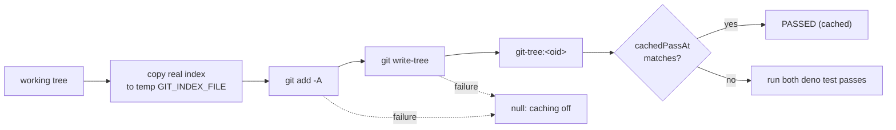

## Summary

The quality gate's `deno tests` cache is now keyed on the whole working tree
as git sees it, not only on the `.ts` files under `worker/deno`. A docs,
prompt, PR-summary, workflow, shell or container edit made after a cached PASS
now re-runs the suite instead of reusing a stale PASS that then fails in CI.
`deno check` keeps its `.ts`-only key, because `.ts` files are all it reads.
Closes #3392.

## Spec

### Intent and Rationale

- The unit suite reads `CODING-STANDARDS.md`, `docs/`, `prompts/`,
  `.github/workflows/` and container files, so a `.ts`-only key let a
  docs-only edit reuse a PASS that no longer held.
- A git tree id is a content digest of every file git would track. It
  costs one `add -A` plus one `write-tree`, which is cheaper than reading
  every file by hand.

### Essential Design Decisions

- Staging goes into a private copy of the index (`GIT_INDEX_FILE` in a
  `vibe_gate_index_` temp dir), so the real index is only read. The temp dir
  is removed in `finally`.
- The key fails closed. Any git failure, a missing `rev-parse` result, or an
  index copy error other than NotFound gives `null`, and caching is then off
  for the run. A fresh repo with no index starts from an empty one.
- The `git-tree:` prefix acts as the version bump for the persisted key. A
  bare sha-256 entry from the old scheme never matches it.
- git runs through `runGitCommand` (the spawn chokepoint from Issue #1214).

### Undiscoverable Facts

- In a linked worktree, `git rev-parse --git-path index` prints an absolute
  path, but in a normal checkout it prints a relative one. Both arms are
  handled and tested.
- `git add -A` also writes blob objects into the object store. That is
  additive only, and `git gc` prunes them.

## Evidence

This is a backend-only change, verified by unit tests in
`worker/deno/tests/quality_gate_cache_test.ts` and
`worker/deno/tests/quality_gate_test.ts`. No visual surface changed.

**Docs sweep** — grep: `computeQualityInputDigest`, `cached PASS`,
`quality_gate_cache`, `gate cache`, `cached — inputs`; updated: module doc and
doc comments in `worker/deno/lib/quality_gate_cache.ts`, the `runDenoTests`
doc comment and skip comment in `worker/deno/lib/quality_gate.ts`;
`worker/deno/lib/quality_gate_cache.ts:21-26` — still true because the module
doc now names what the key misses (ignored or excluded files, environment,
network, files outside the repo) and no longer claims a false skip is
impossible; `worker/deno/lib/quality_gate_cache.ts:78-85` — still true because
`computeQualityInputDigest` is now documented as the `deno check` key only;
`docs/INTERNALS.md:3541` — still true because it describes the separate
baseline cache (`baseline_quality_cache.ts`); `docs/audits/filesystem-path-temp-sweep-1215.md:300`
— still true because it only lists the file, and the new temp dir is made
with `Deno.makeTempDir` and removed in `finally`.

## Acceptance Criteria

<!-- vibe-spec-review inputs="diff+issue-body" -->

- **met** — "Editing only a `.md` file (for example a file under `docs/archive/pr-summaries/` or `prompts/`) after a cached PASS causes `deno tests` to run again rather than report a cached PASS." — evidence: `worker/deno/tests/quality_gate_test.ts::runDenoTests - reuses a cached PASS until a .md edit changes the working tree`; `worker/deno/tests/quality_gate_cache_test.ts::computeWorkingTreeDigest - editing only a .md busts a recorded PASS` — reviewer: met
- **met** — "Editing only a `.yml`, `.sh` or container file does the same." — evidence: `worker/deno/tests/quality_gate_cache_test.ts::computeWorkingTreeDigest - editing only a .yml, .sh or Dockerfile changes it` — reviewer: met
- **met** — "A tree with no changes since the last PASS still reuses the cache." — evidence: `worker/deno/tests/quality_gate_cache_test.ts::computeWorkingTreeDigest - unchanged tree is stable and a recorded PASS is reused`; the first call in the `runDenoTests` wiring test returns the cached PASS — reviewer: met
- **met** — "A test goes red if the digest is reverted to the `.ts`-only walk." — evidence: swapping `denoTestsDigest` back to `computeQualityInputDigest` turned `runDenoTests - reuses a cached PASS until a .md edit changes the working tree` and `denoTestsDigest - keys the whole working tree, so a docs-only edit busts the cache` red — reviewer: met
- **met** — "The module doc no longer claims false skips are impossible unless the new key makes that true." — evidence: `worker/deno/lib/quality_gate_cache.ts:21-26` — reviewer: met
- **unrequested** — `runDenoTests` exported for tests — reviewer: unrequested — reason: the call-site rule requires a test through the production caller, not only through the helper

## Standards Review

<!-- vibe-standards-review inputs="diff+CODING-STANDARDS.md" -->

- **clean** — Areas checked:
  - git runs through the `runGitCommand` chokepoint.
  - Tests do not mutate `Deno.env` and do not `chdir`.
  - It fails loud: the catch warns and turns caching off, and only NotFound
    is tolerated on the index copy.
  - The temp dir is cleaned up in `finally`, and a test proves it.
  - The persisted key is bumped by its prefix, and an old-shape test covers
    it.
  - Spelling is Australian English.

  No assertions were removed from existing tests.

## Test Plan

- Added to `worker/deno/tests/quality_gate_cache_test.ts`:
  - `computeWorkingTreeDigest - unchanged tree is stable and a recorded PASS is reused`
  - `computeWorkingTreeDigest - editing only a .md busts a recorded PASS`
  - `computeWorkingTreeDigest - editing only a .yml, .sh or Dockerfile changes it`
  - `computeWorkingTreeDigest - untracked files count; ignored and excluded files do not`
  - `computeWorkingTreeDigest - never touches the real index`
  - `computeWorkingTreeDigest - a non-git directory is quietly null (caching off, no warning)`
  - `cachedPassAt - an old-shape bare sha-256 entry never matches a git-tree digest`
  - `computeWorkingTreeDigest - leaves no vibe_gate_index_ temp dir behind`
  - `computeWorkingTreeDigest - a failing git add (corrupt index) is null, not a digest`
  - `computeWorkingTreeDigest - an unreadable untracked file makes git add fail, so null`
    (skipped where mode 000 does not block reads, for example as root)
  - `computeWorkingTreeDigest - a failing git write-tree (missing blob) is null, not a digest`
  - `computeWorkingTreeDigest - a fresh repo with no index yet still digests its files`
  - `computeWorkingTreeDigest - a linked worktree uses its absolute index path and keeps force-tracked ignored files`
  - `computeWorkingTreeDigest - a non-NotFound index copy error is null, not an empty index`
- Added to `worker/deno/tests/quality_gate_test.ts`:
  - `denoTestsDigest - keys the whole working tree, so a docs-only edit busts the cache`
  - `runDenoTests - reuses a cached PASS until a .md edit changes the working tree`
  - `denoTestsDigest - null when no cache dir is set`
- No assertions were removed from existing tests.
- Targeted run: `deno task test:unit tests/quality_gate_cache_test.ts tests/quality_gate_test.ts`
  passed (57 tests).
- `./quality.sh < /dev/null` passed on the head with exit 0. Its result line
  was "PASSED (with skipped checks)", and the only skips were the ones the
  gate always makes in this environment.

**Persisted shape:** the key's version was bumped. The `git-tree:` prefix
means an entry from the old bare sha-256 scheme is never read as a match, so
the suite runs live. `cachedPassAt - an old-shape bare sha-256 entry never
matches a git-tree digest` seeds the old shape and asserts this.

**Callers and entry points checked:**

- `runDenoTests` has one production caller, the `mainChecks.push` in
  `worker/deno/lib/quality_gate.ts:1762`. The wiring test goes through
  `runDenoTests` itself.
- `denoTestsDigest` is called only from `runDenoTests`.
- `computeWorkingTreeDigest` is called only from `denoTestsDigest`.
- `runDenoCheck` still uses `computeQualityInputDigest`, on purpose.

**Branch outcomes:**

- `worker/deno/lib/quality_gate.ts:1247-1249` — no cache dir means `null`.
  Reached by `denoTestsDigest - null when no cache dir is set`, which uses a
  real git repo and has a positive control with a cache dir; flipping it to
  always digest went red.
- `worker/deno/lib/quality_gate.ts:1279` — the digest feeds the cache, so an
  unchanged tree gives a cached PASS and a `.md` edit re-runs the suite.
  Reached by `runDenoTests - reuses a cached PASS until a .md edit changes the working tree`;
  flipping to `computeQualityInputDigest` went red.
- `worker/deno/lib/quality_gate_cache.ts:153` — an empty `rev-parse` result,
  or not a git repo, gives `null`. Reached by
  `computeWorkingTreeDigest - a non-git directory is quietly null (caching off, no warning)`,
  which also asserts no warning; deleting the guard went red (the fall-through
  throws and warns).
- `worker/deno/lib/quality_gate_cache.ts:154` — an absolute index path is
  used as is, and a relative one is joined to `repoRoot`. Reached by
  `computeWorkingTreeDigest - a linked worktree uses its absolute index path and keeps force-tracked ignored files`
  and the unchanged-tree test; always prefixing `repoRoot` went red.
- `worker/deno/lib/quality_gate_cache.ts:161` — NotFound starts an empty
  index, and any other copy error is rethrown, which gives `null`. Reached by
  `computeWorkingTreeDigest - a fresh repo with no index yet still digests its files`
  and `computeWorkingTreeDigest - a non-NotFound index copy error is null, not an empty index`;
  swallowing every error went red.
- `worker/deno/lib/quality_gate_cache.ts:164` — a failing `git add -A` gives
  `null`. Reached by
  `computeWorkingTreeDigest - an unreadable untracked file makes git add fail, so null`;
  ignoring the failure went red. The corrupt-index test is extra coverage
  only: it stays green under that flip, because `write-tree` fails too.
- `worker/deno/lib/quality_gate_cache.ts:166` — a failing `git write-tree`
  gives `null`. Reached by
  `computeWorkingTreeDigest - a failing git write-tree (missing blob) is null, not a digest`;
  ignoring the failure went red.
- `worker/deno/lib/quality_gate_cache.ts:168-172` — the catch warns and gives
  `null`. Reached by the non-NotFound copy-error test; going through the
  rethrow, it asserts `null`.
- `worker/deno/lib/quality_gate_cache.ts:173-179` — the `finally` removes the
  temp dir. Reached by `computeWorkingTreeDigest - leaves no vibe_gate_index_ temp dir behind`;
  dropping the remove went red.

🤖 Generated with [Claude Code](https://claude.com/claude-code)
