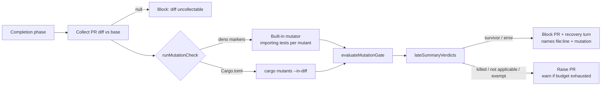

## Progress

- [x] Diff-scoped mutation core (`worker/deno/lib/mutation_gate.ts`)
- [x] Runners: built-in Deno mutator and `cargo mutants --in-diff` (`worker/deno/lib/mutation_runner.ts`)
- [x] Completion-phase wiring, budget config and per-repo opt-out
- [x] `cargo-mutants` added to the container toolchain
- [x] Tests, branch-outcome flips, docs
- [x] Spec and Standards reviews; `./quality.sh` passed

## Summary

The completion phase now runs a mutation check over the PR's **changed lines
only**, using a configurable time budget. A changed line whose mutant
survives (the tests stay green after the mutation) blocks the PR. The recovery
turn is told the `file:line` and the mutation that survived. Rust repos use
`cargo mutants --in-diff`. Deno repos use a built-in line mutator: it negates
`if` conditions and ternaries, swaps `true`/`false`, replaces return values
and deletes calls. Running out of budget is always reported and is never
described as a pass. Closes #3393.

## Spec

### Intent and Rationale

- Line coverage shows that a test ran a line, not that a test checks it. A
  changed condition that no test can tell apart from its negation is the
  untested branch that the "Every outcome of a branch you add needs a test"
  rule targets. Today that rule is enforced only by the agent's own flips.
  This gate checks it mechanically, and only on the diff, so the cost stays
  bounded.

### Essential Design Decisions

- **Diff-scoped.** `parseAddedLines` reads the unified diff. Only added lines
  are mutated, and test files are skipped.
- **Fail closed.** A runner error, a thrown exception, a failing baseline, an
  uncollectable diff or an unparseable `outcomes.json` all block the PR with a
  remedy. A runner that is not wired (no seam) is the only quiet pass.
- **Budget.** The default is 300 s with a global cap of 40 mutants, and
  `mutation_check_budget_seconds` is clamped to 3600 s. When the budget runs
  out, a survivor still blocks. With no survivor the PR is raised with a
  warning that the check was incomplete.
- **Per-repo opt-out.** `skip_mutation_check: true` never calls the runner.
  Individual survivors can be exempted with
  `` `path:line` exempt (untestable): <reason> `` in the PR summary, using the
  same wording as the branch-outcomes gate.
- **Late verdict.** The check runs as a `lateSummaryVerdicts` entry beside the
  docs-sweep, removed-assertion, placeholder, branch-outcomes and claim-check
  gates. A survivor is therefore folded into any earlier gate's block instead
  of being lost.
- **Path confinement.** Every mutated path is resolved fully before it is
  written: the repo-relative path is joined, `..` is normalised, and the
  longest existing prefix is canonicalised. Escapes through `..` or symlinks
  write nothing.

### Reviews

- Spec reviewer: AC1 to AC5 are all MET.
- Standards reviewer: no blocking departures. The minor notes are listed under
  Risks below.

## Acceptance Criteria

- [x] **AC1:** a surviving changed-condition mutant blocks the PR, and the
  recovery turn is told the line and the mutation.
  - Code: `evaluateMutationGate` (`worker/deno/lib/mutation_gate.ts:379`) and
    `buildMutationGateComment` (`worker/deno/lib/mutation_gate.ts:444`).
  - Tests:
    `worker/deno/tests/completion_phase_mutation_gate_test.ts::completion - a surviving mutant blocks the PR and names file:line and the mutation`
    and
    `worker/deno/tests/mutation_gate_test.ts::buildMutationGateComment - names each survivor and the remedy`.
- [x] **AC2:** Rust uses `cargo mutants --in-diff`
  (`worker/deno/lib/mutation_runner.ts:496`), and Deno uses the built-in
  mutator (`generateDenoMutants`, `worker/deno/lib/mutation_gate.ts:284`).
  `cargo-mutants` is installed by `container/toolchains/cargo-mutants.sh`.
- [x] **AC3:** only changed lines are checked, within a configurable budget,
  and running out of budget is reported.
  - Config: `parseAddedLines` (`worker/deno/lib/mutation_gate.ts:81`),
    `mutation_check_budget_seconds` (`worker/deno/lib/config.ts:201`) and
    `resolveMutationBudgetSeconds`
    (`worker/deno/lib/phases/completion_phase.ts:313`).
  - Tests:
    `worker/deno/tests/mutation_gate_test.ts::generateDenoMutants - only mutates added lines`
    and
    `worker/deno/tests/completion_phase_mutation_gate_test.ts::completion - budget exhausted with no survivor raises the PR and warns`.
- [x] **AC4:** there are tests for a surviving mutant, a killed mutant and
  budget exhaustion.
  - Deno runner:
    - `worker/deno/tests/mutation_runner_test.ts::runMutationCheck deno - mutants that leave tests green survive`
    - `worker/deno/tests/mutation_runner_test.ts::runMutationCheck deno - mutants that turn tests red are killed`
    - `worker/deno/tests/mutation_runner_test.ts::runMutationCheck deno - budget exhaustion is reported, not passed`
  - Rust runner:
    - `worker/deno/tests/mutation_runner_test.ts::runMutationCheck rust - a missed mutant is a survivor`
    - `worker/deno/tests/mutation_runner_test.ts::runMutationCheck rust - caught and timed-out mutants are killed`
    - `worker/deno/tests/mutation_runner_test.ts::runMutationCheck rust - a timed-out run is budget exhausted with partial outcomes`
- [x] **AC5:** the docs describe the check and how to configure or disable it
  per repo.
  - New manual: `docs/mutation-check.md`.
  - `skip_mutation_check` and `mutation_check_budget_seconds` rows:
    `docs/CONFIGURATION.md:4466-4467`.
  - Docs table row: `README.md:519`.

## Evidence

Backend-only change: no UI files are touched.

- The new suites pass:
  - `worker/deno/tests/mutation_gate_test.ts`
  - `worker/deno/tests/mutation_runner_test.ts`
  - `worker/deno/tests/completion_phase_mutation_gate_test.ts`
- These existing suites were extended and pass:
  - `worker/deno/tests/config_test.ts`
  - `worker/deno/tests/container_manifest_test.ts`
  - `worker/deno/tests/toolchain_selfcheck_test.ts`
- `worker/deno/tests/mutation_runner_test.ts` is registered in
  `worker/deno/lib/parallel_unsafe_test_manifest.ts`, because it writes into
  temporary repos.
- Regex hostile cases: one per pattern, covering diff parsing, mutant
  generation and exemption parsing (the `hostile -` tests in
  `worker/deno/tests/mutation_gate_test.ts`).
- Path confinement has negative tests:
  - `..` traversal.
  - `missing/../link/file.ts` through an escaping symlink.
  - A symlinked directory.
  - A symlinked file.
  - A Rust target symlink.

  These are the `confinement` tests in
  `worker/deno/tests/mutation_runner_test.ts`.

**Docs sweep** — grep: `mutation`, `skip_mutation_check`, `exempt \(untestable\)`, `lateSummaryVerdicts`; section: `docs/mutation-check.md`, `docs/CONFIGURATION.md`; updated: `README.md`, `docs/CONFIGURATION.md`, `docs/CONTAINER.md`, `docs/mutation-check.md`, `docs/audits/dependency-inventory.md`, `CODING-STANDARDS.md`, `prompts/coding_guidelines/prompt.md`, `prompts/issue/prompt.md`

**Related rules I checked:**

- `CODING-STANDARDS.md`, "Every outcome of a branch you add needs a test that
  reaches it", and its mirror in `prompts/coding_guidelines/prompt.md`.
- The #3288 branch-outcomes gate's `exempt (untestable): <reason>` wording.

The new sentence on the diff-scoped mutation check is written to agree with
both, and it reuses the same exemption syntax.

**Rule applied to this PR's own diff:** each new branch in this diff was
flipped and went red (see Branch outcomes below). No surviving untested
branch was found.

**Deno regression avoided:** the built-in mutator runs on `deno test`. No
Node mutation tool (Stryker) or `package.json` was introduced.

## Risks

- **arm64 install.** The `cargo-mutants` release tarball is amd64-only, so
  arm64 images install it with `cargo install`.
- **Unverified output shape.** The `mutants.out/outcomes.json` shape is taken
  from cargo-mutants' docs and has not been checked against a real run in this
  container. An unparseable file fails closed.
- **Direct importers only.** Deno test selection counts only tests that import
  the mutated module directly. A module covered only through another module
  shows every mutant as surviving, which errs toward blocking.
- **Dangling symlink.** A dangling symlink at the Rust diff path is not
  caught.
- **Broad catch.** `confinePath`'s walk-up has a broad `catch {}` when probing
  missing prefixes.
- **Unconfined delete.** The `removeDir` of `mutants.out` is not run through
  `confinePath`.
- **Stale doc comment.** The `foldInLateSummaryVerdicts` doc comment does not
  yet list the mutation check among the late verdicts.

## Security self-check

- [x] Input validation: diff text and the exemption lines are parsed with
  bounded, linear regexes, each with a hostile case.
- [x] Secrets: no hidden or credential files are staged.
- [x] Injection surface: `deno` and `cargo` are spawned with argv arrays. No
  shell string is built.
- [x] Output encoding: survivor text is sanitised (backticks and newlines)
  before it goes into the PR comment or prompt.
- [x] Authorisation: no new endpoints are added.
- [x] Error handling: runner failures are reported as remedies, not as stack
  traces.
- [x] Dependencies: `cargo-mutants` is pinned in `container/tools.json` and
  recorded in `docs/audits/dependency-inventory.md`.
- [x] Path confinement: paths are resolved fully, then checked. There are
  negative `..` and symlink tests, including the combined case.

## Standards Review

No blocking departures. The minor items are listed under Risks.

## Test Plan

- I ran the targeted suites above with `deno task test:unit`, plus
  `deno fmt --check`, `deno lint` and `deno check`.
- `./quality.sh < /dev/null`: `Result: PASSED (with skipped checks)`. The only
  skip is config integration ("deno or .config.json not available"), because
  this container has no `.config.json`.

Branch outcomes:

- `worker/deno/lib/mutation_gate.ts:383` not applicable → pass and explain → `worker/deno/tests/mutation_gate_test.ts::evaluateMutationGate - not applicable passes and explains`; flipped → red
- `worker/deno/lib/mutation_gate.ts:393` error → fail closed → `worker/deno/tests/mutation_gate_test.ts::evaluateMutationGate - error fails closed with a remedy`; flipped → red
- `worker/deno/lib/mutation_gate.ts:411` exempt vs blocking split → `worker/deno/tests/mutation_gate_test.ts::evaluateMutationGate - surviving mutant blocks`; flipped → red
- `worker/deno/lib/mutation_gate.ts:413` budget exhausted → `worker/deno/tests/mutation_gate_test.ts::evaluateMutationGate - budget exhausted with a survivor blocks`; flipped → red
- `worker/deno/lib/mutation_gate.ts:417` survivors > 0 → block → `worker/deno/tests/mutation_gate_test.ts::evaluateMutationGate - surviving mutant blocks`; flipped → red
- `worker/deno/lib/mutation_runner.ts:318` deno budget exhausted → `worker/deno/tests/mutation_runner_test.ts::runMutationCheck deno - a timed-out mutant run counts as budget exhausted`; flipped → red
- `worker/deno/lib/mutation_runner.ts:292` failing baseline → error → `worker/deno/tests/mutation_runner_test.ts::runMutationCheck deno - failing baseline is an error and nothing is mutated`; flipped → red
- `worker/deno/lib/mutation_runner.ts:320` red tests → killed, green → survived → `worker/deno/tests/mutation_runner_test.ts::runMutationCheck deno - mutants that leave tests green survive`; flipped → red
- `worker/deno/lib/mutation_runner.ts:505` cargo-mutants missing → error → `worker/deno/tests/mutation_runner_test.ts::runMutationCheck rust - missing cargo-mutants is an error`; flipped → red
- `worker/deno/lib/mutation_runner.ts:511` unexpected exit code → error → `worker/deno/tests/mutation_runner_test.ts::runMutationCheck rust - baseline failure and usage errors are errors`; flipped → red
- `worker/deno/lib/mutation_runner.ts:527` timeout with no outcomes → fail closed → `worker/deno/tests/mutation_runner_test.ts::runMutationCheck rust - a timeout with no outcomes fails closed`; flipped → red
- `worker/deno/lib/mutation_runner.ts:383` Timeout/CaughtMutant → killed → `worker/deno/tests/mutation_runner_test.ts::runMutationCheck rust - caught and timed-out mutants are killed`; flipped → red
- `worker/deno/lib/mutation_runner.ts:388` MissedMutant → survivor → `worker/deno/tests/mutation_runner_test.ts::runMutationCheck rust - a missed mutant is a survivor`; flipped → red
- `worker/deno/lib/phases/completion_phase.ts:2736` skip_mutation_check → runner not called → `worker/deno/tests/completion_phase_mutation_gate_test.ts::completion - skip_mutation_check never calls the runner`; flipped → red
- `worker/deno/lib/phases/completion_phase.ts:2743` unwired runner → no block → `worker/deno/tests/completion_phase_mutation_gate_test.ts::completion - an unwired runner does not block`; flipped → red
- `worker/deno/lib/phases/completion_phase.ts:2769` null diff → block → `worker/deno/tests/completion_phase_mutation_gate_test.ts::completion - an uncollectable PR diff blocks the PR and the runner is not called`; flipped → red
- `worker/deno/lib/phases/completion_phase.ts:2781` runner throws → block → `worker/deno/tests/completion_phase_mutation_gate_test.ts::completion - a throwing runner blocks the PR (fail closed)`; flipped → red
- `worker/deno/lib/phases/completion_phase.ts:2792` budget exhausted, no survivor → warn and raise → `worker/deno/tests/completion_phase_mutation_gate_test.ts::completion - budget exhausted with no survivor raises the PR and warns`; flipped → red
- `worker/deno/lib/phases/completion_phase.ts:2814` mutation verdict in lateSummaryVerdicts → `worker/deno/tests/completion_phase_mutation_gate_test.ts::completion - a mutation survivor is folded into an earlier gate's block`; flipped → red

🤖 Generated with [Claude Code](https://claude.com/claude-code)
