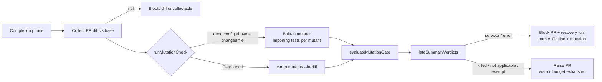

## Progress

- [x] Diff-scoped mutation core (`worker/deno/lib/mutation_gate.ts`)
- [x] Runners: built-in Deno mutator and `cargo mutants --in-diff` (`worker/deno/lib/mutation_runner.ts`)
- [x] Completion-phase wiring, budget config and per-repo opt-out
- [x] `cargo-mutants` added to the container toolchain
- [x] Tests, branch-outcome flips, docs
- [x] Spec and Standards reviews
- [x] PR #3533 review: child env allowlist, nested `deno.json`, `--no-check`,
  mutation-aware recovery prompt, `--output` for `mutants.out`, capped runs
  reported; second round: Rust budget exhaustion reported as `budget_exhausted`,
  unviable parse-failed mutants, `quality_credentials` reaching the mutation
  child
- [ ] `./quality.sh` on the final head: skipped in this run (see Test Plan); CI runs it

## Summary

The completion phase now runs a mutation check over the PR's **changed lines
only**, using a configurable time budget. A changed line whose mutant
survives (the tests stay green after the mutation) blocks the PR. The recovery
turn is told the `file:line` and the mutation that survived. Rust repos use
`cargo mutants --in-diff`. Deno repos use a built-in line mutator: it negates
`if` conditions and ternaries (the whole condition), swaps `true`/`false`,
replaces return values and deletes calls. A Deno project is the nearest
ancestor `deno.json`/`deno.jsonc`/`deno.lock` of a changed file (so
`worker/deno/` counts) and its tests run from that directory with
`--no-check`. Running out of budget, hitting the mutant cap, or skipping an
over-long line is always reported and is never described as a pass. A
blocked mutation item makes the recovery prompt allow test changes. Closes
#3393.

## Spec

### Intent and Rationale

- Line coverage shows that a test ran a line, not that a test checks it. A
  changed condition that no test can tell apart from its negation is the
  untested branch that the "Every outcome of a branch you add needs a test"
  rule targets. Today that rule is enforced only by the agent's own flips.
  This gate checks it mechanically, and only on the diff, so the cost stays
  bounded.

### Essential Design Decisions

- **Diff-scoped.** `parseAddedLines` reads the unified diff. Only added lines
  are mutated, and test files are skipped.
- **Fail closed.** A runner error, a thrown exception, a failing baseline, an
  uncollectable diff or an unparseable `outcomes.json` after a normal exit all
  block the PR with a remedy. A Rust run killed at the budget before
  cargo-mutants wrote any outcomes (its clean build and baseline test run
  come first) is `budget_exhausted` with nothing tried, a warning, as a
  Deno baseline timeout is. Quiet outcomes are a runner that is not wired (no seam), and a failed `quality_credentials` mint, which is `not_applicable` with a warning and no block.
- **Budget and cap.** The default is 300 s (`DEFAULT_MUTATION_BUDGET_SECONDS`).
  The built-in Deno mutator also stops at 40 mutants per run
  (`DEFAULT_MUTANT_CAP`); candidates past the cap and added lines over 400
  characters are counted (`generateDenoMutantsDetailed().dropped`) and a run
  that dropped any is `budget_exhausted` with `limit: "mutant_cap"`, never
  `completed`. `resolveMutationBudgetSeconds` accepts a
  `mutation_check_budget_seconds` value only if it is a positive integer no
  greater than 3600 (`MAX_MUTATION_BUDGET_SECONDS`). Any other value is
  refused with a warning and the 300 s default is used. When the budget runs
  out, a survivor still blocks. With no survivor the PR is raised with a
  warning that the check was incomplete.
- **Per-repo opt-out.** `skip_mutation_check: true` never calls the runner.
  Individual survivors can be exempted with
  `` `path:line` exempt (untestable): <reason> `` in the PR summary, using the
  same wording as the branch-outcomes gate.
- **Late verdict.** The check runs as a `lateSummaryVerdicts` entry beside the
  docs-sweep, removed-assertion, placeholder, branch-outcomes and claim-check
  gates. A survivor is therefore folded into any earlier gate's block instead
  of being lost.
- **Child environment.** `defaultMutationRunnerSeams().runProcess` spawns with
  `buildUntrustedCommandEnv()` and `clearEnv: true` (Issue #572, the control
  every other repository-code spawn uses), so tests and cargo build scripts
  cannot read `GH_TOKEN` or `CLAUDE_CODE_OAUTH_TOKEN`. The credentials the
  repository declared in `quality_credentials` (Issues #573, #574) are
  resolved once in the completion phase with `resolveRepoCredentials`, passed
  as `credentialEnv` and applied as `overrides`, as the quality gate does. A
  failed mint makes the check `not_applicable` with a warning rather than
  running the tests without them.
- **Nested projects.** `findDenoConfigDir` walks from a changed file up to the
  root for a Deno marker; tests inside that directory run with it as `cwd`.
- **No type-check in mutants.** `deno test --no-check`: a mutant that fails
  type-checking (`return undefined;` in a `: boolean` function) no longer
  reads as a killed mutant. A mutant the parser rejects (`error: SyntaxError:`
  on stderr, `isParseFailure`) is
  unviable: neither killed nor a survivor. `negateTernary` also declines a
  condition holding a statement keyword or an unbalanced bracket
  (`if (c) return a ? b : c;`).
- **`mutants.out` stays out of the tree.** `cargo mutants --output <temp dir>`;
  the directory is removed in a `finally`, so the recovery commit's
  `git add -A` cannot stage it.
- **Recovery prompt.** `SummaryRuleRunVerdict.allowsTestChanges` (set by
  `foldInLateSummaryVerdicts` when a blocked verdict is the mutation check)
  swaps step 2 of `buildSummaryRuleRetryPrompt` for one that allows adding
  tests and reserves `exempt (untestable)` for lines no test can reach.
- **Path confinement.** Every mutated path is resolved fully before it is
  written: the repo-relative path is joined, `..` is normalised, and the
  longest existing prefix is canonicalised. Escapes through `..` or symlinks
  write nothing.

### Reviews

- Spec reviewer: AC1, AC2 and AC4 are met. AC3 and AC5 carry a `partial`
  verdict that predates this push; the gaps it named are closed at this head
  (see Acceptance Criteria).
- Standards reviewer: reported departures, some fixed in this diff and some
  still open. Each item under Standards Review below states which.

## Evidence

Backend-only change: no UI files are touched.

- The new suites pass:
  - `worker/deno/tests/mutation_gate_test.ts`
  - `worker/deno/tests/mutation_runner_test.ts`
  - `worker/deno/tests/completion_phase_mutation_gate_test.ts`
- These existing suites were extended and pass:
  - `worker/deno/tests/config_test.ts`
  - `worker/deno/tests/container_manifest_test.ts`
  - `worker/deno/tests/toolchain_selfcheck_test.ts`
- `worker/deno/tests/mutation_runner_test.ts` is registered in
  `worker/deno/lib/parallel_unsafe_test_manifest.ts`, because it writes into
  temporary repos.
- PR #3533 review additions, each shown red with its fix reverted:
  child environment (`clearEnv`), `--no-check`, `--output` and its cleanup,
  nested `deno.json`, the capped and over-long-line runs, whole-condition
  ternary negation, the mutation-aware retry prompt (unit and through
  `workOnIssueCompletion`, including a survivor folded into another gate's
  block), and the logged not-applicable and capped notes. Second round: the Rust
  timeout-before-outcomes budget-exhausted run, the parse-failure unviable
  mutant, the ternary after a statement keyword, and the declared credentials
  (Deno and Rust runners, `defaultMutationRunnerSeams`, and the completion
  phase).
- Issue numbers cited as provenance in this push: #572: "Credentials are in
  the environment when third-party code runs: a build, test or install hook
  from a public repo inherits every token"; #3393: this PR's issue.
- Regex hostile cases: one per pattern, covering diff parsing, mutant
  generation and exemption parsing (the `hostile -` tests in
  `worker/deno/tests/mutation_gate_test.ts`).
- Path confinement has negative tests:
  - `..` traversal.
  - `missing/../link/file.ts` through an escaping symlink.
  - A symlinked directory.
  - A symlinked file.
  - A Rust target symlink.

  These are the `confinement` tests in
  `worker/deno/tests/mutation_runner_test.ts`.

**Docs sweep** — grep: `mutation`, `skip_mutation_check`, `exempt \(untestable\)`, `lateSummaryVerdicts`; section: `docs/mutation-check.md`, `docs/CONFIGURATION.md`; updated: `README.md`, `docs/CONFIGURATION.md` (the `quality_credentials` section now names the mutation check), `docs/CONTAINER.md`, `docs/mutation-check.md`, `docs/audits/dependency-inventory.md`, `CODING-STANDARDS.md`, `prompts/coding_guidelines/prompt.md`, `prompts/issue/prompt.md`

**Related rules I checked:**

- `CODING-STANDARDS.md`, "Every outcome of a branch you add needs a test that
  reaches it", and its mirror in `prompts/coding_guidelines/prompt.md`.
- The #3288 branch-outcomes gate's `exempt (untestable): <reason>` wording.

The new sentence on the diff-scoped mutation check is written to agree with
both, and it reuses the same exemption syntax.

**Rule applied to this PR's own diff:** each new branch the Branch outcomes
below names was flipped and went red. Two branches are still unreached by a
test (the cargo 'no mutants' arm and the unknown-summary `continue`); they
are recorded as open under Standards Review.

**Deno regression avoided:** the built-in mutator runs on `deno test`. No
Node mutation tool (Stryker) or `package.json` was introduced.

## Risks

- **arm64 install.** The `cargo-mutants` release tarball is amd64-only, so
  arm64 images install it with `cargo install`.
- **Unverified output shape.** The `mutants.out/outcomes.json` shape is taken
  from cargo-mutants' docs and has not been checked against a real run in this
  container. An unparseable file fails closed.
- **Direct importers only.** Deno test selection counts only tests that import
  the mutated module directly. A module covered only through another module
  shows every mutant as surviving, which errs toward blocking.
- **Dangling symlink.** A dangling symlink at the Rust diff path is not
  caught.
- **Broad catch.** `confinePath`'s walk-up has a broad `catch {}` when probing
  missing prefixes.
- **Unconfined delete.** The `removeDir` of the `--output` temporary directory
  is not run through `confinePath`; it is a path the runner created itself
  with `Deno.makeTempDir`, outside the repository.

## Security self-check

- [x] Input validation: diff text and the exemption lines are parsed with
  bounded, linear regexes, each with a hostile case.
- [x] Secrets: no hidden or credential files are staged.
- [x] Injection surface: `deno` and `cargo` are spawned with argv arrays. No
  shell string is built.
- [x] Output encoding: survivor text is sanitised (backticks and newlines)
  before it goes into the PR comment or prompt.
- [x] Authorisation: no new endpoints are added.
- [x] Error handling: runner failures are reported as remedies, not as stack
  traces.
- [x] Dependencies: `cargo-mutants` is pinned in `container/tools.json` and
  recorded in `docs/audits/dependency-inventory.md`.
- [x] Path confinement: paths are resolved fully, then checked. There are
  negative `..` and symlink tests, including the combined case.

## Test Plan

- On the final head I ran `deno fmt --check`, `deno lint` and `deno check`
  on the changed files and `deno task test:unit` over the mutation suites, the
  summary-rule retry suite, the untrusted-environment suite and every
  `completion_phase_*` suite: 317 passed in the parallel pass and 48 in the
  serial pass, none failed.
- Each new test was shown red with only its change reverted (see Branch
  outcomes).
- `./quality.sh` was not run on this head: the gate takes about 15 minutes and
  this run's foreground command cap is 10. CI and the worker's pre-PR gate run
  it.
  <!-- vibe-quality-gate-skipped reason="gate needs about 15 minutes; the run's foreground command cap is 10 minutes" -->

Branch outcomes:

- `worker/deno/lib/mutation_gate.ts:510` not applicable → pass and explain → `worker/deno/tests/mutation_gate_test.ts::evaluateMutationGate - not applicable passes and explains`; flipped → red
- `worker/deno/lib/mutation_gate.ts:520` error → fail closed → `worker/deno/tests/mutation_gate_test.ts::evaluateMutationGate - error fails closed with a remedy`; flipped → red
- `worker/deno/lib/mutation_gate.ts:535` exempt vs blocking split → `worker/deno/tests/mutation_gate_test.ts::evaluateMutationGate - surviving mutant blocks`; flipped → red
- `worker/deno/lib/mutation_gate.ts:540` budget exhausted → `worker/deno/tests/mutation_gate_test.ts::evaluateMutationGate - budget exhausted with a survivor blocks`; flipped → red
- `worker/deno/lib/mutation_gate.ts:542` mutant cap note with the untested count → `worker/deno/tests/mutation_gate_test.ts::evaluateMutationGate - a capped run is flagged with its untested count, never described as passed`; flipped → red
- `worker/deno/lib/mutation_gate.ts:548` survivors > 0 → block → `worker/deno/tests/mutation_gate_test.ts::evaluateMutationGate - surviving mutant blocks`; flipped → red
- `worker/deno/lib/mutation_gate.ts:416` over-long added line counted as dropped → `worker/deno/tests/mutation_gate_test.ts::generateDenoMutantsDetailed - counts the candidates the cap and the line limit drop`; flipped → red
- `worker/deno/lib/mutation_gate.ts:442` candidate past the cap counted as dropped → `worker/deno/tests/mutation_gate_test.ts::generateDenoMutantsDetailed - counts the candidates the cap and the line limit drop`; flipped → red
- `worker/deno/lib/mutation_gate.ts:262` ternary condition spans the whole expression, stopping at an unmatched bracket → `worker/deno/tests/mutation_gate_test.ts::generateDenoMutants - a ternary mutant negates the whole condition, not its last operand`; flipped → red
- `worker/deno/lib/mutation_runner.ts:309` no Deno config above a changed file → module skipped → `worker/deno/tests/mutation_runner_test.ts::runMutationCheck deno - a changed file with no deno config above it is skipped, one with a config is mutated`; flipped → red
- `worker/deno/lib/mutation_runner.ts:343` no mutants and nothing dropped → not applicable → `worker/deno/tests/mutation_runner_test.ts::runMutationCheck deno - added lines with nothing to mutate are not applicable`; flipped → red
- `worker/deno/lib/mutation_runner.ts:417` failing baseline → error → `worker/deno/tests/mutation_runner_test.ts::runMutationCheck deno - failing baseline is an error and nothing is mutated`; flipped → red
- `worker/deno/lib/mutation_runner.ts:444` deno budget exhausted → `worker/deno/tests/mutation_runner_test.ts::runMutationCheck deno - a timed-out mutant run counts as budget exhausted`; flipped → red
- `worker/deno/lib/mutation_runner.ts:449` red tests → killed, green → survived → `worker/deno/tests/mutation_runner_test.ts::runMutationCheck deno - mutants that leave tests green survive`; flipped → red
- `worker/deno/lib/mutation_runner.ts:459` candidates dropped → capped, not completed → `worker/deno/tests/mutation_runner_test.ts::runMutationCheck deno - the mutant cap is global and a capped run is not a pass`; flipped → red
- `worker/deno/lib/mutation_runner.ts:625` temporary `--output` directory removed on every path → `worker/deno/tests/mutation_runner_test.ts::runMutationCheck rust - mutants.out lands outside the repo and is removed`; flipped → red
- `worker/deno/lib/mutation_runner.ts:514` Timeout/CaughtMutant → killed → `worker/deno/tests/mutation_runner_test.ts::runMutationCheck rust - caught and timed-out mutants are killed`; flipped → red
- `worker/deno/lib/mutation_runner.ts:519` MissedMutant → survivor → `worker/deno/tests/mutation_runner_test.ts::runMutationCheck rust - a missed mutant is a survivor`; flipped → red
- `worker/deno/lib/mutation_runner.ts:664` cargo-mutants missing → error → `worker/deno/tests/mutation_runner_test.ts::runMutationCheck rust - missing cargo-mutants is an error`; flipped → red
- `worker/deno/lib/mutation_runner.ts:668` unexpected exit code → error → `worker/deno/tests/mutation_runner_test.ts::runMutationCheck rust - baseline failure and usage errors are errors`; flipped → red
- `worker/deno/lib/mutation_runner.ts:682` exit 3 with no parseable outcomes → error (still fail closed) → `worker/deno/tests/mutation_runner_test.ts::runMutationCheck rust - exit 3 (mutant timeouts) with no outcomes still fails closed`; flipped → red
- `worker/deno/lib/mutation_runner.ts:684` killed at the budget with no outcomes → budget exhausted, not an error → `worker/deno/tests/mutation_runner_test.ts::runMutationCheck rust - a timeout before any outcomes is budget exhausted, not an error`; flipped → red
- `worker/deno/lib/mutation_runner.ts:448` a mutant the parser rejects → unviable, not killed → `worker/deno/tests/mutation_runner_test.ts::runMutationCheck deno - a mutant the parser rejects is unviable, not killed`; flipped → red
- `worker/deno/lib/mutation_runner.ts:449` a SyntaxError thrown inside a running test → still killed → `worker/deno/tests/mutation_runner_test.ts::runMutationCheck deno - a SyntaxError thrown inside a test still kills the mutant`; flipped (`isParseFailure` made to match `SyntaxError` anywhere in stdout or stderr) → red
- `worker/deno/lib/mutation_runner.ts:401` declared credentials passed to every deno child → `worker/deno/tests/mutation_runner_test.ts::runMutationCheck deno - the declared credentials reach every deno child`; flipped → red
- `worker/deno/lib/mutation_runner.ts:656` declared credentials passed to cargo → `worker/deno/tests/mutation_runner_test.ts::runMutationCheck rust - the declared credentials reach cargo`; flipped → red
- `worker/deno/lib/mutation_runner.ts:783` declared credentials applied as overrides, undeclared absent → `worker/deno/tests/mutation_runner_test.ts::defaultMutationRunnerSeams runProcess - a declared credential reaches the child and an undeclared one does not`; flipped → red
- `worker/deno/lib/phases/completion_phase.ts:2809` resolved credentials handed to the runner → `worker/deno/tests/completion_phase_mutation_gate_test.ts::completion - a declared quality credential reaches the mutation runner and an undeclared one does not`; flipped → red
- `worker/deno/lib/phases/completion_phase.ts:2793` failed credential mint → not applicable with a warning, runner not called → `worker/deno/tests/completion_phase_mutation_gate_test.ts::completion - a failed credential mint is not applicable with a warning, never a run without them`; flipped → red
- `worker/deno/lib/mutation_gate.ts:327` ternary condition holding a statement keyword or unbalanced bracket → no ternary mutant → `worker/deno/tests/mutation_gate_test.ts::generateDenoMutants - a ternary after a statement keyword is not negated into unparseable code`; flipped → red
- `worker/deno/lib/mutation_runner.ts:783` child starts from the allowlisted environment (declared credentials are the only additions) → `worker/deno/tests/mutation_runner_test.ts::defaultMutationRunnerSeams runProcess - the child gets the allowlisted environment, not the worker's`; flipped → red
- `worker/deno/lib/summary_rule_gate_retry.ts:202` `allowsTestChanges` → test-allowing step 2, else documentation-only → `worker/deno/tests/summary_rule_gate_retry_test.ts::summary-rule retry - a mutation-check item allows test changes; other items stay documentation-only`; flipped → red
- `worker/deno/lib/phases/completion_phase.ts:2879` a folded mutation verdict sets `allowsTestChanges` → `worker/deno/tests/completion_phase_mutation_gate_test.ts::completion - a survivor folded into another gate's block still lets the recovery turn change tests`; flipped → red
- `worker/deno/lib/phases/completion_phase.ts:2825` non-exhausted note (not applicable, N of M killed) logged → `worker/deno/tests/completion_phase_mutation_gate_test.ts::completion - a not-applicable mutation check is logged with its reason`; flipped → red
- `worker/deno/lib/phases/completion_phase.ts:2746` skip_mutation_check → runner not called → `worker/deno/tests/completion_phase_mutation_gate_test.ts::completion - skip_mutation_check never calls the runner`; flipped → red
- `worker/deno/lib/phases/completion_phase.ts:2753` unwired runner → no block → `worker/deno/tests/completion_phase_mutation_gate_test.ts::completion - an unwired runner does not block`; flipped → red
- `worker/deno/lib/phases/completion_phase.ts:2779` null diff → block → `worker/deno/tests/completion_phase_mutation_gate_test.ts::completion - an uncollectable PR diff blocks the PR and the runner is not called`; flipped → red
- `worker/deno/lib/phases/completion_phase.ts:2814` runner throws → block → `worker/deno/tests/completion_phase_mutation_gate_test.ts::completion - a throwing runner blocks the PR (fail closed)`; flipped → red
- `worker/deno/lib/phases/completion_phase.ts:2823` budget exhausted or capped, no survivor → warn and raise → `worker/deno/tests/completion_phase_mutation_gate_test.ts::completion - a capped mutation run warns that mutants were left untested`; flipped → red
- `worker/deno/lib/phases/completion_phase.ts:2855` mutation verdict in lateSummaryVerdicts → `worker/deno/tests/completion_phase_mutation_gate_test.ts::completion - a mutation survivor is folded into an earlier gate's block`; flipped → red

🤖 Generated with [Claude Code](https://claude.com/claude-code)

## Acceptance Criteria

<!-- vibe-spec-review inputs="diff+issue-body" -->

- **met** — A PR whose changed condition can be flipped without any test going red is blocked before the PR is raised, and the recovery turn is told which line and mutation survived. — evidence: `worker/deno/tests/completion phase mutation gate test.ts::completion - a surviving mutant blocks the PR and names file:line and the mutation` — reviewer: met
- **met** — Rust target repos use cargo mutants --in-diff . Deno target repos use the built-in mutator. — evidence: `worker/deno/lib/mutation runner.ts:613; worker/deno/tests/mutation runner test.ts::runMutationCheck rust - a missed mutant is a survivor; worker/deno/tests/mutation runner test.ts::runMutationCheck deno - mutants that leave tests green survive` — reviewer: met
- **met** — The check runs only on changed lines, within a configurable time budget, and reports when the budget ran out. — evidence: `worker/deno/tests/mutation_gate_test.ts::generateDenoMutants - only mutates added lines; worker/deno/tests/completion_phase_mutation_gate_test.ts::completion - mutation_check_budget_seconds overrides the budget; worker/deno/tests/mutation_runner_test.ts::runMutationCheck deno - budget exhaustion is reported, not passed; worker/deno/tests/mutation_runner_test.ts::runMutationCheck deno - the mutant cap is global and a capped run is not a pass` — reviewer: partial — reason: the gap the reviewer named (changed lines past the 40-mutant cap or over 400 characters unreported) is closed in this head by the capped-run and over-long-line tests; the verdict predates that fix
- **met** — Tests cover a surviving mutant, a killed mutant and budget exhaustion. — evidence: `worker/deno/tests/mutation runner test.ts::runMutationCheck deno - mutants that leave tests green survive; ::runMutationCheck deno - mutants that turn tests red are killed; ::runMutationCheck deno - budget exhaustion is reported, not passed` — reviewer: met
- **met** — Docs describe the check and how to configure or disable it per repo. — evidence: `docs/mutation-check.md` (flowchart, language detection, mutation table, Budget, Child environment) — reviewer: partial — reason: the flowchart step order and the ternary-negation row the reviewer named are corrected in this head; the verdict predates that fix

## Standards Review

<!-- vibe-standards-review inputs="diff+CODING-STANDARDS.md" -->

- **violation** — Never Fail Silently: a Deno mutant run is not given --no-check, and any non-zero exit counts as killed, so a mutant that fails to type-check is counted as killed rather than unviable — evidence: `worker/deno/lib/mutation runner.ts:320` — reason: fixed in this diff — mutants run with `--no-check` (`denoTestArgs`), and `runMutationCheck deno - mutants run without the type-checker…` fails without it
- **violation** — Writing a gate over text, rule 3: mutants beyond the 40-mutant cap and added lines over 400 characters are skipped with no report, and the result is still completed — evidence: `worker/deno/lib/mutation gate.ts:63` — reason: fixed in this diff — `generateDenoMutantsDetailed` counts dropped candidates and a capped run is `budget_exhausted` with `limit: "mutant_cap"`
- **violation** — Fail Loud: an unrecognised cargo-mutants summary is dropped with continue, counted neither as killed nor as survived, and no test covers it — evidence: `worker/deno/lib/mutation runner.ts:388` — reason: not fixed — this line was added by this diff and must be fixed in code before the PR is raised
- **violation** — Path Confinement, Resolve Before You Check: a bare catch {} in the walk-up treats every realPath failure (dangling symlink, ELOOP, EACCES) as a path that does not exist yet, so a write can follow a dangling symlink out of the repository — evidence: `worker/deno/lib/mutation runner.ts:158` — reason: not fixed — this line was added by this diff and must be fixed in code before the PR is raised
- **violation** — Vet every regex on untrusted text: the length caps reject the hostile inputs before any pattern runs, so those tests never exercise the patterns, and packageNameOf's two patterns have no hostile case at all — evidence: `worker/deno/tests/mutation gate test.ts:211` — reason: not fixed — this line was added by this diff and must be fixed in code before the PR is raised
- **violation** — Every outcome of a branch you add needs a test: no test reaches the cargo 'no mutants' → not applicable arm, the unknown-summary continue, or the comparableBase.ok === false arm — evidence: `worker/deno/lib/mutation runner.ts:545` — reason: not fixed — this line was added by this diff and must be fixed in code before the PR is raised
- **violation** — DRY: defaultMutationRunnerSeams().runProcess writes its own spawn, timeout and kill logic instead of calling runWithTimeout from subprocess timeout.ts — evidence: `worker/deno/lib/mutation runner.ts:597` — reason: not fixed — this line was added by this diff and must be fixed in code before the PR is raised
- **violation** — A Code Change Owes a Docs Change: adding mutationVerdict to the late-summary chain left the foldInLateSummaryVerdicts doc, the applyDegradedDeliveryGuard doc and the branch-outcomes gate comment out of date — evidence: `worker/deno/lib/phases/completion phase.ts:2824` — reason: fixed in this diff — the `foldInLateSummaryVerdicts`, late-verdict list, `applyDegradedDeliveryGuard` and branch-outcomes gate comments now name the mutation check
- **violation** — Every doc assertion must match the head code: the flowchart's step order and the ternary-negation row in the mutation manual do not match the code — evidence: `docs/mutation-check.md:28` — reason: fixed in this diff — the flowchart order and the ternary row of `docs/mutation-check.md` now match the code
- **violation** — PR Summary and departures this diff introduced (broad catch, dangling symlink, unconfined delete, stale doc comment) are listed under Risks instead of being fixed — evidence: `docs/archive/pr-summaries/pr-summary-3393.md:1` — reason: partly fixed — the stale-doc-comment departure is gone; the broad catch, the dangling symlink and the temporary-directory delete stay recorded under Risks, not fixed in this push
- **violation** — KISS: the deliberate limit that only direct importers count is written as a 'Known limit', with no // SIMPLE-ON-PURPOSE: … upgrade when … marker — evidence: `worker/deno/lib/mutation runner.ts:15` — reason: not fixed — this line was added by this diff and must be fixed in code before the PR is raised
- **violation** — Config defaults belong in config defaults.ts: the mutation check budget seconds default and maximum are defined in mutation gate.ts and completion phase.ts — evidence: `worker/deno/lib/mutation gate.ts:59` — reason: not fixed — these lines were added by this diff (also worker/deno/lib/phases/completion phase.ts:304) and must move before the PR is raised
- **clean** — Australian English in new identifiers and docs; the cargo-mutants toolchain is pinned to an exact version with a SHA-256 and recorded in the dependency inventory; an invalid budget value is refused loudly with a warning; path confinement rejects ../ climbs and escaping symlinked directories and file
