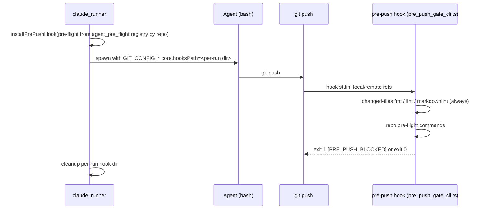

# PR Summary — Issue #3394

## Summary

Before this change, an agent's own `git push` skipped the repo's `pre-flight` gate, and on review-fix and doc-only pushes the cheap lint and format checks were often skipped too. Now every agent spawn gets a per-run git `pre-push` hook, enabled only in the agent's environment through `core.hooksPath` (git's `GIT_CONFIG_COUNT` / `GIT_CONFIG_KEY_n` / `GIT_CONFIG_VALUE_n`). The hook first runs an always-on changed-files check: the formatter, linter and markdownlint on just the files the push introduces, whatever the run budget. It then runs the repo's configured `pre-flight` commands. A check that fails, cannot start or times out refuses the push. The PR-feedback prompt now says the targeted checks always include format and lint on every changed file, docs included. Closes #3394.

Criterion 2 is `partial` (see below): the formatter and markdownlint run on a changed Markdown file only in repos that pin those tools (`deno.json`, markdownlint config).

## Spec

### Intent and Rationale

- The worker's pre-flight ran only at its own commit chokepoint (`commitAndPushPending`), so an agent that committed and pushed itself bypassed it. A git hook catches every push the agent makes, whatever command spelling it uses.
- The hook is enabled through the agent's environment rather than written into the checkout's `.git/hooks`. A checkout-wide hook would also gate the worker's own pushes, including WIP preservation, and a lint failure there would strand work. The worker's own pushes keep their existing pre-flight at the commit chokepoint.
- Pre-flight commands are resolved by repo from a registry that `loadConfig` fills (`agent_pre_flight.ts`). That avoids threading config through about 25 runner callers, and each caller instead passes `repo`, which it mostly already had in scope.

### Essential Design Decisions

- The hook reuses `runPreFlightGate`, so it keeps the same fail-closed classification (`non-zero-exit` / `not-started` / `timeout`) and the same built (non-inherited) environment for repository-supplied commands.
- The changed-files set is `git log --no-merges --name-only -z --diff-filter=d <pushed shas> --not --remotes`, keeping only regular files in the working tree. Merge commits from a base sync are therefore not re-linted, and only the repo's own tools run: `deno fmt`/`deno lint` per outermost `deno.json`, `cargo fmt` per outermost `Cargo.toml`, and `markdownlint-cli2` when the repo carries a markdownlint config.
- If the hook cannot be installed, the runner refuses to start the agent, like the gh guard shim. The same applies when markdownlint is configured but not found, and when the hook's deno, module or spec is missing: each refuses the push.
- This is containment against honest mistakes, not a security boundary. `git push --no-verify`, or the agent rewriting its own environment, bypasses it (stated in `docs/CONFIGURATION.md`).

### Undiscoverable Facts

- Observed on deno 2.9.6: `deno fmt --check <file>` on a config-excluded file exits 1 with "No target files found.", and `--permit-no-files` makes it exit 0. That is why the flag is passed.
- Observed with the real `markdownlint-cli2` v0.23.2: on a file containing `#Bad` it prints `README.md:1:1 error MD018/no-missing-space-atx …` and exits 1. The test stub mirrors this contract: exit 1 with a `file:line:col error MDxxx` line on a violation, exit 0 otherwise, and `--help` runs.
- Overriding `core.hooksPath` for the agent means a repository's own hooks directory (for example husky) does not run for agent git commands.

## Evidence

Backend/CLI change, so there is no UI surface. Tests are listed under Test Plan.

- **Real-tool run** (scratch repo in `/tmp`, hook from `installPrePushHook`, real `git push` and real `markdownlint-cli2`): a doc-only `#Bad` README push was refused with `README.md:1:1 error MD018/no-missing-space-atx` and `error: failed to push some refs` (exit 1). After fixing the content to `# Good`, the push printed `pre-push gate passed (1 changed-file checks, 0 pre-flight commands)` and `* [new branch] HEAD -> feature` (exit 0).
- **Fakes:** the runner tests use a fake agent binary that runs a real `git push`. The gate unit tests use an injected `PreFlightRunner` that stands in for `runPreFlightGate`'s default runner. The property relied on is the exit-code → reason mapping, which the real runner path also exercises in `worker/deno/tests/pre_push_hook_test.ts`.
- **Issue numbers the diff adds:** #3394: Agent self-pushes bypass pre-flight; always run changed-files lint and format before any push. The `#052`, `#14532` and `#450` matches in the diff are Mermaid colour codes, not issues.
- **Callers checked for `repo`** (registry key):
  - Already set: `execute_claude_phase.ts`, `phases/execute_phase.ts`, `closure_verdict_recovery.ts`, `screenshot_gate_retry.ts`, `summary_rule_gate_retry.ts`, `summary_claim_correction.ts`, `security_fix_gate_retry.ts`, `phases/completion_phase.ts`.
  - Added: `merge_conflict_agent.ts`, `pr_spelling_processor.ts`, `pr_ci_processor.ts` (×2), `grill_me_processor.ts`, `planning_processor.ts` (×4), `question_processor.ts`, `revision_processor.ts`, `refinement_processor.ts`, `phases/quality_gate_remediation_phase.ts`, `quorum_processor.ts`, `run_core_production_deps.ts` (custom-label dispatch), `security_scanner.ts`, and `pr_feedback_processor.ts` (its `runAgentTracked` wrapper, which covers all four of its request sites).
  - Left without `repo`, because none is in scope and none pushes code: `clarity_assessment.ts` (read-only assessment), `stream_compaction.ts` (a `/compact` turn), and the failure-detection repair closure in `run_core_production_deps.ts`, which runs in the worker's work dir and receives only the repair prompt. These runs still get the changed-files check.
- **Guards kept on the new path:** the hook adds a second path to "push allowed" beside `commitAndPushPending`. It keeps pre-flight, reached by `agent git push - refused when pre-flight fails (Issue #3394)`. The commit-time guards `assertSafeToCommit` and the run-id trailer apply to commits, not pushes, so they are not on this path. The agent's commits still go through the git guard shim.

**Docs sweep** — grep: `pre-flight`, "Pre-flight enforcement gate", "immediately before the worker", `runPreFlightGate`, "targeted ones always", `--no-verify`; siblings: `GIT_CONFIG_COUNT`, `ghGuard?.env`; section: `docs/CONFIGURATION.md#-pre-flight-enforcement-gate`; updated: `docs/CONFIGURATION.md`, `prompts/pr_feedback/prompt.md`, `worker/deno/lib/pre_flight_gate.ts` (module doc); `SECURITY.md:1836` — still true because the hook reuses `runPreFlightGate`, which still builds its environment from `buildUntrustedCommandEnv()`.

## Acceptance Criteria

<!-- vibe-spec-review inputs="diff+issue-body" -->

- **met** — An agent-initiated `git push` in a repo with `pre-flight` configured runs those commands and is refused when one fails. — evidence: `worker/deno/tests/claude_runner_pre_push_3394_test.ts::agent git push - refused when pre-flight fails (Issue #3394)` and its registry-resolved case, `worker/deno/tests/pre_push_hook_test.ts::integration: agent push is blocked by a failing pre-flight, allowed by a passing one` — reviewer: met — reason: the reviewer's caveat (callers that omit `repo`) is addressed by the caller list under Evidence. Every caller that works on code passes `repo`, and `security_scanner.ts` was added after its review.
- **partial** — A push that changes only a Markdown file runs markdownlint and the formatter check on that file, even when the full gate is skipped for budget. — evidence: `worker/deno/tests/pre_push_gate_test.ts::planChangedFileChecks: doc-only change plans fmt and markdownlint, no lint`, `worker/deno/tests/pre_push_hook_test.ts::integration: doc-only push is blocked by markdownlint, fixed content accepted` — reviewer: partial — reason: the checks run whatever the budget, but only with the repo's own pinned tools. A repo with no `deno.json` gets no formatter check on Markdown, and one with no markdownlint config gets no markdownlint, because forcing an unpinned tool would block on rules the repo's CI never applies.
- **met** — Tests cover an agent push blocked by pre-flight, and a doc-only push blocked by lint. — evidence: `worker/deno/tests/claude_runner_pre_push_3394_test.ts`, `worker/deno/tests/pre_push_hook_test.ts`, `worker/deno/tests/pre_push_gate_test.ts::runPrePushGate: doc-only push blocked by failing markdownlint` — reviewer: met
- **met** — Docs describe the hook and the always-on changed-files check. — evidence: `docs/CONFIGURATION.md` § "Agent pre-push hook and the changed-files check" — reviewer: met
- **unrequested** — `docs/audits/lib-sweep-coverage/top-up-3394.json` — reviewer: unrequested — reason: the repo's completeness gate requires every new `lib/` module to be claimed by a sweep slice.
- **unrequested** — `cargo fmt --all --check` for changed `.rs` files — reviewer: unrequested — reason: it is the formatter check for Rust repos, so it is covered by the issue's "formatter check … using the repo's own pinned tools".
- **unrequested** — the hook is installed on every agent spawn and overrides `core.hooksPath` — reviewer: unrequested — reason: the issue asks for a check "before any push", and installing per route would leave pushing routes uncovered. The husky side effect is documented.
- **unrequested** — `RunClaudeOptions.preFlightCommands` — reviewer: unrequested — reason: a test seam overriding the registry, so runner tests need no global state.
- **unrequested** — the `pr_feedback` Response Message sentence about the hook — reviewer: unrequested — reason: it tells the agent what a refused push means and that it must not bypass the hook. This is part of item 3's prompt update.
- **met** — `./quality.sh` passes — evidence: full gate run on the final head — reviewer: missing — reason: the reviewer saw only the diff and could not run the gate; it was run here and passed.

## Standards Review

<!-- vibe-standards-review inputs="diff+CODING-STANDARDS.md" -->

- **violation** — A new argument reaches every caller that needs it (callers without `repo` silently get no pre-flight) — evidence: `worker/deno/lib/claude_runner.ts:1316` — reason: fixed in this diff. `repo` was added to `security_scanner.ts`, and every remaining repo-less caller is listed with its reason under Evidence.
- **violation** — A stub mirrors the real callee's contract (the `markdownlint-cli2` stub) — evidence: `worker/deno/tests/pre_push_hook_test.ts` `STUB_MARKDOWNLINT` — reason: fixed in this diff. The contract was observed on the real tool and is named under Undiscoverable Facts, and a real-tool push run is quoted under Evidence.
- **clean** — Australian English, the one-line `SIMPLE-ON-PURPOSE` marker (fixed in this diff from four lines), Mermaid for the flow change, the docs change owed, no named-but-absent test, no `.github/workflows` change, fail-loud paths, path quoting (including a `./` prefix for a leading `-`), `Result` control flow, and anchored regexes with no backtracking. No assertion was removed from an existing test. The reviewer found no rule written as "by review only" in `CODING-STANDARDS.md`.

## Test Plan

- Added `worker/deno/tests/pre_push_gate_test.ts`, which covers ref parsing, pushed-file listing, check planning, the `runPrePushGate` paths and `defaultPrePushGit`.
- Added `worker/deno/tests/pre_push_hook_test.ts`, which covers the hook script's fail-closed checks, `GIT_CONFIG_COUNT` handling, and real `git push` integration for pre-flight and doc-only markdownlint.
- Added `worker/deno/tests/pre_push_gate_cli_test.ts`, which covers each CLI exit path.
- Added `worker/deno/tests/claude_runner_pre_push_3394_test.ts`, in which a fake agent runs a real `git push` through `runClaudeWithTimeout`: refused, allowed, resolved through the registry, and refused-to-start when the hook cannot be installed.
- Added `worker/deno/tests/agent_pre_flight_test.ts`, which covers the registry, including `loadConfig` registering `repo_config`.
- No existing test was edited, so no assertions were removed.
- Result: `deno test -A tests/pre_push_gate_test.ts tests/pre_push_hook_test.ts tests/pre_push_gate_cli_test.ts tests/claude_runner_pre_push_3394_test.ts tests/agent_pre_flight_test.ts tests/no_verify_ban_test.ts tests/lib_sweep_coverage_test.ts tests/git_spawn_chokepoint_check_test.ts tests/console_redaction_entrypoint_check_test.ts tests/security_scanner_test.ts` passed on the head before the last two tests were added. `tests/pre_push_gate_test.ts` was then re-run with those tests and passed (18 tests). The full `./quality.sh` result is under the Acceptance Criteria `./quality.sh` entry.
- Entry points checked:
  - In `claude_runner.ts` (spawn env), restoring `ghGuard?.env ?? baseEnv` turned the refused and registry cases red.
  - Replacing the registry fallback with `[]` turned the registry case red.
  - Bypassing the install refusal turned `agent start - refused when the pre-push hook cannot be installed (Issue #3394)` red.

**Branch outcomes:**

- `worker/deno/lib/pre_push_gate.ts:50`: malformed field count → error. Reached by `parsePrePushRefs: malformed input fails closed`; flipping it went red.
- `worker/deno/lib/pre_push_gate.ts:62`: malformed sha → error. Reached by `parsePrePushRefs: malformed input fails closed`; flipping it went red.
- `worker/deno/lib/pre_push_gate.ts:65`: a delete ref is dropped. Reached by `parsePrePushRefs: deletes are dropped`; flipping it went red.
- `worker/deno/lib/pre_push_gate.ts:84`: a `runGitCommand` Result error becomes code 1. Reached by `defaultPrePushGit: a nonexistent working directory fails closed`; flipping it went red.
- `worker/deno/lib/pre_push_gate.ts:88`: a git timeout keeps a non-zero code. exempt (untestable): it needs git to hang past the chokepoint timeout in a unit test, and the generic non-zero path is covered by the line 84 entry.
- `worker/deno/lib/pre_push_gate.ts:123`: `git log` fails → error. Reached by `runPrePushGate: git log failure is an error`; flipping it went red.
- `worker/deno/lib/pre_push_gate.ts:140`: a non-regular file is skipped. Reached by `listPushedFiles: a committed symlink is not a regular file and is skipped`; flipping it went red.
- `worker/deno/lib/pre_push_gate.ts:206`: an unquotable path → error. Reached by `planChangedFileChecks: unquotable path is an error naming the file`; flipping it went red.
- `worker/deno/lib/pre_push_gate.ts:253`: a nested deno root uses its own cwd. Reached by `planChangedFileChecks: nested deno root uses its own cwd and relative paths`; flipping it went red.
- `worker/deno/lib/pre_push_gate.ts:263`: a Cargo root with no `.rs` change is skipped. Reached by `planChangedFileChecks: a Cargo root with no changed .rs file gets no cargo fmt`; flipping it went red.
- `worker/deno/lib/pre_push_gate.ts:276`: markdownlint is configured but its binary is missing → error. Reached by `planChangedFileChecks: markdownlint configured but binary missing is an error`; flipping it went red.
- `worker/deno/lib/pre_push_gate.ts:366`: `ls-files` fails → error. Reached by `runPrePushGate: git ls-files failure is an error`; flipping it went red.
- `worker/deno/lib/pre_push_gate.ts:397`: a changed-file check fails → blocked. Reached by `runPrePushGate: doc-only push blocked by failing markdownlint`; skipping the checks went red.
- `worker/deno/lib/pre_push_gate.ts:406`: pre-flight fails → blocked. Reached by `runPrePushGate: pre-flight failure blocks after changed-file checks ran`; skipping pre-flight went red.
- `worker/deno/lib/pre_push_hook.ts:90`: an invalid `GIT_CONFIG_COUNT` → error. Reached by `installPrePushHook: invalid GIT_CONFIG_COUNT is an error`; flipping it went red.
- `worker/deno/lib/pre_push_hook.ts` (rendered script): a missing deno exits 1. Reached by `renderPrePushHookScript: missing deno blocks the push`; making it exit 0 went red.
- `worker/deno/lib/pre_push_gate_cli.ts:79`: no or invalid spec → 1. Reached by `no --spec blocks; with --spec the same run passes` and the spec tests; inverting `!spec.ok` went red.
- `worker/deno/lib/pre_push_gate_cli.ts:117`: gate Err → 1. Reached by `gate Err blocks with the message; gate Ok passes`; returning 0 went red.
- `worker/deno/lib/pre_push_gate_cli.ts:123`: gate Ok → 0. Reached by `gate Err blocks with the message; gate Ok passes`; inverting `!spec.ok` turned this case red too.
- `worker/deno/lib/claude_runner.ts:1318`: the hook install fails → the agent is refused. Reached by `agent start - refused when the pre-push hook cannot be installed (Issue #3394)`; bypassing it went red.
- `worker/deno/lib/agent_pre_flight.ts:28`: an unknown or undefined repo → `[]`. Reached by `agentPreFlightCommands - returns the registered repo's commands, [] otherwise (Issue #3394)`; returning `[]` always went red.
