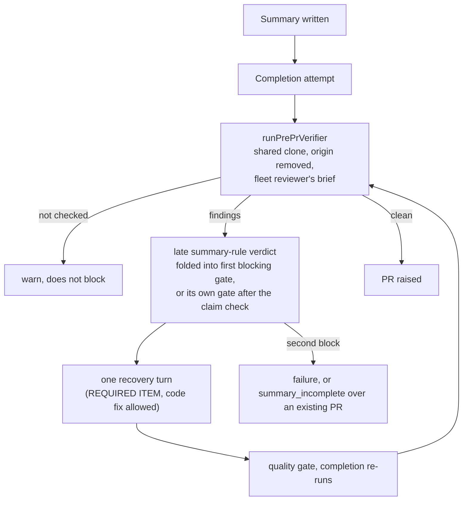

## Summary

Adds a **pre-PR verifier**: once the PR summary is written, the worker runs one
model pass with the fleet reviewer's own brief, in a disposable clone where it
may run commands, and feeds any blocking findings into the run's single in-run
recovery turn. The fleet reviewer's brief moves out of
`.claude/skills/review-fleet-prs/SKILL.md` into a shared template,
`prompts/pr_review_brief/prompt.md`, that both callers render, with a test that
fails if they diverge. Closes #3395 — one criterion is `partial`: network
writes are denied by a tool denylist, not a network sandbox (see Acceptance
Criteria).

## Spec

### Intent and Rationale

- The pre-PR Spec/Standards reviewers are read-only, diff-only and run before the summary exists, so the findings the fleet reviewer later blocks on (summary claims the head contradicts, untested branches, hostile-input regexes) were invisible before the PR. Running the fleet reviewer's own brief after the summary exists closes that gap without a second rulebook.
- The verdict is a late summary-rule verdict, so it reuses the existing fold-and-recover machinery (`foldInLateSummaryVerdicts`, `reportSummaryRuleBlock`, `recoverFromSummaryRuleBlock`) rather than a new recovery path.

### Essential Design Decisions

- One source for the brief: `prompts/pr_review_brief/prompt.md` holds the rules and four `{{FIELDS}}`; SKILL.md defines the fleet's field values, `pre_pr_verifier.ts` the verifier's. The reply parser is shared too: `review_log.ts` `parseFableReview` delegates to `parseReviewReply`.
- The disposable checkout is a `git clone --shared` with `origin` removed (no push destination); `gh`, `git push`, `curl`, `wget`, WebFetch/WebSearch and sub-agents are in `disallowedTools`; the runner's gh guard still applies. This is containment, not a sandbox: another program run through Bash could still reach the network.
- A pass that cannot run is logged as a warning ("not checked") and does not block; a change the issue checkout's `git status`/HEAD shows afterwards, or a checkout that cannot be re-read, is a blocking finding.
- The recovery prompt's "do not change the code" rule gets one exception: a REQUIRED ITEM from the verifier may need a code fix; the quality gate re-runs after the recovery turn as before.

### Undiscoverable Facts

- `git clone --shared --no-checkout` of a worktree path works and, with `origin` removed, `git push` reports "No configured push destination" (observed in this run in a scratch repo).
- The runner installs the gh-guard shim on every spawn regardless of `cwd`, and writes nothing into the cwd checkout (read `claude_runner.ts` `runClaudeWithTimeout`, `pre_push_hook.ts`).

## Evidence

Purely backend / prompt / docs — no UI file in the diff.

- Shared parser callers checked (rule: narrowing a shared helper): `post.ts` → `parseFableReview` (fleet replies follow the brief's JSON, which requires `file`/`line`/`problem`); `gate.ts` `auditSendBack` (its finding carries `file` and `problem`). Both pinned by `worker/deno/tests/pre_pr_verifier_3395_test.ts::the fleet reviewer's parser and audit send-back survive the shared parser`.
- Callers of the new `runPrePrVerifier` seam: `completionBody` only (`worker/deno/lib/phases/completion_phase.ts`); production wiring in `createDefaultDeps` pinned by `pre_pr_verifier_3395_test.ts::createDefaultDeps wires the real pre-PR verifier …`.
- Fakes: the completion tests script `deps.claude.runPrePrVerifier` (stands in for `runPrePrVerifier`, property relied on: it returns the `PrePrVerifierResult` union only); the verifier's own tests run real git in temp repos and script only `ask` (stands in for `runClaudeWithRetry`, same signature).
- Rules checked for overlap: the recovery prompt's "do not change it" step (`summary_rule_gate_retry.ts`, changed in this diff with the verifier exception), and `prompts/issue/prompt.md` § Independent Review (the new paragraph says the agent dispatches nothing for the verifier, consistent with the Spec/Standards rules). Applied both to this PR's own diff: the new prompt paragraph originally said "on every issue run"; reworded to the completion attempts that have a summary to read.
- Issue numbers the diff adds: #3395: Run an execution-capable pre-PR verifier with the fleet reviewer's brief, after the PR summary is written; #3257: First-run PR summaries describe named code wrongly from the start…; #3147: Branch-outcome test rule (#3069) is prose only…; #518: Acceptance criteria published by the planner are never read again…; #3124: Fleet PRs leave a literal QUALITY_RESULT_PLACEHOLDER…; #2976: review-fleet-prs: review PRs with Opus 5.5 at xhigh effort instead of Fable (re-wrapped existing line).

**Docs sweep** — grep: `parseFableReview`, "fill in the fields", "eight summary", "summary claim check", "Spec reviewer", "logged at error"; siblings: "summary claim check", "branch-outcomes gate", `prompts/quorum_judge/`; section: `docs/workflows/issue-processing.md#pre-pr-verifier-issue-3395`; updated: `docs/workflows/issue-processing.md`, `docs/MODEL-AND-CACHING.md`, `docs/PROMPT-HOUSE-VOCABULARY.md`, `prompts/issue/prompt.md`, `.claude/skills/review-fleet-prs/SKILL.md`, `worker/deno/lib/summary_rule_gate_retry.ts` (module doc); `docs/INTERNALS.md:5289` — still true because it describes `summary_claim_check.ts` only and the file index is not a complete list of lib modules; `docs/PROMPTS.md:30` — still true because the Spec reviewer is unchanged; `docs/workflows/issue-processing.md:1092` — still true, same reason

## Acceptance Criteria

<!-- vibe-spec-review inputs="diff+issue-body" -->

- **met** — The fleet reviewer's brief and the pre-PR verifier's brief come from one shared template, and a test fails if they diverge. — evidence: `worker/deno/tests/pr_review_brief_shared_3395_test.ts` — reviewer: met
- **partial** — The verifier runs after the summary exists and can run commands in an isolated worktree, without network writes or GitHub state changes. — evidence: `worker/deno/tests/pre_pr_verifier_3395_test.ts::runPrePrVerifier runs the brief in a disposable, remote-less checkout and reports findings` — reviewer: partial — reason: the clone has no remote and `gh`/`git push`/`curl`/`wget`/web tools are denied, but that is a denylist; another program run through Bash could still reach the network
- **met** — Its blocking findings are fed to the recovery turn, and a run whose findings remain after recovery is reported the same way as other summary-gate blocks. — evidence: `worker/deno/tests/completion_phase_pre_pr_verifier_3395_test.ts::completion - findings that persist with no PR fail the run and post the verifier comment once` — reviewer: met
- **met** — It runs whether or not the issue carries acceptance criteria. — evidence: `worker/deno/tests/completion_phase_pre_pr_verifier_3395_test.ts::completion - the verifier runs without acceptance criteria and receives the issue, summary text, summary path and base ref` — reviewer: met
- **met** — Docs (`docs/workflows/issue-processing.md`, `docs/MODEL-AND-CACHING.md`) describe the verifier and its cost. — evidence: `docs/workflows/issue-processing.md#pre-pr-verifier-issue-3395`, `docs/MODEL-AND-CACHING.md#pre-pr-verifier-issue-phase` — reviewer: met
- **unrequested** — `review_log.ts` `parseFableReview` now delegates to the shared `parseReviewReply`, which rejects findings without a `file` or `problem` — reviewer: unrequested — reason: sharing the parser is what keeps the "same JSON shape" from drifting; existing callers are pinned by a test
- **unrequested** — before/after `git status`/HEAD check of the issue checkout, and symlink/`..` confinement of the summary write — reviewer: unrequested — reason: the isolation the criterion asks for has to be checked, not assumed
- **unrequested** — verifier `unrelatedIssues` are logged, not filed — reviewer: unrequested — reason: the shared reply shape carries them and the worker has no filing path for them here
- **unrequested** — the recovery prompt allows code changes for a verifier REQUIRED ITEM, and `prompts/issue/prompt.md` tells the agent so — reviewer: unrequested — reason: a verifier finding can be a code defect, which the old summary-only recovery rule forbade fixing
- **unrequested** — `docs/audits/lib-sweep-coverage/top-up-3395.json`, `docs/PROMPT-HOUSE-VOCABULARY.md` and the `## Review Mode` heading in the brief — reviewer: unrequested — reason: required by the repo's registration tests for a new lib module and prompt directory
- **unrequested** — "eight" → "nine" summary-gate counts and the claim-check ordering prose in `docs/workflows/issue-processing.md` — reviewer: unrequested — reason: those lists read as complete and the verifier is now a member

## Standards Review

<!-- vibe-standards-review inputs="diff+CODING-STANDARDS.md" -->

- **violation** — Documentation-drift tests: whole-file `includes` with a local collapse helper — evidence: `worker/deno/tests/pr_review_brief_shared_3395_test.ts:61` — reason: fixed in this diff (positive pins read `section(SKILL, "1. Review")`; the absence check uses `flatWholeFile`)
- **violation** — Log levels: a non-blocking "not checked" pass logged at error — evidence: `worker/deno/lib/phases/completion_phase.ts:2695` — reason: fixed in this diff (warn, logged once)
- **violation** — Path confinement: the summary write was not checked against symlinks — evidence: `worker/deno/lib/pre_pr_verifier.ts:540` — reason: fixed in this diff (`summaryEscapesCheckout`, with symlink and `missing/../link` tests)
- **violation** — Narrowing a shared helper: `parseFableReview` callers not checked — evidence: `.claude/skills/review-fleet-prs/scripts/review_log.ts:176` — reason: fixed in this diff (callers listed under Evidence, round-trip test added)
- **violation** — Branch outcome untested: run stats recording — evidence: `worker/deno/lib/phases/completion_phase.ts:2694` — reason: fixed in this diff (test added)
- **violation** — Changed call sites untested: production wiring, threaded timeout/model/retries — evidence: `worker/deno/lib/issue_worker_wiring.ts` — reason: fixed in this diff (tests added, each red when reverted)
- **violation** — Doc comment out of step with the code: mock comment said "logged at error" — evidence: `worker/deno/lib/issue_worker_wiring.ts` — reason: fixed in this diff
- **clean** — fail-loud handling of every not-checked path; untrusted issue text fenced; no workflow change; no persisted-shape change; named tests exist; review-enforced rules checked: drift-test scoping, insertion points, issue-number provenance, prose-claim absolutes, behaviour another issue delivers

## Test Plan

- Added `worker/deno/tests/pre_pr_verifier_3395_test.ts` (32 tests), `worker/deno/tests/completion_phase_pre_pr_verifier_3395_test.ts` (10 tests), `worker/deno/tests/pr_review_brief_shared_3395_test.ts` (5 tests).
- No existing test is edited; the diff removes no assertion from a test on the base branch.
- Divergence test red-checks: appending a brief rule line to SKILL.md turned "SKILL.md carries no copy of the brief's rules" red; adding `{{EXTRA_FIELD}}` to the template turned the placeholder and rendering tests red.
- Drift pins, `deno task drift-pins-on-base origin/milestone/fleet-guidance-issue-and-feedback-prompts .claude/skills/review-fleet-prs/SKILL.md "1. Review" …`: `prompts/pr_review_brief/prompt.md`, `{{REVIEW_CONTEXT}}`, `{{NO_TEST_ADDED_NOTE}}`, `{{TEST_CHANGES}}`, `{{PREVIOUS_FINDINGS}}` — each printed "absent on base"; the base has a `### 1. Review` heading, so the section matched.
- Targeted run on the head: `deno task test` over the three new files plus `review_fleet_prs_log_2678_test.ts`, `summary_rule_gate_retry_test.ts`, `completion_phase_summary_claim_check_test.ts`, `completion_phase_head_reconcile_test.ts`, `lib_sweep_coverage_test.ts`, the two house-vocabulary tests and `review_fleet_prs_skill_links_3300_test.ts` — passed.
- `./quality.sh < /dev/null` on the final head — passed (config integration skipped: no `.config.json` on this host).

**Branch outcomes:**

- `worker/deno/lib/phases/completion_phase.ts:2668` — no summary loaded, verifier skipped — `completion - with no summary file the verifier is not called` — forcing the skip off went red
- `worker/deno/lib/phases/completion_phase.ts:2672` — no comparable base, not checked — `completion - with no resolvable base ref the verifier is not called and no verifier comment is posted` — removing the branch went red
- `worker/deno/lib/phases/completion_phase.ts:2694` — run stats recorded — `completion - the verifier run's stats are recorded on the phase state` — deleting the line went red
- `worker/deno/lib/phases/completion_phase.ts:2695` — not checked does not block — `completion - a verifier that was not checked does not block and costs no recovery turn` — treating not_checked as blocked turned (e), (a), (f), (h) red
- `worker/deno/lib/phases/completion_phase.ts:2747` — verdict blocked / folded — `completion - verifier findings fold into an earlier gate's block as a second REQUIRED ITEM`, `completion - verifier findings fold into the summary claim check's block` — `blocked: false` and dropping the verifier from the fold went red
- `worker/deno/lib/phases/completion_phase.ts:3128` — standalone verifier gate, first and second block — `completion - verifier findings block; the one recovery turn gets them and the re-run is clean, so the PR is raised`, `completion - findings that persist over an existing PR end as summary_incomplete` — disabling the gate went red
- `worker/deno/lib/pre_pr_verifier.ts:77` — unknown placeholder throws — `renderReviewBrief throws on an unknown placeholder` — red when not thrown
- `worker/deno/lib/pre_pr_verifier.ts:143`, `:147`, `:150` — malformed finding rejected — `parseReviewReply rejects a malformed finding and normalises line and fix` — red when accepted
- `worker/deno/lib/pre_pr_verifier.ts:409` — summary path with `..`/absolute — `runPrePrVerifier: a summary path that escapes the checkout is not_checked and nothing is asked` — disabling the `..` rule went red
- `worker/deno/lib/pre_pr_verifier.ts:412` — brief unavailable — `runPrePrVerifier: an unavailable review brief is not_checked and nothing is asked` — condition forced false went red
- `worker/deno/lib/pre_pr_verifier.ts:420` — HEAD unresolvable — `runPrePrVerifier: an unresolvable HEAD is not_checked and nothing is asked` — condition forced false went red
- `worker/deno/lib/pre_pr_verifier.ts:427` — base unresolvable — `runPrePrVerifier: a base ref that does not resolve is not_checked` — removing the branch went red
- `worker/deno/lib/pre_pr_verifier.ts:434` — first snapshot fails — `runPrePrVerifier: a checkout that cannot be snapshotted beforehand is not_checked` — check forced false went red
- `worker/deno/lib/pre_pr_verifier.ts:439` — temp dir cannot be created — `runPrePrVerifier: a disposable directory that cannot be created is not_checked` — changing the reason went red
- `worker/deno/lib/pre_pr_verifier.ts:458` — setup throws — `runPrePrVerifier: a throw during setup is not_checked and the directory is removed` — rethrowing went red
- `worker/deno/lib/pre_pr_verifier.ts:469` — removeDir fails, result kept — `runPrePrVerifier: a removeDir failure does not lose the result` — rethrowing went red
- `worker/deno/lib/pre_pr_verifier.ts:479` — checkout cannot be re-read → finding — `runPrePrVerifier: an issue checkout that cannot be re-read after the run is a blocking finding` — removing the branch went red
- `worker/deno/lib/pre_pr_verifier.ts:488` — issue checkout changed → finding — `runPrePrVerifier: a change to the issue checkout surfaces as a blocking finding` — removing the branch went red
- `worker/deno/lib/pre_pr_verifier.ts:540` — symlinked parent / symlinked summary file — `runPrePrVerifier: a tracked symlinked parent directory cannot redirect the summary write`, `runPrePrVerifier: a tracked symlink at the summary file itself is not written through` — removing the compare and the `lstat` refusal each went red
- `worker/deno/lib/pre_pr_verifier.ts:590` — preparation git step fails — `runPrePrVerifier: a failed preparation git step is not_checked and the directory is removed` — condition forced false went red
- `worker/deno/lib/pre_pr_verifier.ts:641` — model launch fails — `runPrePrVerifier: a failed run is not_checked and the disposable directory is removed` — red when treated as checked
- `worker/deno/lib/pre_pr_verifier.ts:645` — timed out — `runPrePrVerifier: a timeout is not_checked even with a parseable reply` — red when the check is removed
- `worker/deno/lib/pre_pr_verifier.ts:654` — unparseable reply — `runPrePrVerifier: a malformed reply is not_checked` — red when the catch passes it through
- `worker/deno/lib/pre_pr_verifier.ts:666` — blocked only when checked with findings — `runPrePrVerifier: a clean reply is checked and not blocked` — red when findings are ignored

Guards kept on the new path to the summary-rule outcome: the verifier gate returns through `reportSummaryRuleBlock`, so the posted-once comment, the existing-PR degraded-run delivery guard and the one-recovery-turn limit apply unchanged; it sits before the degraded-run delivery guard section like its siblings.

Disposable state this diff deletes: only the temp directory `runPrePrVerifier` itself created (a fresh shared clone holding the verifier's scratch edits, meant to be lost); the issue checkout is never reset — a change there becomes a finding instead.

🤖 Generated with [Claude Code](https://claude.com/claude-code)
