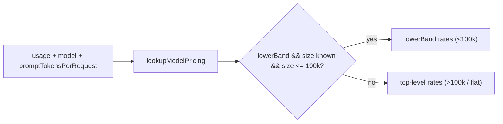

# PR Summary: Banded Claude Haiku 5.5 pricing (Issue #3399)

## Summary

Closes #3399

Adds banded pricing for Claude Haiku 5.5. Requests with a prompt of up to 100k
tokens use the ≤100k rates (0.10 / 0.50 / 0.125 / 0.01 USD per million tokens).
Larger requests, and estimates built from run totals only, use the >100k rates
(0.50 / 2.50 / 0.625 / 0.05). Haiku 4.5 stays flat at 1 / 5 / 1.25 / 0.10. The
`haiku` alias now resolves to Haiku 5.5.

- [x] `BandedRate` plus `ModelPricing.lowerBand`, and a `HAIKU_5_5_PRICING` row
- [x] `lookupModelPricing` and the version parse send Haiku 5.5+ (including
      dated ids) to the banded row, and the `haiku` alias to the current Haiku
- [x] `estimateCost`, `estimateCostWithUpperBound` and `costFor` choose a band
      per request, falling back to >100k when the prompt size is unknown
- [x] Production callers (`cost_estimate.ts`, `credit_tracker.ts`) pass an
      explicit `undefined`
- [x] Tests, docs and the quality gate

## Spec

### Intent and Rationale

Haiku 5.5 is priced in two bands keyed on the size of a single request's
prompt. The worker's cost figures have to reflect that, and when the prompt
size is unknown they must over-estimate, never under-estimate.

### Essential Design Decisions

- **Top-level rates are the >100k band; the cheaper band sits in
  `lowerBand`.** Any reader that ignores `lowerBand` therefore over-estimates.
  This includes `UNPRICED_UPPER_BOUND_PRICING`'s `Math.max` over top-level
  fields, which still produces a true ceiling.
- **`promptTokensPerRequest: number | undefined` is required, not optional.**
  Under CODING-STANDARDS ("A new argument or behaviour reaches every caller that
  needs it"), a behaviour-carrying parameter must not have a default that turns
  the behaviour off. Each totals-only caller passes `undefined` explicitly,
  with a comment explaining why.
- **The `haiku` alias now resolves to Haiku 5.5.** The issue requires it: "The
  `haiku` alias resolves to the current Haiku".
- **The 100k boundary is inclusive** (`<=`), which matches the issue's "≤100k".



### Undiscoverable Facts

- Credit-tracker entries are built from `claude_runner.ts`
  (`const tokenUsage = agentOutput?.usage ?? providerUsage.usage;`), which is
  the usage of one whole `claude -p` invocation summed over all of its API
  requests. `entry.inputTokens` also leaves out cache reads, so it is not one
  request's prompt size, and the >100k rate is the correct choice there.
- `parseClaudeModernVersion` accepts only majors 4 and 5, so
  `major >= 5 && minor >= 5` matches Haiku 5.5 and later 5.x minors exactly.

## Evidence

Backend-only change with no visual surface. The evidence is the unit tests
listed below, and a `./quality.sh < /dev/null` run that ended in
`Result: PASSED (with skipped checks)`. The one skip was config integration,
which needs `.config.json`.

- #3399: Banded Claude Haiku 5.5 pricing in token_usage (≤100k / >100k prompt tokens)

**Docs sweep** — grep: `estimateCost`, `estimateCostWithUpperBound`, `lowerBand`, `HAIKU_PRICING`, `haiku-4-5`, "Haiku 4.5", "current Haiku", "latest Haiku", "single rate", the `haiku` alias; section: `docs/MODEL-AND-CACHING.md#model-pricing`; updated: `docs/MODEL-AND-CACHING.md`

Grepped across `README.md`, `docs/` (excluding `docs/archive/`), `*/README.md`
and `worker/deno/lib/*.ts`, then read the Model Pricing section through.
- `docs/MODEL-AND-CACHING.md:2470`: Haiku 5.5 rows added to the price table.
- `docs/MODEL-AND-CACHING.md:2553`: new paragraph on the bands, the required
  parameter, and the `undefined` callers. Its alias clause now says plainly
  that it describes the pricing lookup, not which model the CLI's `haiku`
  alias serves.
- `docs/MODEL-AND-CACHING.md:2124` and `worker/deno/lib/claude_runner.ts:3825`:
  these say the `haiku` phases run on Haiku 4.5. That is a routing and
  cache-floor claim, and this diff changes no routing, so the sentences are
  still accurate as far as this change goes. They are left as they are; see
  the Standards Review entry on the alias.
- `docs/MODEL-AND-CACHING.md:173` and `:869`: these describe alias passing
  only, so they are still true.
- `docs/IDLE-TASK-FRAMEWORK.md:2026`, `:2118` and `:2132`: these list the alias
  names only, so they are still true.
- `worker/deno/lib/token_usage.ts:184`, `:427` and `:430`: updated in this diff
  to name Haiku 5.5 as the current Haiku.

## Acceptance Criteria

<!-- vibe-spec-review inputs="diff+issue-body" -->

- **met** — A 50k-prompt-token Haiku 5.5 request is costed at the ≤100k rates — evidence: `worker/deno/tests/token_usage_test.ts::token_usage - estimateCost uses the <=100k band for a 50k-prompt Haiku 5.5 request (Issue #3399)` — reviewer: met
- **met** — A 150k-prompt-token Haiku 5.5 request is costed at the >100k rates — evidence: `worker/deno/tests/token_usage_test.ts::token_usage - estimateCost uses the >100k band for a 150k-prompt Haiku 5.5 request (Issue #3399)` — reviewer: met
- **met** — A run-total-only Haiku 5.5 estimate uses the >100k rates — evidence: `worker/deno/tests/token_usage_test.ts::token_usage - estimateCost with an undefined prompt size (run totals only) uses the conservative >100k Haiku 5.5 band (Issue #3399)` — reviewer: met
- **partial** — `claude-haiku-4-5` costs are unchanged (existing tests in `token_usage_test.ts` still pass unmodified) — evidence: `worker/deno/tests/token_usage_test.ts::token_usage - estimateCost for Haiku 4.5/4.9 is unaffected by a promptTokensPerRequest argument (Issue #3399)` — reviewer: partial — reason: the Haiku 4.5 costs are unchanged, but existing tests were edited: the required parameter added `, undefined` to existing calls, and the alias test now expects Haiku 5.5 rates because the issue moves `haiku` to the current Haiku
- **met** — Opus / Sonnet / Fable pricing is unchanged — evidence: `worker/deno/tests/token_usage_test.ts::token_usage - estimateCost for Sonnet ignores a promptTokensPerRequest argument (no lowerBand) (Issue #3399)` — reviewer: met
- **unrequested** — `promptTokensPerRequest` is a required `number | undefined`, not optional — reviewer: unrequested — reason: CODING-STANDARDS forbids a default that turns off a behaviour, so every caller must choose; this is what caused the test edits behind the partial verdict
- **unrequested** — `cost_estimate.ts` and `credit_tracker.ts` pass an explicit `undefined` with comments — reviewer: unrequested — reason: the required parameter forces it; they hold only run totals, so they get the >100k rate the issue asks for
- **unrequested** — Haiku 5.5 rows and a banded-row paragraph in `docs/MODEL-AND-CACHING.md` — reviewer: unrequested — reason: owed under "A Code Change Owes a Docs Change"; benign
- **unrequested** — Haiku 5.6+ go to the banded row and Haiku 5.0–5.4 stay flat (`token_usage.ts:688-694`) — reviewer: unrequested — reason: a version-range rule for future ids; the rates for those ids are assumptions; benign
- **unrequested** — Exact-100k boundary test and the Sonnet-ignores-argument test — reviewer: unrequested — reason: they pin the inclusive `≤` boundary and the no-band path; benign
- **unrequested** — The Codex test and the `unpriced_spend_3870_test.ts` calls were reformatted onto several lines — reviewer: unrequested — reason: `deno fmt` after adding the third argument; benign

## Standards Review

<!-- vibe-standards-review inputs="diff+CODING-STANDARDS.md" -->

- **violation** — Verify a claim about another component / A Code Change Owes a Docs Change: the new paragraph said Haiku 5.5 is "what the alias `haiku` now resolves to", which clashes with `docs/MODEL-AND-CACHING.md:2124` (the `haiku` phases run on Haiku 4.5) — evidence: `docs/MODEL-AND-CACHING.md:2553` — reason: fixed in this diff (the clause now covers only the pricing lookup)
- **violation** — The credit log records the requested model name (`haiku`), so the `summarise` / `spelling_fix` / `health` phases are now costed at Haiku 5.5's >100k rate. If the CLI's `haiku` alias still serves Haiku 4.5, the spend ceiling under-counts those phases by half — evidence: `worker/deno/lib/claude_runner.ts:2377-2380` — reason: outstanding — the issue requires the alias to resolve to the current Haiku; whether the CLI serves 4.5 or 5.5 for `haiku` was not verified in this run
- **violation** — A doc comment outside the diff went stale: it says "Claude Haiku 4.x pricing", but the row now also covers Haiku 5.0–5.4 — evidence: `worker/deno/lib/token_usage.ts:176` — reason: outstanding — a comment-only fix, left for follow-up because this retry is limited to the summary
- **violation** — Comment accuracy: the step-2 comment says the bare alias is resolved there, but step 1 resolves it — evidence: `worker/deno/lib/token_usage.ts:658-661` — reason: outstanding — a comment-only fix, left for follow-up
- **violation** — KISS / dead code: `return TIER_CURRENT_PRICING.get(parsed.tier) ?? null;` can no longer be reached, because every parsed tier now has its own branch — evidence: `worker/deno/lib/token_usage.ts:695` — reason: outstanding, minor — left for follow-up
- **violation** — Reuse the in-repo helper (an existing problem, not introduced here): `batch_api.ts`'s own `lookupPricing` still prices `haiku` at Haiku 4.5, while `lookupModelPricing("haiku")` now returns Haiku 5.5 — evidence: `worker/deno/lib/batch_api.ts:495-512` — reason: outstanding — an older duplicate outside this issue's scope; needs a follow-up
- **clean** — spelling (Australian English), no default that turns off a behaviour (all three production callers pass `undefined` with a reason), every `costFor` and Haiku-lookup outcome is tested against real code, removed assertions are quoted, the price table matches the code, the unpriced upper bound is unchanged, `deno fmt --check` and `deno lint` pass

## Test Plan

Ran `deno task test:unit` on `tests/token_usage_test.ts`,
`tests/unpriced_spend_3870_test.ts`, `tests/cost_estimate_test.ts` and
`tests/credit_tracker_test.ts`: 138 passed, 0 failed. Then ran the full
`./quality.sh < /dev/null`, which passed.

New tests in `worker/deno/tests/token_usage_test.ts`:

- `token_usage - lookupModelPricing returns pricing for Haiku 5.5 (Issue #3399)` (bare and dated ids)
- `token_usage - estimateCost uses the <=100k band for a 50k-prompt Haiku 5.5 request (Issue #3399)`
- `token_usage - estimateCost treats exactly 100k prompt tokens as inside the <=100k band (Issue #3399)`
- `token_usage - estimateCost uses the >100k band for a 150k-prompt Haiku 5.5 request (Issue #3399)`
- `token_usage - estimateCost with an undefined prompt size (run totals only) uses the conservative >100k Haiku 5.5 band (Issue #3399)`
- `token_usage - estimateCostWithUpperBound with an undefined prompt size (run totals only) uses the conservative >100k Haiku 5.5 band (Issue #3399)`
- `token_usage - estimateCost for Haiku 4.5/4.9 is unaffected by a promptTokensPerRequest argument (Issue #3399)`
- `token_usage - lookupModelPricing keeps Haiku 5.0-5.4 on the flat Haiku 4.5 rate (Issue #3399)`
- `token_usage - estimateCost for Sonnet ignores a promptTokensPerRequest argument (no lowerBand) (Issue #3399)`

Removed assertions, quoted verbatim. Each became 0.50 and 2.50 in the alias
test, because the `haiku` alias now resolves to Haiku 5.5:

```text
-  assertEquals(haiku?.inputPerMillion, 1);
-  assertEquals(haiku?.outputPerMillion, 5);
```

- Removed from `worker/deno/tests/token_usage_test.ts`: `assertEquals(estimateCost(usage, "unknown-model"), null);` — #3399 makes `promptTokensPerRequest` a required argument, so the old two-argument call no longer compiles. The same assertion was re-added in place, unchanged except for the third argument: `assertEquals(estimateCost(usage, "unknown-model", undefined), null);` in `token_usage - estimateCost returns null for unknown model`

In `token_usage_test.ts` and `unpriced_spend_3870_test.ts`, every other
removed line is an `estimateCost(...)` or `estimateCostWithUpperBound(...)`
call. Each was re-added with a third argument `undefined` and the same
assertions.

Branch outcomes:

- `worker/deno/lib/token_usage.ts:782`, `lowerBand` present and size ≤ max →
  `lowerBand`. Reached by the 50k test and the exactly-100k test. Flipping `<=`
  to `<` turned the exactly-100k test red.
- `worker/deno/lib/token_usage.ts:782`, `lowerBand` present and size > max →
  top-level rates. Reached by the 150k test. Flipping the comparison so it
  always picks `lowerBand` turned it red.
- `worker/deno/lib/token_usage.ts:782`, `lowerBand` present and size
  `undefined` → top-level rates. Reached by the two run-totals tests. Treating
  `undefined` as inside the band turned them red.
- `worker/deno/lib/token_usage.ts:782`, no `lowerBand` → top-level rates.
  Reached by the Haiku 4.5/4.9 and Sonnet `promptTokensPerRequest` tests and by
  the existing flat-rate tests. Selecting a missing `lowerBand` turned them red.
- `worker/deno/lib/token_usage.ts:691`, Haiku 5.5+ → `HAIKU_5_5_PRICING`.
  Reached by the Haiku 5.5 lookup test (bare and dated ids). Returning
  `HAIKU_PRICING` turned it red.
- `worker/deno/lib/token_usage.ts:691`, Haiku 4.x and 5.0–5.4 →
  `HAIKU_PRICING`. Reached by the Haiku 5.0-5.4 test and the existing Haiku 4.5
  test. Removing the minor clause made `claude-haiku-5-0` return 0.5 against an
  expected 1, which went red.

Callers checked: `cost_estimate.ts:266` and `credit_tracker.ts:516` and `:550`
pass an explicit `undefined`, because each sees merged or invocation-wide
totals. These are the only production callers.

## Pre-PR Security Self-Check

- [x] No new external input, shell, SQL or HTTP surface; pricing is pure arithmetic.
- [x] No secrets or hidden files staged.

🤖 Generated with [Claude Code](https://claude.com/claude-code)
