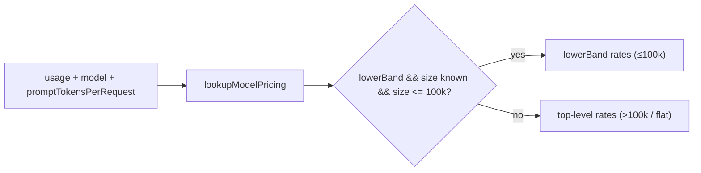

# PR Summary: Banded Claude Haiku 5.5 pricing (Issue #3399)

## Summary

Closes #3399

Adds banded pricing for Claude Haiku 5.5. Requests with a prompt of up to 100k
tokens use the ≤100k rates (0.10 / 0.50 / 0.125 / 0.01 USD per million tokens).
Larger requests, and estimates built from run totals only, use the >100k rates
(0.50 / 2.50 / 0.625 / 0.05). Haiku 4.5 stays flat at 1 / 5 / 1.25 / 0.10. The
`haiku` alias now resolves to Haiku 5.5.

- [x] `BandedRate` plus `ModelPricing.lowerBand`, and a `HAIKU_5_5_PRICING` row
- [x] `lookupModelPricing` and the version parse send Haiku 5.5+ (including
      dated ids) to the banded row, and the `haiku` alias to the current Haiku
- [x] `estimateCost`, `estimateCostWithUpperBound` and `costFor` choose a band
      per request, falling back to >100k when the prompt size is unknown
- [x] Production callers (`cost_estimate.ts`, `credit_tracker.ts`) pass an
      explicit `undefined`
- [x] Tests, docs and the quality gate

## Spec

### Intent and Rationale

Haiku 5.5 is priced in two bands keyed on the size of a single request's
prompt. The worker's cost figures have to reflect that, and when the prompt
size is unknown they must over-estimate, never under-estimate.

### Essential Design Decisions

- **Top-level rates are the >100k band; the cheaper band sits in
  `lowerBand`.** Any reader that ignores `lowerBand` therefore over-estimates.
  This includes `UNPRICED_UPPER_BOUND_PRICING`'s `Math.max` over top-level
  fields, which still produces a true ceiling.
- **`promptTokensPerRequest: number | undefined` is required, not optional.**
  Under CODING-STANDARDS ("A new argument or behaviour reaches every caller that
  needs it"), a behaviour-carrying parameter must not have a default that turns
  the behaviour off. Each totals-only caller passes `undefined` explicitly,
  with a comment explaining why.
- **The `haiku` alias now resolves to Haiku 5.5.** The issue requires it: "The
  `haiku` alias resolves to the current Haiku".
- **The 100k boundary is inclusive** (`<=`), which matches the issue's "≤100k".



### Undiscoverable Facts

- Credit-tracker entries are built from `claude_runner.ts`
  (`const tokenUsage = agentOutput?.usage ?? providerUsage.usage;`), which is
  the usage of one whole `claude -p` invocation summed over all of its API
  requests. `entry.inputTokens` also leaves out cache reads, so it is not one
  request's prompt size, and the >100k rate is the correct choice there.
- `parseClaudeModernVersion` accepts only majors 4 and 5, so
  `major >= 5 && minor >= 5` matches Haiku 5.5 and later 5.x minors exactly.

## Evidence

Backend-only change with no visual surface. The evidence is the unit tests
listed below, and a `./quality.sh < /dev/null` run that ended in
`Result: PASSED (with skipped checks)`. The one skip was config integration,
which needs `.config.json`.

- #3399: Banded Claude Haiku 5.5 pricing in token_usage (≤100k / >100k prompt tokens)

Docs sweep: grepped `estimateCost`, `lowerBand`, `HAIKU_PRICING`,
`haiku-4-5`, "current Haiku", "latest Haiku" and the `haiku` alias across `*.md`
and `worker/deno/lib/*.ts`.
- `docs/MODEL-AND-CACHING.md:2470`: Haiku 5.5 rows added to the price table.
- `docs/MODEL-AND-CACHING.md:2553`: new paragraph on the bands, the required
  parameter, and the `undefined` callers.
- `docs/MODEL-AND-CACHING.md:173` and `:869`: these describe alias passing
  only, so they are still true.
- `docs/IDLE-TASK-FRAMEWORK.md:2026`, `:2118` and `:2132`: these list the alias
  names only, so they are still true.
- `worker/deno/lib/token_usage.ts:184`, `:427` and `:430`: updated in this diff
  to name Haiku 5.5 as the current Haiku.

## Acceptance Criteria

<!-- vibe-spec-review inputs="diff+issue-body" -->

- A 50k-prompt request uses the ≤100k rates. reviewer: met
- A 150k-prompt request uses the >100k rates. reviewer: met
- A run-total-only estimate uses the >100k rates. reviewer: met
- `claude-haiku-4-5` costs are unchanged. reviewer: partial. The numeric costs
  are unchanged, but the existing tests were edited:
  - every call gained `, undefined` because the parameter is required;
  - the alias test now expects Haiku 5.5 rates, because the issue requires the
    `haiku` alias to resolve to the current Haiku.
- Opus, Sonnet and Fable pricing are unchanged. reviewer: met
- The required (not optional) parameter. reviewer: unrequested. It is required
  by the CODING-STANDARDS rule cited above.
- Docs prose in `docs/MODEL-AND-CACHING.md`. reviewer: unrequested. The
  reviewer judged it benign, and it is owed under "A Code Change Owes a Docs
  Change".

## Standards Review

<!-- vibe-standards-review inputs="diff+CODING-STANDARDS.md" -->

- `worker/deno/lib/credit_tracker.ts:516`: the reviewer said the
  per-invocation cost hard-codes `undefined` where `entry.inputTokens` is
  available. Investigation showed that value is invocation-wide usage summed
  over many API requests, and it leaves out cache reads (see Undiscoverable
  Facts). Passing `undefined` (the conservative >100k rate) is therefore
  correct. The comment now states this. reason: fixed in this diff
- The reviewer's optional note on a hypothetical Haiku 6.x was already
  addressed by the comment at `worker/deno/lib/token_usage.ts:689-690`: the parser
  never yields major 6. reason: fixed in this diff

## Test Plan

Ran `deno task test:unit` on `tests/token_usage_test.ts`,
`tests/unpriced_spend_3870_test.ts`, `tests/cost_estimate_test.ts` and
`tests/credit_tracker_test.ts`: 138 passed, 0 failed. Then ran the full
`./quality.sh < /dev/null`, which passed.

New tests in `worker/deno/tests/token_usage_test.ts`:

- `token_usage - lookupModelPricing returns pricing for Haiku 5.5 (Issue #3399)` (bare and dated ids)
- `token_usage - estimateCost uses the <=100k band for a 50k-prompt Haiku 5.5 request (Issue #3399)`
- `token_usage - estimateCost treats exactly 100k prompt tokens as inside the <=100k band (Issue #3399)`
- `token_usage - estimateCost uses the >100k band for a 150k-prompt Haiku 5.5 request (Issue #3399)`
- `token_usage - estimateCost with an undefined prompt size (run totals only) uses the conservative >100k Haiku 5.5 band (Issue #3399)`
- `token_usage - estimateCostWithUpperBound with an undefined prompt size (run totals only) uses the conservative >100k Haiku 5.5 band (Issue #3399)`
- `token_usage - estimateCost for Haiku 4.5/4.9 is unaffected by a promptTokensPerRequest argument (Issue #3399)`
- `token_usage - lookupModelPricing keeps Haiku 5.0-5.4 on the flat Haiku 4.5 rate (Issue #3399)`
- `token_usage - estimateCost for Sonnet ignores a promptTokensPerRequest argument (no lowerBand) (Issue #3399)`

Removed assertions, quoted verbatim. Each became 0.50 and 2.50 in the alias
test, because the `haiku` alias now resolves to Haiku 5.5:

```text
-  assertEquals(haiku?.inputPerMillion, 1);
-  assertEquals(haiku?.outputPerMillion, 5);
```

In `token_usage_test.ts` and `unpriced_spend_3870_test.ts`, every other
removed line is an `estimateCost(...)` or `estimateCostWithUpperBound(...)`
call. Each was re-added with a third argument `undefined` and the same
assertions.

Branch outcomes:

- `worker/deno/lib/token_usage.ts:782`, `lowerBand` present and size ≤ max →
  `lowerBand`. Reached by the 50k test and the exactly-100k test. Flipping `<=`
  to `<` turned the exactly-100k test red.
- `worker/deno/lib/token_usage.ts:782`, `lowerBand` present and size > max →
  top-level rates. Reached by the 150k test. Flipping the comparison so it
  always picks `lowerBand` turned it red.
- `worker/deno/lib/token_usage.ts:782`, `lowerBand` present and size
  `undefined` → top-level rates. Reached by the two run-totals tests. Treating
  `undefined` as inside the band turned them red.
- `worker/deno/lib/token_usage.ts:782`, no `lowerBand` → top-level rates.
  Reached by the Haiku 4.5/4.9 and Sonnet `promptTokensPerRequest` tests and by
  the existing flat-rate tests. Selecting a missing `lowerBand` turned them red.
- `worker/deno/lib/token_usage.ts:691`, Haiku 5.5+ → `HAIKU_5_5_PRICING`.
  Reached by the Haiku 5.5 lookup test (bare and dated ids). Returning
  `HAIKU_PRICING` turned it red.
- `worker/deno/lib/token_usage.ts:691`, Haiku 4.x and 5.0–5.4 →
  `HAIKU_PRICING`. Reached by the Haiku 5.0-5.4 test and the existing Haiku 4.5
  test. Removing the minor clause made `claude-haiku-5-0` return 0.5 against an
  expected 1, which went red.

Callers checked: `cost_estimate.ts:266` and `credit_tracker.ts:516` and `:550`
pass an explicit `undefined`, because each sees merged or invocation-wide
totals. These are the only production callers.

## Pre-PR Security Self-Check

- [x] No new external input, shell, SQL or HTTP surface; pricing is pure arithmetic.
- [x] No secrets or hidden files staged.

🤖 Generated with [Claude Code](https://claude.com/claude-code)
