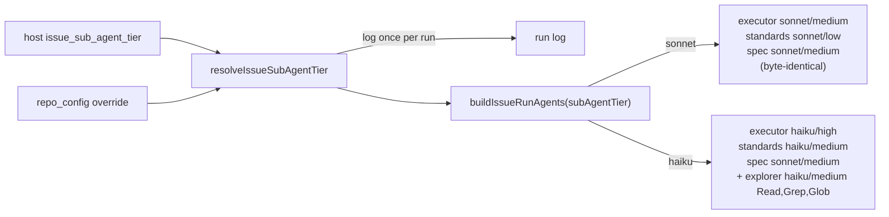

## Summary

The issue-run `--agents` JSON now follows `issue_sub_agent_tier`. Both
issue-phase call sites resolve the tier with `resolveIssueSubAgentTier`
(#3401), log it once per run, and pass it as a required `subAgentTier` through
`IssueRunAgentSwitches` → `buildIssueRunAgents` → `buildIssueExecutorAgents` /
`buildIssueReviewerAgents`. On `"sonnet"` (the default) the JSON is
byte-identical to before. On `"haiku"`:

- the executor runs as `haiku`/`high`;
- the Standards reviewer runs as `haiku`/`medium`;
- the Spec reviewer stays `sonnet`/`medium`;
- a read-only `explorer` is added (`haiku`, `medium`, `Read`/`Grep`/`Glob`, `Agent` denied);
- each Haiku-tier prompt ends with two short Haiku guidance lines.

Closes #3402.

This branch merges `origin/main` (commit `ab63db48`) to pick up #3401's
resolver, which landed on `main` before the milestone branch was synced. Until
the milestone sync runs, the PR diff against the milestone branch also shows
#3401's own commits. The change described here is `ab63db48..HEAD`.

## Spec

### Intent and Rationale

- The owner asked on #3385 to make Haiku or Sonnet a per-fleet choice for the executor, trial it on part of the fleet, and compare review rejections and CI failures against cost. The key is that trial switch. Its default leaves every current run unchanged.
- The tier is a required field and parameter, not a defaulted one. The type checker therefore flagged every caller, and every caller passes it.

### Essential Design Decisions

- `"sonnet"` must stay byte-identical. `tests/fixtures/issue_run_agents/sonnet_tier_3402.json` was generated from the unchanged builder before any edit, and checked byte for byte against a fresh run of the base builder at `ab63db48`.
- The explorer rides every Haiku-tier `issue` run, whatever the split and reviewer switches are. A Haiku run with both switches off therefore carries `--agents` with only the explorer. A Sonnet run with both off still carries no `--agents`.
- The Spec reviewer stays on Sonnet at every tier, because judging criteria is judgement work. Only the Standards reviewer (a diff checked against one document) moves to Haiku.
- The guidance lines are appended only to Haiku-tier sub-agent prompts in `issue_executor_agents.ts`. No template under `prompts/` is touched.

### Undiscoverable Facts

- #3401 merged to `main` (PR #3434), not to the milestone branch, so this branch had to merge `origin/main` to get `resolveIssueSubAgentTier`.
- Run-stats cost per served model (`buildRunStats`), so Haiku executor tokens are priced at Haiku's rate with no change here.

## Evidence

Backend/CLI change only, so no UI files and no screenshot. Tests are listed in the Test Plan.

Call sites changed: `worker/deno/lib/execute_claude_phase.ts` (`executeClaudePhaseBody`, fed by `worker/deno/commands/execute_claude_phase.ts`) and `worker/deno/lib/phases/execute_phase.ts` (`executeClaudeBody`). `buildIssueRunAgents` has no other caller.

**Docs sweep** — grep: `issue_sub_agent_tier`, `issueSubAgentTier`, "not read yet", `#3402`, "Sonnet executor\w*", "executor (Sonnet)", "pinned to Sonnet", `standards-reviewer`, `ISSUE_EXECUTOR_MODEL`; section: `docs/MODEL-AND-CACHING.md#haiku-sub-agent-tier-issue-phase` (new), `docs/MODEL-AND-CACHING.md#reviewer-sub-agents-issue-phase`, `docs/MODEL-AND-CACHING.md#advisor-and-executor-split-issue-phase`, `docs/CONFIGURATION.md` rows `issue_executor_split`, `issue_sub_agent_tier` (host and `repo_config`), `issue_reviewer_agents`; updated: `docs/CONFIGURATION.md`, `docs/MODEL-AND-CACHING.md` (sections, Provider Applicability matrix row, contents, and the delegation-reversal scoping sentence), `worker/deno/lib/config_defaults.ts` and `worker/deno/lib/issue_sub_agent_tier.ts` doc comments, comments in both call sites; hits left in place:
- `docs/MODEL-AND-CACHING.md:257` — still true because it describes the Sonnet-tier default set by #2812.
- `docs/MODEL-AND-CACHING.md:322` — still true because "Sonnet executors implement at `medium`" describes the default tier.
- `docs/MODEL-AND-CACHING.md:540` — still true because it now says that measurement covered Sonnet executors only and is not evidence for the Haiku tier.

Issue numbers this diff adds as provenance: #3385: Adopt Claude Haiku 5.5: pricing tables, trial key for cheaper sub-agent tiers; #3401: Add issue_sub_agent_tier config key (sonnet|haiku) with per-repo override; #3402: Tier-aware issue-run sub-agents: Haiku executors/standards reviewer and read-only explorer.

No new prompt rule or coding standard is added (prompt text lives only in sub-agent definitions), so no rule-overlap check applies. No `deno.lock` change. The only fake relied on is `createMockDeps` from `issue_worker_wiring.ts`, which captures `runClaudeWithRetry` options. The assertions read the `agents` value the production builder produced.

## Acceptance Criteria

<!-- vibe-spec-review inputs="diff+issue-body" -->

- **met** — Tier `sonnet` (or unset): the `--agents` JSON is byte-identical to the current output (snapshot/equality test against today's builder output). — evidence: `worker/deno/tests/issue_reviewer_agents_2575_test.ts::issue reviewers - the sonnet tier is byte-identical to the pre-#3402 output`, `worker/deno/tests/execute_claude_phase_issue_executor_split_2342_test.ts::execute_claude_phase - no tier option with split and reviewers on is the sonnet output (Issue #3402)` — reviewer: met
- **met** — Tier `haiku`: executors are `haiku`/`high`, the standards reviewer is `haiku`/`medium`, the spec reviewer is `sonnet`/`medium`. — evidence: `worker/deno/tests/issue_reviewer_agents_2575_test.ts::issue reviewers - the haiku tier with both switches on carries the executor, both reviewers and the explorer`, `worker/deno/tests/execute_phase_issue_executor_split_2342_test.ts::execute_phase - a haiku host tier carries the haiku executor, haiku standards reviewer, sonnet spec reviewer and an explorer (Issue #3402)` — reviewer: met
- **met** — Tier `haiku`: an `explorer` agent exists with exactly `Read`, `Grep`, `Glob` and no write/Bash tool. — evidence: `worker/deno/tests/issue_executor_agents_test.ts::issue_executor_agents - the explorer is read-only, denies Agent, and runs on haiku at medium effort` — reviewer: met
- **met** — Non-issue runs never get the `explorer` agent. — evidence: `worker/deno/tests/pr_feedback_processor_codegraph_2160_test.ts::pr_feedback_processor - a haiku sub-agent tier never puts an explorer (or any --agents) on a non-issue run (Issue #3402)`; `buildIssueRunAgents` is called only from the two issue-phase call sites — reviewer: partial — reason: the reviewer saw only a structural guarantee and no test. After its review, the `pr_feedback` test above was added and shown to go red when the explorer is wired into that path. It exercises the `pr_feedback` path only; `ci_fix` and `planning` are covered by the builder having no caller there.
- **met** — The resolved tier appears in the run log. — evidence: `worker/deno/tests/execute_claude_phase_issue_executor_split_2342_test.ts::execute_claude_phase - the resolved tier is logged exactly once per run (Issue #3402)`, `worker/deno/tests/execute_phase_issue_executor_split_2342_test.ts::execute_phase - the resolved tier is logged exactly once (Issue #3402)` — reviewer: met
- **met** — `./quality.sh` passes — evidence: full gate run on `72300333`: `Result: PASSED (with skipped checks)` (the gate skipped `config integration` itself). The only later commit adds two tests, re-run green with every touched file (310 passed) — reviewer: met — reason: the reviewer did not judge the gate; this entry records the run here.

## Standards Review

<!-- vibe-standards-review inputs="diff+CODING-STANDARDS.md" -->

- **violation** — A Code Change Owes a Docs Change: the `issueSubAgentTier` doc comment still said "not read yet … Today executors stay on Sonnet" — evidence: `worker/deno/lib/config_defaults.ts:484` — reason: fixed in this diff
- **violation** — A Code Change Owes a Docs Change: the delegation-reversal scoping sentence did not say whether it covers Haiku executors — evidence: `docs/MODEL-AND-CACHING.md:539` — reason: fixed in this diff
- **clean** — tests call real functions (no source grepping); every caller of the three builders passes the tier (no defaulted behaviour-carrying parameter); no assertion removed from an existing test (only call arguments gained `"sonnet"`); Australian English; named tests exist; no stubs of external binaries; no workflow files. Review-enforced rules checked: A Code Change Owes a Docs Change, named-test, removed-assertion, new-argument-reaches-every-caller, narrowing-a-shared-helper. Optional notes not chased: `planning_run_stats.ts` comments use "Sonnet executors" as an example of a mixed-model run (still accurate). The same session also flagged two inline call-site comments saying "Sonnet executors"; both are fixed in this diff.

## Test Plan

Final head, from `worker/deno`: `deno test --allow-all` over `tests/issue_executor_agents_test.ts`, `tests/issue_reviewer_agents_2575_test.ts`, `tests/reuse_existing_owner_3084_test.ts`, `tests/phantom_test_and_stub_contract_3011_test.ts`, `tests/workflow_validator_contract_3021_test.ts`, `tests/review_only_standards_3230_test.ts`, `tests/agent_provider_test.ts`, `tests/agent_provider_deepseek_test.ts`, `tests/claude_runner_test.ts`, `tests/execute_claude_phase_issue_executor_split_2342_test.ts`, `tests/execute_phase_issue_executor_split_2342_test.ts`, `tests/pr_feedback_processor_codegraph_2160_test.ts`, `tests/docs_provider_matrix_test.ts`, `tests/config_docs_consistency_test.ts`, `tests/issue_sub_agent_tier_test.ts`, `tests/config_defaults_test.ts` → `ok | 310 passed | 0 failed`. `./quality.sh` → `Result: PASSED (with skipped checks)` on `72300333`. The only later commit adds two tests, included in the 310 above.

Tests added (all under `worker/deno/tests/`):

- `issue_executor_agents_test.ts` — Haiku-tier executor `haiku`/`high`; same six tools and `Agent` denial; guidance on the Haiku prompt only; explorer is read-only with `Agent` denied and runs as `haiku`/`medium`.
- `issue_reviewer_agents_2575_test.ts` — Sonnet byte-equality against `fixtures/issue_run_agents/sonnet_tier_3402.json` for all three switch combinations, plus both-off `undefined`; Haiku with both switches on; Haiku with both off returns exactly `{explorer}`; Sonnet never carries the explorer.
- `execute_claude_phase_issue_executor_split_2342_test.ts` — Sonnet default output; Haiku tier; repo `sonnet` beats host `haiku`; repo `haiku` applies with the host unset; tier logged exactly once; invalid repo `"opus"` warns and falls back; split-on log names the tier's executor model.
- `execute_phase_issue_executor_split_2342_test.ts` — Haiku host tier; default carries no explorer; repo `sonnet` beats host `haiku`; tier logged exactly once; split-on log names the tier's executor model.
- `pr_feedback_processor_codegraph_2160_test.ts` — a Haiku repo tier puts no `--agents` on a `pr_feedback` run.

Existing tests edited: only call arguments changed. `buildIssueExecutorAgents()` became `buildIssueExecutorAgents("sonnet")`, `buildIssueReviewerAgents()` became `buildIssueReviewerAgents("sonnet")`, and `buildIssueRunAgents({...})` gained `subAgentTier: "sonnet"`. No assertion was removed.

Red checks (each change reverted on purpose, test seen failing, change restored):

- Changing one character of the Sonnet executor prompt turned the byte-equality test red.
- In each call site, `subAgentTier: issueSubAgentTier` → `"sonnet"` turned that file's Haiku tests red. This covers both entry points: `execute_claude_phase.ts`, reached through `commands/execute_claude_phase.ts`, and `phases/execute_phase.ts`.
- Removing the tier log line in each call site turned its "logged exactly once" test red.
- Replacing the executor-model ternary with `ISSUE_EXECUTOR_MODEL` in each call site turned its split-on log test red.
- Wiring `buildIssueRunAgents({..., subAgentTier: "haiku"})` into `pr_feedback_processor.ts` turned the `pr_feedback` test red.

The `pr_feedback` test pins existing behaviour (that path never had `--agents`). It is green on base by design.

**Branch outcomes:**

- `worker/deno/lib/issue_executor_agents.ts:155-161` — executor prompt/model/effort Haiku arm — `issue_executor_agents_test.ts::issue_executor_agents - the Haiku-tier executor runs on haiku at high effort` — the call-site flip to `"sonnet"` (which selects the Sonnet arm) turned the call-site Haiku tests red. The Sonnet arm is covered by the byte-equality test, which went red on a one-character prompt change.
- `worker/deno/lib/issue_executor_agents.ts:314-320` — Standards reviewer Haiku arm — `issue_reviewer_agents_2575_test.ts::issue reviewers - the haiku tier with both switches on carries the executor, both reviewers and the explorer` — the call-site flip to `"sonnet"` turned the matching call-site Haiku tests red. The Sonnet arm is pinned by the byte-equality test.
- `worker/deno/lib/issue_executor_agents.ts:424` — `undefined` only when both switches are off and the tier is Sonnet — Sonnet both-off: `issue reviewers - the sonnet tier is byte-identical to the pre-#3402 output`; Haiku both-off: `issue reviewers - the haiku tier with both switches off returns exactly the explorer` — the call-site flip turned the explorer assertions red.
- `worker/deno/lib/issue_executor_agents.ts:433` — explorer present only on Haiku — `issue reviewers - the sonnet tier never carries the explorer, whatever the other switches resolve to` and the Haiku tests — the call-site flip to `"sonnet"` removed the explorer and went red.
- `worker/deno/lib/execute_claude_phase.ts:1299` and `worker/deno/lib/phases/execute_phase.ts:604` — executor model named in the split-on log — `execute_claude_phase - the split-on log names the resolved tier's executor model (Issue #3402)`, `execute_phase - the split-on log names the resolved tier's executor model (Issue #3402)` — replacing the ternary turned each red.

🤖 Generated with [Claude Code](https://claude.com/claude-code)
