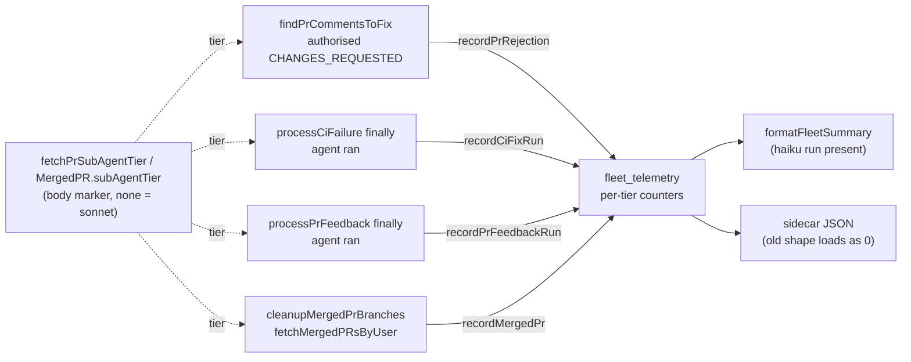

# PR Summary — Issue #3404

## Summary

The fleet summary's per-tier block now covers what happens to a PR after it is
opened, alongside the issue-run figures from #3403. For each sub-agent tier it
shows:

- authorised `CHANGES_REQUESTED` reviews;
- `ci_fix` runs and their estimated USD;
- `pr_feedback` estimated USD;
- merged PRs;
- **cost per merged PR** = (issue + `pr_feedback` + `ci_fix` USD) ÷ merged
  PRs, or `n/a` when that tier has no merged PRs.

A PR's tier is read from the `vibe-sub-agent-tier` marker in its body. A body
with no marker counts as `sonnet`. As before, the block appears only once a
haiku run has been recorded. Closes #3404.

## Spec

### Intent and Rationale

- The milestone owner (#3385) wants haiku judged against sonnet by "code review
  rejections and CI failures at a lower price". These counters put both
  figures, and cost per merged PR, on the line that already carries the
  per-tier issue spend.
- Each counter is recorded where the event already happens:
  - the review loop in `findPrCommentsToFix`, after the authorisation check;
  - the outer `finally` of `processCiFailure` and of `processPrFeedback`;
  - the merged-PR loop in `cleanupMergedPrBranches`, which reuses
    `fetchMergedPRsByUser` as the issue asked.
  None of these adds a new scan.

### Essential Design Decisions

- **Restart-safe counting.** Reviews and merges count only when their own
  timestamp (`submitted_at`, `mergedAt`) is at or after the telemetry window
  start. Within a window they are also deduplicated, by review id and by
  repo + PR number.
  - Why: the merged-PR listing returns the last 30 merges, and outstanding
    reviews persist. With a per-process dedupe alone, every restart would
    count them again in the cumulative sidecar.
  - Accepted cost: an event that happened while the worker was down is not
    counted (marked `SIMPLE-ON-PURPOSE`).
- **An unreadable body is never guessed as sonnet.** If a PR's body cannot be
  read, `fetchPrSubAgentTier` logs a warning and returns `null`, and nothing is
  recorded. A review whose tier could not be resolved is retried on the next
  scan.
- **One run per CI-fix or PR-feedback run, priced the same way as issue runs.**
  Every agent invocation in the run (the main call, retries and recovery turns)
  is summed by `estimatePhaseRunUsd`. `measureIssuePhaseRun` now calls the same
  helper, so all three are priced by one function. A run that stops before the
  agent is invoked records nothing.
- **Persisted shapes read the old shape, with no key bump.**
  - The sidecar's new counters are optional on read and default to 0; the
    schema stays at 1.
  - The `prs_merged_${user}` cache entry gains an optional `subAgentTier`. An
    entry written before this change has no tier and is not counted, rather
    than being counted as sonnet.

### Undiscoverable Facts

- The owner direction on #3385 ("measured by code review rejections and CI
  failures at a lower price") agrees with the sub-issue; nothing in it was
  overridden.
- Neither processor's agent request names a model. Pricing therefore falls back
  to the configured `claudeModel`, or else `DEFAULT_CLAUDE_MODEL`, and only
  when the run stats name no served model.

## Evidence

This is a backend and telemetry change with no UI files. The verification is
the tests listed under the Test Plan.

**Docs sweep**:
- grep: `issue_tier_`, `vibe-sub-agent-tier`, `fetchMergedPRsByUser`,
  `measureIssuePhaseRun`, "once per process", "restart re-count",
  "Mirrors the cost maths".
- section: `docs/INTERNALS.md#-fleet-telemetry--idle-blocked-and-success-rate-issue-855`.
- updated: `docs/INTERNALS.md`, `docs/CONFIGURATION.md`, `docs/USAGE.md`,
  `worker/deno/lib/phase_run_usd.ts` (module doc),
  `worker/deno/lib/issue_query.ts` (`parseMergedPrListing` doc).
- Hits left in place:
  - `docs/CONFIGURATION.md:4488` — still true because the per-repo row names
    "the fleet summary's per-tier figures" generically, and those now include
    the PR-outcome figures.
  - `docs/INTERNALS.md:1000` — still true because the `issue_tier_*` bullet is
    unchanged.
  - `docs/SETUP.md:1504` — still true because that "once per process" is about
    a token-scope warning, unrelated to this change.

**Provenance cited in the diff**:
- #3403: Per-tier issue-run telemetry and PR-body sub-agent tier marker
- #3404: Per-tier PR outcomes and cost per merged PR in fleet telemetry

## Acceptance Criteria

<!-- vibe-spec-review inputs="diff+issue-body" -->

- **met** — A CHANGES_REQUESTED review on a PR with the haiku marker increments the haiku rejection count; one without a marker increments sonnet. — evidence: `worker/deno/tests/pr_maintenance_rejection_telemetry_test.ts::rejection of a haiku-marked PR counts under haiku (Issue #3404)`, `::rejection of an unmarked PR counts under sonnet (Issue #3404)` — reviewer: met
- **met** — A ci_fix run on a haiku-marked PR adds to haiku ci_fix runs and USD. — evidence: `worker/deno/tests/pr_ci_processor_tier_telemetry_test.ts::pr_ci_processor tier telemetry - a haiku PR records one haiku run priced from its stats (Issue #3404)` — reviewer: met
- **met** — The same merged PR seen on two scans is counted once. — evidence: `worker/deno/tests/branch_cleanup_merged_telemetry_test.ts::cleanupMergedPrBranches - the same listing on two runs counts once (Issue #3404)`, `worker/deno/tests/fleet_telemetry_test.ts::fleet_telemetry - a merged PR is counted once per repo and number` — reviewer: met
- **met** — Cost per merged PR equals the summed USD ÷ merged; merged = 0 renders `n/a`, never `Infinity`/`NaN`. — evidence: `worker/deno/tests/fleet_telemetry_test.ts::fleet_telemetry - the summary renders cost per merged PR per tier`, `::fleet_telemetry - costPerMergedPr guards against nothing merged` — reviewer: met
- **met** — Sidecar files without the new fields still load. — evidence: `worker/deno/tests/fleet_telemetry_sidecar_test.ts::fleet_telemetry_sidecar - a legacy sidecar without PR outcome fields loads as zeros` — reviewer: met
- **unrequested** — Window-start filter on `recordMergedPr` and `recordPrRejection` — reviewer: unrequested — reason: without it, every restart re-counts the last 30 merges and every persistent review into the cumulative sidecar; the undercount it accepts is documented in `docs/INTERNALS.md`
- **unrequested** — Per-review-id dedupe and the reset-during-await guard on `recordPrRejection` — reviewer: unrequested — reason: reviews persist across scans the same way merged PRs do, so they need the same once-only counting the issue asks for merges
- **unrequested** — `prFeedbackRuns*` run counts kept alongside the PR-feedback USD — reviewer: unrequested — reason: kept for symmetry with the `ci_fix` counters and stored in the sidecar; not rendered
- **unrequested** — New modules `phase_run_usd.ts` and `pr_sub_agent_tier.ts` — reviewer: unrequested — reason: shared helpers for pricing and tier lookup; the reviewer saw the pricing maths duplicated from `measureIssuePhaseRun`, which now calls `estimatePhaseRunUsd`, so there is one copy
- **unrequested** — `subAgentTier` on `MergedPR` and in the `prs_merged_${user}` cache entry — reviewer: unrequested — reason: needed to count merged PRs by tier from the listing the issue says to reuse; an old-shape entry is read and not counted (tested)
- **unrequested** — Docs edits in `docs/CONFIGURATION.md`, `docs/INTERNALS.md`, `docs/USAGE.md` — reviewer: unrequested — reason: a code change owes a docs change; the reviewer's garbled-sentence note on `docs/CONFIGURATION.md` was fixed in this diff

## Standards Review

<!-- vibe-standards-review inputs="diff+CODING-STANDARDS.md" -->

- **violation** — Every outcome of a branch you add needs a test that reaches it: the post-await `seenRejections` re-check had no test — evidence: `worker/deno/lib/fleet_telemetry.ts:655` — reason: fixed in this diff (`fleet_telemetry_test.ts::fleet_telemetry - concurrent calls for the same review count it once` goes red without it)
- **violation** — Every outcome of a branch you add needs a test that reaches it: the warn-and-continue `catch` in `recordCiFixTierRun` was unreachable — evidence: `worker/deno/lib/pr_ci_processor.ts:1017` — reason: fixed in this diff (the unreachable `try`/`catch` was removed)
- **violation** — Every outcome of a branch you add needs a test that reaches it: the warn-and-continue `catch` in `recordFeedbackTierRun` was unreachable — evidence: `worker/deno/lib/pr_feedback_processor.ts:704` — reason: fixed in this diff (the unreachable `try`/`catch` was removed)
- **clean** — persisted-shape rule (old-shape tests for the sidecar and the `prs_merged_${user}` cache, schema unchanged); fail loud and log levels; Australian English; secret redaction; each changed call site tested through its real caller (`findPrCommentsToFix`, `processCiFailure`, `processPrFeedback`, `cleanupMergedPrBranches`); negative tests carry the forbidden input; docs updated; no named-but-absent tests. The reviewer found no standard worded as enforced by review only, so none was checked as such. Its optional notes were also fixed: the four-line `SIMPLE-ON-PURPOSE` comment is now one line, and the `docs/CONFIGURATION.md` row is reworded. The remaining optional note, the nominal `/tmp/tier-3404-*` strings in the feedback test, is left as is: they are only passed to mocks and never created on disk.

## Test Plan

**Edited assertion in an existing test** (`worker/deno/tests/fleet_telemetry_test.ts`, "fleet_telemetry - a haiku run adds the tier tokens right after issue_duration"):

- Removed: `"issue_tier_usd=sonnet=1.0000,haiku=0.2500 idle_by_reason=",`
- Replaced by: `"issue_tier_usd=sonnet=1.0000,haiku=0.2500 pr_tier_rejections=",`
- The issue requirement that makes it untrue: "`formatFleetSummary` adds these to the per-tier line from #3403". The new keys follow `issue_tier_usd`, so `idle_by_reason` no longer follows it directly. The key order is still pinned.

No other assertion in an existing test was removed or changed. Two existing
sidecar key lists only gained the new field names.

**Tests added**:

- `worker/deno/tests/fleet_telemetry_test.ts`:
  - rejection attribution: haiku and sonnet;
  - dedupe: the same review id, a repeated review, concurrent calls for the same
    review;
  - the window filter for reviews and merges, before, at and after the window
    start;
  - an unparseable timestamp;
  - an unresolved tier, retried later;
  - a reset during the tier lookup;
  - a CI-fix run for haiku; PR-feedback runs per tier;
  - a merged PR counted once;
  - the `costPerMergedPr` guards (0, `NaN` and negative merged);
  - the summary's cost per merged PR, and a sonnet-only summary that omits the
    keys.
- `worker/deno/tests/fleet_telemetry_sidecar_test.ts`: a legacy sidecar loads
  the new fields as zeros; `mergeCumulative` sums the fields; the fields
  round-trip through the file.
- `worker/deno/tests/pr_sub_agent_tier_test.ts`: a haiku marker, no marker,
  a gh failure, invalid JSON, and a missing or non-string body.
- `worker/deno/tests/phase_run_usd_test.ts`: no runs; undefined and usage-less
  entries; parity with `estimateRunCost`.
- `worker/deno/tests/pr_maintenance_rejection_telemetry_test.ts`: haiku and
  sonnet attribution; an unauthorised reviewer (not counted, body never read);
  two scans counted once.
- `worker/deno/tests/pr_ci_processor_tier_telemetry_test.ts` and
  `worker/deno/tests/pr_feedback_processor_tier_telemetry_test.ts`:
  - haiku and sonnet attribution;
  - an unreadable body records nothing;
  - a PR closed before the agent runs, and a run that fails before the agent is
    invoked, both record nothing;
  - CI only: the post-quality retry counts as the same run, with its USD summed.
- `worker/deno/tests/branch_cleanup_merged_telemetry_test.ts`:
  - haiku and sonnet attribution;
  - two runs over the same listing count once;
  - a PR with no head branch is still counted;
  - an old-shape cached entry is not counted.
- `worker/deno/tests/issue_query_test.ts`:
  - the tier is read from the body marker, defaulting to sonnet; the cache
    holds the tier but no body text;
  - an old-shape cache entry is served without a tier.

Every named file was checked with `git ls-files` from the repository root.

**Branch outcomes:**

- **`worker/deno/lib/fleet_telemetry.ts`**:
  - **:643** — an unparseable `submittedAt` is not counted —
    `fleet_telemetry_test.ts::fleet_telemetry - a review with a missing or unparseable submittedAt is not counted` — the flip went red.
  - **:645** — a review submitted before the window is not counted —
    `::fleet_telemetry - a review submitted before the window start is not counted and never resolves a tier` — the flip went red.
  - **:649** — a review already seen is not resolved again —
    `::fleet_telemetry - a repeated review does not resolve the tier again` — the flip went red.
  - **:651** — a `null` tier is not counted and is retried —
    `::fleet_telemetry - an unresolved tier is not counted and the review is retried later` — the flip went red.
  - **:653** — a reset during the await is discarded —
    `::fleet_telemetry - a reset during the tier lookup does not credit the new window` — the flip went red.
  - **:655** — a concurrent duplicate is counted once —
    `::fleet_telemetry - concurrent calls for the same review count it once` — the flip went red.
  - **:727** — an unparseable `mergedAt` is not counted —
    `::fleet_telemetry - a merged PR with an empty or unparseable mergedAt is not counted` — the flip went red.
  - **:728** — a merge before the window is not counted —
    `::fleet_telemetry - a merged PR before the window start is not counted` — the flip went red.
  - **:730** — a duplicate merged PR is counted once —
    `::fleet_telemetry - a merged PR is counted once per repo and number` — the flip went red.
  - **:750** — `merged <= 0` renders `n/a` —
    `::fleet_telemetry - costPerMergedPr guards against nothing merged`
    (`costPerMergedPr(-2, -1)`) — the flip went red.
  - **:752** — a non-finite quotient renders `n/a` — the same test — the flip
    went red.
  - **:884** — the keys are shown only with a haiku run —
    `::fleet_telemetry - a sonnet-only summary omits the PR outcome keys` —
    the flip went red.
- **`worker/deno/lib/fleet_telemetry_sidecar.ts:186`** — `withPrOutcomeCounters`
  fills absent fields with 0 —
  `fleet_telemetry_sidecar_test.ts::fleet_telemetry_sidecar - a legacy sidecar without PR outcome fields loads as zeros` — the flip went red.
- **`worker/deno/lib/pr_sub_agent_tier.ts`**:
  - **:54** — the marker tier, or sonnet when there is no marker —
    `pr_sub_agent_tier_test.ts::fetchPrSubAgentTier - a haiku marker resolves to haiku and asks gh for the body` — the flip went red.
  - **:60** — an unreadable body gives `null` and a warning —
    `::fetchPrSubAgentTier - a gh failure returns null and warns` — the flip
    went red.
- **`worker/deno/lib/phase_run_usd.ts:29`** — a usage-less entry is skipped —
  `phase_run_usd_test.ts::phase_run_usd - undefined and usage-less entries are skipped` — the flip went red.
- **`worker/deno/lib/pr_ci_processor.ts`**:
  - **:1021** — no record when the agent never ran —
    `pr_ci_processor_tier_telemetry_test.ts::… - a run that fails before the agent is invoked records nothing (Issue #3404)` — the flip went red.
  - **:1029** — a `null` tier records nothing —
    `::… - an unreadable body records nothing (Issue #3404)` — the flip went red.
- **`worker/deno/lib/pr_feedback_processor.ts`**:
  - **:708** — no record when the agent never ran —
    `pr_feedback_processor_tier_telemetry_test.ts::… - a run that fails before the agent is invoked records nothing (Issue #3404)` — the flip went red.
  - **:716** — a `null` tier records nothing —
    `::… - an unreadable body records nothing (Issue #3404)` — the flip went red.
- **`worker/deno/lib/branch_cleanup.ts:214`** — an entry with no tier (old
  cache shape) is not counted, and the call precedes the `headRefName` skip:
  - `branch_cleanup_merged_telemetry_test.ts::cleanupMergedPrBranches - an old-shape cached entry without a tier is not counted (Issue #3404)`;
  - `::… - a merged PR with no head branch is still counted (Issue #3404)`;
  - removing the call and moving it below the skip each went red.
- **`worker/deno/lib/issue_query.ts:1927`** — the tier comes from the body
  marker, defaulting to sonnet —
  `issue_query_test.ts::issue_query - fetchMergedPRsByUser - reads the sub-agent tier from the body marker, defaulting to sonnet (Issue #3404)` — dropping the tier went red.

**Call sites and entry points checked.** Each test drives the real entry point
and goes red when only that caller's hook is removed:

- `findPrCommentsToFix` (rejection), via
  `pr_maintenance_rejection_telemetry_test.ts`. Moving the call above the
  authorisation check also turned the unauthorised-reviewer test red.
- `processCiFailure`, via `pr_ci_processor_tier_telemetry_test.ts`.
- `processPrFeedback`, via `pr_feedback_processor_tier_telemetry_test.ts`.
- `cleanupMergedPrBranches`, via `branch_cleanup_merged_telemetry_test.ts`.
- `measureIssuePhaseRun` now calls `estimatePhaseRunUsd` with the same inputs.
  `issue_run_stats_comment_test.ts` and the `completion_phase*` tests pass
  unchanged.

**Callers and siblings checked**:

- `recordPrRejection` and `recordMergedPr` each have one production caller.
- `fetchMergedPRsAnyAuthor` shares `parseMergedPrListing`, so it gains the tier
  harmlessly; it is not counted anywhere.
- `cleanupStaleRemoteBranches` also lists merged PRs but deliberately records
  nothing, so each merge is counted from one place.
- Every `runClaudeWithRetry` call in both processors feeds the run's stats:
  two in `pr_ci_processor.ts`, and four in `pr_feedback_processor.ts` through
  `runAgentTracked`.

**Guards kept.** The rejection hook sits below the host's own-review skip and
the authorisation check, so an unauthorised review is never counted.

**Gate.** Targeted runs passed: fmt, lint, `deno task check` across the whole
tree, and the touched test files. The full gate result is in the final line
below.
