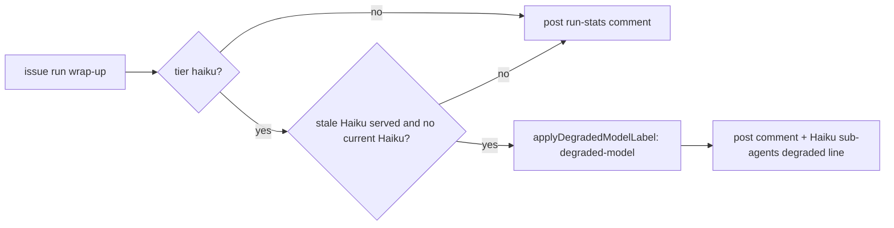

## Summary

An `issue`-phase run that resolved `issue_sub_agent_tier: "haiku"` but was
served a previous-generation Haiku (e.g. `claude-haiku-4-5`) and no current
Haiku now gets the `degraded-model` label. Its run-stats comment also carries a
`- **Haiku sub-agents degraded:** requested … served …` line naming both
models, so a trial result is never silently measured on the wrong model.
Closes #3405.

## Spec

### Intent and Rationale

- Issue runs never reach `reportPhaseDegradation`. The new
  `reportIssueSubAgentDegradation` (`worker/deno/lib/issue_sub_agent_degradation.ts`)
  is therefore called on the two paths that post an `issue`-phase run-stats
  comment: `postWorkOnRunStats` in `completion_phase.ts` (PR raise) and the
  already-resolved close in `handle_no_changes_phase.ts`. That keeps the label
  paired with the comment line that justifies it.
- Stale-Haiku detection calls the existing owners: `previousGenerationOf` /
  `CURRENT_TIER_MODELS` (`current_models.ts`), `parseClaudeModernVersion`
  (`token_usage.ts`) and `applyDegradedModelLabel`
  (`planning_degraded_label.ts`). No version parsing or labelling is
  re-implemented.

### Essential Design Decisions

- The check is lenient like `assessPreviousGeneration`: if any current (or
  newer) Haiku was served, the run counts as healthy.
- Any earlier Haiku generation `previousGenerationOf` recognises counts as
  stale, not only the literal `claude-haiku-4-5*`. Dated ids such as
  `claude-haiku-4-5-20251001` are covered.
- The tier is resolved with `resolveIssueSubAgentTier` from the host value and
  the `repo_config` override, the same resolver the execute path uses. A
  `"sonnet"` tier returns before any served-model inspection.
- Served model ids come from the API, so they pass through an allow-list
  sanitiser (`[A-Za-z0-9._:@/-]`) before they reach the comment.

### Undiscoverable Facts

- #3400's `CURRENT_TIER_MODELS` haiku row was merged to `main` (#3432), not to
  this milestone branch. Merging all of `main` conflicts in
  `docs/CONFIGURATION.md`, `config_defaults.ts` and `issue_sub_agent_tier.ts`.
  So `worker/deno/lib/current_models.ts` and its test are taken from
  `origin/main` byte-for-byte, and the milestone sync merges them cleanly.

## Evidence

Backend-only change; no UI file touched. The new tests in
`worker/deno/tests/issue_sub_agent_degradation_test.ts`,
`worker/deno/tests/completion_phase_run_stats_test.ts` and
`worker/deno/tests/handle_no_changes_phase_test.ts` drive each tier/served
combination, with `gh` stubbed.

- `gh` stub: the label calls are mirrored from `addLabelToIssue` /
  `ensureLabelExists` in `worker/deno/lib/label_operations.ts`. That is the REST
  `api -X POST repos/<repo>/issues/<n>/labels -f labels[]=…`, then the
  `issue edit … --add-label` fallback.
- Issue numbers cited: #3405 (Apply degraded-model when Haiku 4.5 is served to a
  haiku-tier issue run); #3400 (Model tables for Haiku 5.5: 1M haiku context
  window, budget probe model, current haiku id); #3402 (Tier-aware issue-run
  sub-agents: Haiku executors/standards reviewer and read-only explorer).

**Docs sweep** — grep: `degraded-model`, `issue_sub_agent_tier`,
`CURRENT_TIER_MODELS`, `reportPhaseDegradation`; section:
`docs/MODEL-AND-CACHING.md#haiku-sub-agent-tier-issue-phase`; updated:
`docs/MODEL-AND-CACHING.md` (new "Served-model check" paragraph),
`worker/deno/lib/issue_run_stats_comment.ts` module doc (item 5);
`docs/MODEL-AND-CACHING.md:1308` — still true because the label lifecycle
section describes the planning run and its own guarantees (non-reserved, never
removed) also hold here; `docs/CONFIGURATION.md:453` — still true because the
row describes what the tier selects and links to the section updated above;
`worker/deno/lib/phase_run_stats.ts:3` — still true because it documents the
six planning-shaped phases, which this change does not route through.

## Acceptance Criteria

<!-- vibe-spec-review inputs="diff+issue-body" -->

- **met** — Tier `haiku`, served `claude-haiku-4-5` only → `degraded-model` applied and the run-stats comment names both models. — evidence: `worker/deno/tests/issue_sub_agent_degradation_test.ts::haiku tier served haiku-4-5 - degraded, labelled, both models named`, `worker/deno/tests/completion_phase_run_stats_test.ts::completion - a haiku-tier run served haiku-4-5 labels degraded-model and names both models (Issue #3405)`, `worker/deno/tests/handle_no_changes_phase_test.ts::handle_no_changes_phase - a haiku-tier already-complete close labels degraded-model and names both Haiku models (Issue #3405)` — reviewer: met
- **met** — Tier `haiku`, served `claude-haiku-5-5` → no label. — evidence: `worker/deno/tests/issue_sub_agent_degradation_test.ts::haiku tier served current haiku - healthy, no gh call` — reviewer: met
- **met** — Tier `sonnet`, served `claude-haiku-4-5` (e.g. a Haiku phase) → no label from this check. — evidence: `worker/deno/tests/issue_sub_agent_degradation_test.ts::sonnet tier served haiku-4-5 - never triggers, no gh call`, `worker/deno/tests/completion_phase_run_stats_test.ts::completion - the default sonnet tier never labels or renders the Haiku line (Issue #3405)` — reviewer: met
- **met** — A label-apply failure is logged as a warning with the issue number, not swallowed. — evidence: `worker/deno/tests/issue_sub_agent_degradation_test.ts::label-apply failure - does not throw, still returns the assessment, warns with the issue number` — reviewer: partial — reason: the reviewer correctly found that the test passed on this module's own pre-label warning; it now asserts the exact `Failed to apply degraded-model label (non-fatal)` warning with the issue number, and goes red when that warning is removed from `applyDegradedModelLabel`
- **unrequested** — `CURRENT_TIER_MODELS` haiku row and its test, taken byte-for-byte from `origin/main` — reviewer: unrequested — reason: the issue's check depends on this #3400 deliverable, which landed on `main` but not on this milestone branch
- **unrequested** — `docs/MODEL-AND-CACHING.md` "Served-model check" paragraph — reviewer: unrequested — reason: a behaviour change owes a docs change (CODING-STANDARDS.md)
- **unrequested** — `docs/audits/lib-sweep-coverage/top-up-3405.json` — reviewer: unrequested — reason: the `lib_sweep_coverage_test.ts` gate requires every new `worker/deno/lib/` module to be claimed by a sweep slice
- **unrequested** — `sanitiseModelId` allow-list on the rendered model ids — reviewer: unrequested — reason: the ids are API-sourced text rendered into a GitHub comment (output encoding, Secure Coding Principles)
- **unrequested** — one current Haiku among the served models keeps the run healthy — reviewer: unrequested — reason: this reads the issue's "and `CURRENT_TIER_MODELS.haiku` was not [served]" literally
- **unrequested** — `repo_config` override test — reviewer: unrequested — reason: proves the call site resolves the tier through `resolveIssueSubAgentTier`'s per-repo override, as the execute path does

## Standards Review

<!-- vibe-standards-review inputs="diff+CODING-STANDARDS.md" -->

- **clean** — Checked: the removed-assertion rule; new tests going red without their change; tests exercising real code (no grep tests); named tests existing; no workflow files changed; docs owed with the code change; security (allow-list sanitiser, non-fatal labelling); Australian English. `CODING-STANDARDS.md` names no "by review only" rule, so no review-enforced rule applied. Optional notes: the haiku row also makes `assessPreviousGeneration` flag Haiku 4.x on Haiku-alias phases, which is #3400's documented intent; `sweptAt` in `top-up-3405.json` names the commit that added the module.

## Test Plan

- Added `worker/deno/tests/issue_sub_agent_degradation_test.ts`. It has 9 tests: haiku/stale, haiku/current, haiku/no Haiku, haiku/stale+current, dated id, sonnet tier, label-apply failure warning, sanitiser, and no-degradation line.
- Added three tests to `worker/deno/tests/completion_phase_run_stats_test.ts`: haiku tier, `repo_config` override, and the default sonnet tier. Its `makeDeps` now records `runGhCommand` calls and answers `label list` with `[]`; every other call gets the same PR URL as before.
- Added one test to `worker/deno/tests/handle_no_changes_phase_test.ts`: the haiku-tier already-resolved close.
- `worker/deno/tests/current_models_test.ts` is taken from `origin/main` (#3400). Removed assertion: `assertEquals(previousGenerationOf("claude-haiku-4-5"), undefined);` from "untracked tiers are never flagged". The haiku row this issue's check requires makes it untrue. The replacement test "previousGenerationOf - Haiku 4.5 is a previous generation of Haiku 5.5 (Issue #3400)" covers the new behaviour.
- Ran `deno test -A tests/issue_sub_agent_degradation_test.ts tests/completion_phase_run_stats_test.ts tests/handle_no_changes_phase_test.ts tests/issue_run_stats_comment_test.ts tests/current_models_test.ts`: passed (164 tests) before the opus-only test was added. `issue_sub_agent_degradation_test.ts` alone, after it was added: passed (9 tests).
- Ran `./quality.sh`: passed (config integration skipped), after the final code change.
- Entry points checked: `postWorkOnRunStats` (`completion_phase.ts:1095`) and the already-resolved close (`handle_no_changes_phase.ts:282`). Removing either call turned its phase test red. `reportPhaseDegradation` does not need the check: it serves non-`issue` phases, which have no sub-agent tier.
- `subAgentDegradation` is optional on `buildIssueRunStatsComment` / `postIssueRunStatsComment`. It is data, not a switch: absent means nothing degraded. Every `issue`-phase caller passes it, and the non-issue callers have no tier to report.

**Branch outcomes:**

- `worker/deno/lib/issue_sub_agent_degradation.ts:43` — tier not haiku → undefined — `worker/deno/tests/issue_sub_agent_degradation_test.ts::sonnet tier served haiku-4-5 - never triggers, no gh call` — removing the tier check turned it red
- `worker/deno/lib/issue_sub_agent_degradation.ts:60` — a current Haiku was served → undefined — `worker/deno/tests/issue_sub_agent_degradation_test.ts::haiku tier served both stale and current haiku - one current keeps it healthy` — dropping the check turned it red
- `worker/deno/lib/issue_sub_agent_degradation.ts:63` — no stale Haiku → undefined — `worker/deno/tests/issue_sub_agent_degradation_test.ts::haiku tier served no haiku at all - healthy, no gh call` — returning an assessment instead turned it red
- `worker/deno/lib/issue_sub_agent_degradation.ts:63` — stale Haiku → assessment — `worker/deno/tests/completion_phase_run_stats_test.ts::completion - a haiku-tier run served haiku-4-5 labels degraded-model and names both models (Issue #3405)` — removing the call site (no assessment) turned it red
- `worker/deno/lib/issue_sub_agent_degradation.ts:80` — no degradation → empty line — `worker/deno/tests/issue_sub_agent_degradation_test.ts::no degradation - no line and no comment text` — returning a line turned it red
- `worker/deno/lib/issue_sub_agent_degradation.ts:109` — healthy run → no gh call — `worker/deno/tests/issue_sub_agent_degradation_test.ts::haiku tier served current haiku - healthy, no gh call` — labelling anyway turned it red
- `worker/deno/lib/issue_run_stats_comment.ts:649` — degradation present → Haiku line rendered — `worker/deno/tests/handle_no_changes_phase_test.ts::handle_no_changes_phase - a haiku-tier already-complete close labels degraded-model and names both Haiku models (Issue #3405)` — rendering nothing turned it red

🤖 Generated with [Claude Code](https://claude.com/claude-code)
