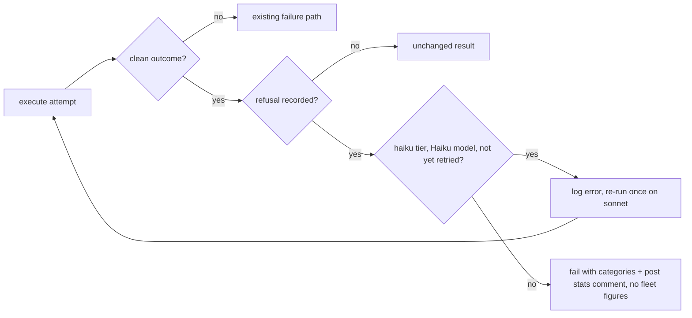

## Summary

A safety refusal in an `issue`-phase execute attempt no longer counts as a
success or as "no changes". The worker now reads refusals from the run's
stream-json (`worker/deno/lib/agent_refusal.ts`). If a Haiku model refuses on
the `"haiku"` sub-agent tier, the worker logs an error naming the category and
re-runs the execute phase once on the `"sonnet"` tier. The run fails in three
cases: a refusal on that retry, any refusal on a `"sonnet"`-tier run, and a
refusal by a non-Haiku model. The failure reason names the categories. The
run-stats comment carries a `- **Safety refusal:** …` line naming the category
and what the retry did. The line appears on the PR-raise comment, on the
already-resolved close's comment, and on the comment the refusal-failure path
posts. Closes #3406.

## Spec

### Intent and Rationale

- Detection is one small helper, `extractAgentRefusals`. It reads the CLI's
  `model_refusal_no_fallback` system event or, on an older CLI, an assistant
  frame with `stop_reason: "refusal"`. When the system event is present, the
  matching assistant frame is not counted a second time. A turn the CLI already
  recovered on a fallback model (`model_refusal_fallback`) is not counted.
  `RunStats.refusals` is set only when the run refused, so a run with no
  refusal has exactly the stats it had before.
- The policy lives in `worker/deno/lib/haiku_refusal_retry.ts`
  (`decideRefusalAction`, `buildRefusalFailureReason`,
  `buildAgentRefusalLine`). `executeWithRefusalRetry` in
  `worker/deno/lib/phases/execute_phase.ts` applies it by wrapping
  `executeWithFreshSessionFallback`.
- Only a clean attempt (`continue`, or `early_exit` with `no_changes`) can hide
  a refusal. An attempt that already failed keeps its own failure path.

### Essential Design Decisions

- Once `state.agentRefusal` is set, every later execute attempt in the run
  resolves its tier to `REFUSAL_RETRY_TIER` (`"sonnet"`). That includes the
  in-process infrastructure retry (`shouldRetryInfrastructureFailure`), so the
  run never drops back to Haiku.
- A refused run fails, and the generic failure path posts no stats comment, so
  the execute phase posts it itself through `postWorkOnRunStats`. That function
  is now exported and takes a required `recordFigures` option. The value
  `false` keeps the failed run out of the `issue_*` fleet counters.
- Model ids and categories come from the API, so both are cleaned before they
  reach a comment. Model ids go through the shared `sanitiseModelId`.
  Categories are restricted to `[a-z0-9_-]` and capped at 64 characters. The
  failure reason avoids the words `detectFailureCategory` keys off, so a
  refusal is never read as an infrastructure fault.

### Undiscoverable Facts

- The event shapes come from the Claude Code 2.1.293 CLI's own SDK schema, as
  recorded in the `worker/deno/lib/agent_refusal.ts` module doc. Haiku has no
  server-side refusal fallback.
- The issue asks for the refusal to be logged as an error. The Standards
  reviewer noted that the log-level standard would make a retry a warning, but
  the issue's own wording is kept.
- The owner directions on #3385 (configurable executor tier, outcome-per-dollar
  measurement) do not conflict with this sub-issue, so the sub-issue
  description stands unchanged.

## Evidence

Backend-only change; no UI file touched.

Issue numbers this diff adds as provenance: #3406: Haiku 5.5 safety refusal:
fail loud and retry once on the sonnet tier.

Load-bearing fakes: `worker/deno/tests/haiku_refusal_retry_test.ts` stubs
`runClaudeWithRetry` with a result whose `runStats` comes from the real
`buildRunStats` over fixture stream-json. This mirrors the production
`recordClaudeRunStats` capture, which reads `runStats` off the invocation
result.

**Docs sweep** — grep: `postWorkOnRunStats`, `sanitiseModelId`,
`agentRefusal`, `model_refusal`, `stop_reason\W+refusal`, `Safety refusal`,
`already-resolved close`, `run-stats comment`, `Issue run model stats`;
section: `docs/MODEL-AND-CACHING.md#haiku-sub-agent-tier-issue-phase`;
updated: `docs/MODEL-AND-CACHING.md`. That covers the "Safety refusals"
paragraph, which now says the line is on the PR-raise and already-resolved
close comments and that the failure path posts its own comment without fleet
figures. It also covers the "Served-model check" paragraph and the run-stats
"Implementation" list, which now name the refusal-failure path. Hits left in
place: `docs/INTERNALS.md:986` — still true because it describes completed
implementation runs, and a refused run records no figures;
`docs/CONFIGURATION.md:453` and `docs/CONFIGURATION.md:4488` — still true
because they describe what the tier selects, not the refusal policy;
`worker/deno/lib/issue_sub_agent_degradation.ts:66` — still true because the
allow-list doc fits its new caller too.

## Acceptance Criteria

<!-- vibe-spec-review inputs="diff+issue-body" -->

- **met** — A refusal on a haiku-tier run triggers exactly one sonnet-tier retry. — evidence: `worker/deno/tests/haiku_refusal_retry_test.ts::execute - a haiku-tier Haiku refusal retries once on sonnet and a clean retry continues (Issue #3406)` — reviewer: met
- **met** — A refusal on the retry fails the run (non-success outcome) — no third attempt. — evidence: `worker/deno/tests/haiku_refusal_retry_test.ts::execute - a second refusal on the sonnet retry fails the run with no third attempt (Issue #3406)` — reviewer: met
- **met** — A refusal on a sonnet-tier run is not retried and fails loud. — evidence: `worker/deno/tests/haiku_refusal_retry_test.ts::execute - a sonnet-tier refusal fails at once without a retry (Issue #3406)` — reviewer: met
- **met** — The run-stats comment names the refusal category and the retry outcome. — evidence: `worker/deno/tests/completion_phase_run_stats_test.ts::completion - the PR-raise stats comment carries the safety-refusal line when the state has one (Issue #3406)`, `worker/deno/tests/handle_no_changes_phase_test.ts::handle_no_changes_phase - an already-complete close carries the safety-refusal line when the state has one (Issue #3406)` — reviewer: met
- **met** — Runs with no refusal behave exactly as before. — evidence: `worker/deno/tests/haiku_refusal_retry_test.ts::execute - no refusal on the ${tier} tier runs once, unchanged, with no extra comment (Issue #3406)` — reviewer: met
- **unrequested** — `docs/audits/lib-sweep-coverage/top-up-3406.json` ledger entry — reviewer: unrequested — reason: every new `worker/deno/lib/` module needs a lib-sweep coverage claim, following the sibling `top-up-3405.json`
- **unrequested** — `docs/MODEL-AND-CACHING.md` edits — reviewer: unrequested — reason: the repository's docs rule requires the manual describing the run-stats comment and tier to be updated with the behaviour
- **unrequested** — `postWorkOnRunStats` exported with a `recordFigures` option — reviewer: unrequested — reason: the refusal-failure path must post the stats comment the criteria require, and a failed run must not count as a completed run in fleet telemetry
- **unrequested** — handling of `model_refusal_fallback`/`model_refusal_no_fallback`, de-duplication, and string cleaning — reviewer: unrequested — reason: detection has to read the shapes the CLI actually emits without double-counting, and API-sourced strings are rendered into Markdown
- **unrequested** — later attempts in a refused run (including the infrastructure retry) stay on sonnet — reviewer: unrequested — reason: without it the infrastructure retry after a sonnet retry would silently drop back to the tier that refused
- **unrequested** — refusal line also on the already-resolved close path — reviewer: unrequested — reason: the reviewer called it a reasonable way to meet criterion 4; that path posts the run's only stats comment

## Standards Review

<!-- vibe-standards-review inputs="diff+CODING-STANDARDS.md" -->

- **clean** — no violations. Checked: the requirements coverage, fail-loud handling (a refusal never passes as `continue` or `no_changes`), a test for each changed call site (completion, no-changes close, execute, the comment builder, `run_stats`), the required `recordFigures` parameter on both callers, branch outcomes of `decideRefusalAction` and `buildAgentRefusalLine`, negative fixtures holding the forbidden input, cleaning of hostile input with no backtracking regex, named tests existing, no over-engineering (`sanitiseModelId` exported, not copied), "Check where you insert", Australian English, and that no assertion was removed. Review-enforced rules: the reviewer found none worded as review-only. Optional notes: the retry is logged at error level, as the issue asks; a long doc line at `docs/MODEL-AND-CACHING.md:1568`, rewrapped in this diff

## Test Plan

- No assertion is removed from any existing test. Every test file in the diff
  is additions only: `worker/deno/tests/agent_refusal_test.ts`,
  `worker/deno/tests/haiku_refusal_retry_test.ts`,
  `worker/deno/tests/completion_phase_run_stats_test.ts`,
  `worker/deno/tests/handle_no_changes_phase_test.ts` and
  `worker/deno/tests/issue_run_stats_comment_test.ts`, with 0 lines deleted.
- New `worker/deno/tests/agent_refusal_test.ts` (14 tests): detection shapes,
  de-duplication, a recovered fallback, cleaning, the empty-after-cleaning
  fallbacks, the length cap, and `isHaikuModel`.
- New `worker/deno/tests/haiku_refusal_retry_test.ts` (16 tests): fixture
  stream-json for refusal→retry→success, refusal→retry→refusal, a sonnet-tier
  refusal, a non-Haiku refusal, no refusal on each tier, the `no_changes`
  attempts, the infrastructure retry staying on sonnet, the fleet-telemetry
  exclusion, and a failed attempt keeping its path. Also unit tests of the
  policy helpers.
- Added tests: 2 in `worker/deno/tests/completion_phase_run_stats_test.ts`, 1
  in `worker/deno/tests/issue_run_stats_comment_test.ts` and 1 in
  `worker/deno/tests/handle_no_changes_phase_test.ts`.
- Ran `deno test -A tests/agent_refusal_test.ts tests/haiku_refusal_retry_test.ts tests/issue_run_stats_comment_test.ts tests/completion_phase_run_stats_test.ts tests/handle_no_changes_phase_test.ts`
  from `worker/deno` at the head: `ok | 175 passed | 0 failed`.
- `./quality.sh < /dev/null` passed at the code head: `Result: PASSED (with skipped checks)`. The one skipped check is `config integration`.
- Callers checked for the new required `recordFigures` parameter:
  `worker/deno/lib/phases/completion_phase.ts:1007` (`true`, the PR-raise
  path) and `worker/deno/lib/phases/execute_phase.ts:435` (`false`, the
  refusal failure). Callers checked for `agentRefusal` on
  `postIssueRunStatsComment`: completion (`completion_phase.ts:1143`) and the
  no-changes close (`handle_no_changes_phase.ts:324`) pass it.
  `phase_run_stats.ts:233` serves non-`issue` phases, which run no refusal
  policy, so it does not need it.
- Guards on the new failure path: it returns `status: "failure"` to
  `workOnIssueExecuteClaude`, so the existing failure handling and its guards
  run after it unchanged. It posts the stats comment but skips the fleet
  figures. `execute - a refused, failed run is kept out of the issue_* fleet telemetry (Issue #3406)`
  goes red when that guard is removed.

**Branch outcomes:**

- `worker/deno/lib/agent_refusal.ts:40` — non-string model → `unknown` — `worker/deno/tests/agent_refusal_test.ts::missing model becomes unknown` — flipping the fallback value turned it red
- `worker/deno/lib/agent_refusal.ts:41` — model empty after cleaning → `unknown` — `worker/deno/tests/agent_refusal_test.ts::a model id empty after cleaning becomes unknown` — changing the fallback to `""` turned it red
- `worker/deno/lib/agent_refusal.ts:46` — non-string category → `unspecified` — `worker/deno/tests/agent_refusal_test.ts::null category becomes unspecified` — flipping the fallback value turned it red
- `worker/deno/lib/agent_refusal.ts:47` — over-long category → capped at 64 — `worker/deno/tests/agent_refusal_test.ts::a 10k-character category is capped at 64` — raising the cap turned it red
- `worker/deno/lib/agent_refusal.ts:51` — category empty after cleaning → `unspecified` — `worker/deno/tests/agent_refusal_test.ts::a category empty after cleaning becomes unspecified` — returning the bare cleaned value turned it red
- `worker/deno/lib/agent_refusal.ts:74` — line without `refusal` → skipped unparsed — exempt (untestable): it is a fast path only, and removing it gives the same output, so no output-level test can tell it apart
- `worker/deno/lib/agent_refusal.ts:78` — malformed JSON line → skipped — `worker/deno/tests/agent_refusal_test.ts::malformed JSON line is skipped` (its line `{not json refusal` passes the line-74 pre-check and reaches the `catch`) — pushing a refusal from the `catch` turned it red
- `worker/deno/lib/agent_refusal.ts:82` — `model_refusal_no_fallback` event → one refusal — `worker/deno/tests/agent_refusal_test.ts::system no_fallback event yields one entry with its category` — matching nothing turned it red
- `worker/deno/lib/agent_refusal.ts:88` — `model_refusal_fallback` event → recovered, nothing counted — `worker/deno/tests/agent_refusal_test.ts::model_refusal_fallback plus assistant frame is recovered` — matching nothing turned it red
- `worker/deno/lib/agent_refusal.ts:92` — assistant frame with `stop_reason: "refusal"` → one refusal — `worker/deno/tests/agent_refusal_test.ts::older CLI assistant frame alone yields one entry` — `false` turned it red
- `worker/deno/lib/agent_refusal.ts:101` — structured signal present → system refusals only — `worker/deno/tests/agent_refusal_test.ts::system event plus matching assistant frame is counted once` — returning both lists turned it red
- `worker/deno/lib/agent_refusal.ts:107` — bare `haiku` alias / modern Haiku id → Haiku — `worker/deno/tests/agent_refusal_test.ts::isHaikuModel recognises Haiku-tier ids only` — breaking either half turned it red
- `worker/deno/lib/haiku_refusal_retry.ts:31` — no refusals → `none` — `worker/deno/tests/haiku_refusal_retry_test.ts::decideRefusalAction - none, retry-on-sonnet and fail` — returning `fail` turned it red
- `worker/deno/lib/haiku_refusal_retry.ts:33` — haiku tier, not yet retried → `retry-on-sonnet`; sonnet tier or already retried → `fail` — `worker/deno/tests/haiku_refusal_retry_test.ts::decideRefusalAction - none, retry-on-sonnet and fail` — dropping the tier check, and separately the retried check, each turned it red
- `worker/deno/lib/haiku_refusal_retry.ts:34` — no Haiku model among the refusals → `fail` — `worker/deno/tests/haiku_refusal_retry_test.ts::execute - a non-Haiku refusal on the haiku tier is not retried (Issue #3406)` — `true` turned it red
- `worker/deno/lib/haiku_refusal_retry.ts:81` — `not-retried` reason vs `refused` reason — `worker/deno/tests/haiku_refusal_retry_test.ts::buildRefusalFailureReason - names both refusals and avoids infrastructure wording` — never taking the `not-retried` arm turned it red
- `worker/deno/lib/haiku_refusal_retry.ts:91` — no outcome → empty line — `worker/deno/tests/haiku_refusal_retry_test.ts::buildAgentRefusalLine - renders all four retry outcomes and nothing for none` — returning a line turned it red
- `worker/deno/lib/haiku_refusal_retry.ts:95` / `:98` / `:101` / `:105` — `not-retried` / `ran` / `succeeded` / `refused` wording — `worker/deno/tests/haiku_refusal_retry_test.ts::buildAgentRefusalLine - renders all four retry outcomes and nothing for none` — replacing each arm's text, one arm at a time, turned it red
- `worker/deno/lib/issue_run_stats_comment.ts:659` — refusal present → line rendered; absent → nothing — `worker/deno/tests/issue_run_stats_comment_test.ts::buildIssueRunStatsComment - renders the safety-refusal line after the stats and leaves other comments byte-identical (Issue #3406)` — rendering nothing turned it red
- `worker/deno/lib/issue_run_stats_comment.ts:903` — `agentRefusal` passed through when present — `worker/deno/tests/completion_phase_run_stats_test.ts::completion - the PR-raise stats comment carries the safety-refusal line when the state has one (Issue #3406)` — dropping the spread turned it red
- `worker/deno/lib/phases/completion_phase.ts:1007` — PR-raise path records fleet figures (`recordFigures: true`) — `worker/deno/tests/completion_phase_run_stats_test.ts::completion - records the run in fleet telemetry with the figures the comment reports (Issue #2347)` — changing it to `false` turned it red
- `worker/deno/lib/phases/completion_phase.ts:1143` — state refusal passed to the comment — `worker/deno/tests/completion_phase_run_stats_test.ts::completion - the PR-raise stats comment carries the safety-refusal line when the state has one (Issue #3406)` — dropping the spread turned it red
- `worker/deno/lib/phases/completion_phase.ts:1157` — `recordFigures: false` → no fleet figures recorded — `worker/deno/tests/haiku_refusal_retry_test.ts::execute - a refused, failed run is kept out of the issue_* fleet telemetry (Issue #3406)` — removing `options.recordFigures &&` turned it red
- `worker/deno/lib/phases/handle_no_changes_phase.ts:324` — state refusal passed to the already-complete close's comment — `worker/deno/tests/handle_no_changes_phase_test.ts::handle_no_changes_phase - an already-complete close carries the safety-refusal line when the state has one (Issue #3406)` — removing the spread turned it red
- `worker/deno/lib/phases/execute_phase.ts:374` — refusal seen → tier forced to sonnet — `worker/deno/tests/haiku_refusal_retry_test.ts::execute - the infrastructure retry after a sonnet retry stays on the sonnet tier (Issue #3406)` — removing the override turned it red
- `worker/deno/lib/phases/execute_phase.ts:400` — `no_changes` early exit counts as clean — `worker/deno/tests/haiku_refusal_retry_test.ts::execute - a refusal on an attempt that ended no_changes fails instead of exiting early (Issue #3406)` — `false` turned it red
- `worker/deno/lib/phases/execute_phase.ts:402` — attempt that already failed → returned unchanged — `worker/deno/tests/haiku_refusal_retry_test.ts::execute - a refusal on an attempt that already failed keeps the failure path and is not retried on sonnet (Issue #3406)` — changing the guard to `if (false)` turned it red
- `worker/deno/lib/phases/execute_phase.ts:411` — clean retry → `retry: "succeeded"` — `worker/deno/tests/haiku_refusal_retry_test.ts::execute - a haiku-tier Haiku refusal retries once on sonnet and a clean retry continues (Issue #3406)` — removing the update turned it red
- `worker/deno/lib/phases/execute_phase.ts:418` — `retry-on-sonnet` → one re-run — `worker/deno/tests/haiku_refusal_retry_test.ts::execute - a haiku-tier Haiku refusal retries once on sonnet and a clean retry continues (Issue #3406)` — never taking the arm turned it red
- `worker/deno/lib/phases/execute_phase.ts:428` — refusal on the retry → `retry: "refused"` with both refusal lists — `worker/deno/tests/haiku_refusal_retry_test.ts::execute - a second refusal on the sonnet retry fails the run with no third attempt (Issue #3406)` — recording `not-retried` instead turned it red
- `worker/deno/lib/phases/execute_phase.ts:435` — refusal failure posts the stats comment — `worker/deno/tests/haiku_refusal_retry_test.ts::execute - a sonnet-tier refusal fails at once without a retry (Issue #3406)` — removing the post turned it red
- `worker/deno/lib/run_stats.ts:243` — refusals present → field set; none → field absent — `worker/deno/tests/agent_refusal_test.ts::buildRunStats carries refusals only when present` — always setting the field turned it red
- `worker/deno/lib/run_stats.ts:279` — parsed refusals carried onto `RunStats` — `worker/deno/tests/agent_refusal_test.ts::buildRunStats carries refusals only when present` — dropping the spread turned it red

🤖 Generated with [Claude Code](https://claude.com/claude-code)
