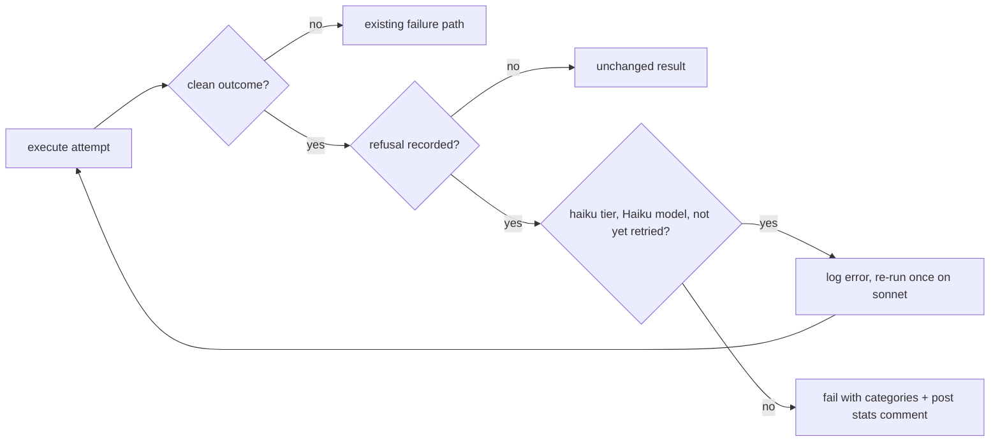

## Summary

An `issue`-phase execute attempt that ends with a safety refusal is no longer
counted as a success or as "no changes". The worker now reads refusals from
the run's stream-json (`worker/deno/lib/agent_refusal.ts`). If a Haiku model
refuses on the `"haiku"` sub-agent tier, the worker logs an error naming the
category and re-runs the execute phase once on the `"sonnet"` tier. A refusal
on that retry fails the run, and so does any refusal on a `"sonnet"`-tier run
or by a non-Haiku model. The failure reason names the categories. The run-stats
comment carries a `- **Safety refusal:** …` line naming the category and what
the retry did. Closes #3406.

⚠️ **Known gap at this head:** the new test
`worker/deno/tests/handle_no_changes_phase_test.ts::handle_no_changes_phase - an already-complete close carries the safety-refusal line when the state has one (Issue #3406)`
fails. `worker/deno/lib/phases/handle_no_changes_phase.ts` never passes
`state.agentRefusal` to `postIssueRunStatsComment`, so the stats comment on the
already-complete close has no refusal line. See Acceptance Criteria 4 and the
Standards Review.

## Spec

### Intent and Rationale

- Detection is one small helper, `extractAgentRefusals`. It reads the CLI's
  `model_refusal_no_fallback` system event, or on an older CLI the assistant
  frame with `stop_reason: "refusal"`. When the system event is present the
  assistant frame is not counted again. A turn the CLI already recovered on a
  fallback model (`model_refusal_fallback`) is not counted. The refusals ride
  on `RunStats.refusals`, which is only set when there was a refusal, so a run
  with no refusal has exactly the stats it had before.
- The policy is in `worker/deno/lib/haiku_refusal_retry.ts`
  (`decideRefusalAction`, `buildRefusalFailureReason`,
  `buildAgentRefusalLine`). It is applied by `executeWithRefusalRetry` in
  `worker/deno/lib/phases/execute_phase.ts`, which wraps
  `executeWithFreshSessionFallback`.
- Only a clean attempt (`continue`, or an `early_exit` with `no_changes`) can
  hide a refusal. An attempt that already failed keeps its own failure path.

### Essential Design Decisions

- Once `state.agentRefusal` is set, every later execute attempt in the run
  resolves its tier to `REFUSAL_RETRY_TIER` (`"sonnet"`). That includes the
  existing infrastructure retry (#1550), which therefore never drops back to
  Haiku.
- On a refusal the run fails, but the generic failure path posts no stats
  comment. So the execute phase posts it through `postWorkOnRunStats`, now
  exported with a `recordFigures` option. The value `false` keeps the failed
  run out of the `issue_*` fleet counters.
- Model ids and categories come from the API, so they are cleaned to an
  allow-list and the category is capped at 64 characters before either reaches
  a comment. The failure reason avoids the words `detectFailureCategory` keys
  off, so a refusal is never read as an infrastructure fault.

## Evidence

Backend-only change; no UI file touched.

**Docs sweep** — grep: `postWorkOnRunStats`, `sanitiseModelId`,
`extractRunStats`, `StreamRunStats`, `stop_reason`, `model_refusal`,
`Safety refusal`, `run-stats comment`, `Issue run model stats`; section:
`docs/MODEL-AND-CACHING.md#haiku-sub-agent-tier-issue-phase`; updated:
`docs/MODEL-AND-CACHING.md` (three changes: the "Served-model check" paragraph
now also names the refusal-failure path as a place the stats comment is
posted; the "Safety refusals" paragraph now says the line is on the PR-raise
comment and the failure-path comment but not on the already-resolved close's
comment, and that a refused run is kept out of the `issue_*` counters; the
"Implementation" list of the run-stats comment section now names
`phases/execute_phase.ts`); `docs/INTERNALS.md:986` — still true because it
describes completed implementation runs, and a refused run is not recorded;
`docs/CONFIGURATION.md:453` and `docs/CONFIGURATION.md:4488` — still true
because they describe what the tier selects, not the refusal policy.

## Acceptance Criteria

<!-- vibe-spec-review inputs="diff+issue-body" -->

- **met** — A refusal on a haiku-tier run triggers exactly one sonnet-tier retry. — evidence: `worker/deno/tests/haiku_refusal_retry_test.ts::execute - a haiku-tier Haiku refusal retries once on sonnet and a clean retry continues (Issue #3406)`, `worker/deno/tests/haiku_refusal_retry_test.ts::decideRefusalAction - none, retry-on-sonnet and fail` — reviewer: met
- **met** — A refusal on the retry fails the run (non-success outcome) — no third attempt. — evidence: `worker/deno/tests/haiku_refusal_retry_test.ts::execute - a second refusal on the sonnet retry fails the run with no third attempt (Issue #3406)` — reviewer: met
- **met** — A refusal on a sonnet-tier run is not retried and fails loud. — evidence: `worker/deno/tests/haiku_refusal_retry_test.ts::execute - a sonnet-tier refusal fails at once without a retry (Issue #3406)` — reviewer: met
- **partial** — The run-stats comment names the refusal category and the retry outcome. — evidence: `worker/deno/tests/haiku_refusal_retry_test.ts::buildAgentRefusalLine - renders all four retry outcomes and nothing for none`, `worker/deno/tests/completion_phase_run_stats_test.ts::completion - the PR-raise stats comment carries the safety-refusal line when the state has one (Issue #3406)`, `worker/deno/tests/issue_run_stats_comment_test.ts::buildIssueRunStatsComment - renders the safety-refusal line after the stats and leaves other comments byte-identical (Issue #3406)` — reviewer: partial — reason: `worker/deno/tests/handle_no_changes_phase_test.ts::handle_no_changes_phase - an already-complete close carries the safety-refusal line when the state has one (Issue #3406)` fails, because `worker/deno/lib/phases/handle_no_changes_phase.ts` never passes `agentRefusal` to `postIssueRunStatsComment`
- **met** — Runs with no refusal behave exactly as before. — evidence: `worker/deno/tests/haiku_refusal_retry_test.ts::execute - no refusal on the haiku tier runs once, unchanged, with no extra comment (Issue #3406)`, `worker/deno/tests/haiku_refusal_retry_test.ts::execute - no refusal on the sonnet tier runs once, unchanged, with no extra comment (Issue #3406)`, `worker/deno/tests/haiku_refusal_retry_test.ts::execute - a no_changes attempt with no refusal still exits early (Issue #3406)`, `worker/deno/tests/completion_phase_run_stats_test.ts::completion - a run with no refusal renders no safety-refusal line (Issue #3406)`, `worker/deno/tests/agent_refusal_test.ts::buildRunStats carries refusals only when present` — reviewer: met
- **unrequested** — `docs/MODEL-AND-CACHING.md` "Safety refusals" paragraph — reviewer: unrequested — reason: operator documentation for the new policy, which the project standards expect but the issue does not ask for
- **unrequested** — `docs/audits/lib-sweep-coverage/top-up-3406.json` — reviewer: unrequested — reason: records the two new lib modules in the lib-sweep coverage ledger
- **unrequested** — Exporting `sanitiseModelId` from `worker/deno/lib/issue_sub_agent_degradation.ts` — reviewer: unrequested — reason: reused to clean the category and model text in the refusal line and failure reason
- **unrequested** — Cleaning and length-capping of category and model strings (`cleanModel` / `cleanCategory`) — reviewer: unrequested — reason: these strings come from the API and are put into Markdown, so this guards against Markdown injection
- **unrequested** — Not counting `model_refusal_fallback` turns — reviewer: unrequested — reason: avoids failing a run the CLI already recovered
- **unrequested** — A non-Haiku refusal on the haiku tier fails without a retry — reviewer: unrequested — reason: a policy choice that goes beyond the issue: only a Haiku refusal earns the Sonnet retry, so a lead-model (Opus) refusal fails at once
- **unrequested** — Refusals that hide behind a `no_changes` outcome are also checked — reviewer: unrequested — reason: covers the issue's "never a clean no-change outcome" in a code path the bullets don't spell out
- **unrequested** — The infrastructure retry stays on the Sonnet tier once a refusal has been seen — reviewer: unrequested — reason: keeps the existing #1550 retry from dropping back to Haiku after a timeout; it means three attempts in total are possible in that path
- **unrequested** — `postWorkOnRunStats` exported, with a new `recordFigures` option — reviewer: unrequested — reason: lets the execute phase post the stats comment on a refusal failure without counting that run in the pilot's fleet-telemetry pass rate
- **unrequested** — The execute phase posts the run-stats comment itself on a refusal failure — reviewer: unrequested — reason: the generic failure path does not post the comment, so this is how the refusal gets onto the issue when no PR is raised
- **unrequested** — The failure reason is worded so it cannot be read as an infrastructure failure — reviewer: unrequested — reason: stops `detectFailureCategory` from treating a refusal as a retryable infrastructure fault
- **unrequested** — New test in `worker/deno/tests/handle_no_changes_phase_test.ts` (currently failing, see criterion 4) — reviewer: unrequested — reason: extends the comment check to the already-complete close path, but the library change it tests was never made

## Standards Review

<!-- vibe-standards-review inputs="diff+CODING-STANDARDS.md" -->

- **violation** — TDD: every changed call site needs a test, and a test may not be weakened to pass a gate — evidence: `worker/deno/tests/handle_no_changes_phase_test.ts:728` — reason: outstanding — the test fails (170 passed, 1 failed in the five touched test files), because `worker/deno/lib/phases/handle_no_changes_phase.ts:296-322` never passes `agentRefusal` to `postIssueRunStatsComment`; not fixed in this summary-only commit
- **violation** — Every outcome of a new branch needs a test that reaches it — evidence: `worker/deno/lib/phases/completion_phase.ts:1157` (caller `worker/deno/lib/phases/execute_phase.ts:435`) — reason: outstanding — no test checks that a refused, failed run (`recordFigures: false`) is kept out of fleet telemetry; flipping it leaves the suite green
- **violation** — DRY: an in-repo helper written again by hand — evidence: `worker/deno/lib/agent_refusal.ts:37` — reason: outstanding — `cleanModel` repeats the `/[^A-Za-z0-9._:@/-]/g` allow-list of `sanitiseModelId`, which this same diff exports
- **violation** — A code change owes a docs change — evidence: `docs/MODEL-AND-CACHING.md:785-787`, `docs/MODEL-AND-CACHING.md:809`, `docs/MODEL-AND-CACHING.md:1559-1561` — reason: fixed in this diff — the three passages now name the refusal-failure path and say the already-resolved close's comment does not carry the refusal line
- **clean** — Checked: the diff only adds test assertions and removes or weakens none; the tests call real code (`workOnIssueExecuteClaude`, `buildRunStats`, `extractAgentRefusals`) and none grep source; `deno fmt --check`, `deno lint` and `deno check` pass on the 13 changed files; there is no import cycle (`completion_phase.ts` does not reach `execute_phase.ts`, directly or transitively); Australian English throughout; API-sourced strings are cleaned to an allow-list, capped and backticked; the `logger.error` before the retry matches the issue's "log an error"; the lib-sweep top-up record is present; the commit messages cite the issue. Optional notes from the reviewer: the head commits are WIP checkpoints (#4170), and after the forced-sonnet retry `postWorkOnRunStats` still runs the degradation check against the configured tier, which does no harm today.

## Test Plan

- No assertion is removed from an existing test: every test file in the diff
  (`worker/deno/tests/agent_refusal_test.ts`,
  `worker/deno/tests/haiku_refusal_retry_test.ts`,
  `worker/deno/tests/completion_phase_run_stats_test.ts`,
  `worker/deno/tests/handle_no_changes_phase_test.ts`,
  `worker/deno/tests/issue_run_stats_comment_test.ts`) has additions only,
  with 0 lines deleted.
- New `worker/deno/tests/agent_refusal_test.ts` (12 tests): detection shapes,
  de-duplication, a recovered fallback, cleaning, the length cap, and
  `isHaikuModel`.
- New `worker/deno/tests/haiku_refusal_retry_test.ts` (14 tests): fixture
  stream-json for refusal→retry→success, refusal→retry→refusal, sonnet-tier
  refusal, non-Haiku refusal, no refusal on each tier, the `no_changes`
  attempts, and the infrastructure retry staying on sonnet; plus unit tests of
  the policy helpers.
- Added tests to `worker/deno/tests/completion_phase_run_stats_test.ts` (2),
  `worker/deno/tests/issue_run_stats_comment_test.ts` (1) and
  `worker/deno/tests/handle_no_changes_phase_test.ts` (1, failing — see above).
- Ran `deno test -A tests/agent_refusal_test.ts tests/haiku_refusal_retry_test.ts tests/issue_run_stats_comment_test.ts tests/completion_phase_run_stats_test.ts tests/handle_no_changes_phase_test.ts`
  from `worker/deno` at this head: **170 passed, 1 failed** (the
  `handle_no_changes_phase` refusal-line test). `./quality.sh` was not run for
  this summary.

**Branch outcomes:**

- `worker/deno/lib/agent_refusal.ts:36` — non-string model → `unknown` — `worker/deno/tests/agent_refusal_test.ts::missing model becomes unknown` — flipped the fallback value, test went red
- `worker/deno/lib/agent_refusal.ts:38` — model empty after cleaning → `unknown` — no test reaches it — dropping the fallback left the suite green
- `worker/deno/lib/agent_refusal.ts:43` — non-string category → `unspecified` — `worker/deno/tests/agent_refusal_test.ts::null category becomes unspecified` — flipped the fallback value, test went red
- `worker/deno/lib/agent_refusal.ts:46` — over-long category → capped at 64 — `worker/deno/tests/agent_refusal_test.ts::a 10k-character category is capped at 64` — raising the cap turned it red
- `worker/deno/lib/agent_refusal.ts:48` — category empty after cleaning → `unspecified` — no test reaches it — dropping the fallback left the suite green
- `worker/deno/lib/agent_refusal.ts:71` — line without `refusal` → skipped unparsed — exempt (untestable): a fast path only; removing it produces the same output, so the suite stays green
- `worker/deno/lib/agent_refusal.ts:75` — malformed JSON line → skipped — no test reaches it — returning a refusal from the `catch` left the suite green (the malformed-line test's line has no `refusal` text, so the line 71 pre-check skips it first)
- `worker/deno/lib/agent_refusal.ts:79` — `model_refusal_no_fallback` event → one refusal — `worker/deno/tests/agent_refusal_test.ts::system no_fallback event yields one entry with its category` — matching nothing turned it red
- `worker/deno/lib/agent_refusal.ts:85` — `model_refusal_fallback` event → recovered, nothing counted — `worker/deno/tests/agent_refusal_test.ts::model_refusal_fallback plus assistant frame is recovered` — matching nothing turned it red
- `worker/deno/lib/agent_refusal.ts:89` — assistant frame with `stop_reason: "refusal"` → one refusal — `worker/deno/tests/agent_refusal_test.ts::older CLI assistant frame alone yields one entry` — `false` turned it red
- `worker/deno/lib/agent_refusal.ts:98` — structured signal present → system refusals only — `worker/deno/tests/agent_refusal_test.ts::system event plus matching assistant frame is counted once` — returning both lists turned it red
- `worker/deno/lib/agent_refusal.ts:104` — bare `haiku` alias / modern Haiku id → Haiku — `worker/deno/tests/agent_refusal_test.ts::isHaikuModel recognises Haiku-tier ids only` — breaking either half turned it red
- `worker/deno/lib/haiku_refusal_retry.ts:31` — no refusals → `none` — `worker/deno/tests/haiku_refusal_retry_test.ts::execute - no refusal on the haiku tier runs once, unchanged, with no extra comment (Issue #3406)` — returning `fail` turned it red
- `worker/deno/lib/haiku_refusal_retry.ts:33` — haiku tier, not yet retried → `retry-on-sonnet`; sonnet tier or already retried → `fail` — `worker/deno/tests/haiku_refusal_retry_test.ts::decideRefusalAction - none, retry-on-sonnet and fail` — dropping the tier check, and separately the retried check, each turned it red
- `worker/deno/lib/haiku_refusal_retry.ts:34` — no Haiku model among the refusals → `fail` — `worker/deno/tests/haiku_refusal_retry_test.ts::execute - a non-Haiku refusal on the haiku tier is not retried (Issue #3406)` — `true` turned it red
- `worker/deno/lib/haiku_refusal_retry.ts:81` — `not-retried` reason vs `refused` reason — `worker/deno/tests/haiku_refusal_retry_test.ts::buildRefusalFailureReason - names both refusals and avoids infrastructure wording` — never taking the `not-retried` arm turned it red
- `worker/deno/lib/haiku_refusal_retry.ts:91` — no outcome → empty line — `worker/deno/tests/haiku_refusal_retry_test.ts::buildAgentRefusalLine - renders all four retry outcomes and nothing for none` — returning a line turned it red
- `worker/deno/lib/haiku_refusal_retry.ts:95` / `:98` / `:101` / `:105` — `not-retried` / `ran` / `succeeded` / `refused` wording — `worker/deno/tests/haiku_refusal_retry_test.ts::buildAgentRefusalLine - renders all four retry outcomes and nothing for none` — replacing each arm's text turned it red, one arm at a time
- `worker/deno/lib/issue_run_stats_comment.ts:662` — refusal present → line rendered; absent → nothing — `worker/deno/tests/issue_run_stats_comment_test.ts::buildIssueRunStatsComment - renders the safety-refusal line after the stats and leaves other comments byte-identical (Issue #3406)` — rendering nothing turned it red
- `worker/deno/lib/issue_run_stats_comment.ts:903` — `agentRefusal` passed through when present — `worker/deno/tests/completion_phase_run_stats_test.ts::completion - the PR-raise stats comment carries the safety-refusal line when the state has one (Issue #3406)` — dropping the spread turned it red
- `worker/deno/lib/phases/completion_phase.ts:1143` — state refusal passed to the comment — `worker/deno/tests/completion_phase_run_stats_test.ts::completion - the PR-raise stats comment carries the safety-refusal line when the state has one (Issue #3406)` — dropping the spread turned it red
- `worker/deno/lib/phases/completion_phase.ts:1157` — `recordFigures: false` → no fleet figures recorded — no test reaches it — dropping the `options.recordFigures` guard left `worker/deno/tests/haiku_refusal_retry_test.ts` and `worker/deno/tests/completion_phase_run_stats_test.ts` green
- `worker/deno/lib/phases/execute_phase.ts:374` — refusal seen → tier forced to sonnet — `worker/deno/tests/haiku_refusal_retry_test.ts::execute - the infrastructure retry after a sonnet retry stays on the sonnet tier (Issue #3406)` — removing the override turned it red
- `worker/deno/lib/phases/execute_phase.ts:400` — `no_changes` early exit counts as clean — `worker/deno/tests/haiku_refusal_retry_test.ts::execute - a refusal on an attempt that ended no_changes fails instead of exiting early (Issue #3406)` — `false` turned it red
- `worker/deno/lib/phases/execute_phase.ts:402` — attempt that already failed → returned unchanged — no test reaches it — treating every attempt as clean left the suite green (no test gives a failed attempt a refusal)
- `worker/deno/lib/phases/execute_phase.ts:411` — clean retry → `retry: "succeeded"` — `worker/deno/tests/haiku_refusal_retry_test.ts::execute - a haiku-tier Haiku refusal retries once on sonnet and a clean retry continues (Issue #3406)` — removing the update turned it red
- `worker/deno/lib/phases/execute_phase.ts:418` — `retry-on-sonnet` → one re-run — `worker/deno/tests/haiku_refusal_retry_test.ts::execute - a haiku-tier Haiku refusal retries once on sonnet and a clean retry continues (Issue #3406)` — never taking the arm turned it red
- `worker/deno/lib/phases/execute_phase.ts:428` — refusal on the retry → `retry: "refused"` with both refusal lists — `worker/deno/tests/haiku_refusal_retry_test.ts::execute - a second refusal on the sonnet retry fails the run with no third attempt (Issue #3406)` — recording `not-retried` instead turned it red
- `worker/deno/lib/phases/execute_phase.ts:435` — refusal failure posts the stats comment — `worker/deno/tests/haiku_refusal_retry_test.ts::execute - a sonnet-tier refusal fails at once without a retry (Issue #3406)` — removing the post turned it red
- `worker/deno/lib/run_stats.ts:243` — refusals present → field set; none → field absent — `worker/deno/tests/agent_refusal_test.ts::buildRunStats carries refusals only when present` — always setting the field turned it red
- `worker/deno/lib/run_stats.ts:279` — parsed refusals carried onto `RunStats` — `worker/deno/tests/agent_refusal_test.ts::buildRunStats carries refusals only when present` — dropping the spread turned it red

Each flip was made in a scratch worktree at this head, one at a time, then
restored; `deno test -A --no-check` ran on the named test file.

🤖 Generated with [Claude Code](https://claude.com/claude-code)
