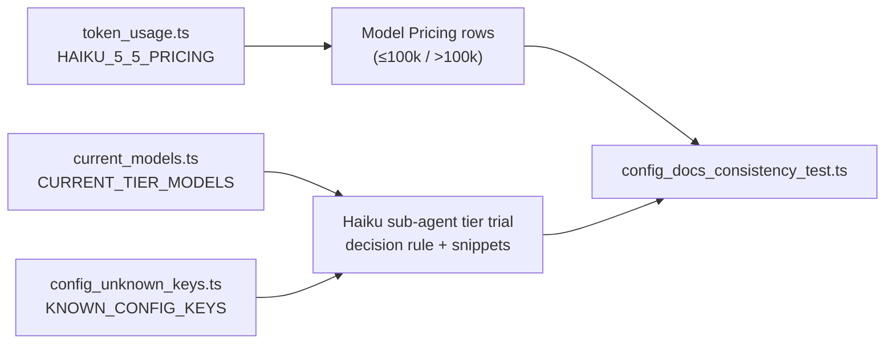

## Summary

Documents the adoption of Claude Haiku 5.5 in `docs/MODEL-AND-CACHING.md`. It adds the two banded price rows and explains that the band is chosen per request. It adds a **Haiku sub-agent tier trial** subsection: what `issue_sub_agent_tier: "haiku"` changes, how a repository override wins, the four-threshold decision rule, refusal and `degraded-model` behaviour, and an optional `quality_fix` Haiku override snippet. It also adds an entry to the per-phase decision log. New drift tests tie the doc to `token_usage.ts`, `CURRENT_TIER_MODELS` and the accepted config keys. Closes #3407.

## Spec

### Intent and Rationale

- Dependencies #3399–#3402 shipped the banded price, the 1M window, the key and the tier-aware sub-agents. Operators had no written rule for when the trial graduates, so this PR adds one.
- The trial lives as a `####` subsection inside the existing "Haiku sub-agent tier (issue phase)" section, so the tier's agent table is not duplicated (DRY). The issue suggested placing it near Phase-Specific Defaults; the decision-log entry links to it from there.

### Essential Design Decisions

- The rejection rate and the CI-failure rate are defined per `issue` run (`pr_tier_rejections` / `ci_fix_tier_runs` ÷ `issue_tier_runs`). The per-tier telemetry from #3403/#3404 records those counters and does not count PRs raised per tier.
- Haiku as the default is stated as **not yet adopted**. Graduating it is a separate change to `OPERATIONAL_DEFAULTS.issueSubAgentTier`.
- The test takes the pinned model id from `CURRENT_TIER_MODELS` and checks the key against `KNOWN_CONFIG_KEYS`, so a rename turns the test red rather than leaving the page stale (Standards review).

### Undiscoverable Facts

- Owner direction on #3385: enable Haiku on part of the fleet, then keep Sonnet unless code-review rejections and CI failures hold at a lower price. That is what the decision rule encodes. No part of the sub-issue description was replaced.
- No production cost path passes `singleRequest: true` (grep of `worker/deno` outside tests finds it only in `token_usage.ts:706,770`). Every worker estimate therefore uses the >100k rate, and the doc says so.
- The context window (1,000,000, from #3400) was already at the head. No output-tokens table row exists, so neither needed a change.

## Evidence

Docs-only change, plus drift tests. There are no UI files.

**Docs sweep** — grep: `issue_sub_agent_tier`, `claude-haiku-5-5`, "not yet wired", "open Issue #340\d", "is not on a before/after"; section: `docs/MODEL-AND-CACHING.md#haiku-sub-agent-tier-issue-phase`; updated: `docs/MODEL-AND-CACHING.md`. The stale "not yet wired … open Issue #3405" sentence in the Fable 5.1 subsection is fixed. `docs/CONFIGURATION.md` (4 `issue_sub_agent_tier` hits) is still true because it describes the key, which is unchanged. `docs/INTERNALS.md` (1 hit) is still true because it describes the telemetry split, which is unchanged. `docs/MERGE.md:968` and `docs/audits/security-sweep-2967-repo-formatters.md:16` ("not yet wired") are unrelated features.

Issue numbers the diff cites (looked up with `gh api …/issues/N`):

- #3385: Adopt Claude Haiku 5.5: pricing tables, trial key for cheaper sub-agent tiers
- #3399: Banded Claude Haiku 5.5 pricing in token_usage (≤100k / >100k prompt tokens)
- #3400: Model tables for Haiku 5.5: 1M haiku context window, budget probe model, current haiku id
- #3405: Apply degraded-model when Haiku 4.5 is served to a haiku-tier issue run
- #3407: this issue

## Acceptance Criteria

<!-- vibe-spec-review inputs="diff+issue-body" -->

- **met** — Haiku 5.5 prices, both bands, match `token_usage.ts` (#3399). — evidence: `worker/deno/tests/config_docs_consistency_test.ts::config docs - Haiku 5.5 price rows match token_usage (Issue #3407)` — reviewer: met
- **met** — The Haiku context window reads 1,000,000. — evidence: `docs/MODEL-AND-CACHING.md` Context Window Sizes table, `Claude Haiku 5.5 | 1,000,000 tokens` (already at head from #3400) — reviewer: met
- **met** — The decision rule states all four thresholds (7 days, 30 runs per tier, ≥25% cheaper, ≤5 pp worse on rejections and CI failures). — evidence: `worker/deno/tests/config_docs_consistency_test.ts::config docs - the trial decision rule states every threshold (Issue #3407)` — reviewer: met
- **met** — The `quality_fix` override snippet is valid JSON using keys the worker accepts. — evidence: `worker/deno/tests/config_docs_consistency_test.ts::config docs - the quality_fix Haiku override snippet uses keys the worker accepts (Issue #3407)` — reviewer: met
- **met** — Haiku-as-default is stated as not yet adopted. — evidence: `docs/MODEL-AND-CACHING.md#haiku-sub-agent-tier-trial`, pinned by the threshold test's `not yet adopted` pin — reviewer: met
- **unrequested** — Mermaid flowchart and worked 5-point example for the decision rule — reviewer: unrequested — reason: the repo's Visual Documentation standard favours diagrams; the example makes "percentage points" unambiguous
- **unrequested** — JSON snippet of the per-repo `issue_sub_agent_tier` override — reviewer: unrequested — reason: the issue asks to document how the repo override wins, and the snippet shows it; the snippet test validates its keys
- **unrequested** — Reworded "Opt-in trial, not a default change" paragraph — reviewer: unrequested — reason: its old claim that the key "is not on a before/after check of its own" would contradict the new trial rule
- **unrequested** — Fixed the stale "not yet wired … open Issue #3405" sentence — reviewer: unrequested — reason: #3405 is closed and shipped `issue_sub_agent_degradation.ts`, and this PR's own trial text relies on that label
- **unrequested** — The `degraded-model` check before reading figures, the telemetry key names and the `OPERATIONAL_DEFAULTS` pointer — reviewer: unrequested — reason: these are how the decision rule is applied; the telemetry keys exist in `worker/deno/lib/fleet_telemetry.ts` and are documented in `docs/INTERNALS.md`
- **unrequested** — The bare `haiku` alias pricing note and the extra price-row and snippet tests — reviewer: unrequested — reason: the note explains why run-total estimates never under-state; the tests are the evidence for criteria 1 and 4

## Standards Review

<!-- vibe-standards-review inputs="diff+CODING-STANDARDS.md" -->

- **violation** — Documentation-drift tests, condition 3: pinned values the code can express were retyped (`issue_sub_agent_tier`, `claude-haiku-5-5`) — evidence: `worker/deno/tests/config_docs_consistency_test.ts:219` — reason: fixed in this diff (model id from `CURRENT_TIER_MODELS`, key asserted in `KNOWN_CONFIG_KEYS`)
- **clean** — Review-enforced rules checked:
  - prose about the PR's own change: `singleRequest`, `lowerBand` and the `OPERATIONAL_DEFAULTS` default are backed by code;
  - behaviour another issue delivers: #3400 and #3405 are shipped at the head;
  - subsumed and whole-file pins: none (`section()` plus `assertPins`).
- **clean** — Other areas checked:
  - the anchors resolve;
  - Australian English in the added text;
  - no assertions removed from existing tests;
  - the workflow-validator, named-test and stub rules are not triggered.

## Test Plan

- Added four tests to `worker/deno/tests/config_docs_consistency_test.ts`:
  - trial section names the key and the model;
  - decision-rule thresholds;
  - Haiku 5.5 price rows match `lookupModelPricing(CURRENT_TIER_MODELS.get("haiku"))`, including `lowerBand` and the kept Haiku 4.5 row;
  - every JSON snippet in the trial section uses only `KNOWN_CONFIG_KEYS`, with `quality_fix` → `haiku` / `high`.
- Red before the doc edit: `deno test --allow-read --allow-env tests/config_docs_consistency_test.ts` gave `FAILED | 6 passed | 4 failed` (`no heading containing "Haiku sub-agent tier trial"`; `missing the Haiku 5.5 ≤100k pricing row`).
- Drift pins absent on base: `deno task drift-pins-on-base origin/milestone/3385-worker-deno-lib-haiku-pricing-follow-ups docs/MODEL-AND-CACHING.md "Haiku sub-agent tier trial" …` reported "absent on base" for each pin:
  - `` `issue_sub_agent_tier` ``
  - `` `claude-haiku-5-5` ``
  - `at least 7 days`
  - ``at least 30 `issue` runs``
  - `at least 25% cheaper`
  - `no more than 5 percentage points`
  - `not yet adopted`
- Final head, passed (`ok | 78 passed | 0 failed`): `deno test --no-check --allow-read --allow-env --allow-run --allow-write --allow-sys=hostname` over
  - `config_docs_consistency_test.ts`
  - `docs_provider_matrix_test.ts`
  - `docs_provider_prose_test.ts`
  - `markdown_anchors_test.ts`
  - `model_routing_docs_test.ts`
  - `coding_standards_model_agnostic_test.ts`
  - `codex_phase_routing_test.ts`
  - `gemini_phase_routing_test.ts`
- Other checks on the final head, all passed:
  - `deno fmt --check`, `deno lint` and `deno check` on the test file: clean;
  - `check-markdownlint`: PASSED (221 files);
  - `check-mermaid`: PASSED (1221 blocks).
- Removed assertions from existing tests: none. The one loop the follow-up commit dropped was added earlier in this same PR, not on base.
- Full `./quality.sh` run: started, then killed by its 900 s `timeout` during the full `deno test` stage. It produced no verdict, so it was not re-run within this run's budget. CI runs the same gate on the PR.

<!-- vibe-quality-gate-skipped reason="full ./quality.sh exceeded its 900s timeout in the full deno test stage; targeted tests, fmt, lint, check, markdownlint and mermaid all passed on the final head" -->

Branch outcomes: none added

🤖 Generated with [Claude Code](https://claude.com/claude-code)
