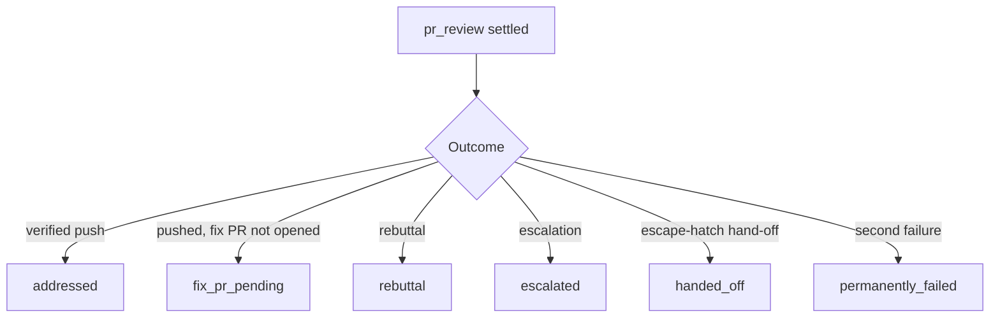

# PR Summary — Issue #3409: dismiss a review with a message that matches its outcome

## Summary

`markCommentProcessed` dismissed every `pr_review` with "Changes have been addressed by the
automated worker.", including a review that failed twice, was rebutted, was escalated or was
handed off. The caller now passes a `ReviewDismissalOutcome`. Only a verified pushed fix keeps
the "addressed" wording, and each other outcome gets its own accurate message. Closes #3409.

## Spec

### Intent and Rationale

- A dismissal cannot be undone, and its message is what a human sees on the review. A
  permanently-failed review labelled "addressed" hides the fact that the requested change never
  landed.
- The outcome is a **required** parameter with no default. The type checker therefore names every
  caller, so none can quietly keep the old wording.

### Essential Design Decisions

- `REVIEW_DISMISSAL_MESSAGES` (`worker/deno/lib/pr_comments.ts`) is the single source of truth.
  It maps `addressed`, `permanently_failed`, `rebuttal`, `escalated`, `handed_off` and
  `fix_pr_pending` to their messages.
- Each `retireReview(outcome)` site in `_processFeedbackWithHeartbeat` passes the outcome it
  settles. `markPrCommentAsFailed` passes `permanently_failed`.
- `review` and `issue` comments receive only an `eyes` reaction, so the outcome has no effect for
  those types. Their callers pass `"addressed"`, with a one-line comment saying it is unused.
- The `pr_manager mark-comment-processed` CLI takes `--outcome`. It refuses an unknown value, and
  it refuses a `pr_review` without one rather than guessing "addressed". No script, prompt or doc
  calls this CLI; only its tests do.

### Undiscoverable Facts

- The `fix_pr_pending` outcome exists because a fix can be pushed while the fix PR itself fails
  to open (the gated-head milestone path). "Addressed" would overstate that case.

## Evidence

This is a backend-only change, with no UI files. Tests:

- `worker/deno/tests/pr_comments_test.ts`
  - "markCommentProcessed dismisses a PR review with the '<outcome>' message (Issue #3409)", one
    test per outcome.
  - "only the 'addressed' dismissal claims the changes were made".
  - "markPrCommentAsFailed dismisses a pr_review with the permanently-failed wording".
  - Against the unfixed code, the file cannot load (the new exports are missing). A temporary
    copy with the new imports removed gave 10 assertion failures, including the
    `markPrCommentAsFailed` test, which received the "addressed" wording. That copy was deleted.
- `worker/deno/tests/pr_feedback_review_dismissal_3383_test.ts` and
  `worker/deno/tests/pr_feedback_processor_milestone_fix_test.ts` assert the outcome for each
  settlement path. Seven of these tests fail against the unfixed code.
- `worker/deno/tests/pr_manager_command_test.ts` covers both CLI refusals.
- After the fix, the targeted run gives 142 passed and 0 failed.

Issues cited as provenance:

- #3409: A permanently failed CHANGES_REQUESTED review is dismissed with 'Changes have been
  addressed by the automated worker.'
- #3383: PR feedback dismisses a CHANGES_REQUESTED review at claim time, so a timed-out or
  silent run loses it and only base merges follow (VibeCoder#3308, #3355, GRQ-AutoTrader#2699)

**Docs sweep** — grep: `addressed by the automated worker`, `dismiss\w*`, `markCommentProcessed`, `mark-comment-processed`, `REVIEW_DISMISSAL_MESSAGES`; section: `docs/workflows/pr-feedback.md#a-review-is-dismissed-only-once-the-run-retires-it-issue-3383`, `docs/USAGE.md#-reviewing-and-requesting-fixes`, `docs/INTERNALS.md` ("Failure handling", second-failure step); updated: `docs/workflows/pr-feedback.md`, `docs/USAGE.md`, `docs/INTERNALS.md`

- `docs/workflows/pr-feedback.md:311` adds a paragraph listing the outcome messages.
- `docs/USAGE.md:744` changes "addressed it" to "settled it" and adds a sentence on the
  message.
- `docs/INTERNALS.md:2694` says the second-failure dismissal carries the "Not addressed after
  two automated attempts" message.
- The `markCommentProcessed`, `reviewSettlement` and `retireReview` doc comments, and the
  `pr_manager.ts` header, were updated in code.
- Hits read and left in place, because they describe *when* the review is dismissed, not the
  message: `docs/workflows/pr-feedback.md:119-125, 154, 174, 189-190, 231-232, 274-308, 868`,
  `docs/USAGE.md:755`, `docs/INTERNALS.md:1991, 2000, 2019, 2068-2069, 2692, 3674, 5306`.
- Unrelated hits: `docs/SECURITY-SCAN.md:464` and
  `docs/audits/security-sweep-2755-lib-delta-12a-12c.md:214`.
- No hits in `README.md` or `*/README.md`.

A raw `deno fmt --check` on these three markdown files already reports them as unformatted at
base (the `INTERNALS.md` file table). The gate's `deno fmt` step passes, and this change adds no
new formatting failure.

## Test Plan

**Changed assertion:** in `worker/deno/tests/pr_feedback_review_dismissal_3383_test.ts`, the spy event string now
includes the outcome. The issue-comment ordering check changed from
`indexOf("markCommentProcessed:issue:123")` to
`indexOf("markCommentProcessed:issue:123:addressed")`. The assertion is the same, in the new
format. No assertion was removed.

**Branch outcomes:** each value was flipped on its own, the tests were run, and the value was
restored.

- `worker/deno/lib/pr_feedback_processor.ts:1722` — escape-hatch hand-off (`handed_off`) — `worker/deno/tests/pr_feedback_review_dismissal_3383_test.ts::pr_review dismissal: an escape-hatch hand-off dismisses the review exactly once` — flipped to another outcome, test went red
- `worker/deno/lib/pr_feedback_processor.ts:1800` — pushed, fix PR not opened (`fix_pr_pending`) — `worker/deno/tests/pr_feedback_processor_milestone_fix_test.ts::processPrFeedback - gated head: pr_review fix PR creation failure => dismisses the review once (Issue #3383)` — flipped to another outcome, test went red
- `worker/deno/lib/pr_feedback_processor.ts:1824` — verified push (`addressed`) — `worker/deno/tests/pr_feedback_review_dismissal_3383_test.ts::pr_review dismissal: verified push dismisses once, after commitAndPushPending` — flipped to another outcome, test went red
- `worker/deno/lib/pr_feedback_processor.ts:1859` — rebuttal (`rebuttal`) — `worker/deno/tests/pr_feedback_review_dismissal_3383_test.ts::pr_review dismissal: rebuttal with no changes dismisses exactly once` — flipped to another outcome, test went red
- `worker/deno/lib/pr_feedback_processor.ts:1910` — escalation (`escalated`) — `worker/deno/tests/pr_feedback_review_dismissal_3383_test.ts::pr_review dismissal: no fix, no rebuttal after in-run retry — escalates and dismisses once` — flipped to another outcome, test went red
- `worker/deno/lib/pr_feedback_processor.ts:1427` — non-`pr_review` early mark (`addressed`) — `worker/deno/tests/pr_feedback_review_dismissal_3383_test.ts::pr_review dismissal: an 'issue' comment is unaffected — markCommentProcessed still runs before the push` — flipped to another outcome, test went red through the spy event string
- `worker/deno/lib/pr_comments.ts:615` — second failure (`permanently_failed`) — `worker/deno/tests/pr_comments_test.ts::pr_comments - markPrCommentAsFailed dismisses a pr_review with the permanently-failed wording (Issue #3409)` — flipped to `addressed`, test went red
- `worker/deno/lib/pr_comments.ts:161` — message lookup by outcome — `worker/deno/tests/pr_comments_test.ts::pr_comments - markCommentProcessed dismisses a PR review with the '<outcome>' message (Issue #3409)` (one test per outcome) — flipped to always `.addressed`, tests went red (6 failures)
- `worker/deno/commands/pr_manager.ts:390` — error (unknown `--outcome` refused) — `worker/deno/tests/pr_manager_command_test.ts::prManagerCommand - mark-comment-processed refuses an unknown --outcome (Issue #3409)` — flipped to accept, test went red
- `worker/deno/commands/pr_manager.ts:400` — error (`pr_review` without `--outcome` refused) — `worker/deno/tests/pr_manager_command_test.ts::prManagerCommand - mark-comment-processed refuses a pr_review without --outcome (Issue #3409)` — flipped to accept, test went red
- `worker/deno/commands/pr_manager.ts:410` — absent (`--outcome` omitted for a non-`pr_review` type, defaults to `addressed`) — exempt (untestable): `markCommentProcessed` ignores the outcome for `review` and `issue` comments (they get an `eyes` reaction), and the success path calls the real `gh` (`runGhCommand` is not injectable in this command), so no test can observe the default
- `worker/deno/commands/pr_manager.ts:410` — success (a valid `--outcome` passed through to `gh`) — exempt (untestable): `gh` is not injectable in this command, so a success-path test would call the real GitHub API
- `worker/deno/lib/claim_pr_comment.ts:574` — `addressed` for a `review`/`issue` comment — exempt (untestable): this branch only handles `review` and `issue` comments, and `markCommentProcessed` ignores the outcome for those types (they get an `eyes` reaction), so flipping it changes no observable behaviour

**Callers checked (`markCommentProcessed`):**

- The five `retireReview` sites and the non-`pr_review` early mark in
  `worker/deno/lib/pr_feedback_processor.ts`.
- `worker/deno/lib/claim_pr_comment.ts`.
- `markPrCommentAsFailed` in `worker/deno/lib/pr_comments.ts`.
- The `pr_manager mark-comment-processed` CLI. It has no script, prompt or doc callers.
- `worker/deno/lib/issue_worker_wiring.ts` imports `markCommentProcessed` (line 104), types the
  `PrDeps` field as `typeof markCommentProcessed` (line 300), wires the function into the `pr`
  deps object (line 657) and builds a `mockFn<PrDeps["markCommentProcessed"]>` (line 1105). It
  never calls the function itself, and the wiring passes it through unchanged, so the new
  required parameter needed no change there.

**Gate:** `./quality.sh < /dev/null` from the repo root: `Result: PASSED (with skipped checks)`,
exit 0. Deno tests, lint, type check, fmt, markdownlint, mermaid and semgrep all passed.
