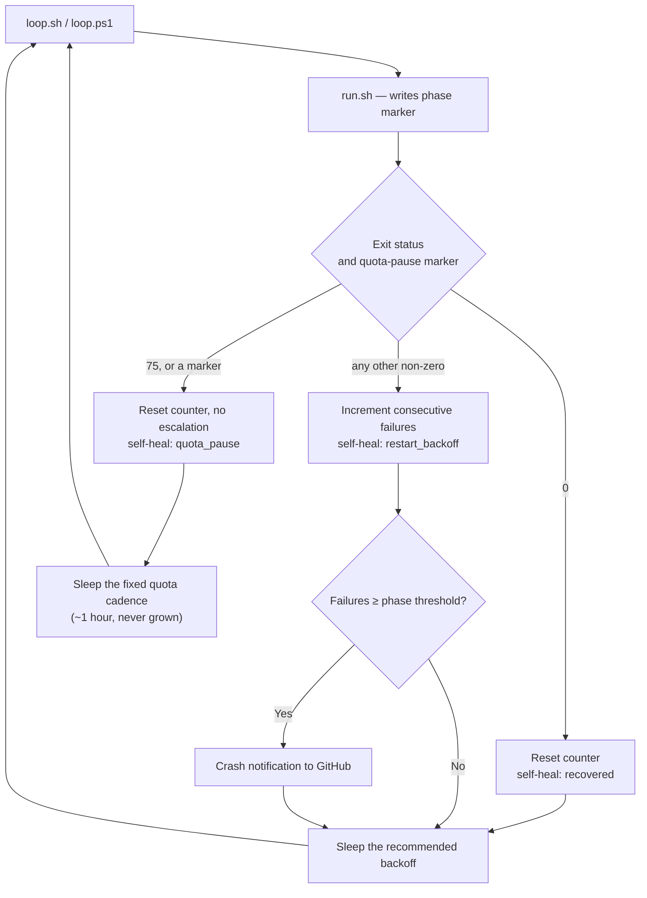

# Quota exhaustion is a scheduled pause, not a crash

## Summary

Out of quota, `run_core` exited cleanly and the supervisor still recorded a
crash: the clean mid-loop exit shared its status with a failure, so the launcher
counted a failure streak, doubled its wait to 16 minutes and beyond, reported
the "failure" to GitHub, and rebuilt a perfectly healthy container image. The
re-probe cadence Issue #333 intended (~hourly, because the quota may be
*extended* before its stated reset) decayed into hours. Closes #342.

The run now declares the pause twice, and the supervisor classifies on that
declaration:

- **Its own exit status.** `QUOTA_PAUSE_EXIT_STATUS = 75` (`EX_TEMPFAIL` —
  "temporary failure, the caller is invited to retry"). It sits outside every
  other launcher status: 0 clean, 87 wedged container, 124/137 supervisor
  deadline, 125–127 the runtime CLI's own "could not start", ≥128 signal
  deaths.
- **A marker file** — `~/logs/quota-pause.json`, on the one host mount both
  sides of the container boundary share (the work directory rides a named
  volume the host cannot read). The marker is preferred over the exit status,
  as the issue asks, so a container runtime that loses the container's exit
  code and substitutes its own generic status still classifies correctly.

The marker is **consumed** (read and deleted) by the recorder, so one
declaration can only ever explain the one launcher outcome it belongs to — a
later run that genuinely crashes while the quota is still out has no marker of
its own, keeps its crash status, and backs off exactly as before. Stale
(>6 h), corrupt and time-less markers are discarded loudly rather than believed.

On a quota pause the recorder resets the failure streak, escalates nothing,
claims no recovery (so no `container environment reconstructed` event and no
teardown of a healthy image), and answers with a **fixed** cadence —
`--quota-pause-sleep-seconds` / `VIBE_QUOTA_PAUSE_SLEEP_SECONDS`, default
3600 s — clamped down when the window reopens sooner than that, never grown.
It is emitted as a `quota_pause` self-heal event, so `self-heal-summary` shows
an operator "out of quota" instead of a host that keeps crashing.

## Evidence

Backend/CLI change with no web interface, so the evidence is test output rather
than a screenshot.



Affected suites, run under the quality gate's own permission set
(`deno test --frozen --lock=deno.lock --allow-read --allow-env --allow-run
--allow-write --allow-sys=hostname`):

```text
tests/container_restart_backoff_test.ts
tests/quota_pause_test.ts
tests/run_worker_test.ts
tests/container_entrypoint_test.ts
tests/run_core_rate_limit_resume_test.ts
ok | 83 passed | 0 failed (9s)
```

### Pre-existing failures, unrelated to this change

`./quality.sh` reports 10 failures in `fleet_health_test.ts`,
`host_workdir_guard_test.ts`, `optional_feature_env_test.ts` and
`setup_workdir_reminder_test.ts`. They reproduce identically on an untouched
`main` worktree (`git worktree add /tmp/vc-main main`, same command, same 10
failures), and none of those files or their subjects are touched here. They are
environment-specific to this container, not a regression from this PR.

## Test Plan

New tests — `worker/deno/tests/quota_pause_test.ts`:

- the exit status collides with no other launcher status and stays below 128
- a declaration round-trips through the marker (including the reset epoch)
- the marker is **consumed**, so it explains one outcome only, and the file is
  gone rather than merely ignored
- no marker is the healthy case and warns about nothing
- stale, corrupt and declaration-time-less markers are discarded loudly and
  removed
- writing without a log directory fails loud

New tests — `worker/deno/tests/container_restart_backoff_test.ts`:

- `classifyLauncherOutcome` — a declared pause is not a crash; a crash *while*
  rate-limited (no marker of its own) still is
- `computeQuotaPauseSleepSeconds` — a fixed cadence, clamped to a nearer reset,
  floored at the base sleep
- `recordContainerRestartOutcome` — a pause holds the fixed cadence instead of
  decaying, clears the streak without claiming a recovery, and is classified
  from the marker even when the exit status lost the pause (255)
- a crash *after* a quota pause still backs off, and its streak still grows
- the command consumes the marker and prints the cadence; the cadence is
  operator-configurable by `VIBE_QUOTA_PAUSE_SLEEP_SECONDS`

New tests elsewhere:

- `run_core_rate_limit_resume_test.ts` — a wait past the run-duration cap
  reports `quotaPaused` with the reset it was waiting on; an ordinary run
  reports neither
- `run_worker_test.ts` — an out-of-quota run exits `75`, declares the pause into
  the host-visible log directory before teardown, and still cleans up; a run
  that was not out of quota declares nothing
- `container_entrypoint_test.ts` — the entrypoint carries status 75 across the
  container boundary intact

Docs updated: `docs/DEPLOYMENT.md` (the new status, marker,
`VIBE_QUOTA_PAUSE_SLEEP_SECONDS`) and
`docs/workflows/resilience-and-concurrency.md` (the classification, and the
flowchart above).
