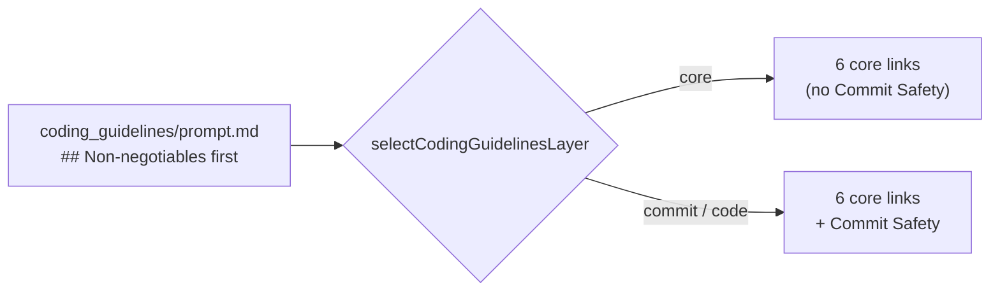

## Summary

The shared coding guidelines now open with a short `## Non-negotiables`
digest, placed directly after the role paragraph. It has one line per
irreversible-action rule: commit safety, reversible actions, the issue and PR
lifecycle, `needs-human` escalation, tool output as data, images as data,
failing loud, and no spin-waits. Each line links to its full section, which
stays where it was. This is option 2 from the issue. Closes #3421.

## Spec

### Intent and Rationale

- The guide's "instructions buried" fix is to put critical instructions at the top and repeat key points. The hard safety rules sat at about lines 719–1548, below the housekeeping sections.
- A digest (option 2) was chosen over a reorder (option 1). Moving about 300 lines would break the "above" and "below" pointers between sections, such as "the escalation flow below" and "the internal-dependency rule". The digest leaves every section in place and costs about 36 lines.

### Essential Design Decisions

- The two Commit Safety bullets sit inside a `<!-- guidelines-layer: commit -->` block, because Commit Safety is itself commit-only. `selectCodingGuidelinesLayer` drops that block for core-only phases (`planning`, `planning_critique`, `question`, `grill_me`), so those phases never get a link to a section they do not receive.
- Each bullet is a pointer, not a restatement. The linked section stays the single source of the full rule and its exceptions; for example, the lifecycle bullet keeps "unless your phase prompt orders it".

### Undiscoverable Facts

- `prompts/issue/prompt.md` was left unchanged. The issue's proposal covers only `prompts/coding_guidelines/prompt.md`, and the Claude-specific header technique is filed separately against `prompts/coding_guidelines_claude/prompt.md`.

## Evidence

Prompt and test change only; there is no UI.

**Docs sweep** — grep: `coding_guidelines/prompt.md`, "opens with", `guidelines-layer`, "Token Economy", "non-negotiable"; section: none — no manual documents the order of the guidelines' sections; updated: none; `docs/MODEL-AND-CACHING.md:536` — still true because it cites the *Cap delegation* bullet, which is unchanged; `docs/PROMPT-HOUSE-VOCABULARY.md:77` — still true because the persona line still opens the file.

Related existing rules checked: `CODING-STANDARDS.md` **Prompt Engineering Guidance** and **Prompt Templates**. Neither has a rule on section order or repetition, so there is no conflict. The DRY rule is respected because each bullet links to its section rather than replacing it. I applied the new digest to this PR's own diff and found nothing it would flag.

## Test Plan

- Added `worker/deno/tests/coding_guidelines_non_negotiables_3421_test.ts`. It checks every layer (`core`, `commit`, `code`):
  - `## Non-negotiables` is the first `##` heading;
  - every digest link resolves through `anchorSet` (`worker/deno/lib/markdown_anchors.ts`);
  - each layer carries the exact link set, and the core layer has no `#commit-safety`.
- Modified `worker/deno/tests/coding_guidelines_layers_2574_test.ts`. It adds `"## Non-negotiables"` to `CORE` and to `CODE_PHASE_HEADINGS_BEFORE_2574`. No assertions were removed.
- Red checks:
  - Removing the whole digest turned all three new cases red.
  - Deleting only the digest's two commit-layer marker lines turned the "every link resolves" and "exact link sets" cases red for `core`.
  - The prompt was restored after each check.
- Drift pins: `## Non-negotiables` and its anchors are absent from the base `prompts/coding_guidelines/prompt.md`.
- `deno test -A` was run on the new test plus six sibling guideline and prompt tests (`coding_guidelines_layers_2574`, `coding_guidelines_twin_drift`, `prompt_leak_redaction`, `prompt_presence_gaps`, `tool_output_treat_as_data_3046`, `coding_guidelines_run_scope_3135`). Result: 71 passed, 0 failed.
- `./quality.sh < /dev/null` on the head: Result: PASSED (with skipped checks). The only skip is `config integration`, which the gate itself skips.

Branch outcomes: none added

🤖 Generated with [Claude Code](https://claude.com/claude-code)
