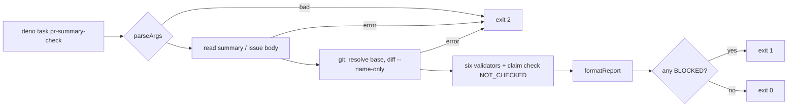

# PR Summary — Issue #3423

Closes #3423

## Summary

Adds `deno task pr-summary-check`, which runs the deterministic PR-summary
gates against a draft summary and the branch diff, so an agent sees every block
before the worker raises the PR. The issue, PR-feedback and CI-fix prompts now
tell the agent to run it and fix what it reports, but only where
`worker/deno/deno.json` defines the task.

## Spec

### Intent and Rationale

- Agents found summary-gate blocks only after the worker had refused the PR.
  Running the same validators locally gets those blocks fixed before then.
- The task fails closed. A gate that has no input to run on, and the
  model-backed claim check (#3257), are reported as `NOT_CHECKED`, and the
  report says a not-checked gate is not a pass.

### Essential Design Decisions

- The task reuses the existing validators unchanged: closure (#518), two-axis
  review (#663), reproduction (#521), docs sweep (#3073), placeholders (#3124)
  and branch outcomes (#3147). It narrows no shared helper.
- Exit codes are 0 when no gate is blocked, 1 when one is, and 2 for bad
  arguments or a git or I/O failure. A git error never prints a report.
- The issue body and labels are optional flags. Without them, the gates that
  need them report `NOT_CHECKED` and never `PASSED`.
- Every git call runs in the repository root, because the paths a summary
  names are relative to the root.

### Undiscoverable Facts

- The CLI runs git through the `runGitCommand` chokepoint. The task grants
  `--allow-read --allow-run=git` plus `--allow-env` for
  `GIT_COMMAND_TIMEOUT`, `GIT_MERGE_TIMEOUT` and `HOME` (read by
  `git_timeout.ts`) and `VIBE_AUDIT_DISABLED` and `WORK_DIR` (read by
  `audit_hook.ts`). `GH_CONFIG_DIR` is read only on a guarded auth-repair
  path, so it is not granted. The env list was verified on the happy path
  only.
- The prompt rule depends on the task existing, so other repositories still
  follow the prompts' existing rules.

## Evidence

- `worker/deno/lib/pr_summary_check.ts` contains `runPrSummaryCheck`,
  `hasBlock` and `formatReport`.
- `worker/deno/lib/pr_summary_check_cli.ts` contains `parseArgs` and `main`.
  `main` takes its effects as injected dependencies, so the tests run it in
  process.
- `worker/deno/deno.json` defines the `pr-summary-check` task with the
  scoped `--allow-env` list above.
- `docs/audits/lib-sweep-coverage/top-up-3423.json` claims both new modules
  for the lib-sweep ledger.
- Prompt changes:
  - `prompts/issue/prompt.md:1110` adds "Run the summary gates before you
    finish."
  - `prompts/pr_feedback/prompt.md:66` and `prompts/ci_fix/prompt.md:98` add
    the same instruction.
  - `CODING-STANDARDS.md:1417` adds the same instruction in "PR Summary and
    Evidence".
- `deno check` is clean. `worker/deno/tests/pr_summary_check_test.ts` and
  `worker/deno/tests/pr_summary_check_prompt_3423_test.ts` together report 23
  passed and 0 failed.

**Docs sweep** — grep: `pr-summary-check`, `pr_summary_check`, "summary gates", "not checked", `runGitCommand`, "PR Summary and Evidence"; section: `CODING-STANDARDS.md#pr-summary-and-evidence`; updated: `docs/audits/lib-sweep-coverage/top-up-3423.json`, `prompts/issue/prompt.md:1110`, `prompts/pr_feedback/prompt.md:66`, `prompts/ci_fix/prompt.md:98`, `CODING-STANDARDS.md:1417`; `docs/workflows/issue-processing.md` — still true because it describes each gate's rules as the worker applies them when it raises a PR, and this task reuses those validators without changing a rule; `docs/EXTENDING.md` — still true because it lists how to add commands and run tests, and does not enumerate `deno.json` tasks.

## Test Plan

- `cd worker/deno && deno test --allow-all tests/pr_summary_check_test.ts tests/pr_summary_check_prompt_3423_test.ts < /dev/null`
  reports 23 passed and 0 failed.
- Drift-pin base check: `deno task drift-pins-on-base` found each pinned
  phrase absent from the base version of every section it reads:
  - "defines a `pr-summary-check` task", "deno task pr-summary-check" and
    "not checked is not a pass", in the issue, pr_feedback and ci_fix
    sections;
  - "deno task pr-summary-check" in the CODING-STANDARDS "PR Summary and
    Evidence" section.
- Removed assertions: none.
- New rule, related rules checked: the new rule says "run the task and fix
  what it reports". I checked it against the existing summary-gate rules in
  `prompts/issue/prompt.md`'s PR Summary File section, against "Making
  Changes" in pr_feedback, against "Fixing the Failure" in ci_fix, and against
  `CODING-STANDARDS.md` "PR Summary and Evidence". It adds a step before
  finishing and repeals none of them. The wording lists the six gates the
  task runs and says the removed-assertion gate and the claim check are not
  run, so it does not overclaim. Applied to this PR's own diff: `deno task
  pr-summary-check --base milestone/worker-deno-lib-pr-summary-markdown-gates
  --issue-body-file /tmp/s3423/body.md --labels ""
  ../../docs/archive/pr-summaries/pr-summary-3423.md` (from `worker/deno`,
  with the issue body fetched by `gh api`) exits 0. Docs
  sweep, result placeholders and branch outcomes pass, closure, review and
  reproduction are not applicable, and the claim check is not checked.
- Guards and callers checked:
  - The task is read-only and raises no PR, so it adds no new path to an
    existing outcome.
  - The validators are called unchanged, so no shared helper was narrowed.
  - The branch-outcomes wiring (`lookupTestsAtHead`, `namedTestPaths`,
    `parseBranchOutcomes`) mirrors `worker/deno/lib/phases/completion_phase.ts`.
  - Changed call sites:
    - Task entry → `main` → `runPrSummaryCheck`. Reverting `main`'s exit
      mapping turns `main - well-formed summary exits 0` red.
  - `deno.lock` is unchanged.

Branch outcomes:

- `worker/deno/lib/pr_summary_check.ts:83` — base ref unresolvable → error — `worker/deno/tests/pr_summary_check_test.ts::runPrSummaryCheck - an unresolvable base ref is an error, and main exits 2` — flip went red
- `worker/deno/lib/pr_summary_check.ts:89` — git diff runner error → error — `worker/deno/tests/pr_summary_check_test.ts::runPrSummaryCheck - git diff failure is an error, and main exits 2` — flip went red
- `worker/deno/lib/pr_summary_check.ts:95` — git diff non-zero exit → error — `worker/deno/tests/pr_summary_check_test.ts::runPrSummaryCheck - git diff failure is an error, and main exits 2` — flip went red
- `worker/deno/lib/pr_summary_check.ts:111` — no issue body → closure not checked — `worker/deno/tests/pr_summary_check_test.ts::runPrSummaryCheck - absent issue body and labels are not checked` — flip went red
- `worker/deno/lib/pr_summary_check.ts:111` — issue body given → closure validated, blocks — `worker/deno/tests/pr_summary_check_test.ts::runPrSummaryCheck - criteria in the issue body with no closure block blocks the closure gate` — flip went red
- `worker/deno/lib/pr_summary_check.ts:128` — no issue body → review not checked — `worker/deno/tests/pr_summary_check_test.ts::runPrSummaryCheck - absent issue body and labels are not checked` — flip went red
- `worker/deno/lib/pr_summary_check.ts:128` — issue body given → review validated, blocks — `worker/deno/tests/pr_summary_check_test.ts::runPrSummaryCheck - criteria in the issue body with no reviewer blocks block the review gate` — flip went red
- `worker/deno/lib/pr_summary_check.ts:145` — no labels → reproduction not checked — `worker/deno/tests/pr_summary_check_test.ts::runPrSummaryCheck - absent issue body and labels are not checked` — flip went red
- `worker/deno/lib/pr_summary_check.ts:145` — labels given → reproduction validated, blocks — `worker/deno/tests/pr_summary_check_test.ts::runPrSummaryCheck - bug label without a Reproduction block blocks` — flip went red
- `worker/deno/lib/pr_summary_check.ts:61` — verdict invalid → blocked — `worker/deno/tests/pr_summary_check_test.ts::runPrSummaryCheck - missing Docs sweep line blocks and main exits 1` — flip went red
- `worker/deno/lib/pr_summary_check.ts:61` — verdict valid → passed — `worker/deno/tests/pr_summary_check_test.ts::runPrSummaryCheck - well-formed summary passes docs sweep and branch outcomes` — flip went red
- `worker/deno/lib/pr_summary_check.ts:167` — placeholder token → blocked — `worker/deno/tests/pr_summary_check_test.ts::runPrSummaryCheck - a placeholder token blocks the placeholder gate` — flip went red
- `worker/deno/lib/pr_summary_check.ts:176` — named test absent at HEAD → branch outcomes blocked — `worker/deno/tests/pr_summary_check_test.ts::runPrSummaryCheck - a named test absent at HEAD blocks branch outcomes` — flip went red
- `worker/deno/lib/pr_summary_check.ts:188` — claim check always not checked — `worker/deno/tests/pr_summary_check_test.ts::runPrSummaryCheck - claim check is not checked even with all inputs` — flip went red
- `worker/deno/lib/pr_summary_check.ts:199` — any blocked → hasBlock true — `worker/deno/tests/pr_summary_check_test.ts::runPrSummaryCheck - missing Docs sweep line blocks and main exits 1` — flip went red
- `worker/deno/lib/pr_summary_check_cli.ts:45` — flag without value → error — `worker/deno/tests/pr_summary_check_test.ts::parseArgs - rejects missing base, missing or extra file, unknown flag, valueless flag` — flip went red
- `worker/deno/lib/pr_summary_check_cli.ts:53` — each flag assigned to its own field — `worker/deno/tests/pr_summary_check_test.ts::parseArgs - accepts all flags and one summary file` — flip went red
- `worker/deno/lib/pr_summary_check_cli.ts:55` — unknown flag → error — `worker/deno/tests/pr_summary_check_test.ts::parseArgs - rejects missing base, missing or extra file, unknown flag, valueless flag` — flip went red
- `worker/deno/lib/pr_summary_check_cli.ts:62` — missing `--base` → error — `worker/deno/tests/pr_summary_check_test.ts::parseArgs - rejects missing base, missing or extra file, unknown flag, valueless flag` — flip went red
- `worker/deno/lib/pr_summary_check_cli.ts:65` — not exactly one summary file → error — `worker/deno/tests/pr_summary_check_test.ts::parseArgs - rejects missing base, missing or extra file, unknown flag, valueless flag` — flip went red
- `worker/deno/lib/pr_summary_check_cli.ts:98` — bad args → exit 2 — `worker/deno/tests/pr_summary_check_test.ts::main - bad args and an unreadable summary exit 2` — flip went red
- `worker/deno/lib/pr_summary_check_cli.ts:114` — unreadable input → exit 2 — `worker/deno/tests/pr_summary_check_test.ts::main - bad args and an unreadable summary exit 2` — flip went red
- `worker/deno/lib/pr_summary_check_cli.ts:120` — repository root failure → exit 2 — `worker/deno/tests/pr_summary_check_test.ts::main - a repository root failure exits 2 and names the repository root` — flip went red
- `worker/deno/lib/pr_summary_check_cli.ts:133` — check error → exit 2 — `worker/deno/tests/pr_summary_check_test.ts::runPrSummaryCheck - git diff failure is an error, and main exits 2` — flip went red
- `worker/deno/lib/pr_summary_check_cli.ts:137` — a block → exit 1, none → exit 0 — `worker/deno/tests/pr_summary_check_test.ts::main - well-formed summary exits 0` — flip went red
- `worker/deno/lib/pr_summary_check_cli.ts:148` — `git rev-parse` non-zero in the process entry — exempt (untestable): runs only inside the `import.meta.main` process entry, which the tests cannot load in process
