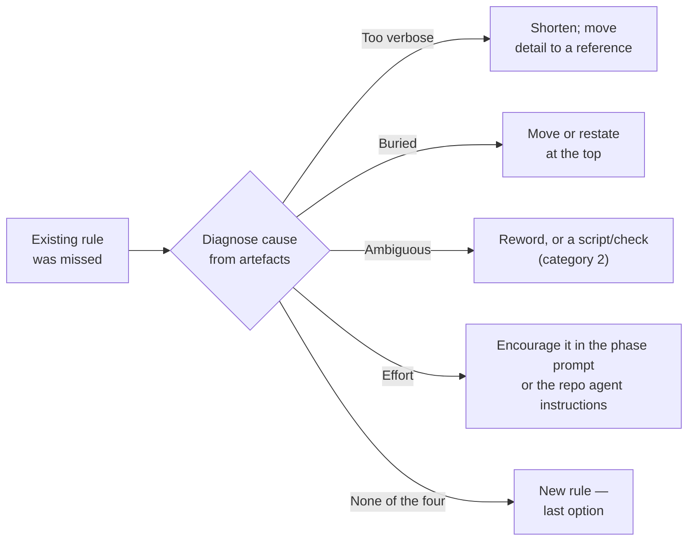

## Summary

Category 3 ("Coding standards") of `prompts/retro/prompt.md` now asks the
retro to diagnose why an existing rule was missed before it proposes another
one. A cause→fix table maps each of four causes to a fix: too verbose, buried,
ambiguous, and effort. The candidate must name the diagnosed cause and its
matching fix. A new rule beside an ignored one is the last option. The five
category headings are unchanged. `CODING-STANDARDS.md` gains a short pointer
bullet, and the Coding standards row in `docs/RETRO-SCAN.md` names the same
fix. Closes #3425.

## Spec

### Intent and Rationale

- A rule that existed and was still missed failed for a reason. Another rule
  added beside it fails the same way, so the retro should repair the cause
  instead of adding to the pile.

### Essential Design Decisions

- The table sits inside category 3, after "Proposal shape:", so the five
  category headings and their triggers stay as they are.
- The "ambiguous" fix can be a script or check, which makes it a category 2
  candidate. The table says so, so a mechanical fix is routed to the gate
  rather than restated as prose.
- The cause is read from the artefacts: the rule's text, where it sits, and the
  instructions that drove the run. The retro runs on every monitored
  repository, and a phase prompt exists only in VibeCoder, so the text names
  "the phase prompt when this repository holds it, otherwise the repository's
  agent instructions (`AGENTS.md` or `CLAUDE.md`)" for both the evidence and
  the effort fix. A cause whose evidence is not in the artefacts counts as
  ruled out, so the new-rule last option stays reachable in a repository with
  no phase prompt. A guess about the run does not count. This keeps the table
  consistent with "Judge the environment, never the author" and "Absent
  evidence is not evidence".

### Undiscoverable Facts

- The issue was filed from #3301 (part of #3265). The four causes come from
  "The Complete Guide to Building Skills for Claude", which lives outside this
  repository, so the repo holds no other copy of the table.

## Acceptance Criteria

<!-- vibe-spec-review inputs="diff+issue-body" -->
- **met** — Category 3 has a cause→fix table: too verbose, buried, ambiguous (script or check, category 2), effort — evidence: `prompts/retro/prompt.md` — reviewer: met
- **met** — The candidate names the diagnosed cause and its matching fix — evidence: `prompts/retro/prompt.md` — reviewer: met
- **met** — A new rule beside an ignored one is the last option — evidence: `prompts/retro/prompt.md` — reviewer: met
- **met** — The five category headings are unchanged — evidence: `prompts/retro/prompt.md` — reviewer: met
- **met** — Optional pointer in CODING-STANDARDS Prompt Engineering Guidance — evidence: `CODING-STANDARDS.md` — reviewer: met
- **unrequested** — Drift test pinning the new phrases — evidence: `worker/deno/tests/retro_ignored_rule_diagnosis_3425_test.ts` — reviewer: unrequested — reason: guards the table and both rules against silent removal
- **unrequested** — Coding standards row in the retro scan manual — evidence: `docs/RETRO-SCAN.md` — reviewer: unrequested — reason: docs sweep; the row described category 3 and would otherwise omit the diagnose-first fix

## Evidence

Backend-only change: no UI files are touched (prompt and docs only).

- Issue numbers this diff adds as provenance: #3425, "Retro: diagnose why a
  rule was ignored before proposing another rule".

**Docs sweep** — grep: `Coding standards|ignored rule|rule was (ignored|missed)`; section: `docs/RETRO-SCAN.md#the-five-categories`; updated: `docs/RETRO-SCAN.md`, `prompts/retro/prompt.md`, `CODING-STANDARDS.md`

The Coding standards row at `docs/RETRO-SCAN.md:53` now names the diagnose-first
fix. `DESIGN-PRINCIPLES.md:9` ("Coding standards & conventions live in") is a
general pointer, so it is still true.

## Standards Review

<!-- vibe-standards-review inputs="diff+CODING-STANDARDS.md" -->
- **clean** — Australian English, model-agnostic wording, `section()`-scoped drift pins, no hidden files staged; an optional Effort-row rewording was declined because the row matches the issue's own solution text

## Test Plan

- Added `worker/deno/tests/retro_ignored_rule_diagnosis_3425_test.ts`, which
  has two tests:
  - **Prompt test:** pins the four table rows, "a category 2 candidate", "names
    the diagnosed cause and its matching fix", "A new rule beside an ignored
    one is the last option", the "phase prompt when this repository holds it,
    otherwise the repository's agent instructions" scoping and "counts as ruled
    out". The pins are scoped to `section(prompt,
    "3. Coding standards")`.
  - **Standards test:** pins the new bullet and its `prompts/retro/prompt.md`
    pointer in the Prompt Engineering Guidance section.
- **Drift pins:** `deno task drift-pins-on-base main …` showed that every
  pinned phrase is absent from the base version of its section.
- **Related rules checked** (Prompt Engineering Guidance):
  - Write precise, unambiguous instructions
  - Mind the token economy
  - Prefer positive instructions
  - Structure prompts with clear sections
  - Check the existing rules before you add one
  - Apply a new rule to your own diff
  - Scope a rule to the runs it is true for

  I also checked the retro's "Judge the environment, never the author" and
  "Absent evidence is not evidence". None of them conflicts with the new rule.
- **Own diff:** I applied the new rule to this PR's own diff. It adds no rule
  beside an ignored one, so I found nothing.
- **Red run (PR #3550 review):** with the prompt edit stashed, the prompt test
  failed on the two new scoping pins; with it restored, the new test file plus
  the retro template tests gave 21 passed and 0 failed. `markdownlint-cli2 docs/RETRO-SCAN.md` reported 0 issues.
- **Formatting:** `deno fmt --check` already fails on `prompts/retro/prompt.md`
  and `CODING-STANDARDS.md` on base. I left both unformatted so the diff does
  not reflow unrelated text.
- **Quality gate:** `./quality.sh < /dev/null` after the PR #3550 review fix
  gave `Result: PASSED (with skipped checks)`. The only skip was config
  integration.

Branch outcomes: none added

🤖 Generated with [Claude Code](https://claude.com/claude-code)
