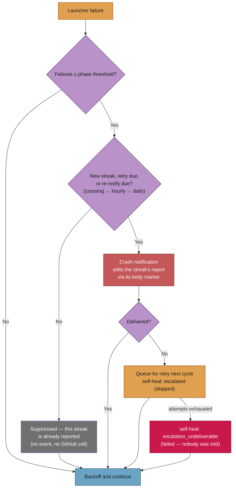

# Escalate once per streak, and never drop a suppressed escalation

## Summary

The container-restart escalation re-evaluated `consecutiveFailures >= threshold`
on **every cycle**, so failures 3, 4, 5 … 54 of one ongoing condition each filed
their own GitHub report — 59 `escalated` events in `~/logs/self-heal.jsonl` for a
handful of incidents, one streak reporting 54 times. Separately, an escalation
the crash channel rate-limited was **dropped**: no retry, no record, so whether
the operator ever learnt about an outage was left to whether the limiter happened
to have room.

A failure streak is now identified by its **phase and its start**, and that
identity drives four changes in
`worker/deno/lib/container_restart_backoff.ts`:

- **Once per streak.** `planStreakEscalation()` is a pure decision: the threshold
  crossing escalates, and every failure after it inside the same streak is
  suppressed. A streak that breaks and starts again, or whose fault moves to a
  different phase, is a new incident and escalates immediately.
- **A decaying re-notify schedule.** `reNotifyIntervalSeconds()` — crossing, then
  hourly, then daily — so a genuinely stuck host stays visible without filling
  the channel. It never decays back to per-cycle for any count.
- **Update rather than repeat.** The report carries a body marker
  (`VIBE_CONTAINER_ESCALATION:<phase>:<streak start>`) and
  `notifyCrashViaIssueComment` edits the comment already carrying it instead of
  posting another — the same marker dedup the script-failure (#207) and
  idle-inversion (#321) streaks use. A failed lookup falls back to posting a
  fresh comment: a duplicate report is recoverable, a lost one is not.
- **Retried, never dropped.** A suppressed escalation is queued in the state file
  and retried on the next cycle (capped at 5 attempts, then falling back to the
  schedule). The report that finally lands names the attempts that were lost. An
  escalation still undeliverable at the cap — or whose streak ends before it ever
  landed — is emitted as an `escalation_undeliverable` self-heal event with
  result **failed**, so the loss reaches the health report rather than vanishing.

Closes #343.

## Evidence

Backend/CLI change with no web interface to screenshot; the evidence is the test
suite below plus the flow it pins.



The reproduction is the first end-to-end test: 54 consecutive failures two
minutes apart used to produce 52 reports. They now produce **two** — the crossing
and one hourly update.

```text
deno test --allow-all tests/container_escalation_streak_test.ts \
  tests/container_restart_backoff_test.ts tests/crash_notification_test.ts
ok | 84 passed | 0 failed (8s)
```

`./quality.sh` passes every gate except `deno tests`, which reports **10
pre-existing failures unrelated to this change** — `fleet_health_test.ts`,
`host_workdir_guard_test.ts`, `optional_feature_env_test.ts` and
`setup_workdir_reminder_test.ts` all assert on host work-directory paths and
environment state, and they fail identically on the unmodified tree (verified by
stashing this change and re-running those four files: `63 passed | 10 failed`).
No test touched by this change fails.

## Test Plan

New — `worker/deno/tests/container_escalation_streak_test.ts` (15 tests):

- `reNotifyIntervalSeconds` — crossing is immediate, then hourly, then daily, and
  never below an hour for any delivered count.
- `planStreakEscalation` — below threshold; the crossing; **failures 4…54 of one
  streak all suppressed** (the regression the issue reported); hourly then daily
  re-notification with the early cases withheld; a new streak or a new phase
  escalating again; a queued escalation retried each cycle then capped.
- `nextContainerRestartDecision` — a streak keeps its start across failures, a
  clean run clears it, and the next failure starts a new one.
- `recordContainerRestartOutcome` end-to-end — a 54-failure streak escalates
  twice, not 52 times; the re-notification carries the same dedup marker as the
  crossing; a broken streak gets a new marker; a rate-limited escalation is
  retried and delivered with the lost attempts named in the body; an escalation
  undeliverable at the cap is recorded as `escalation_undeliverable` / `failed`;
  a streak that ends while still undelivered is recorded too.
- `buildContainerEscalationParams` — the marker identifies phase *and* streak
  start, so two streaks can never share one report.

New — `worker/deno/tests/crash_notification_test.ts` (4 tests): a marked report
PATCHes the existing comment; an unmatched marker posts a new one; a failed dedup
lookup still delivers the report; no marker means no lookup and unchanged
behaviour.

**Modified — documented business-logic change.** One existing test,
`container_restart_backoff_test.ts::"escalation is rate-limited by the crash
cooldown"`, asserted that the failure *immediately after* the crossing re-entered
the channel and was refused with `rate_limited`. Under this change that failure
is suppressed by the per-streak dedup and never reaches the channel, so it now
asserts `suppressed_same_streak`. The test's original coverage is preserved and
extended: the cooldown is raised past the first re-notify interval and the clock
advanced an hour, so the due re-notification still meets a closed channel, still
reports `rate_limited`, and is now asserted to be **queued** rather than dropped.
No test was removed or commented out.

## Pre-PR Security Self-Check

- **Input validation** — the persisted escalation state is parsed through
  `coerceStreakEscalation()`, which rejects anything malformed field by field; a
  state file written before this change simply reads as "no escalation yet".
- **Secrets** — no credentials touched; the escalation body still goes through
  `redactSecrets()` in `buildCrashMessage`, and the new `-f body=` PATCH argument
  is covered by the existing `redactGhBodyArgs` masking at the `spawnGh`
  chokepoint.
- **Injection surface** — the dedup marker is built from an internal phase enum
  and an integer timestamp, never from external text, and the comment lookup
  filters in TypeScript rather than interpolating the marker into a `--jq`
  expression. The PATCH endpoint is `repos/<repo>/issues/comments/<numeric id>`,
  which the existing mutation classifier resolves to a repo, so the write-repo
  allowlist still applies.
- **Error handling** — every new failure path is loud: a failed dedup lookup is
  recorded as a fault event and falls back to posting, a failed state persist
  warns on the configured sink, and an undeliverable escalation is a `failed`
  self-heal event rather than silence.
