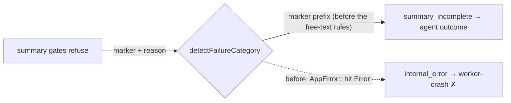

# PR Summary — Issue #3431: summary-gate refusals no longer misread as worker crashes

## Summary

Closes #3431

When the PR-summary completion gates refused a run, the failure reason was the gates' own refusal text. In stSoftwareAU/GRQ-AutoTrader#2788 that text quoted the Rust path `AppError::EvaluationSummaryUnavailable`. Its `Error:` substring hit the `internal_error` catch-all, so the run was classed `worker-crash` (code-fixable), and the worker filed a false diagnostic.

The fix has three parts:

- **Marker on gate refusals.** The gates now prefix their refusal with `SUMMARY_RULE_GATE_MARKER`.
- **New category.** The marker maps to a new `summary_incomplete` category, displayed as `summary-incomplete`, which is an agent outcome and not code-fixable.
- **Narrower catch-all.** The `Error:` catch-all no longer matches a `::` path separator.

## Spec

### Intent and Rationale

A summary-gate refusal means the agent's work is done but its summary is incomplete. That is an agent outcome. Classing it as a worker crash caused two problems: worker-diagnostic issues were filed for agent shortfalls, and failures were counted against the worker.

### Essential Design Decisions

- **Marker, not text matching.** A worker-owned marker identifies a gate refusal. Guessing from the quoted agent text would break, because that text is free-form and can quote anything.
- **Placement of the marker check.** It is matched with `startsWith` and is the first rule in `detectFailureCategory`, ahead of the scheduled-release, kill, timeout, rate-limit and interrupted rules (PR #3440 review). The gate refusal quotes the agent's summary, so a quoted "Released on schedule:", "timeout", "SIGTERM", "rate limit" or `TypeError:` must not outrank it. Every reason `buildScheduledReleaseReason` writes opens with `SCHEDULED_RELEASE_MARKER`, so none can open with the summary marker. A timeout or kill message begins with the worker's own text, so one that merely quotes the marker later still classifies as a timeout or a kill. `classifyRunFailure` likewise answers `summary_incomplete` before its message-pattern rules, so a quoted `ENOSPC` is not `disk-full`. The failure ladder does the same: `classifyCodingFailure` returns `ladder` / `non_transient` for the category before its deadline-marker and timeout checks, and `detectHostFault` returns `null` for a marked reason (so `isSetupFault`, `planCodingFailure` and the first/second-attempt failure comments never read the quotation as a host fault).
- **Narrowing the catch-all.** `/Error:(?!:)/` keeps real `Error: x` and `TypeError: x` lines and drops `Foo::Bar` paths. The lookahead is a single token, so the pattern stays linear. A hostile-input growth test guards this.

### Undiscoverable Facts

- Stored category values are additive. Every existing value stays valid, so no key bump or old-shape reader is needed. A record written before this change still normalises through `VALID_FAILURE_CATEGORIES`.

## Evidence

- Quality gate: `./quality.sh < /dev/null` gave `Result: PASSED (with skipped checks)`. Only the config integration check was skipped.
- `deno.lock` is unchanged.
- Callers checked:
  - The consumers of `getFailureCategoryDisplay` / `detectFailureCategory`: `label_failure.ts`, `label_question_failure.ts`, `execute_phase.ts` and `run_outcome_classifier.ts`. They already handle every category through the new switch arms.
  - All three `reportSummaryRuleBlock` failure returns (`completion_phase.ts:605`, `:637`, `:675`) carry the marker.
- Existing rules checked: the `WORKFLOW_GATE_MARKER` precedent (matched after the free-text rules, because its text can be quoted by an agent; this marker is a prefix, so it can lead), plus the classifier's ordering doc (item 0 now lists `summary_incomplete`).
- PR #3440 review: a marked refusal quoting "timeout" + `TypeError:`, "rate limit", "usage limit", "SIGTERM", "SIGKILL", "interrupted before completing", `ENOSPC`, out-of-credit text or a secondary rate limit now stays `summary_incomplete` / `not_code_fixable` / `agent-outcome`. The other callers of the detector take the category from the same function, so they follow it. No prompt or standards rule changed.
- PR #3440 review (round 2): a marked refusal quoting `Released on schedule:` is `summary_incomplete`, not `scheduled_release`. The ladder (`classifyCodingFailure` / `planCodingFailure`) gives a marked refusal quoting `ENOSPC`, `Failed to clone o/r: `, "at the cycle deadline", "timeout" or `Released on schedule:` `applyLadder: true` with cooldown kind `non_transient`. Other readers of the raw reason checked: `detectHostFault` (callers `isSetupFault`, `label_failure.ts` first/second-attempt notes, now `null` for a marked reason), `isTimeoutClassFailureReason` (only reached through `classifyCodingFailure`, now after the early return), `label_failure.ts` scheduled-release skip (reads `detectFailureCategory`, fixed by the reorder), and `run_core_production_deps.ts` `isSetupFault` (same helper). No new `Issue #N` provenance was cited.
- I applied the rules to the PR's own diff and found one problem: the new growth test was missing from `WALL_CLOCK_TEST_FILES`. It now lives in `worker/deno/tests/failure_diagnosis_bounds_3431_test.ts` and is registered there.

**Docs sweep** — grep: `summary_incomplete`, `summary-incomplete`, `SUMMARY_RULE_GATE_MARKER`, `reportSummaryRuleBlock`, `internal_error`, `Error:`, `agent-outcome`, `clone-corrupt` (failure-category lists) across `README.md`, `docs/` (excluding `docs/archive/`) and `*/README.md`; section: `docs/INTERNALS.md#summary_incomplete-is-its-own-failure-category-issue-3431`, `docs/workflows/issue-processing.md#️-prompt-is-too-long--one-uncounted-fresh-session-retry`; updated: `docs/INTERNALS.md`, `docs/workflows/issue-processing.md` — the other hits were read and are still true (the `summary_incomplete` outcome kind in `docs/CALLBACKS.md` and the outcome table in `docs/workflows/issue-processing.md`, the host-fault kind lists in `docs/TROUBLESHOOTING.md` and `docs/INTERNALS.md`, and the `API Error: 402` → `rate_limit` note in `docs/CONFIGURATION.md`, where `Error: ` is still an `Error:` line)

## Reproduction

- **symptom** — a summary-gate refusal quoting `AppError::EvaluationSummaryUnavailable` was classed `internal_error` → `worker-crash`, and auto-filed #3431.
- **status** — `verified` — the regression test was observed failing against the unfixed code and passing after the fix. With the fix's behaviour reverted (the `SUMMARY_RULE_GATE_MARKER` check removed and the catch-all put back to `/Error:/`), all four #3431 tests below failed on their assertions. With the fix restored, the same files gave `133 passed | 0 failed`. Against the full base-branch `lib/`, `run_outcome_classifier_test.ts` "summary_incomplete is an agent outcome…" also failed.
- **regression test** — `worker/deno/tests/failure_diagnosis_test.ts::the marked #3431 refusal is summary_incomplete and an agent outcome, not a worker crash`
- Also covering:
  - `worker/deno/tests/failure_diagnosis_test.ts::a Rust AppError:: path is not an Error: line, but real Error: lines still are (Issue #3431)`
  - `worker/deno/tests/completion_phase_summary_rule_retry_test.ts::a no-PR summary-rule block carries the gate marker, so it is summary_incomplete not a crash (Issue #3431)`
  - `worker/deno/tests/failure_diagnosis_bounds_3431_test.ts::hostile colon runs classify in linear time (Issue #3431)`

## Test Plan

- [x] `deno task test:unit` on the touched test files
- [x] Full `./quality.sh < /dev/null` passes

Branch outcomes:

- `worker/deno/lib/failure_diagnosis.ts:269`: the marker prefix gives `summary_incomplete`. Reached by "the marked #3431 refusal is summary_incomplete…" and by the completion-phase #3431 test. Flipping it (removing the check) went red.
- `worker/deno/lib/failure_diagnosis.ts:435`: `Error:` followed by `::` is no longer `internal_error`, while `Error: x` still is. Reached by "a Rust AppError:: path is not an Error: line…" and `worker/deno/tests/failure_diagnosis_bounds_3431_test.ts`. Flipping it (reverting to `/Error:/`) went red.
- `worker/deno/lib/failure_diagnosis.ts:269` ordering and anchor: a marked refusal quoting a scheduled-release phrase, timeout, `TypeError:`, rate limit, usage limit, SIGTERM, SIGKILL or "interrupted" wins over those rules. Reached by the "a marked refusal quoting … is still summary_incomplete" tests in `worker/deno/tests/failure_diagnosis_test.ts`. Moving the check back below the scheduled-release rule went red on the scheduled-release-phrase case (PR #3440 review round 2).
- `worker/deno/lib/coding_failure_ladder.ts:164`: a `summary_incomplete` category returns a `ladder` / `non_transient` decision. Reached by the five "a marked gate refusal quoting … earns a normal attempt" tests in `worker/deno/tests/coding_failure_ladder_test.ts` (ENOSPC, a clone failure, the cycle deadline, timeout, a scheduled release). Removing the branch went red on the deadline and timeout cases.
- `worker/deno/lib/host_fault.ts:94`: a marked reason is never a host fault. Reached by the ENOSPC and clone-failure cases above; the unmarked-quotation case in "isSetupFault - the same quotation without the gate marker is still a host fault" proves the guard is the marker, not the wording. Removing the guard went red on the ENOSPC and clone-failure cases.
- `worker/deno/lib/failure_diagnosis.ts:269` anchor, the other outcome: a timeout or kill message that quotes the marker later is not a gate refusal. Reached by "the summary marker cannot mask a timeout or a kill" in the same file. Changing `startsWith` to `includes` while keeping the early position went red.
- `worker/deno/lib/run_outcome_classifier.ts:246`: `summary_incomplete` answers before the stale-lineage, disk-full and out-of-credit rules. Reached by "a marked refusal quoting ENOSPC / out-of-credit / a secondary limit stays agent-outcome" in `worker/deno/tests/failure_diagnosis_test.ts`. Removing the early return went red.
- `worker/deno/lib/failure_diagnosis.ts:573` (isInfrastructure false), `:621` (display), `:943` (diagnosis), `:1050` (oneliner), `:499` (validation): reached by "summary_incomplete category - display, diagnosis, oneliner and validation handle it". Flipping each arm's value went red.
- `worker/deno/lib/run_outcome_classifier.ts:193` (the shared `AGENT_OUTCOME` result): `summary_incomplete` gives not_code_fixable / agent-outcome. Reached by `worker/deno/tests/run_outcome_classifier_test.ts` "summary_incomplete is an agent outcome even over a stack-trace-looking line". Flipping it to code-fixable went red.
- `worker/deno/lib/phases/completion_phase.ts:557` (the prefix, returned at `:605`, `:637` and `:675`): reached by the completion-phase #3431 test on the no-PR return at `:605`. Removing the prefix went red. The returns at `:637` and `:675` share the same `failureReason` constant, and their existing summary-rule retry tests still pass.
