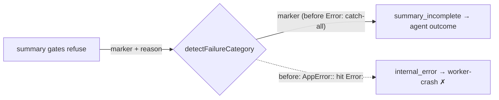

# PR Summary — Issue #3431: summary-gate refusals no longer misread as worker crashes

## Summary

Closes #3431

When the PR-summary completion gates refused a run, the failure reason was the gates' own refusal text. In stSoftwareAU/GRQ-AutoTrader#2788 that text quoted the Rust path `AppError::EvaluationSummaryUnavailable`. Its `Error:` substring hit the `internal_error` catch-all, so the run was classed `worker-crash` (code-fixable), and the worker filed a false diagnostic.

The fix has three parts:

- **Marker on gate refusals.** The gates now prefix their refusal with `SUMMARY_RULE_GATE_MARKER`.
- **New category.** The marker maps to a new `summary_incomplete` category, displayed as `summary-incomplete`, which is an agent outcome and not code-fixable.
- **Narrower catch-all.** The `Error:` catch-all no longer matches a `::` path separator.

## Spec

### Intent and Rationale

A summary-gate refusal means the agent's work is done but its summary is incomplete. That is an agent outcome. Classing it as a worker crash caused two problems: worker-diagnostic issues were filed for agent shortfalls, and failures were counted against the worker.

### Essential Design Decisions

- **Marker, not text matching.** A worker-owned marker identifies a gate refusal. Guessing from the quoted agent text would break, because that text is free-form and can quote anything.
- **Placement of the marker check.** It runs after the timeout and kill checks and after `WORKFLOW_GATE_MARKER`, so it cannot mask a timeout or a kill (the #249 lesson). It runs before the `Error:` catch-all.
- **Narrowing the catch-all.** `/Error:(?!:)/` keeps real `Error: x` and `TypeError: x` lines and drops `Foo::Bar` paths. The lookahead is a single token, so the pattern stays linear. A hostile-input growth test guards this.

### Undiscoverable Facts

- Stored category values are additive. Every existing value stays valid, so no key bump or old-shape reader is needed. A record written before this change still normalises through `VALID_FAILURE_CATEGORIES`.

## Evidence

- Quality gate: `./quality.sh < /dev/null` gave `Result: PASSED (with skipped checks)`. Only the config integration check was skipped.
- `deno.lock` is unchanged.
- Callers checked:
  - The consumers of `getFailureCategoryDisplay` / `detectFailureCategory`: `label_failure.ts`, `label_question_failure.ts`, `execute_phase.ts` and `run_outcome_classifier.ts`. They already handle every category through the new switch arms.
  - All three `reportSummaryRuleBlock` failure returns (`completion_phase.ts:605`, `:637`, `:675`) carry the marker.
- Existing rules checked: the `WORKFLOW_GATE_MARKER` precedent, plus the classifier's ordering doc (item 8 now lists `summary_incomplete`). No prompt or standards rule changed.
- I applied the rules to the PR's own diff and found one problem: the new growth test was missing from `WALL_CLOCK_TEST_FILES`. It now lives in `worker/deno/tests/failure_diagnosis_bounds_3431_test.ts` and is registered there.
- Docs sweep:
  - `docs/INTERNALS.md` has a new subsection on `summary_incomplete` (Issue #3431).
  - `docs/workflows/issue-processing.md` has a new paragraph on how a gate refusal is classed.
  - `grep -rn "internal_error\|Error:" docs/` hits still describe the catch-all correctly. Real `Error:` lines are still matched.

## Reproduction

- **Symptom:** a summary-gate refusal quoting `AppError::EvaluationSummaryUnavailable` was classed `internal_error` → `worker-crash`, and auto-filed #3431.
- **Status:** verified. On the base branch, `detectFailureCategory` returns `internal_error` for the #3431 refusal text.
- **Regression tests:**
  - `worker/deno/tests/failure_diagnosis_test.ts`: "the marked #3431 refusal is summary_incomplete and an agent outcome, not a worker crash", and "a Rust AppError:: path is not an Error: line, but real Error: lines still are (Issue #3431)".
  - `worker/deno/tests/completion_phase_summary_rule_retry_test.ts`: "a no-PR summary-rule block carries the gate marker, so it is summary_incomplete not a crash (Issue #3431)".

## Test Plan

- [x] `deno task test:unit` on the touched test files
- [x] Full `./quality.sh < /dev/null` passes

Branch outcomes:

- `worker/deno/lib/failure_diagnosis.ts:339`: the marker gives `summary_incomplete`. Reached by "the marked #3431 refusal is summary_incomplete…" and by the completion-phase #3431 test. Flipping it (removing the check) went red.
- `worker/deno/lib/failure_diagnosis.ts:425`: `Error:` followed by `::` is no longer `internal_error`, while `Error: x` still is. Reached by "a Rust AppError:: path is not an Error: line…" and `worker/deno/tests/failure_diagnosis_bounds_3431_test.ts`. Flipping it (reverting to `/Error:/`) went red.
- `worker/deno/lib/failure_diagnosis.ts:339` ordering: a timeout or kill still wins over the marker. Reached by "the summary marker cannot mask a timeout or a kill". Flipping it (moving the check above the timeout and kill checks) went red.
- `worker/deno/lib/failure_diagnosis.ts:573` (isInfrastructure false), `:621` (display), `:943` (diagnosis), `:1050` (oneliner), `:499` (validation): reached by "summary_incomplete category - display, diagnosis, oneliner and validation handle it". Flipping each arm's value went red.
- `worker/deno/lib/run_outcome_classifier.ts:373`: `summary_incomplete` gives not_code_fixable / agent-outcome. Reached by `worker/deno/tests/run_outcome_classifier_test.ts` "summary_incomplete is an agent outcome even over a stack-trace-looking line". Flipping it to code-fixable went red.
- `worker/deno/lib/phases/completion_phase.ts:557` (the prefix, returned at `:605`, `:637` and `:675`): reached by the completion-phase #3431 test on the no-PR return at `:605`. Removing the prefix went red. The returns at `:637` and `:675` share the same `failureReason` constant, and their existing summary-rule retry tests still pass.
