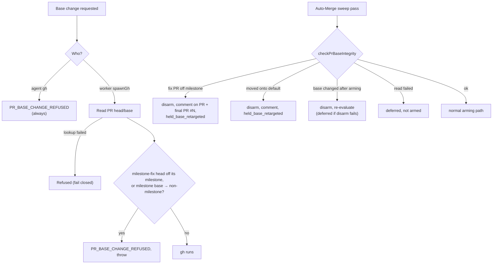

## Summary

Milestone-fix PRs could leave their milestone branch and auto-merge into the default branch. The caller was `retargetOrphanBoundPr` (Issue #4396 gate in `milestone_children_gate.ts`). When a milestone was closed, or a PR headed by the milestone branch had merged, `enableAutoMerge` ran `gh pr edit <N> --base <default>` on every PR still bound for that milestone, milestone-fix PRs included. A fix PR's diff against the default branch is the whole milestone, and the auto-merge armed at creation then landed it there.

This PR:

- stops that caller: the PR is held on its milestone branch, not merged, auto-merge disarmed, one comment;
- guards every PR base change at both `gh` seams (the worker's `spawnGh` chokepoint and the agent's `gh` guard);
- makes auto-merge follow the base, both when a fix PR is armed and on every Auto-Merge sweep pass.

Closes #3433.

## Spec

### Intent and Rationale

- The issue requires a base change from a `milestone/**` base to the default branch to be refused. That makes the Issue #4396 retarget impossible, so its block path now holds the PR for a human instead of retargeting it. The PR is never merged into the dead milestone branch, which was #4396's goal, and nothing reaches the default branch unreviewed.
- The worker seam is `spawnGh`, the single `gh` chokepoint. Every worker base edit therefore passes the guard, including future callers. The agent guard runs as a pure child with no network access, so it cannot read a PR's head or base. It refuses every agent base change instead; the worker owns PR targeting.

### Essential Design Decisions

- `decidePrBaseChange` (`worker/deno/lib/pr_base_change_guard.ts`) refuses two moves. A `milestone-fix/**` head may target only its own milestone branch. A PR on a `milestone/**` base may not move to any non-milestone branch, a stricter rule than "to the default branch", so no default-branch lookup is needed. If the head/base lookup fails, the change is refused.
- The branch-name predicates moved to an import-free leaf, `worker/deno/lib/milestone_branch_names.ts`, which the old owners re-export. `gh_spawn.ts` and the agent guard child can import it without the cycle `gh_spawn → milestone_children_gate → github → gh_spawn`, and the agent guard child can load it without the permissions that heavier modules need.
- The sweep runs its base check before the armed+behind branch-update path, because that path skips `attemptMerge`. To bound GraphQL cost, the read is skipped only for an unarmed, non-fix PR on a milestone base.
- The hold comment uses a new marker, `<!-- milestone-route-closed-hold -->`. This is a bumped key for persisted data: the old `milestone-rollup-merged-retarget` comment claimed the PR had been retargeted, which no longer happens, so the new code never reads it.

### Undiscoverable Facts

- The issue's evidence shows `BaseRefChangedEvent` entries whose actor was the fleet account, with `previousRefName: milestone/…` and `currentRefName: <default>`. On the base branch, `retargetOrphanBoundPr` is the only fleet code that edits a PR's base away from a milestone branch; `retargetPrToMilestone` and the self-heal only retarget *towards* one.
- GitHub kept auto-merge armed across the retarget (PRs B and C merged by fleet auto-merge 14–18 minutes later), so disarming on a base change is required.

## Evidence

- Backend/CLI only; no UI files touched.
- Real tool observed: `gh api graphql -f query="<the pr_base_integrity.ts QUERY>" -F owner=stSoftwareAU -F name=VibeCoder -F number=3491` returned `{"defaultBranchRef":{"name":"main"},"pullRequest":{"headRefName":"issue-3409-…","baseRefName":"milestone/worker-deno-lib-pr-feedback-and-body-sync","autoMergeRequest":{"enabledAt":"2026-10-10T10:14:49Z"},"timelineItems":{"nodes":[]}}}`. The test fixtures copy this shape. No PR with a `BaseRefChangedEvent` was found to observe. The `createdAt`/`previousRefName`/`currentRefName` fields follow the GitHub GraphQL schema and the field names quoted in the issue's evidence.
- Fakes: the `gh` fakes in `worker/deno/tests/pr_base_integrity_test.ts` and `worker/deno/tests/gh_spawn_test.ts` stand in for the real `gh` binary, which `spawnGh`'s injectable runner drives in production. They rely on `pr view --json headRefName,baseRefName` returning those two strings, and on the GraphQL payload shape observed above.
- Issue numbers cited as provenance: #3433: Milestone-fix PRs get retargeted to the default branch and auto-merge there, bypassing the milestone's review. #4396, #2907, #2022 and #1967 were already cited in the code this PR edits.

**Docs sweep** — grep: `RetargetedToDefault`, `retargeted_to_default`, `retargetOrphanBoundPr`, `milestone-rollup-merged-retarget`, "retargets the PR at the default", "edit\` are (unaffected|untouched)"; section: `docs/workflows/milestones.md#milestone-fix-prs-only-target-their-milestone-branch-issue-3433`; updated: `docs/workflows/milestones.md`, `docs/INTERNALS.md`, `SECURITY.md`, `prompts/coding_guidelines/prompt.md`, `docs/audits/lib-sweep-coverage/top-up-3433.json`; `prompts/coding_guidelines/prompt.md:753` — still true because it now names the `--base` exception; `worker/deno/tests/milestone_branch_self_heal_test.ts:487` — still true because it is about a human's retarget, which the self-heal never flips back

## Reproduction

- **symptom** — a milestone-fix PR opened into `milestone/<…>` had its base changed to the default branch by the fleet's account and then auto-merged there, landing the whole milestone without its final review
- **status** — `partial` — reason: the faulty call was confirmed on the base branch by reading `retargetOrphanBoundPr`, and by the base test that asserted `edit?.slice(-2)` equals `["--base", "Develop"]`. The new regression tests import exports this PR adds (`HeldRouteClosed`, `holdOrphanBoundPr`, `PrBaseChangeRefusedError`), so they cannot run unchanged against base production code. Each was instead seen going red in-tree with its fix removed: re-adding a `pr edit --base main` to the hold, disabling the milestone-fix rule, and making `classifyPrBaseChange` return `undefined`.
- **regression test** — `worker/deno/tests/pr_auto_merge_test.ts::pr_auto_merge - a base whose rollup already merged: comment once, disarm, no retarget, no merge (Issue #3433)`

## Acceptance Criteria

<!-- vibe-spec-review inputs="diff+issue-body" -->

- **met** — Find the caller that changed the base and stop it — evidence: `worker/deno/lib/milestone_children_gate.ts::holdOrphanBoundPr`, `worker/deno/tests/pr_auto_merge_test.ts::pr_auto_merge - a base whose rollup already merged: comment once, disarm, no retarget, no merge (Issue #3433)` — reviewer: met
- **met** — Add a guard at the shared PR-edit seam: a base change on a PR whose head starts `milestone-fix/`, or whose current base is a `milestone/` branch, to the default branch is refused and logged loudly — evidence: `worker/deno/tests/gh_spawn_test.ts::spawnGh #3433 - refuses moving a milestone-fix PR off its milestone branch`, `worker/deno/tests/pr_base_change_guard_test.ts::enforcePrBaseChangeGuard - logs and throws on refusal, no-op otherwise` — reviewer: met
- **met** — This applies to agents' `gh` calls too (the audited command path) — evidence: `worker/deno/tests/gh_guard_decision_test.ts::gh-guard #3433 - every agent PR base change is refused with PR_BASE_CHANGE_REFUSED` — reviewer: met
- **met** — When any fleet PR's base changes, disable its auto-merge and re-evaluate — evidence: `worker/deno/tests/pr_base_integrity_test.ts::check: a base change since arming disarms and proceeds as disarmed`, `worker/deno/tests/auto_merge_sweep_test.ts::a base check that disarmed an armed, behind PR gets no branch update and is merge-attempted afresh` — reviewer: met
- **met** — Never auto-merge a PR into the default branch that the fleet did not open there under the normal one-slot rule — evidence: `worker/deno/tests/pr_base_integrity_test.ts::check: a PR moved onto the default branch is disarmed, commented once and held` — reviewer: partial — reason: the reviewer wrote that "an unarmed PR on a non-milestone base with no recorded base-change event is not held". Such a PR is on the base it was opened on, so the fleet did open it there. A PR on the default branch that the fleet did not open there always has a `BaseRefChangedEvent` onto it, and that is what the check holds.
- **met** — `armMilestoneFixPrAutoMerge` should check the base at merge-arming time and again on every later pass — evidence: `worker/deno/tests/milestone_fix_pr_test.ts::raiseMilestoneFixPr - a base that reads back as main is not armed (Issue #3433)`, `worker/deno/tests/pr_base_integrity_test.ts::check: a retargeted milestone-fix PR is disarmed, commented twice and held` — reviewer: met
- **met** — A maintenance pass flags any open fleet PR whose head is `milestone-fix/**` and whose base is not a `milestone/**` branch — evidence: `worker/deno/lib/auto_merge_sweep.ts` (`checkBaseIntegrity`), `worker/deno/tests/auto_merge_sweep_test.ts::a human PR moved onto the default branch is never read or touched, while a fleet milestone-fix PR on main is disarmed and held` — reviewer: met
- **met** — It disarms that PR's auto-merge and comments on it and on the milestone's final PR — evidence: `worker/deno/tests/pr_base_integrity_test.ts::check: a retargeted milestone-fix PR is disarmed, commented twice and held` — reviewer: met
- **met** — Docs: state in docs/workflows/milestones.md that milestone-fix PRs only ever target their milestone branch and are disarmed if moved — evidence: `docs/workflows/milestones.md` section "Milestone-fix PRs only target their milestone branch (Issue #3433)" — reviewer: met
- **met** — A base-change request from a milestone-fix PR's milestone branch to the default branch is refused (unit test at the seam), including via an agent `gh pr edit --base` command — evidence: `worker/deno/tests/gh_spawn_test.ts::spawnGh #3433 - refuses moving a milestone-fix PR off its milestone branch`, `worker/deno/tests/gh_guard_decision_test.ts::gh-guard #3433 - every agent PR base change is refused with PR_BASE_CHANGE_REFUSED` — reviewer: met
- **met** — A fleet PR whose base changed has auto-merge disabled — evidence: `worker/deno/tests/pr_base_integrity_test.ts::check: a base change since arming disarms and proceeds as disarmed` — reviewer: met
- **met** — The maintenance pass flags and disarms an open `milestone-fix/**` PR based on the default branch — evidence: `worker/deno/tests/auto_merge_sweep_test.ts::a human PR moved onto the default branch is never read or touched, while a fleet milestone-fix PR on main is disarmed and held` — reviewer: met
- **met** — A human retarget of a non-fleet PR is untouched (keeps the Issue #2022 rule) — evidence: `worker/deno/tests/auto_merge_sweep_test.ts::a human PR moved onto the default branch is never read or touched, while a fleet milestone-fix PR on main is disarmed and held`; `worker/deno/tests/milestone_branch_self_heal_test.ts::selfHealMilestoneBranches - never flips back a PR a human retargeted at the default branch` is unchanged and passes — reviewer: missing — reason: the reviewer saw no such test, and it was added after the review in response to that finding.
- **unrequested** — the Issue #4396 retarget is replaced by a hold (`HeldRouteClosed`, new marker) — reviewer: unrequested — reason: the issue's guard refuses every base change off a `milestone/` branch to the default branch, so the #4396 retarget could no longer run. This path is the caller that moved the fix PRs.
- **unrequested** — new `milestone_branch_names.ts` leaf and `auto_merge_disarm.ts` helper — reviewer: unrequested — reason: the leaf breaks the import cycle without copying the owners' predicates, and the helper keeps the three disarm sites on one implementation.
- **unrequested** — the agent guard refuses every base change, not only milestone ones — reviewer: unrequested — reason: the guard child is pure and cannot read a PR's head or base; refusing every base change is the fail-closed reading of the issue's rule.

## Standards Review

<!-- vibe-standards-review inputs="diff+CODING-STANDARDS.md" -->

- **violation** — Prose about the PR's own change: "each PR's base is re-read" overstated the read, which is skipped for an unarmed non-fix PR on a milestone base — evidence: `docs/INTERNALS.md:614`, `worker/deno/lib/auto_merge_sweep.ts:22` — reason: fixed in this diff (both sentences now name the skip)
- **violation** — Every outcome of a branch you add needs a test: the disarm-failure arm of `base-changed-since-armed`, the comment-failure catches, the unparsable-head arm and the non-string-base arm had no test — evidence: `worker/deno/lib/pr_base_integrity.ts:347`, `worker/deno/lib/pr_base_integrity.ts:304`, `worker/deno/lib/milestone_fix_pr.ts:297` — reason: fixed in this diff (the disarm failure now holds as `deferred`, and each arm has a test that went red when flipped)
- **clean** — review-enforced rule checked: "Check where you insert" (no new block sits between a doc comment and its item). Also checked: Australian English; fail-closed paths (unreadable `--input`, failed lookup, failed disarm, throwing base check); refusal tests assert `PR_BASE_CHANGE_REFUSED` or `PrBaseChangeRefusedError`, with legal-input pairs; no named-but-absent tests; no workflow files; removed assertions all traced to #3433. Optional, done: `pr_auto_merge.ts` imports `isMilestoneFixBranch` from the leaf.

## Test Plan

- `./quality.sh < /dev/null` on the final head: `Result: PASSED (with skipped checks)` (only `config integration` skipped).
- `deno task check:manifests`: PASSED (692 passed).
- New: `worker/deno/tests/pr_base_change_guard_test.ts`, `worker/deno/tests/pr_base_integrity_test.ts`, `worker/deno/tests/auto_merge_disarm_test.ts`.
- Extended: `worker/deno/tests/gh_spawn_test.ts`, `worker/deno/tests/gh_guard_decision_test.ts`, `worker/deno/tests/auto_merge_sweep_test.ts`, `worker/deno/tests/pr_auto_merge_test.ts`, `worker/deno/tests/milestone_fix_pr_test.ts`, `worker/deno/tests/milestone_children_gate_test.ts`, `worker/deno/tests/conflict_takeover_test.ts` (the stub answers the new `pr view` read; expected comment count unchanged).
- Assertions removed from existing tests (`worker/deno/tests/pr_auto_merge_test.ts`), each made untrue by #3433's "base change … to the default branch is refused":
  - `assertEquals(result.result, AutoMergeResult.RetargetedToDefault);` (both #4396 tests) — now `HeldRouteClosed`.
  - `const edit = calls.find((c) => c[0] === "pr" && c[1] === "edit");` / `assertEquals(edit?.slice(-2), ["--base", "Develop"]);` — now asserts no `pr edit` and a `pr merge 3371 --repo owner/repo --disable-auto`.
  - `AutoMergeResult.RetargetedToDefault,` in the quiet-outcomes list — replaced by `HeldRouteClosed` and `HeldBaseRetargeted`.
- Removed from `worker/deno/tests/pr_auto_merge_test.ts`: `assert( !calls.some((c) => c[0] === "pr" && c[1] === "merge"), "no --auto merge issued", );` — #3433 requires a held PR's auto-merge to be disabled, and that disarm is itself a `pr merge --disable-auto` call, so "no `pr merge` call at all" is untrue. The replacement in the same test requires every `pr merge` call to lack `--auto`, which keeps the "no --auto merge issued" intent.
- Removed from `worker/deno/tests/pr_auto_merge_test.ts`: `assert( calls.some((c) => c[0] === "pr" && c[1] === "edit"), "still retargeted", );` — #3433 says a base change from a `milestone/` branch to the default branch is refused, so the PR is no longer retargeted. The test now asserts no `pr edit` call ("never retargeted").
- Callers checked: `armMilestoneFixPrAutoMerge` has one caller, `raiseMilestoneFixPr`, which passes `milestoneBranch`. `checkBaseIntegrity` is a required sweep option, wired in `worker/deno/lib/run_core_production_deps.ts`. `enableAutoMerge` gets `headRefName` from the sweep and from `pr_ci_processor.ts`. Every `gh pr edit --base` in the worker passes `spawnGh`: `pr_retarget.ts` moves towards a milestone and is allowed (`spawnGh #3433 - allows retargeting an ordinary PR onto a milestone branch`).
- Guards kept on the new hold path: the summary-PR open-children gate and the #477 defer still run before it. The #1967 sync close still runs for sync heads, which `moved-onto-default` excludes (`decide: a sync PR moved onto the default branch is left to the #1967 path`).

**Branch outcomes:**

- `worker/deno/lib/pr_base_change_guard.ts:266` — unreadable new base refused — `worker/deno/tests/pr_base_change_guard_test.ts::decidePrBaseChange - rules` — forcing allow went red
- `worker/deno/lib/pr_base_change_guard.ts:272` — milestone-fix head off its own milestone refused / onto it allowed — `worker/deno/tests/gh_spawn_test.ts::spawnGh #3433 - refuses moving a milestone-fix PR off its milestone branch` — forcing allow went red
- `worker/deno/lib/pr_base_change_guard.ts:290` — milestone base → non-milestone refused, others allowed — `worker/deno/tests/gh_spawn_test.ts::spawnGh #3433 - refuses moving a PR off a milestone base`, `worker/deno/tests/gh_spawn_test.ts::spawnGh #3433 - allows retargeting an ordinary PR onto a milestone branch` — forcing allow went red
- `worker/deno/lib/gh_spawn.ts:416` — lookup failure fails closed — `worker/deno/tests/gh_spawn_test.ts::spawnGh #3433 - a failed head/base lookup fails closed` — classifier returning undefined went red
- `worker/deno/lib/gh_guard_decision.ts:919` — agent base change refused / non-base edits allowed — `worker/deno/tests/gh_guard_decision_test.ts::gh-guard #3433 - every agent PR base change is refused with PR_BASE_CHANGE_REFUSED`, `worker/deno/tests/gh_guard_decision_test.ts::gh-guard #3433 - non-base PR edits and pr create --base stay allowed` — classifier returning undefined went red
- `worker/deno/lib/pr_auto_merge.ts:894` — closed route held, never retargeted — `worker/deno/tests/pr_auto_merge_test.ts::pr_auto_merge - a base whose rollup already merged: comment once, disarm, no retarget, no merge (Issue #3433)` — re-adding `pr edit --base` went red
- `worker/deno/lib/pr_auto_merge.ts:907` — fix head on non-milestone base held / on milestone base armed — `worker/deno/tests/pr_auto_merge_test.ts::pr_auto_merge - milestone-fix head on the default branch is held, never armed (Issue #3433)`, `worker/deno/tests/pr_auto_merge_test.ts::pr_auto_merge - milestone-fix head on a milestone base is not held (Issue #3433)` — disabling the rule went red
- `worker/deno/lib/milestone_fix_pr.ts:297` — base read back wrong, unreadable or non-string → not armed — `worker/deno/tests/milestone_fix_pr_test.ts::raiseMilestoneFixPr - a base that reads back as main is not armed (Issue #3433)`, `worker/deno/tests/milestone_fix_pr_test.ts::raiseMilestoneFixPr - an unreadable base fails closed and warns (Issue #3433)`, `worker/deno/tests/milestone_fix_pr_test.ts::raiseMilestoneFixPr - a base the view does not return as a string is 'unknown' and not armed (Issue #3433)` — removing the check went red
- `worker/deno/lib/pr_base_integrity.ts:183` — mistargeted fix PR held, both comments — `worker/deno/tests/pr_base_integrity_test.ts::check: a retargeted milestone-fix PR is disarmed, commented twice and held` — flipping the outcome went red
- `worker/deno/lib/pr_base_integrity.ts:304` — unparsable head comments on its own PR only — `worker/deno/tests/pr_base_integrity_test.ts::check: an unparsable milestone-fix head is held on its own PR and comments nowhere else` — a fake fallback PR number went red
- `worker/deno/lib/pr_base_integrity.ts:192` — moved onto default held; sync heads excluded — `worker/deno/tests/pr_base_integrity_test.ts::check: a PR moved onto the default branch is disarmed, commented once and held`, `worker/deno/tests/pr_base_integrity_test.ts::decide: a sync PR moved onto the default branch is left to the #1967 path` — flipping the outcome went red
- `worker/deno/lib/pr_base_integrity.ts:347` — base changed after arming: disarmed → proceed, disarm failed → deferred — `worker/deno/tests/pr_base_integrity_test.ts::check: a base change since arming disarms and proceeds as disarmed`, `worker/deno/tests/pr_base_integrity_test.ts::check: a base change since arming holds as deferred when the disarm fails (Issue #3433)` — `if (false)` went red
- `worker/deno/lib/pr_base_integrity.ts:273` — unarmed non-fix milestone-base PR skips the read — `worker/deno/tests/pr_base_integrity_test.ts::check: an unarmed non-fix PR on a milestone base makes no gh call` — flipping the outcome went red
- `worker/deno/lib/pr_base_integrity.ts:283` — read failure → deferred, no disarm — `worker/deno/tests/pr_base_integrity_test.ts::check: a read failure defers, and never disarms or merges` — flipping the outcome went red
- `worker/deno/lib/auto_merge_sweep.ts:270` — hold recorded, no merge, no branch update; disarmed treated as unarmed; a throw is not armed — `worker/deno/tests/auto_merge_sweep_test.ts::a held base check records its outcome and neither merges nor updates the branch, even armed and behind`, `worker/deno/tests/auto_merge_sweep_test.ts::a base check that disarmed an armed, behind PR gets no branch update and is merge-attempted afresh`, `worker/deno/tests/auto_merge_sweep_test.ts::a throwing base check is logged and the PR is not armed` — moving the check after the armed+behind block went red, and so did letting hold fall through
- `worker/deno/lib/auto_merge_disarm.ts` — disarm success / failure logged — `worker/deno/tests/auto_merge_disarm_test.ts::disarmAutoMerge logs a warning and returns false on failure` — flipping the return went red
- `worker/deno/lib/milestone_children_gate.ts::holdOrphanBoundPr` — comment failure logged, disarm still issued — `worker/deno/tests/milestone_children_gate_test.ts::holdOrphanBoundPr - a failed hold comment is logged, does not throw, and the disarm is still issued (Issue #3433)` — re-throwing in the catch went red

## Security Self-Check

- [x] Input validation: repo slugs are checked against the allow-list regex before the GraphQL read; head parsing is anchored, with no overlapping quantifiers.
- [x] Secrets: none staged.
- [x] Injection surface: every `gh` call uses argv arrays; the GraphQL query passes its values as `-F` variables.
- [x] Error handling: every refusal and disarm failure is logged; none is swallowed.

🤖 Generated with [Claude Code](https://claude.com/claude-code)
