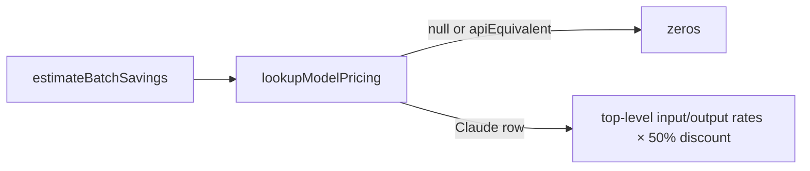

## Summary

`worker/deno/lib/batch_api.ts` no longer has its own `lookupPricing`.
`estimateBatchSavings` now prices through `lookupModelPricing`
(`token_usage.ts`), so an alias or Claude 4/5 id costs at the same row as every
other cost estimate. API-equivalent (non-Claude) rows still report zero, and a
banded row is costed at its top-level (>100k) rate. Comments and one docs
paragraph that described the old substring walk are corrected. Closes #3436.

## Spec

### Intent and Rationale

- Two pricing lookups had drifted apart. At the base, the private lookup
  priced `haiku` at the Haiku 5.5 row ($0.50/$2.50): no key matched as a
  substring, and its tier-name fallback then hit `claude-haiku-5-5` first.
  `lookupModelPricing("haiku")` returns the flat Haiku 4.x row ($1/$5). The
  same was true of a future Opus minor: `claude-opus-5-7` matched
  `claude-opus-5` ($5/$25) instead of being classified as 5.5+ ($4/$20).
- Calling the owner rather than copying it removes the drift for good.

### Essential Design Decisions

- The `apiEquivalent` exclusion (Issue #1937) is now a guard in
  `estimateBatchSavings`, at `batch_api.ts:505`. It used to be a row filter
  inside the deleted lookup.
- A banded row (`lowerBand`, Issue #3399) uses its own top-level rates. The
  estimate has no per-request prompt size, so this matches `estimateCost` for
  run totals.

### Undiscoverable Facts

- The issue says the `haiku` alias resolves to Haiku 5.5 in
  `lookupModelPricing`. At the head it does not: `TIER_CURRENT_PRICING`
  deliberately keeps `haiku` on the flat 4.x row (Issue #3400/#3399 comment in
  `token_usage.ts`). The criterion ("same row as `lookupModelPricing("haiku")`")
  still holds and is what the test pins.
- One side effect follows from the swap: `lookupModelPricing` matches by version
  parse and `startsWith`, not substring. An id with a vendor prefix (for example
  `anthropic.claude-…`) now reports zero batch savings rather than a guessed
  row.
- The milestone parent's owner comments (an executor-tier trial,
  budget accounting) do not touch this lookup, so the sub-issue description
  stands unchanged.

## Evidence

Backend-only change. No UI files are touched.

Issues cited as provenance in the diff:

- #3436: Use lookupModelPricing in batch_api.ts instead of its own lookupPricing
- #3399: Banded Claude Haiku 5.5 pricing in token_usage (≤100k / >100k prompt tokens)
- #1937: Price Codex, Gemini and DeepSeek model ids in MODEL_PRICING and label their run-stats sub-bullets (API-equivalent)

**Docs sweep** — grep: `lookupPricing`, `estimateBatchSavings`,
`batch_api`, "prefix walk", "tier name"; section:
`docs/MODEL-AND-CACHING.md#model-pricing` (Opus 5.5 paragraph) and
`docs/MODEL-AND-CACHING.md` "What remains in the code"; updated:
`docs/MODEL-AND-CACHING.md`, `worker/deno/lib/token_usage.ts` (MODEL_PRICING
row comments), `worker/deno/tests/token_usage_test.ts` and
`worker/deno/tests/batch_api_fable_pricing_test.ts` (comments);
`docs/MODEL-AND-CACHING.md:2585` — still true because `estimateBatchSavings` is
still a pure offline helper; `docs/INTERNALS.md:5010` and `:5344` — still true
because they describe the module's history and offline status, not its pricing
lookup.

## Acceptance Criteria

<!-- vibe-spec-review inputs="diff+issue-body" -->

- **met** — `batch_api.ts` has no pricing lookup of its own; it calls `lookupModelPricing`. — evidence: `worker/deno/lib/batch_api.ts` (private `lookupPricing` deleted, `estimateBatchSavings` calls `lookupModelPricing`) — reviewer: met
- **met** — `estimateBatchSavings` for `haiku` uses the same row as `lookupModelPricing("haiku")`. — evidence: `worker/deno/tests/batch_api_test.ts::batch_api - estimateBatchSavings prices the bare haiku alias at lookupModelPricing's row (Issue #3436)` — reviewer: met
- **met** — Non-Claude (`apiEquivalent`) ids still report zero batch savings. — evidence: `worker/deno/tests/batch_api_test.ts::batch_api - estimateBatchSavings never applies Anthropic's discount to a non-Claude row (Issue #1937)` — reviewer: met
- **met** — Decide how batch savings should handle banded rows (`lowerBand`, #3399): use the top-level (>100k) rate — evidence: `worker/deno/tests/batch_api_test.ts::batch_api - estimateBatchSavings costs a banded row at its upper band (Issue #3436)` — reviewer: met
- **unrequested** — Reworded `MODEL_PRICING` row comments in `token_usage.ts` and test comments in `token_usage_test.ts` / `batch_api_fable_pricing_test.ts` — reviewer: unrequested — reason: they described the deleted `lookupPricing` walk and would be false after this change (docs-sweep rule)
- **unrequested** — Rewrote the Opus 5.5 paragraph in `docs/MODEL-AND-CACHING.md` — reviewer: unrequested — reason: it claimed `batch_api.ts` walks the rows in order, which this change makes false
- **unrequested** — Added the "classifies a future Opus minor by version" test — reviewer: unrequested — reason: regression test for the Opus example in the issue's own Summary

## Standards Review

<!-- vibe-standards-review inputs="diff+CODING-STANDARDS.md" -->

- **clean** — DRY / reuse the in-repo helper (review-enforced, checked);
  fail loud (unknown and API-equivalent ids still return explicit zeros);
  named tests exist; no stubs or fakes; no workflow changes; no persisted data
  shape changed; new tests go red without the change; docs and comments updated
  to match; Australian English; "Check where you insert" hunk boundaries. No
  assertion removed from any existing test. The reviewer noted as optional that
  the banded-row test hard-codes 0.50/2.50. That is intentional: the test pins
  the upper-band rates against the lower band's 0.10/0.50.

## Test Plan

Added in `worker/deno/tests/batch_api_test.ts`:

- `batch_api - estimateBatchSavings prices the bare haiku alias at lookupModelPricing's row (Issue #3436)`:
  red on the base (`Expected actual: "3" to be close to "6"`), green at the head.
- `batch_api - estimateBatchSavings classifies a future Opus minor by version (Issue #3436)`:
  red on the base (`Expected actual: "30" to be close to "24"`), green at the head.
- `batch_api - estimateBatchSavings costs a banded row at its upper band (Issue #3436)`:
  pins the chosen design. It is green on the base too, because the old
  substring walk also reached the `claude-haiku-5-5` row's top-level rates.
- `batch_api - estimateBatchSavings reports zeros for a model id lookupModelPricing cannot price (Issue #3436)`:
  pins the unknown-id outcome. It is green on the base too, because no tier
  name occurs in the id.

Modified (comments only, no assertion removed): `worker/deno/tests/batch_api_fable_pricing_test.ts`
and `worker/deno/tests/token_usage_test.ts`.

Results on the final head:

- `deno test --allow-all tests/batch_api_test.ts tests/batch_api_fable_pricing_test.ts tests/token_usage_test.ts`
  (run from `worker/deno`): `ok | 91 passed | 0 failed`.
- `./quality.sh < /dev/null`: `Result: PASSED (with skipped checks)`. The only
  skipped check was `config integration`. The gate ran before the
  unknown-id test was added. That test was then run with `deno test`,
  `deno fmt --check` and `deno lint`, and all passed.

Entry points checked: `estimateBatchSavings` is called by the `batch-api
--estimate-savings` command (`worker/deno/commands/batch_api.ts`), which is
unchanged. It now receives the shared lookup's row, and `deno check` passes on
it.

**Branch outcomes:**

- `worker/deno/lib/batch_api.ts:505` — `pricing.apiEquivalent === true` →
  zeros — `worker/deno/tests/batch_api_test.ts::batch_api - estimateBatchSavings never applies Anthropic's discount to a non-Claude row (Issue #1937)`
  — removing the `apiEquivalent` clause turned it red.
- `worker/deno/lib/batch_api.ts:505` — `!pricing` (unknown id) → zeros —
  `worker/deno/tests/batch_api_test.ts::batch_api - estimateBatchSavings reports zeros for a model id lookupModelPricing cannot price (Issue #3436)`
  — removing the `!pricing` clause turned it red (`TypeError: Cannot read properties of null`).
- `worker/deno/lib/batch_api.ts:505` — priced Claude row → discounted cost —
  `worker/deno/tests/batch_api_test.ts::batch_api - estimateBatchSavings prices the bare haiku alias at lookupModelPricing's row (Issue #3436)`
  — this test was red against the old lookup.

🤖 Generated with [Claude Code](https://claude.com/claude-code)
