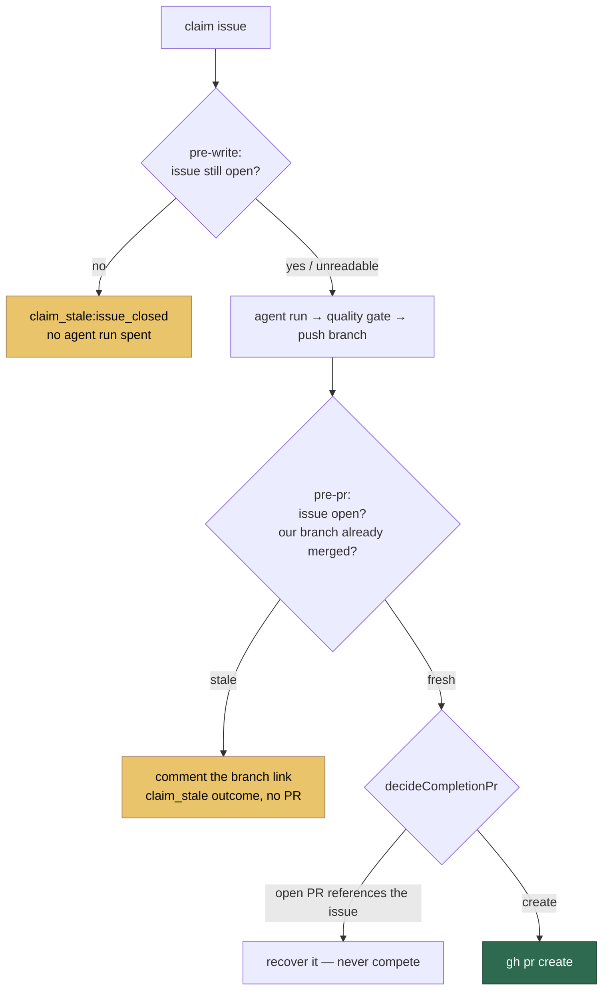

# Re-check claim freshness before spending an agent run and before raising a PR

## Summary

The worker held one claim across a whole cycle and never re-read the world
before opening a PR. On VibeCoder#333 the cost was a duplicate: the issue closed
at `07:57:54Z` when PR #339 merged, and the worker opened PR #341 against it at
`08:15:06Z` — a `CONFLICTING`/`DIRTY` PR against work already on `main`, which
needed manual salvage. The claim was legitimate when it was taken; nothing
between the claim and `gh pr create` asked whether it still was.

`worker/deno/lib/claim_freshness.ts` adds that re-check at two points:

- **`pre-write`** — start of the execute phase. One `gh issue view`, so a cycle
  that spent forty minutes rate-limited does not spend an agent run on work that
  may already be merged.
- **`pre-pr`** — immediately before `gh pr create`. The issue state, plus the PR
  that references the issue.

Two rules, most decisive first: **the issue closed** during the cycle, and **a
merged PR already carries this run's branch**. The second defers to
`pr_run_provenance.ts` (#174) rather than inventing a second notion of "already
done" — a merged PR on a _different_ branch deliberately does **not** make the
claim stale, because #174's rule is that it does not complete this run and those
commits still deserve their PR.

The third hazard the issue names — "do not open a competing PR" — is already
answered by `decideCompletionPr`, which **recovers** an open PR that references
the issue instead of creating a second one. An earlier revision of this change
duplicated that as a stale-claim abort; it regressed the self-heal path, because
`superseding_pr.ts` reports an *unreadable* PR state as "open", so a `gh pr view`
hiccup abandoned a finished run that today recovers cleanly. The rule was
dropped and the recover path is now pinned by a test instead.

A stale claim is a **clean stop, never a failure**: the branch is already pushed,
so the completion phase comments the branch link on the issue and returns a
`claim_stale` `RunOutcome` — no failure label, no `unknown` class, no run-failure
issue, and no contribution to the failure streak (the phases return
`status: "early_exit"`, which `issue_worker.ts` reports as `success: true`). That
is #342's lesson applied: a normal outcome counted as a crash backs the whole
host off.

Every lookup failure fails safe to `fresh` and is warned about, never swallowed.
This guard withholds a PR for finished, pushed, quality-gated work, so a `gh`
hiccup must never be the thing that withholds it.

Closes #344.

## Evidence

Backend/CLI only — no web interface to screenshot. The evidence is the test
suite below, plus the `deno test` output quoted after it.



**The guard is what makes the regression tests pass.** With the two
`if (freshness.kind === "stale")` branches disabled, the phase-level tests fail
exactly as VibeCoder#333 did — `gh pr create` runs against a closed issue and an
agent run is spent on it:

```text
FAILURES
completion #344 - an issue closed mid-cycle stops the PR being raised
completion #344 - a hand-off comment that fails to post does not turn the abort into a failure
execute #344 - a claim whose issue closed during the cycle never spends an agent run
FAILED | 2 passed | 3 failed
```

With the guard in place:

```text
ok | 22 passed | 0 failed   tests/claim_freshness_test.ts
ok |  6 passed | 0 failed   tests/claim_freshness_phase_test.ts
ok | 134 passed | 0 failed  (with tests/issue_worker_test.ts)
```

`./quality.sh` reports every check `PASSED` except `deno tests`, which carries a
**pre-existing** 34-failure baseline in this container. That baseline was
measured on `main` in a clean worktree before any change here (34 failed) and is
unchanged on this branch (34 failed); the failures are environment- and
timing-dependent families — `setup_workdir_reminder`, `claude_runner_*`,
`fleet_health`, `run_sh_launcher` — with zero failures in any file this change
touches:

```text
$ ./quality.sh | sed -n '/^ FAILURES/,/^FAILED |/p' \
    | grep -cE 'claim_freshness|issue_worker_test|completion_phase|execute_phase|run_outcome|heartbeat_storage|pr_run_provenance'
0
```

### Security self-check

- **Input validation** — `gh issue view --json state` output is parsed inside a
  `try`; a non-string, empty or unparseable `state` is treated as unreadable
  (fail-safe `fresh`) and warned about, never coerced into a state the worker
  never saw.
- **Injection surface** — no new shell or SQL. `gh` is invoked through the
  existing `runGhCommand` chokepoint with an argument array; the issue number is
  passed as `String(issueNumber)` from a typed `number`.
- **Output encoding** — the branch name in the hand-off comment's URL is
  `encodeURIComponent`-escaped.
- **Error handling** — no stack traces or paths reach the issue comment; the
  operator-facing text names the branch, the reason and the PR only.
- **Secrets / dependencies** — no new dependency, no new credential, nothing
  hidden staged.

## Test Plan

`worker/deno/tests/claim_freshness_test.ts` — 22 tests over the decision rules,
the lookups and the outcome:

- an issue closed mid-cycle is stale; the closing PR is named on the verdict
- an open issue with no PR is fresh
- a merged PR carrying **this run's** branch is stale (`work_already_merged`)
- someone else's merged PR is **fresh** — #174's rule, so unpublished commits
  keep their PR — as is a merged PR with an unknown head
- an open PR for the issue is fresh for every head ref, left to
  `decideCompletionPr`
- an unreadable / unparseable / failed `gh issue view` fails safe to `fresh` and
  is warned about (both the throw and the malformed-payload path)
- `pre-write` mode issues exactly one `gh` call and does not stop a run for an
  in-flight PR; `pre-pr` mode also classifies the PR
- a lower-case `gh` state is still recognised as closed
- `formatStaleClaimReason` starts with the greppable `claim_stale:<reason>` token
- the hand-off comment links the branch, names the overtaking PR, and renders
  with no `undefined` when there is none
- the outcome is `claim_stale`, never `no_pr`; the release comment and the
  attempt tally both read as a stale claim rather than a crash

`worker/deno/tests/claim_freshness_phase_test.ts` — 6 phase-level tests
reproducing the VibeCoder#333 shape end to end:

- completion: a closed issue raises **no** PR, comments the branch link, and
  returns `early_exit` with a `claim_stale` outcome naming the branch
- completion: an open issue raises its PR exactly as before
- completion: another author's open PR is **recovered**, never competed with
- completion: a hand-off comment that fails to post stays a clean abort, not a
  failure
- execute: a closed issue spends **zero** agent runs
- execute: an open issue runs the agent exactly as before

### Modified existing test

`worker/deno/tests/issue_worker_test.ts` — the #3389 suspicious-image test set
`prCreated = true` from **any** `runGhCommand` call, so the new read-only
pre-write `gh issue view` tripped an assertion whose stated subject is "the
worker never proceeded to raise a PR". The mock now sets the flag only for
`gh pr create`, which is what the assertion claims to test. No assertion was
weakened or removed.
