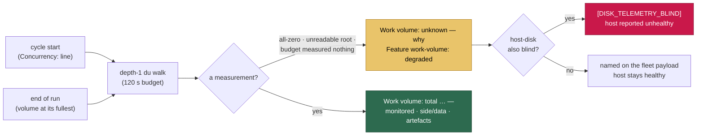

# Both disk signals blind, both reported `available` (Issue #345)

## Summary

GRQ-23 crashed out of disk on 2026-08-21 while its work-volume telemetry
logged a confident `total 0.0 GB` beside a count of twelve clones and five
`target/` dirs, every cycle, for days — and `Feature work-volume: available`
sat two lines above it. `df` was blind at the same time and only *it* said so.

The root cause is one word in each probe. `duBytes` and `probeDiskReading`
both parse a subprocess's **stdout**, and both asked `runWithTimeout` for
`quiet: true` — which sets `stdout: "null"` and returns `""`
(`worker/deno/lib/subprocess_timeout.ts:76,120`). Stdout *is* the reading, so:

- `du` → `Number("")` → a finite **0**: a confident zero from a probe that
  measured nothing;
- `df` → `parseDfKP("")` → `null`: the "df unreadable" symptom already known
  as Issue #226.

Two signals, one bug, opposite failure modes. Nothing echoes stdout either
way, so `quiet` bought nothing and cost both signals.

Fixed at the point of use, plus the four self-healing boundaries the issue
asked for. Closes #345.

### What changed

- **The probes read again.** Dropped `quiet: true` from `duBytes`
  (`work_volume_prune.ts`) and `probeDiskReading` (`host_disk.ts`).
- **Zero is not a measurement.** New `parseDuBytes` returns `null` for empty
  or non-numeric output instead of `Number("") === 0`, and
  `workVolumeUnknownReason` rejects any reading that is not a measurement — a
  walk that measured N > 0 directories and still totals 0 bytes, a work root
  that could not be read, or a budget that expired before measuring anything.
  Those report `Work volume: unknown — <why>`, never a total. A **genuinely
  empty** work root still reads as a clean `0.0 GB`: that is a measurement,
  and it is right.
- **A probe that cannot produce a value is `degraded`.** `Feature host-disk`
  is available only on an `ok` reading (`unknown` is now degraded, not
  available); `Feature work-volume` requires no I/O fault **and** measurable
  standing totals.
- **Both signals blind marks the host unhealthy.** New `disk_telemetry.ts`
  holds the pure verdict over the pair. One blind signal is named on the
  fleet-health payload; losing both logs `[DISK_TELEMETRY_BLIND]` once per
  cycle and reports the host unhealthy, so the operator learns *which* host
  lost its disk telemetry before it fills up. It gates nothing — a monitoring
  fault must not stop the fleet working — and recovers on the next readable
  probe.
- **Measure where the bytes are.** The cycle-start walk lands ~2 minutes in,
  before the clones a cycle creates exist, which is why it could describe an
  empty work root. New `WorkVolumeMonitor` holds the reading on a bounded
  cadence (one walk per 5 min) and the run now samples again at end of run
  with `force`, when the volume is at its fullest — `Work volume (end of
  run):`. One shared reading feeds the log line, the feature report and the
  fleet payload, so a blind probe can never be advertised as available.
- **Unprobed is not blind.** `HostDiskMonitor` reported both "not probed yet"
  and a failed reading as `level: "unknown"`, so the verdict could count a
  probe it had never run as blind. A `probed` flag now gates it, mirroring the
  guard the work-volume side already had.

## Evidence

Backend/CLI only — no web surface to screenshot. The evidence is the test
suite, and in particular two tests that run the **real** subprocesses against
real temp directories, because the whole point is that the bytes survive the
round trip (no injected size can prove that):

```text
running 6 tests from ./tests/disk_telemetry_probe_test.ts
parseDuBytes - a du -sk line becomes bytes ... ok
parseDuBytes - output that says nothing is unmeasured, never zero ... ok
duBytes - measures a real directory's bytes instead of reporting 0 (Issue #345) ... ok
probeDiskReading - reads the filesystem df actually reports (Issue #345) ... ok
probeDiskReading - a path with no filesystem is unreadable, not a zero reading ... ok
HostDiskMonitor - 'not probed yet' is not a blind signal (Issue #345) ... ok

ok | 58 passed | 0 failed (422ms)
```

`duBytes` and `probeDiskReading` both fail these against the unfixed code
(`duBytes` returns 0 for a 2 MiB directory; `probeDiskReading` returns
`null` for a real mount point).



### Quality gate

`./quality.sh` passes every check except `deno tests`, which reports **10
pre-existing failures unrelated to this change** — `fleet_health_test.ts`,
`host_workdir_guard_test.ts`, `optional_feature_env_test.ts` and
`setup_workdir_reminder_test.ts`. Verified pre-existing by running the same
four files in a clean worktree at `origin/main` (6e1bc43): identical 10
failures, `FAILED | 63 passed | 10 failed`. The full suite otherwise reports
`15834 passed | 10 failed`.

## Test Plan

Added:

- `worker/deno/tests/disk_telemetry_probe_test.ts` — the regression tests for
  the root cause. `parseDuBytes` unit cases; `duBytes` against a real 2 MiB
  temp directory; `probeDiskReading` against a real mount point and against a
  path with no filesystem; the `HostDiskMonitor.probed` unprobed-vs-failed
  distinction.
- `worker/deno/tests/disk_telemetry_test.ts` — `assessDiskTelemetry`: both
  readable, both blind (unhealthy, both named), and each single-blind case
  (named, host stays healthy).
- `worker/deno/tests/work_volume_monitor_test.ts` — a real reading is known
  and carries its total; an all-zero walk is unknown and the line says so; no
  monitored list is never a published split; the cadence bounds the `du` cost
  and `force` overrides it.

Extended:

- `worker/deno/tests/work_volume_usage_test.ts` — `workVolumeUnknownReason`
  across all-zero, unreadable root, expired budget, and the genuinely-empty
  root that stays a clean zero; `formatWorkVolumeUsage` reporting `unknown`
  instead of a confident total.
- `worker/deno/tests/run_core_work_volume_usage_test.ts` — the end-of-run
  sample; both-blind marks the host unhealthy once per cycle; one readable
  signal keeps it healthy; the production deps report `work-volume` degraded
  when the walk cannot measure.

Documentation: `docs/CONTAINER.md` gains "A blind probe is `unknown`, never
`0.0 GB`" — the root cause, the four boundaries, and an updated flowchart.
