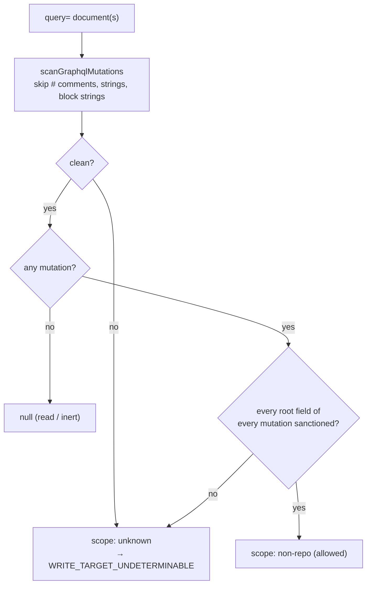

# PR Summary — Issue #3549

## Summary

The GraphQL mutation classifier now reads the whole document. Before this
change, a document could show the classifier only the sanctioned
`changeUserStatus` and pass the agent `gh` guard as a non-repo write. Two
shapes did this: a second operation selected with `operationName`, and a
`# }` comment that closed the first operation early. Both are now refused
with `WRITE_TARGET_UNDETERMINABLE`.

- `scanGraphqlMutations` is a new export in
  `worker/deno/lib/audit_mutation_classifier.ts`, returning a new exported
  `GraphqlScan` (`{fields, hasMutation, clean}`).
  - It skips `#` comments, `"…"` strings and `"""…"""` block strings.
  - It collects the root fields of **every** mutation operation.
  - Its `clean` flag is false whenever the text is not understood.
- `classifyGhGraphql` gives `scope: "non-repo"` only when every scan is
  clean and every mutation field across all documents is sanctioned.
- `graphqlMutationFields` keeps its signature. It returns `null` only for a
  clean document with no mutation; an unclean document with no mutation
  returns `[]`, so it is never read as a read.
- `SECURITY.md:1759` documents the rule.

Closes #3549

## Spec

### Intent and Rationale

- GitHub ignores `#` comments and runs whichever operation `operationName`
  selects, so the classifier has to read the document the way GitHub does.
  A partial read lets a repo write hide behind `changeUserStatus`.
- The exception is a security bypass of the write-repo allowlist and of the
  `gh pr ready` backstop, so anything the scanner does not fully understand
  fails closed rather than being sanctioned.
- I chose the issue's main fix (parse every operation) over its simpler
  alternative (one operation, no `#`), because the production
  `changeUserStatus` documents in `github_status.ts` must stay allowed.

### Essential Design Decisions

- **The scan is strict.** `clean = false` for: unbalanced or mismatched
  brackets, an unterminated string or block string, an unexpected
  character, a pending operation keyword at the end, a dangling `@`, or a
  `.` (spread or inline fragment) at a mutation's root.
- **The inert rule.** Text with no `mutation` keyword and no `{` at all is
  clean and inert (`null`). GitHub cannot execute it, and `@/tmp/q.graphql`
  must stay `null`; the `@file` rule catches that case separately.
- **Root fragments are refused, not resolved.** `...F` or `... on Mutation`
  at the root could select further mutation fields, and the scanner does
  not resolve fragments. Spreads nested inside a field are still allowed.
- **A dangling `@` fails closed.** Otherwise the directive mark would
  swallow the next real field name (`nextSignificantIsNameStart`).

### Undiscoverable Facts

- `gh api graphql -f operationName=B` passes `operationName` straight to
  GitHub, so a later operation in the same document is what runs.
- `alias : field` with a space before the colon makes the scanner collect
  both names. This over-collects, so it fails closed; I accepted the gap.
- `write_repo_allowlist.ts:605` says "first mutation of each kind" about
  journal deduplication. That is a different meaning and is unchanged.

## Evidence

- #3549: GraphQL mutation classifier reads only the first mutation operation
  and ignores `#` comments, so a document that shows only the sanctioned
  `changeUserStatus` passes the agent guard as a non-repo write.
- Both shapes from the issue are refused by `evaluateGhCommand` with
  `WRITE_TARGET_UNDETERMINABLE`, and a plain `changeUserStatus` control is
  allowed in the same test:
  `worker/deno/tests/gh_mutation_fail_closed_test.ts::Issue #3549 - evaluateGhCommand: refuses the multi-operation and comment shapes`.
- Quality gate: `./quality.sh < /dev/null` exited 0 with "Result: PASSED
  (with skipped checks)". Only the config integration check was skipped.
- Docs sweep: I grepped for `graphqlMutationFields`, `changeUserStatus`,
  `GH_SANCTIONED_GRAPHQL_MUTATIONS`, `first mutation`, `non-repo` and
  `GraphQL`. I read SECURITY.md's write-repo allowlist section and
  `docs/AGENT-ACCOUNTABILITY.md`. I updated `SECURITY.md:1759` and the doc
  comments in `audit_mutation_classifier.ts`. Hits I left in place:
  - `SECURITY.md:1756` — still true because `changeUserStatus` is still
    the one named exception.
  - `SECURITY.md:1758` — still true because a body that is not on the
    command line is still never sanctioned.
  - The `gh pr ready` paragraph in `SECURITY.md` (around line 1804) —
    still true because that GraphQL mutation still fails closed, and now
    also when it is hidden behind a second operation.
  - `docs/AGENT-ACCOUNTABILITY.md:173` — still true because GraphQL
    queries are still skipped as reads.
  - `worker/deno/lib/write_repo_allowlist.ts:605` — still true because
    "first mutation of each kind" describes journal deduplication, not the
    parser.
  - `worker/deno/tests/gh_api_body_classification_test.ts:195` — still true
    because `@/tmp/q.graphql` still gives `null`; the inert rule keeps it.
  - `worker/deno/lib/github_status.ts:175` and `:238` — still true because
    the production `changeUserStatus` documents still classify as non-repo.
- Rules applied to this PR's own diff: this change adds no prompt or
  coding-standard rule. I found no related existing rules beyond the
  SECURITY.md exception bullets listed above.

## Acceptance Criteria

<!-- vibe-spec-review inputs="diff+issue-body" -->

- **met** — "Make the parser skip `#` comments (and string literals)" —
  evidence: `scanGraphqlMutations` (`audit_mutation_classifier.ts:524`,
  `:543`, `:558`); tests `Issue #3549 - graphqlMutationFields: a comment brace does not end the operation`
  and `Issue #3549 - look-alike: braces, hash and quotes inside a string argument stay non-repo`
  — reviewer: met
- **met** — "collect the top-level fields of **every** operation in the
  document" — evidence: `audit_mutation_classifier.ts:513`; test
  `Issue #3549 - graphqlMutationFields: collects every operation` —
  reviewer: met
- **met** — "Treat the document as sanctioned only when every mutation field
  across all operations is sanctioned" — evidence:
  `audit_mutation_classifier.ts:667`; test
  `Issue #3549 - classifyGhMutation: multi-operation document is not non-repo`
  — reviewer: met
- **met** — "Add classifier … tests for a multi-operation document with
  `operationName`" — evidence:
  `Issue #3549 - classifyGhMutation: multi-operation document is not non-repo`
  — reviewer: met
- **met** — "Add classifier … tests … for a document containing a comment" —
  evidence: `Issue #3549 - classifyGhMutation: brace inside a comment is not non-repo`
  — reviewer: met
- **met** — "Add … `evaluateGhCommand` tests" for both shapes — evidence:
  `Issue #3549 - evaluateGhCommand: refuses the multi-operation and comment shapes`
  — reviewer: met
- **unrequested** — The strict `clean` flag, root-fragment and dangling-`@`
  refusals, the `[]` return for unclean input with no mutation, the new
  `scanGraphqlMutations` and `GraphqlScan` exports, the hostile-input test
  and the SECURITY.md bullet. The reviewer judged each one defensible,
  because each one closes a bypass of the same exception.

## Standards Review

<!-- vibe-standards-review inputs="diff+CODING-STANDARDS.md" -->

- **clean** — The reviewer found no material departures. Areas checked:
  - Unparseable input fails closed.
  - Every test calls real code (`classifyGhMutation`,
    `graphqlMutationFields`, `evaluateGhCommand`).
  - The scanner is linear, and a hostile-input test of 100k characters
    covers it.
  - Spelling is Australian English.

  The reviewer's one note, that the PR summary was not yet written, is
  resolved by this file.

## Test Plan

- I added 20 tests to `worker/deno/tests/gh_mutation_fail_closed_test.ts`,
  all named `Issue #3549 - …` (lines 330–546). No existing assertions were
  removed.
- Regression: the multi-operation and comment tests are red on the base
  `d173e644`. Both shapes classified as `graphql:changeUserStatus`,
  `non-repo`.
- Known gap: `alias : field` with a space before the colon over-collects.
  It fails closed and is untested by design.

Branch outcomes (all lines are in
`worker/deno/lib/audit_mutation_classifier.ts`; all tests are in
`worker/deno/tests/gh_mutation_fail_closed_test.ts`):

- `:506` — a `mutation` keyword sets `hasMutation` — `Issue #3549 - look-alike: a read whose string or comment says mutation is a read`
  (treating `query` as a mutation went red).
- `:508` — a non-keyword token at depth 0 sets `clean = false` —
  `Issue #3549 - fail closed: malformed documents are never non-repo`
  (ignoring `clean` went red).
- `:513` — a root field of every mutation operation is collected —
  `Issue #3549 - graphqlMutationFields: collects every operation`
  (stopping after the first operation went red).
- `:524` — a `#` comment is skipped to the end of the line —
  `Issue #3549 - classifyGhMutation: brace inside a comment is not non-repo`
  (not skipping `#` went red).
- `:543` — an unterminated block string sets `clean = false` —
  `Issue #3549 - fail closed: malformed documents are never non-repo`
  (accepting unterminated strings went red).
- `:558` — an unterminated string sets `clean = false` — the same test
  (accepting unterminated strings went red). String skipping itself is
  reached by `Issue #3549 - look-alike: braces, hash and quotes inside a string argument stay non-repo`
  (not skipping strings went red).
- `:572` — a closer that does not match sets `clean = false` —
  `Issue #3549 - fail closed: malformed documents are never non-repo`
  (ignoring `clean` went red).
- `:585` — a dangling `@` sets `clean = false`, while a real directive keeps
  the mark — `Issue #3549 - a dangling @ never hides the next field` and
  `Issue #3549 - look-alike: a normal directive on a mutation field stays non-repo`
  (`@` always setting the mark went red, and so did `@` without
  `clean = false`).
- `:590` — a `.` at the mutation root sets `clean = false` —
  `Issue #3549 - fragments at the mutation root are never non-repo` and
  `Issue #3549 - evaluateGhCommand: refuses inline fragments at the mutation root`
  (turning the rule off went red). A nested spread stays allowed —
  `Issue #3549 - look-alike: a spread nested inside a mutation field stays non-repo`
  (applying the rule at any depth went red).
- `:592` — an unexpected character sets `clean = false` —
  `Issue #3549 - fail closed: malformed documents are never non-repo`
  (ignoring `clean` went red).
- `:599` — an unbalanced stack or a pending keyword at the end sets
  `clean = false` — the same test (ignoring `clean` went red).
- `:602` — the inert rule: no mutation and no `{` gives `clean` —
  `worker/deno/tests/gh_api_body_classification_test.ts::classifyGhMutation - graphql query=@file on -f/--raw-field is a visible literal, not a file read`
  (the first strict rule without this line went red).
- `:619` — `graphqlMutationFields` returns `null` only for a clean scan with
  no mutation, and `[]` otherwise —
  `Issue #3549 - fail closed: an unparseable document with no mutation is not a read`
  (ignoring `clean` went red).
- `:657` — a clean scan with no mutation is skipped —
  `Issue #3549 - look-alike: a sanctioned mutation plus a query operation stays non-repo`
  (treating `query` as a mutation went red).
- `:659` — an unclean scan clears `allClean` —
  `Issue #3549 - fail closed: malformed documents are never non-repo`
  (ignoring `clean` went red).
- `:667` — sanctioned only when the scan is readable and clean, there is at
  least one field, and every field is sanctioned —
  `Issue #3549 - evaluateGhCommand: refuses the multi-operation and comment shapes`,
  whose `SANCTIONED_DOC` control is allowed (ignoring `clean` went red, and
  so did stopping after the first operation).

🤖 Generated with [Claude Code](https://claude.com/claude-code)
