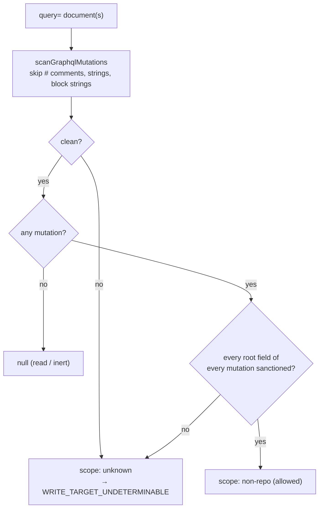

# PR Summary — Issue #3549

## Summary

The GraphQL mutation classifier now reads the whole document. Before this
change, a document could show the classifier only the sanctioned
`changeUserStatus` and pass the agent `gh` guard as a non-repo write. Two
shapes did this: a second operation selected with `operationName`, and a
`# }` comment that closed the first operation early. Both are now refused
with `WRITE_TARGET_UNDETERMINABLE`.

- `scanGraphqlMutations` is a new export in
  `worker/deno/lib/audit_mutation_classifier.ts`, returning a new exported
  `GraphqlScan` (`{fields, hasMutation, clean}`).
  - It skips `#` comments, `"…"` strings and `"""…"""` block strings.
  - It collects the root fields of **every** mutation operation.
  - Its `clean` flag is false whenever the text is not understood.
- `classifyGhGraphql` gives `scope: "non-repo"` only when every scan is
  clean and every mutation field across all documents is sanctioned.
- `graphqlMutationFields` keeps its signature. It returns `null` only for a
  clean document with no mutation; an unclean document with no mutation
  returns `[]`, so it is never read as a read.
- `SECURITY.md:1759` documents the rule.

Closes #3549

## Spec

### Intent and Rationale

- GitHub ignores `#` comments and runs whichever operation `operationName`
  selects, so the classifier has to read the document the way GitHub does.
  A partial read lets a repo write hide behind `changeUserStatus`.
- The exception is a security bypass of the write-repo allowlist and of the
  `gh pr ready` backstop, so anything the scanner does not fully understand
  fails closed rather than being sanctioned.
- I chose the issue's main fix (parse every operation) over its simpler
  alternative (one operation, no `#`), because the production
  `changeUserStatus` documents in `github_status.ts` must stay allowed.

### Essential Design Decisions

- **The scan is strict.** `clean = false` for: unbalanced or mismatched
  brackets, an unterminated string or block string, a raw newline inside a
  `"…"` string, an unexpected character, a stray name or capitalised
  keyword at depth 0, a pending operation keyword at the end, a dangling
  `@`, or a `.` (spread or inline fragment) at a mutation's root.
- **The inert rule.** Text with no `mutation` keyword and no `{` at all is
  clean and inert (`null`). Every GraphQL operation needs a selection set,
  so GitHub cannot execute such text. The existing #3937 test pins
  `-f query=@/tmp/q.graphql` as `null`, and the base branch also returned
  `null` for any text without `mutation`.
- **Root fragments are refused, not resolved.** `...F` or `... on Mutation`
  at the root could select further mutation fields, and the scanner does
  not resolve fragments. Spreads nested inside a field are still allowed.
- **A mismatched closer is not consumed.** The opener stays on the stack, so
  the fields after a stray `)` are still collected and the audit target
  names them.

### Undiscoverable Facts

- `gh api graphql -f operationName=B` passes `operationName` straight to
  GitHub, so a later operation in the same document is what runs.
- `alias : field` with a space before the colon makes the scanner collect
  both names. This over-collects, so it fails closed; I accepted the gap.
- `write_repo_allowlist.ts:605` says "first mutation of each kind" about
  journal deduplication. That is a different meaning and is unchanged.

## Evidence

- #3549: GraphQL mutation classifier reads only the first mutation operation
  and ignores `#` comments, so a document that shows only the sanctioned
  `changeUserStatus` passes the agent guard as a non-repo write.
- #3937 is cited in `SECURITY.md` and in the inert-rule reasoning above; it
  is the issue whose `@file` rule this change keeps.
- Both shapes from the issue are refused by `evaluateGhCommand` with
  `WRITE_TARGET_UNDETERMINABLE`, and a plain `changeUserStatus` control is
  allowed in the same test:
  `worker/deno/tests/gh_mutation_fail_closed_test.ts::Issue #3549 - evaluateGhCommand: refuses the multi-operation and comment shapes`.
- Backend only: no UI files changed.
- **Docs sweep** — grep: `graphqlMutationFields`, `scanGraphqlMutations`, `changeUserStatus`, `GH_SANCTIONED_GRAPHQL_MUTATIONS`, "first mutation", `non-repo`, `GraphQL`; section: `SECURITY.md#6-egress-containment--per-run-write-repo-allowlist`; updated: `SECURITY.md`
  - I read §6 of `SECURITY.md` (the write-repo allowlist) and
    `docs/AGENT-ACCOUNTABILITY.md`. I added `SECURITY.md:1759` and updated
    the doc comments in `audit_mutation_classifier.ts`. Hits I left in place:
  - `SECURITY.md:1756` — still true because `changeUserStatus` is still
    the one named exception.
  - `SECURITY.md:1758` — still true because a body that is not on the
    command line is still never sanctioned.
  - `SECURITY.md:1805` (the `gh pr ready` sentence) — still true because
    that GraphQL mutation still fails closed, and now also when it is
    hidden behind a second operation.
  - `docs/AGENT-ACCOUNTABILITY.md:173` — still true because GraphQL
    queries are still skipped as reads.
  - `worker/deno/lib/write_repo_allowlist.ts:605` — still true because
    "first mutation of each kind" describes journal deduplication, not the
    parser.
  - `worker/deno/tests/gh_api_body_classification_test.ts:195` — still true
    because `@/tmp/q.graphql` still gives `null`; the inert rule keeps it.
  - `worker/deno/lib/github_status.ts:175` and `:238` — still true because
    the production `changeUserStatus` documents still classify as non-repo.
- Rules applied to this PR's own diff: this change adds no prompt or
  coding-standard rule. I found no related existing rules beyond the
  SECURITY.md exception bullets listed above.

## Acceptance Criteria

<!-- vibe-spec-review inputs="diff+issue-body" -->

- **met** — "Make the parser skip `#` comments (and string literals)" —
  evidence: `scanGraphqlMutations` (`audit_mutation_classifier.ts:527`–`:530`
  for comments, `:531`–`:559` for strings and block strings); tests `Issue #3549 - graphqlMutationFields: a comment brace does not end the operation`
  and `Issue #3549 - look-alike: braces, hash and quotes inside a string argument stay non-repo`
  — reviewer: met
- **met** — "collect the top-level fields of **every** operation in the
  document" — evidence: `audit_mutation_classifier.ts:513`; test
  `Issue #3549 - graphqlMutationFields: collects every operation` —
  reviewer: met
- **met** — "Treat the document as sanctioned only when every mutation field
  across all operations is sanctioned" — evidence:
  `audit_mutation_classifier.ts:666`; test
  `Issue #3549 - classifyGhMutation: multi-operation document is not non-repo`
  — reviewer: met
- **met** — "Add classifier … tests for a multi-operation document with
  `operationName`" — evidence:
  `Issue #3549 - classifyGhMutation: multi-operation document is not non-repo`
  — reviewer: met
- **met** — "Add classifier … tests … for a document containing a comment" —
  evidence: `Issue #3549 - classifyGhMutation: brace inside a comment is not non-repo`
  — reviewer: met
- **met** — "Add … `evaluateGhCommand` tests" for both shapes — evidence:
  `Issue #3549 - evaluateGhCommand: refuses the multi-operation and comment shapes`
  — reviewer: met
- **unrequested** — The strict `clean` flag, the root-fragment and
  dangling-`@` refusals, and the `[]` return for unclean input with no
  mutation — reviewer: unrequested — reason: each closes a bypass of the
  same `changeUserStatus` exception, which the reviewer called traceable to
  the "every mutation field sanctioned" intent.
- **unrequested** — The new `scanGraphqlMutations` and `GraphqlScan`
  exports — reviewer: unrequested — reason: `classifyGhGraphql` needs the
  `clean` flag that `graphqlMutationFields`' signature cannot carry.
- **unrequested** — The hostile-input test of 100k characters — reviewer:
  unrequested — reason: `CODING-STANDARDS.md` asks for a hostile case for a
  scanner that runs on agent-written text.
- **unrequested** — The `SECURITY.md:1759` bullet — reviewer: unrequested —
  reason: a change to a security control owes its docs change.

## Standards Review

<!-- vibe-standards-review inputs="diff+CODING-STANDARDS.md" -->

- **clean** — These areas comply:
  - Australian English, which is review-enforced.
  - Fail loud: every unexpected character, stray closer, unterminated
    string and mismatched bracket marks the scan unclean, and an unclean
    scan is refused.
  - No source-grep tests (review-enforced): every test calls
    `classifyGhMutation`, `graphqlMutationFields` or `evaluateGhCommand`.
  - Regex vetting (review-enforced): the old regex is gone, and a 100k
    hostile-input test covers the linear scanner.
  - No assertion is removed from an existing test.
  - No named-but-absent test.
- **clean** — The reviewer raised the inert rule (`audit_mutation_classifier.ts:601`)
  as a possible "unparseable input passes clean" breach and as unreached by
  a test. I judge it not a breach. Text with no selection set holds no
  executable operation, so this is a decision about what GitHub can run, not
  input that was skipped. Keeping it also preserves the base behaviour that
  the existing test pins:
  `worker/deno/tests/gh_api_body_classification_test.ts::classifyGhMutation - graphql query=@file on -f/--raw-field is a visible literal, not a file read`.
  That test reaches the rule: removing the rule turned it red.
- **clean** — Optional note, not a breach: `graphqlMutationFields` now has
  only test callers. It stays exported with its signature unchanged.

## Test Plan

- I added 26 tests to `worker/deno/tests/gh_mutation_fail_closed_test.ts`,
  all named `Issue #3549 - …` (lines 330–648). The test-file diff is
  append-only, so no existing assertion was removed.
- Regression: on the base `d173e644`, the multi-operation and comment tests
  are red. Both shapes classified as `graphql:changeUserStatus`, `non-repo`.
- Each test below was run with
  `deno task test:unit tests/gh_mutation_fail_closed_test.ts tests/gh_api_body_classification_test.ts < /dev/null`
  from `worker/deno` on the final head: `ok | 82 passed | 0 failed`.
- Known gap: `alias : field` with a space before the colon over-collects.
  It fails closed and is untested by design.

**Branch outcomes:**

For each line below, I applied the flip to the head and ran the two test
files above, then reverted it. Every flip turned at least one named test
red. Lines are at the head of `worker/deno/lib/audit_mutation_classifier.ts`.

- `worker/deno/lib/audit_mutation_classifier.ts:451` — skip (a `#` comment between `@` and the directive name) — `worker/deno/tests/gh_mutation_fail_closed_test.ts::Issue #3549 - look-alike: a comment between @ and the directive name stays non-repo` — disabled the skip, test went red
- `worker/deno/lib/audit_mutation_classifier.ts:461` — error (a digit after `@` is not a directive name) — `worker/deno/tests/gh_mutation_fail_closed_test.ts::Issue #3549 - fail closed: each malformed shape is refused while its legal twin is allowed` — dropped the digit exclusion, test went red
- `worker/deno/lib/audit_mutation_classifier.ts:464` — absent (`@` at the end of the document is dangling) — `worker/deno/tests/gh_mutation_fail_closed_test.ts::Issue #3549 - fail closed: each malformed shape is refused while its legal twin is allowed` — returned `true` instead, test went red
- `worker/deno/lib/audit_mutation_classifier.ts:497` — skip (a directive name after `@` is not collected as a field) — `worker/deno/tests/gh_mutation_fail_closed_test.ts::Issue #3549 - look-alike: a normal directive on a mutation field stays non-repo` — disabled the skip, test went red
- `worker/deno/lib/audit_mutation_classifier.ts:502` — skip (the operation name after a keyword is not checked as a keyword) — `worker/deno/tests/gh_mutation_fail_closed_test.ts::Issue #3549 - look-alike: a sanctioned mutation plus a query operation stays non-repo` — removed the skip, test went red
- `worker/deno/lib/audit_mutation_classifier.ts:504` — error (a capitalised `Mutation` is not an operation keyword) — `worker/deno/tests/gh_mutation_fail_closed_test.ts::Issue #3549 - fail closed: each malformed shape is refused while its legal twin is allowed` — dropped `name === keyword`, test went red
- `worker/deno/lib/audit_mutation_classifier.ts:506` — success (`mutation` sets `hasMutation`; `query` does not) — `worker/deno/tests/gh_mutation_fail_closed_test.ts::Issue #3549 - look-alike: a read whose string or comment says mutation is a read` — made every keyword set `hasMutation`, test went red
- `worker/deno/lib/audit_mutation_classifier.ts:508` — error (a stray name at depth 0 sets `clean = false`) — `worker/deno/tests/gh_mutation_fail_closed_test.ts::Issue #3549 - fail closed: each malformed shape is refused while its legal twin is allowed` — removed `clean = false`, test went red
- `worker/deno/lib/audit_mutation_classifier.ts:511` — skip (an alias before `:` is not collected) — `worker/deno/tests/gh_mutation_fail_closed_test.ts::Issue #3549 - look-alike: escaped quote and aliases/directives still parse` — dropped the `:` check, test went red
- `worker/deno/lib/audit_mutation_classifier.ts:513` — success (a root field of every mutation operation is collected) — `worker/deno/tests/gh_mutation_fail_closed_test.ts::Issue #3549 - graphqlMutationFields: collects every operation` — kept only the first field, test went red
- `worker/deno/lib/audit_mutation_classifier.ts:527` — skip (a `#` comment is skipped to the end of the line) — `worker/deno/tests/gh_mutation_fail_closed_test.ts::Issue #3549 - classifyGhMutation: brace inside a comment is not non-repo` — disabled the skip, test went red
- `worker/deno/lib/audit_mutation_classifier.ts:531` — skip (a `"…"` string is skipped) — `worker/deno/tests/gh_mutation_fail_closed_test.ts::Issue #3549 - look-alike: braces, hash and quotes inside a string argument stay non-repo` — disabled string skipping, test went red
- `worker/deno/lib/audit_mutation_classifier.ts:532` — skip (a `"""…"""` block string is skipped) — `worker/deno/tests/gh_mutation_fail_closed_test.ts::Issue #3549 - look-alike: a block string argument is skipped` — disabled block-string detection, test went red
- `worker/deno/lib/audit_mutation_classifier.ts:536` — skip (an escaped `\"""` inside a block string does not close it) — `worker/deno/tests/gh_mutation_fail_closed_test.ts::Issue #3549 - look-alike: an escaped triple quote inside a block string stays non-repo` — removed the escape rule, test went red
- `worker/deno/lib/audit_mutation_classifier.ts:543` — error (an unterminated block string sets `clean = false`) — `worker/deno/tests/gh_mutation_fail_closed_test.ts::Issue #3549 - fail closed: malformed documents are never non-repo` — removed `clean = false`, test went red
- `worker/deno/lib/audit_mutation_classifier.ts:550` — skip (a backslash escape inside a string) — `worker/deno/tests/gh_mutation_fail_closed_test.ts::Issue #3549 - look-alike: escaped quote and aliases/directives still parse` — disabled the escape, test went red
- `worker/deno/lib/audit_mutation_classifier.ts:555` — error (a raw newline ends a `"…"` string unterminated) — `worker/deno/tests/gh_mutation_fail_closed_test.ts::Issue #3549 - fail closed: each malformed shape is refused while its legal twin is allowed` — removed the newline rule, test went red
- `worker/deno/lib/audit_mutation_classifier.ts:558` — error (an unterminated string sets `clean = false`) — `worker/deno/tests/gh_mutation_fail_closed_test.ts::Issue #3549 - fail closed: malformed documents are never non-repo` — removed `clean = false`, test went red
- `worker/deno/lib/audit_mutation_classifier.ts:562` — success (a `{` marks the text as having a selection set) — `worker/deno/tests/gh_mutation_fail_closed_test.ts::Issue #3549 - fail closed: an unparseable document with no mutation is not a read` — removed the mark, test went red
- `worker/deno/lib/audit_mutation_classifier.ts:563` — success (a depth-0 `{` opens an operation) — `worker/deno/tests/gh_mutation_fail_closed_test.ts::Issue #3549 - graphqlMutationFields: collects every operation` — disabled the branch, test went red
- `worker/deno/lib/audit_mutation_classifier.ts:564` — default (an anonymous `{` opens a query) — `worker/deno/tests/gh_mutation_fail_closed_test.ts::Issue #3549 - look-alike: the anonymous query shorthand is a read` — defaulted to `mutation` instead, test went red
- `worker/deno/lib/audit_mutation_classifier.ts:571` — error (a closer that does not match sets `clean = false`) — `worker/deno/tests/gh_mutation_fail_closed_test.ts::Issue #3549 - fail closed: malformed documents are never non-repo` — removed `clean = false`, test went red
- `worker/deno/lib/audit_mutation_classifier.ts:573` — error path (a mismatched closer leaves the opener on the stack) — `worker/deno/tests/gh_mutation_fail_closed_test.ts::Issue #3549 - a stray closer does not hide later fields from the audit target` — removed the push-back, test went red
- `worker/deno/lib/audit_mutation_classifier.ts:574` — success (closing the last bracket resets `openKind`) — `worker/deno/tests/gh_mutation_fail_closed_test.ts::Issue #3549 - look-alike: a later operation's variable definitions are not mutation fields` — removed the reset, test went red
- `worker/deno/lib/audit_mutation_classifier.ts:580` — success (a real directive keeps the `@` mark) — `worker/deno/tests/gh_mutation_fail_closed_test.ts::Issue #3549 - a dangling @ never hides the next field` — made `@` always set the mark, test went red
- `worker/deno/lib/audit_mutation_classifier.ts:584` — error (a dangling `@` sets `clean = false`) — `worker/deno/tests/gh_mutation_fail_closed_test.ts::Issue #3549 - a dangling @ never hides the next field` — removed `clean = false`, test went red
- `worker/deno/lib/audit_mutation_classifier.ts:586` — error (a `.` at the mutation root sets `clean = false`) — `worker/deno/tests/gh_mutation_fail_closed_test.ts::Issue #3549 - fragments at the mutation root are never non-repo` — disabled the rule, test went red
- `worker/deno/lib/audit_mutation_classifier.ts:586` — success (a `.` below the mutation root stays allowed) — `worker/deno/tests/gh_mutation_fail_closed_test.ts::Issue #3549 - look-alike: a spread nested inside a mutation field stays non-repo` — applied the rule at any depth, test went red
- `worker/deno/lib/audit_mutation_classifier.ts:591` — error (an unexpected character sets `clean = false`) — `worker/deno/tests/gh_mutation_fail_closed_test.ts::Issue #3549 - fail closed: each malformed shape is refused while its legal twin is allowed` — removed `clean = false`, test went red
- `worker/deno/lib/audit_mutation_classifier.ts:598` — error (an unbalanced bracket stack at the end sets `clean = false`) — `worker/deno/tests/gh_mutation_fail_closed_test.ts::Issue #3549 - fail closed: malformed documents are never non-repo` — dropped the stack check, test went red
- `worker/deno/lib/audit_mutation_classifier.ts:598` — error (an operation keyword never followed by a selection set sets `clean = false`) — `worker/deno/tests/gh_mutation_fail_closed_test.ts::Issue #3549 - fail closed: each malformed shape is refused while its legal twin is allowed` — dropped the pending-keyword check, test went red
- `worker/deno/lib/audit_mutation_classifier.ts:601` — inert (no mutation and no `{` is clean) — `worker/deno/tests/gh_api_body_classification_test.ts::classifyGhMutation - graphql query=@file on -f/--raw-field is a visible literal, not a file read` — removed the rule, test went red
- `worker/deno/lib/audit_mutation_classifier.ts:620` — absent (`null` only for a clean scan with no mutation; `[]` otherwise) — `worker/deno/tests/gh_mutation_fail_closed_test.ts::Issue #3549 - fail closed: an unparseable document with no mutation is not a read` — ignored `clean`, test went red
- `worker/deno/lib/audit_mutation_classifier.ts:656` — skip (a clean scan with no mutation is skipped as a read) — `worker/deno/tests/gh_mutation_fail_closed_test.ts::Issue #3549 - fail closed: an unparseable document with no mutation is not a read` — ignored `clean`, test went red
- `worker/deno/lib/audit_mutation_classifier.ts:658` — error (an unclean scan clears `allClean`) — `worker/deno/tests/gh_mutation_fail_closed_test.ts::Issue #3549 - fail closed: malformed documents are never non-repo` — removed the line, test went red
- `worker/deno/lib/audit_mutation_classifier.ts:666` — success / fail-closed default (non-repo only when readable, clean, non-empty and all sanctioned) — `worker/deno/tests/gh_mutation_fail_closed_test.ts::Issue #3549 - fail closed: malformed documents are never non-repo` — dropped `allClean`, test went red

🤖 Generated with [Claude Code](https://claude.com/claude-code)
