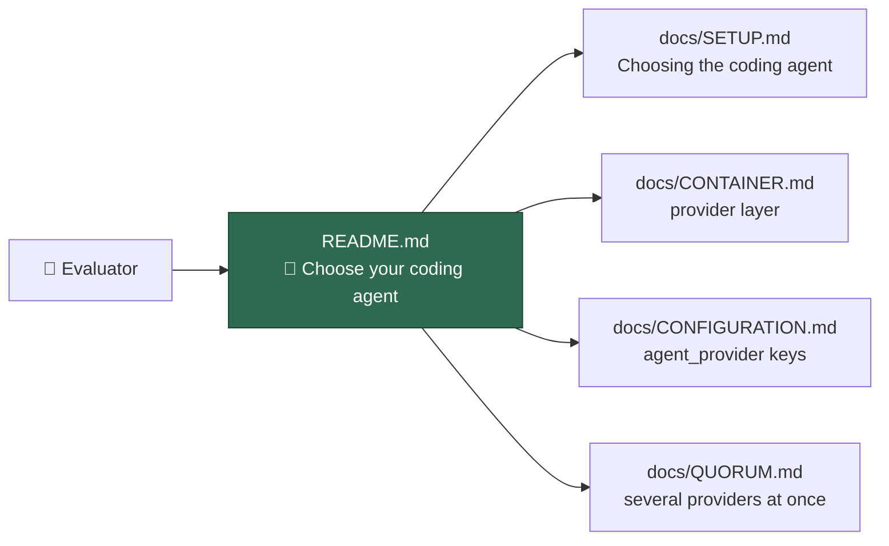

# Document AI provider selection (Claude/Codex/Gemini) in the README

## Summary

VibeCoder has been provider agnostic since the coding-agent seam landed —
`worker/deno/lib/agent_provider.ts` registers `claude`, `codex` and `gemini`,
and the active one is resolved from `agent_provider` in `.config.json` or
`VIBE_AGENT_PROVIDER`. That choice was documented only in `docs/CONTAINER.md`,
so the front door read as Claude-only and an evaluator concluded the worker was
locked to one vendor. This is a documentation change: no code behaviour is
altered. Closes #355.

- **README.md** — the intro now says the worker is driven by a coding-agent CLI
  and is provider agnostic, and a new **🔌 Choose your coding agent** section
  gives the three provider ids, the credential file each uses, selection via
  `agent_provider` / `agent_providers`, the `VIBE_AGENT_PROVIDER` /
  `VIBE_AGENT_PROVIDERS` single-run overrides, the loud startup failure on an
  unregistered id, the caveat that the default image installs Claude Code alone,
  and links into `docs/CONTAINER.md`, `docs/CONFIGURATION.md`, `docs/SETUP.md`
  and `docs/QUORUM.md`.
- **README.md** — the *How It Works* sequence diagram participant is now
  "Coding agent" rather than "Claude Code", since every step in it is the
  worker's, not the vendor's.
- **docs/SETUP.md** — a **Choosing the coding agent** subsection beside the
  existing configuration examples, covering both keys, both env overrides, the
  per-vendor `<provider>/provider.env` requirement and the image build set.



## Evidence

Documentation-only change with no web interface to screenshot — the evidence is
the new test suite, which derives every assertion from `agent_provider.ts`
rather than from hand-written prose. Registering a fourth provider, renaming a
provider id or renaming a selection key fails these tests until the front-door
documentation is updated to match:

```text
running 6 tests from ./tests/agent_provider_readme_docs_test.ts
README.md - carries a coding-agent provider section ... ok
README.md - names every registered provider id and display name ... ok
README.md - names both ways to select a provider ... ok
README.md - links the detailed provider documentation ... ok
README.md - the introduction does not present the worker as Claude-only ... ok
docs/SETUP.md - documents provider selection in the config section ... ok

ok | 6 passed | 0 failed
```

`./quality.sh` passes every gate except `deno tests`, which fails on ten
assertions that are **pre-existing and environmental** — `fleet_health_test.ts`,
`host_workdir_guard_test.ts`, `optional_feature_env_test.ts` and
`setup_workdir_reminder_test.ts` pick up the host's real work-dir paths. Verified
by running those four files in a clean worktree at `origin/main` (`d7875bd`),
where they fail identically with no part of this change applied. Nothing in this
diff touches `worker/deno/lib/`. Filed as #378 rather than fixed here, since it
is unrelated to this issue.

## Test Plan

- Added `worker/deno/tests/agent_provider_readme_docs_test.ts` — six tests that
  import `agentProviderIds()`, `resolveAgentProvider()`,
  `AGENT_PROVIDER_CONFIG_KEY`, `ENABLED_AGENT_PROVIDERS_CONFIG_KEY`,
  `AGENT_PROVIDER_ENV` and `ENABLED_AGENT_PROVIDERS_ENV`, then assert the
  README and setup-guide provider sections name each registered id, each
  display name, both selection keys, both env overrides and the detailed docs
  they link to. They fail against the unfixed README (no such section existed).
- Ran `./quality.sh < /dev/null`: `deno fmt`, `deno lint`, `deno check`,
  markdownlint and the mermaid gate all pass.
