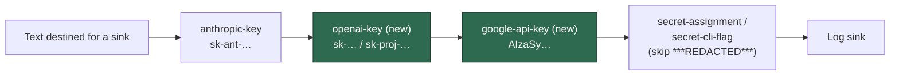

# Redact bare OpenAI (`sk-`) and Google/Gemini (`AIzaSy`) API keys

## Summary

`redactSecrets()` carried bare-shape rules for every provider key format the
worker knows about — `github_pat_…`, `gh[pousr]_…`, `sk-ant-…`, `AKIA|ASIA…` —
except the two it handles as live secrets for its own child processes:
OpenAI/Codex (`OPENAI_API_KEY`, `CODEX_API_KEY`; `worker/deno/lib/codex_env.ts`)
and Google/Gemini (`GEMINI_API_KEY`, `GOOGLE_API_KEY`;
`worker/deno/lib/gemini_env.ts`). Those values were masked only when they landed
in a recognised *structure* — an env assignment, an `--api-key` flag or a
`Bearer` header. A **bare** occurrence — the shape a CLI produces when it echoes
a rejected key into stderr, or when the key rides an exception message into a
stack frame — matched no rule and was written to the log sink verbatim.

Two rules are added to the `RULES` array in
`worker/deno/lib/secret_redaction.ts`, immediately after `anthropic-key`:

| Rule | Pattern | Notes |
|------|---------|-------|
| `openai-key` | `/\bsk-[A-Za-z0-9_-]{20,512}/g` | Covers `sk-`, `sk-proj-`, `sk-svcacct-`, `sk-admin-` |
| `google-api-key` | `/\bAIzaSy[A-Za-z0-9_-]{33}/g` | Google's fixed 39-character key format |

Both substitute the shared `REDACTION_PLACEHOLDER`, never a literal. Closes #36.

**Anthropic non-regression.** `openai-key`'s `sk-` prefix overlaps `sk-ant-`, so
ordering carries the invariant: `anthropic-key` runs first and has already
replaced the key with `***REDACTED***` — which contains no `sk-` — by the time
`openai-key` scans the text. Exactly one substitution per key, no nested
placeholders. The same holds downstream: `secret-assignment` and
`secret-cli-flag` both carry a `(?!\*\*\*REDACTED)` guard, and `bearer-token`'s
character class excludes `*`, so a key already masked by the new rules is not
masked a second time.

**Linearity (Issue #3942).** Both quantifiers are explicitly bounded — the
OpenAI run is capped at 512 characters (~3× the longest real `sk-proj-` key, so
no genuine key is split) and the Google run is an exact count of 33. Both are
anchored on a literal prefix behind a `\b`, so there is no unanchored greedy
run to backtrack over. The input itself is still never truncated, per the
redact-before-truncate standard in `SECURITY.md`.

**False positives.** The 20-character minimum plus the `\b` anchor keeps the
short `sk-` prefix off ordinary hyphenated prose; `AIzaSy` fragments shorter
than the fixed key length are left alone.

## Evidence

Backend/CLI change with no web interface, so there is no screenshot to capture —
the evidence is the test suite. The new tests fail against the unfixed code and
pass after the fix:

```text
# Before the fix (tests added, rules not yet present)
FAILED | 45 passed | 6 failed (533ms)
  redactSecrets - masks a bare OpenAI sk- API key (Issue #36)
  redactSecrets - masks a bare sk-proj- project-scoped OpenAI key (Issue #36)
  redactSecrets - masks a bare Google/Gemini AIzaSy API key (Issue #36)
  redactSecrets - a long sk- charset run stays bounded and is masked (Issue #36)
  redactSecrets - the google-api-key rule masks exactly the 39-character key (Issue #36)
  redactSecrets - provider keys in the tail of a huge input are still masked (Issue #36)

# After the fix
ok | 51 passed | 0 failed (468ms)
```

The regression test for the security flaw is
`worker/deno/tests/secret_redaction_test.ts::redactSecrets - masks a bare OpenAI sk- API key (Issue #36)`,
which reproduces the leak — a bare key in free text surviving the chokepoint —
fails against the unfixed code, and passes after the fix.

**Original trigger is closed, with no trivial bypass.** The trigger is a bare
provider key reaching a log sink in unstructured text. Both rules match on the
provider's own literal prefix wherever it appears, independent of any
surrounding structure, so the bare, assignment, flag and header shapes are all
covered by the same chokepoint — there is no remaining unstructured shape of an
`sk-…` or `AIzaSy…` key that reaches a sink unmasked. Prefix-splitting is not a
bypass either: a key broken across the prefix is no longer a usable credential.
The rules run inside `redactSecrets()`, which every outbound sink already routes
through (see the sink table in `SECURITY.md`), so the coverage is inherited by
the logger, the console patch, the answer sanitiser and the `gh` body
chokepoints without further wiring.



### Pre-existing unrelated test failures

`./quality.sh` reports 7 failures in `fleet_health_test.ts`,
`optional_feature_env_test.ts` and `setup_workdir_reminder_test.ts`. These are
environment-dependent (they read the host work dir and local config) and were
confirmed to fail identically on the base branch with this branch's changes
stashed — they are untouched by this change. Every other gate passes: prompt
immutability, benchmark audit, hardcoded branch names, needs-human chokepoint,
`gh` spawn chokepoint, workflow hygiene, source targets, mermaid, markdownlint,
docs prompt versions, deno lint, deno type check, deno fmt.

## Test Plan

Added to `worker/deno/tests/secret_redaction_test.ts`:

- `redactSecrets - masks a bare OpenAI sk- API key (Issue #36)` — the
  regression test for the flaw; bare key in a stderr-style line, exactly one
  placeholder.
- `redactSecrets - masks a bare sk-proj- project-scoped OpenAI key (Issue #36)`
- `redactSecrets - masks a bare Google/Gemini AIzaSy API key (Issue #36)`
- `redactSecrets - masks OpenAI and Google keys inside an assignment exactly once (Issue #36)`
  — `OPENAI_API_KEY` / `CODEX_API_KEY` / `GEMINI_API_KEY` / `GOOGLE_API_KEY`.
- `redactSecrets - an Anthropic key still redacts to exactly one placeholder (Issue #36)`
  — the required non-regression case; no double substitution from the
  overlapping `sk-` prefix.
- `redactSecrets - leaves short sk- and AIzaSy-like fragments untouched (Issue #36)`
  — `task-sk-notes`, `sk-cache`, `AIzaSyShort` and friends pass through
  verbatim, and `containsSecret()` stays false.

Added to `worker/deno/tests/secret_redaction_redos_test.ts`:

- `redactSecrets - a run of near-miss sk- prefixes is linear (openai-key, Issue #36)`
- `redactSecrets - a run of near-miss AIzaSy prefixes is linear (google-api-key, Issue #36)`
- `redactSecrets - provider keys in the tail of a huge input are still masked (Issue #36)`

Added to `worker/deno/tests/secret_redaction_bounds_test.ts`:

- `redactSecrets - a long sk- charset run stays bounded and is masked (Issue #36)`
- `redactSecrets - the google-api-key rule masks exactly the 39-character key (Issue #36)`
- `redactSecrets - near-miss provider prefixes do not stall the new rules (Issue #36)`

Docs updated in the same change (`SECURITY.md`): the "known shapes" list now
names the OpenAI and Google/Gemini formats, and the wired-sinks table gains a
row for the new rules.
