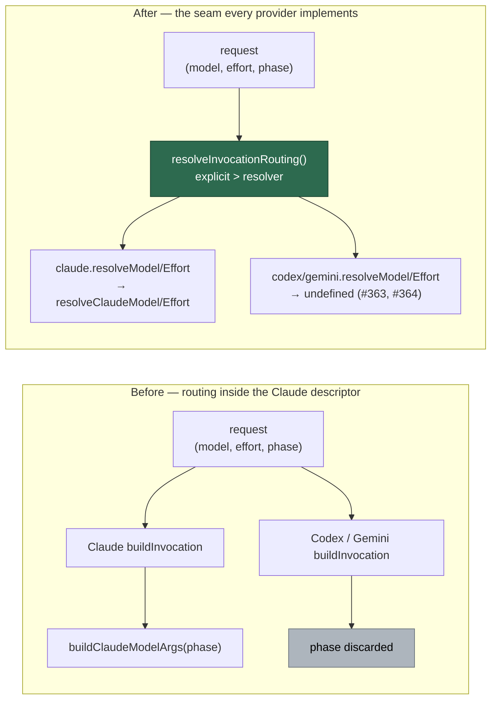

# PR Summary — Issue #362

## Summary

Model and effort routing was resolved **inside the Claude descriptor** in
`worker/deno/lib/agent_provider.ts`, so the `phase` `claude_runner.ts` populates
for every provider reached Codex and Gemini and was silently discarded — the
phase-routing chain documented in `docs/MODEL-AND-CACHING.md` was Claude-only
with no seam for another provider to plug into.

`AgentProviderDescriptor` now carries `resolveModel(phase)` /
`resolveEffort(phase)`, and a single `resolveInvocationRouting()` states the
precedence for every provider: an explicit `request.model` / `request.effort`
always wins, otherwise the provider's own resolver decides, otherwise the CLI's
default stands. Claude's resolvers delegate to the existing chain, which moved
into value-returning `resolveClaudeModel()` / `resolveClaudeEffort()` in
`claude_executor.ts`; `buildClaudeModelArgs()` / `buildClaudeEffortArgs()` are
now thin argv wrappers over them, so the six-step chain is stated in exactly one
place. Codex and Gemini return `undefined` from both resolvers — exactly today's
pass-through — until #363 and #364 fill in their tables.

Pure refactor: no behaviour change for any provider. Closes #362.

## Evidence

Backend/CLI change with no web interface to screenshot; the evidence is the
argv-equality test suite below plus the full quality gate.

Where the routing decision lives, before and after:



Test run (`deno task test tests/agent_provider_routing_seam_test.ts`):

```text
ok | 10 passed | 0 failed (4ms)
```

The provider and executor suites this change touches all pass
(`agent_provider_test.ts`, `agent_provider_codex_test.ts`,
`agent_provider_gemini_test.ts`, `agent_provider_per_invocation_test.ts`,
`quorum_orchestrator_test.ts`, `claude_executor_test.ts`,
`agent_mcp_config_test.ts`, `prompt_stable_prefix_test.ts` —
`269 passed | 0 failed`).

`./quality.sh` reports `deno lint`, `deno type check`, `deno fmt`,
markdownlint, mermaid and every chokepoint check PASSED. The full `deno test`
run shows 10 failures in `fleet_health_test.ts`, `setup_workdir_reminder_test.ts`,
`host_workdir_guard_test.ts` and `optional_feature_env_test.ts` — all
pre-existing on the milestone branch: they fail identically with this branch's
changes stashed (verified by `git stash -u` and re-running those four files),
and none of them touch the provider seam.

## Test Plan

New `worker/deno/tests/agent_provider_routing_seam_test.ts` — 10 tests calling
the real descriptors:

- Every registered provider exposes `resolveModel` / `resolveEffort`, and
  neither throws for an unknown phase.
- Claude's resolvers equal `resolveClaudeModel` / `resolveClaudeEffort` for
  every phase key in `PHASE_MODEL_DEFAULTS` and `PHASE_EFFORT_DEFAULTS`, plus
  the phase-less call.
- Codex and Gemini resolve `undefined` for every phase (today's pass-through).
- Precedence: an explicit model/effort beats the resolver; a blank explicit
  value falls through to it; a provider that resolves nothing keeps the caller's
  explicit values.
- Golden argv, for every phase key and the phase-less call:
  - Claude's `buildInvocation()` equals
    `buildClaudeModelArgs(phase) + buildClaudeEffortArgs(phase) + tail`
    (a) with no model/effort and (b) with an explicit model + effort.
  - Claude's argv carries the phase's designed default, pinned deterministically
    via the `CLAUDE_MODEL_PLANNING` / `CLAUDE_EFFORT_PLANNING` env vars
    (precedence step 1), restored afterwards.
  - Codex argv is byte-identical to the pre-seam list, with and without an
    explicit model/effort; Gemini argv gains no `--model` from a phase and never
    an `--effort` flag.

Modified `worker/deno/tests/quorum_orchestrator_test.ts` — its fake descriptor
implements the two new interface members. No existing test was removed or
disabled.
